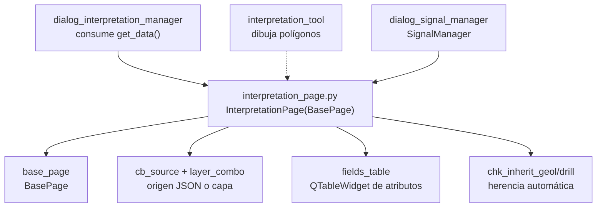

---
tags:
  - secinterp
  - code-walkthrough
  - gui
  - pages
aliases:
  - interpretation_page.py
  - InterpretationPage
cssclass: secinterp-note
---

# `gui/ui/pages/interpretation_page.py`

> [!abstract] Resumen en una línea
> Página de ajustes de interpretación: origen de almacenamiento (JSON interno o capa vectorial), tabla editable de atributos personalizados y herencia automática desde geología y sondajes.

**Ruta**: `gui/ui/pages/interpretation_page.py` (230 líneas)
**Clase principal**: `InterpretationPage(BasePage)`
**Capa**: GUI (presentación programática · sin validación core)
**Tags**: #secinterp #gui #pages

---

## 🎯 ¿Por qué existe este archivo?

La interpretación (polígonos dibujados por el usuario sobre la vista previa) necesita
dónde guardarse, qué atributos personalizados lleva y si hereda datos de las capas
de entrada. Esta página reúne esas tres decisiones.

| Problema | Solución |
|----------|----------|
| El usuario debe elegir si la interpretación vive en el proyecto (JSON) o en una capa | `cb_source` conmuta el combo de capa y el auto-sync |
| Cada proyecto necesita atributos propios (litología interpretada, confianza, autor…) | `QTableWidget` editable de campos (nombre, tipo, valor por defecto) |
| Rellenar atributos a mano para cada polígono es lento y propenso a errores | Herencia automática desde geología y sondajes con dos checkboxes |

> [!important] Nota arquitectónica
> Es la única página con `layer_keys` vacío: no persiste capas (el `target_layer_id`
> de `get_data` no entra en `dump`). La interpretación se guarda por otras vías
> (mezclas de persistencia e `interpretation_tool`); la página solo configura cómo.

---

## 🧬 Diagrama de relaciones



> [!tip] Cómo leer
> Flecha sólida = importa/contiene; punteada = la herramienta de dibujo produce los
> polígonos que esta página configura.

---

## 📦 Imports — lectura arquitectónica

```python
# gui/ui/pages/interpretation_page.py
from __future__ import annotations

import contextlib
from typing import Any

from qgis.PyQt.QtCore import QCoreApplication
from qgis.PyQt.QtWidgets import (
    QCheckBox, QComboBox, QHBoxLayout, QHeaderView, QLabel,
    QPushButton, QTableWidget, QTableWidgetItem, QVBoxLayout, QWidget,
)

from .base_page import BasePage
```

| # | Observación |
|---|-------------|
| ① | Importa solo `qgis.PyQt` (Qt puro): ni `qgis.core` en cabecera ni `qgis.gui`. Los combos de capa se importan en diferido dentro de `_setup_ui`. |
| ② | Cero imports de `sec_interp`: junto con la base, es una hoja del grafo (nadie del core la conoce; solo managers GUI la consumen). |
| ③ | `QTableWidget` + `QHeaderView` + `QTableWidgetItem` para la tabla de atributos; `QComboBox` tanto para el origen como para el tipo por fila. |
| ④ | `contextlib` para las tres desconexiones blindadas por separado. |
| ⑤ | Sin `ProjectValidator` ni `ValidationParams`: no hay `is_complete`; la página es siempre "completa" y su `validate` solo mira duplicados. |

---

## 🏗️ Inventario de estructura

**Clase `InterpretationPage(BasePage)`** — `layer_keys = frozenset()` (vacío):

Construcción:

- `__init__(self, parent: QWidget | None = None) -> None`
- `_setup_ui(self) -> None` — 3 bloques: origen, atributos, herencia

Lógica de UI:

- `_on_source_changed(self, index: int) -> None`
- `_add_field_row(self) -> None`
- `_remove_field_row(self) -> None`

Protocolo `BasePage`:

- `get_data`, `dump`, `load`, `reset`, `validate`, `connect_signals`, `disconnect_signals` (sin `is_complete`)

**Widgets (3 bloques):**

| Bloque | Widgets | Rol |
|--------|---------|-----|
| Origen | `cb_source`, `layer_combo`, `chk_auto_sync` | JSON interno vs capa poligonal + auto-sync |
| Atributos | `fields_table` (0×3), `btn_add_field`, `btn_remove_field` | tabla nombre/tipo/defecto + botones |
| Herencia | `chk_inherit_geol` (✓), `chk_inherit_drill` (✓) | copiar atributos de geología y sondajes |

---

## 📖 Recorrido método por método

### `__init__` — título de interpretación

```python
def __init__(self, parent: QWidget | None = None) -> None:
    super().__init__(
        QCoreApplication.translate("InterpretationPage", "Interpretation Settings"),
        parent,
    )
```

Sin estado propio ni `iface`. Todo el estado vive en los widgets creados en `_setup_ui`.

### `_setup_ui` — tres bloques en layout vertical

```python
def _setup_ui(self) -> None:
    super()._setup_ui()

    self.group_layout = QVBoxLayout()
    self.group_box.setLayout(self.group_layout)

    # 1. Source Selection
    self.group_layout.addWidget(QLabel("<b>" + self.tr("Interpretation Storage") + "</b>"))
    source_layout = QHBoxLayout()
    self.cb_source = QComboBox()
    self.cb_source.addItems(
        [self.tr("Project (Internal JSON)"), self.tr("Vector Layer (External)")]
    )
    # ... capa poligonal (import diferido) + chk_auto_sync, ambos disabled ...
    # 2. Custom Fields Section: tabla 0x3 + botones Add/Remove
    # 3. Inheritance Options: chk_inherit_geol + chk_inherit_drill (checked)
```

Nótese `self.group_box.setLayout(...)` explícito (las demás páginas pasan el
`group_box` al constructor del layout, que lo instala solo). Los imports de
`QgsMapLayerProxyModel` y `QgsMapLayerComboBox` ocurren **dentro** del método
(import diferido): la página carga sin `qgis.gui` hasta que se construye su UI.
El combo de capa usa filtro `PolygonLayer` clásico y nace deshabilitado, igual
que `chk_auto_sync`; `_on_source_changed` los gobierna.

### `_on_source_changed` — conmutador JSON/capa

```python
def _on_source_changed(self, index: int) -> None:
    is_layer = index == 1
    self.layer_combo.setEnabled(is_layer)
    self.chk_auto_sync.setEnabled(is_layer)
```

Índice 0 (JSON) → capa y auto-sync deshabilitados; índice 1 (capa) → habilitados.
El auto-sync ("escuchar ediciones de la capa y actualizar el preview") solo tiene
sentido con capa externa. Mismo idioma de toggle que `_on_auto_ve_toggled` en
[[dem_page]] y `_toggle_lod_spin` en [[preview_page]].

### `_add_field_row` / `_remove_field_row` — filas de atributo

```python
def _add_field_row(self) -> None:
    row = self.fields_table.rowCount()
    self.fields_table.insertRow(row)

    # Type combo
    type_combo = QComboBox()
    type_combo.addItems(["String", "Integer", "Double"])
    self.fields_table.setCellWidget(row, 1, type_combo)

    # Default name
    self.fields_table.setItem(row, 0, QTableWidgetItem(f"field_{row + 1}"))
    self.fields_table.setItem(row, 2, QTableWidgetItem(""))

def _remove_field_row(self) -> None:
    current_row = self.fields_table.currentRow()
    if current_row >= 0:
        self.fields_table.removeRow(current_row)
```

Añadir crea la fila con combo de tipo (`String/Integer/Double`, obsérvese sin
traducir: son nombres de tipo, no texto UI) y nombre por defecto `field_{n}`;
eliminar solo actúa si hay selección (`currentRow() >= 0`), sin pedir
confirmación. La cabecera usa `setSectionResizeMode(QHeaderView.ResizeMode.Stretch)`
y la tabla mide 150 px de alto mínimo.

### `get_data` — configuración completa de interpretación

```python
def get_data(self) -> dict[str, Any]:
    fields = []
    for i in range(self.fields_table.rowCount()):
        name_item = self.fields_table.item(i, 0)
        type_widget = self.fields_table.cellWidget(i, 1)
        default_item = self.fields_table.item(i, 2)

        if name_item and name_item.text():
            fields.append(
                {
                    "name": name_item.text(),
                    "type": type_widget.currentText() if type_widget else "String",
                    "default": default_item.text() if default_item else "",
                }
            )

    return {
        "source_type": "layer" if self.cb_source.currentIndex() == 1 else "json",
        "target_layer_id": (
            self.layer_combo.currentLayer().id() if self.layer_combo.currentLayer() else None
        ),
        "auto_sync": self.chk_auto_sync.isChecked(),
        "custom_fields": fields,
        "inherit_geology": self.chk_inherit_geol.isChecked(),
        "inherit_drillholes": self.chk_inherit_drill.isChecked(),
    }
```

Salta filas sin nombre (defensa contra filas a medio editar). `target_layer_id`
guarda el **id** de la capa, no la capa viva: es la única página que persiste una
referencia por id en lectura (el gestor de interpretación la resuelve después).
`type_widget` puede ser `None` en tests con mocks, de ahí el fallback `"String"`.

### `dump` / `load` — solo herencia y campos

```python
def dump(self) -> dict[str, Any]:
    return {
        "interp_inherit_geol": self.chk_inherit_geol.isChecked(),
        "interp_inherit_drill": self.chk_inherit_drill.isChecked(),
        "interp_custom_fields": self.get_data()["custom_fields"],
    }

def load(self, data: dict[str, Any]) -> None:
    inherit_geol = data.get("interp_inherit_geol")
    if inherit_geol is not None:
        self.chk_inherit_geol.setChecked(bool(inherit_geol))
    # ... igual para interp_inherit_drill ...

    fields = data.get("interp_custom_fields")
    if isinstance(fields, list):
        self.fields_table.setRowCount(0)
        for f in fields:
            self._add_field_row()
            row = self.fields_table.rowCount() - 1
            self.fields_table.item(row, 0).setText(f.get("name", ""))
            self.fields_table.cellWidget(row, 1).setCurrentText(f.get("type", "String"))
            self.fields_table.item(row, 2).setText(f.get("default", ""))
```

`dump` excluye a propósito `source_type/target_layer_id/auto_sync`: el origen de
almacenamiento no viaja en la sesión de páginas (lo gestiona la persistencia de
interpretaciones). `load` reconstruye la tabla desde cero (`setRowCount(0)` +
re-añadir) reutilizando `_add_field_row`, y usa `.get()` con defecto por campo:
listas de sesiones antiguas con campos raros no rompen.

### `reset` — tabla vacía y herencias activas

```python
def reset(self) -> None:
    self.fields_table.setRowCount(0)
    self.chk_inherit_geol.setChecked(True)
    self.chk_inherit_drill.setChecked(True)
```

Vacía los atributos y reactiva ambas herencias. No toca `cb_source` ni la capa:
el origen de almacenamiento sobrevive al reset (decisión consciente: cambiar el
origen por accidente perdería el destino de lo dibujado).

### `validate` — nombres no vacíos y únicos

```python
def validate(self) -> tuple[bool, str]:
    # Check for duplicate names
    names = []
    for i in range(self.fields_table.rowCount()):
        item = self.fields_table.item(i, 0)
        if item:
            name = item.text().strip()
            if not name:
                return False, self.tr("Field name cannot be empty")
            if name in names:
                return False, self.tr("Duplicate field name: {}").format(name)
            names.append(name)
    return True, ""
```

La única validación de Nivel 1 con bucle de la bóveda de páginas: rechaza nombres
vacíos (tras `strip()`) y duplicados con mensajes traducidos (el segundo con
`.format(name)`). Las filas fantasma sin `QTableWidgetItem` se saltan (`if item`).

### `connect_signals` / `disconnect_signals` — tres conexiones Qt puras

```python
def connect_signals(self) -> None:
    self.btn_add_field.clicked.connect(self._add_field_row)
    self.btn_remove_field.clicked.connect(self._remove_field_row)
    self.cb_source.currentIndexChanged.connect(self._on_source_changed)
# disconnect_signals revierte cada una con su propio contextlib.suppress.
```

Sin señales QGIS (`layerChanged`, `fieldChanged`): todo es Qt puro (`clicked`,
`currentIndexChanged`). Cada desconexión va en su propio `suppress`, el estilo
recomendado frente al `try` global de [[dem_page]].

---

## 🗂️ Claves de lectura frente a claves de sesión

| Origen | Claves |
|--------|--------|
| `get_data` | `source_type, target_layer_id, auto_sync, custom_fields, inherit_geology, inherit_drillholes` |
| `dump` / `load` | `interp_inherit_geol, interp_inherit_drill, interp_custom_fields` |
| No persistido en sesión | `source_type, target_layer_id, auto_sync` (lo gestiona la persistencia de interpretaciones) |
| `layer_keys` | vacío: la página no declara capas persistibles |

---

## 🧩 Ciclo de vida en el diálogo

| Momento | Quién | Qué hace con la página |
|---------|-------|------------------------|
| Construcción | [[main_window]] / diálogo | `InterpretationPage()` en el `QStackedWidget`, entrada "Interpretation" en [[sidebar]] |
| Cableado | `SignalManager` | `connect_signals()` (sin `dataChanged`: el diálogo no revalida por estos cambios) |
| Dibujo | `interpretation_tool` | crea polígonos con los `custom_fields` y herencias vigentes |
| Lectura | `dialog_interpretation_manager` | `get_data()` aporta origen, capa destino y campos |
| Sesión | persistencia | `dump()` guarda herencias + campos; `load()` reconstruye la tabla |
| Cierre | `SignalManager` | `disconnect_signals()` por conexión |

---

## 🔄 Flujo de datos

| Fase | Entrada | Transformación | Salida |
|------|---------|----------------|--------|
| Origen | `cb_source` índice | `_on_source_changed` | capa + auto-sync habilitados o no |
| Atributos | botones Add/Remove | `_add_field_row/_remove_field_row` | filas `{name, type, default}` |
| Herencia | checkboxes | lectura directa | `inherit_geology/inherit_drillholes` |
| Lectura | widgets + tabla | `get_data()` (salta filas sin nombre) | dict de 6 claves con `target_layer_id` |
| Validación | nombres de fila | `validate()` (vacío/duplicado) | `(bool, mensaje)` |
| Persistencia | checkboxes + tabla | `dump()` (sin origen) | 3 claves `interp_*` |
| Restauración | lista `interp_custom_fields` | `setRowCount(0)` + re-añadir | tabla reconstruida |

---

## 🏛️ Patrones de diseño presentes

| Patrón | Dónde | Propósito |
|--------|-------|-----------|
| **Builder por bloques** | `_setup_ui` en 3 secciones | Origen, atributos y herencia separados |
| **Row factory** | `_add_field_row` reutilizada por UI y `load` | Una sola forma de crear filas válidas |
| **Feature toggle** | `_on_source_changed` | Origen JSON o capa sin bifurcar la página |
| **Defensive read** | `get_data` salta filas sin nombre | Filas a medio editar no corrompen |

---

## 🧾 Resumen de la API

| Símbolo | Firma / Hereda | Uso típico |
|---------|----------------|------------|
| `InterpretationPage` | `(BasePage)` | pestaña "Interpretation" del `QStackedWidget` |
| `layer_keys` | `frozenset()` vacío | sin capas persistibles |
| `get_data` | 6 claves con `target_layer_id` | gestor de interpretación |
| `dump` | 3 claves `interp_*` | sesión (sin origen) |
| `validate` | vacío/duplicado | puerta de guardado de campos |
| Sin `is_complete` | siempre completa | sin puerta de preview propia |

---

## 🛡️ Manejo de errores

- Filas sin nombre: `get_data` las ignora; `validate` las rechaza con mensaje (doble red: lectura tolerante, guardado estricto).
- `load` con `interp_custom_fields` no-lista: `isinstance` lo ignora sin romper la tabla actual.
- Eliminar sin selección (`currentRow() == -1`): no-op silencioso.
- `cellWidget` ausente (mocks): fallback `"String"` en lectura y `.get("type", "String")` en carga.
- Tres `suppress` independientes en `disconnect_signals`: un fallo no bloquea el resto.

---

## 🧪 Tests asociados

No existe un `tests/gui/test_interpretation_page.py` dedicado; la cobertura es
indirecta:

- `tests/gui/test_interpretation_export.py` — export con atributos personalizados y herencia.
- `tests/gui/test_main_dialog_interpretation.py` — la página dentro del diálogo (origen, campos, herencias).
- `tests/gui/test_interpretation_tool.py` — la herramienta que consume `custom_fields` al dibujar.
- `tests/gui/test_multi_session_persistence.py` — round-trip con claves `interp_*`.
- `tests/gui/test_attribute_inheritance.py` — herencia geología/sondajes extremo a extremo.

| Aspecto a testear | Estado |
|-------------------|--------|
| `validate` duplicados/vacíos | sin test dedicado; lógica pura fácil de cubrir |
| `_on_source_changed` habilita capa | sin test dedicado |
| Round-trip `dump/load` de la tabla | cubierto vía persistencia de diálogo |
| `target_layer_id` por id (no capa viva) | cubierto vía gestor de interpretación |

---

## 🌐 i18n y notas de migración

- Todo el texto visible usa `self.tr(...)` salvo los tipos de la fila (`"String/Integer/Double"`, nombres de tipo universales) y el título con contexto `"InterpretationPage"`.
- `self.tr("Duplicate field name: {}").format(name)`: el placeholder sobrevive a la traducción; los traductores reordenan `{}` libremente.
- Etiquetas con HTML (`"<b>" + … + "</b>"`) para los encabezados de bloque: estilo propio, sin hojas externas.
- Solo Qt puro + import diferido de `qgis.gui`: migración 4.x sin fricción esperada.

---

## 👀 Observaciones y notas

> [!success] Fortalezas
> - `_add_field_row` como factoría única para UI y `load`: imposible reconstruir una fila inválida al restaurar.
> - `dump` excluye el origen a propósito: evita que restaurar una sesión cambie dónde se guarda lo dibujado.
> - `target_layer_id` por id en vez de capa viva: la única lectura que no retiene objetos QGIS.

> [!warning] Puntos de atención
> - Sin `dataChanged` ni `is_complete`: el diálogo no reacciona a cambios aquí (p. ej. validación en vivo de duplicados).
> - `reset()` no toca `cb_source`: coherente (no perder el destino), pero asimétrico frente a otras páginas que resetean todo.
> - Eliminar filas sin confirmación: un clic accidental pierde el campo (aunque `dump` aún no lo haya guardado).
> - Import diferido dentro de `_setup_ui`: pragmático, pero oculta la dependencia de `qgis.gui` al lector de cabecera.

> [!question] Preguntas abiertas
> - ¿Emitir `dataChanged` al editar la tabla para validación en vivo de duplicados?
> - ¿Confirmar la eliminación de filas o añadir deshacer?
> - ¿Persistir también `source_type/target_layer_id` en la sesión de páginas o seguir dejándolo a la persistencia de interpretaciones?

---

## 🔗 Notas relacionadas

- [[Index]] — índice de la bóveda
- [[base_page]] — protocolo (esta página omite `is_complete`)
- [[gui_ui_pages]] — paquete de páginas
- [[main_window]] — pestaña "Interpretation" del `QStackedWidget`
- [[sidebar]] — entrada "Interpretation" (`mActionEdit.svg`)
- [[dialog_interpretation_manager]] — consume `get_data()` (origen y campos)
- [[interpretation_tool]] — dibuja los polígonos configurados aquí
- [[interpretations]] — dominio de interpretación en el core
- [[dialog_settings_persistence]] — persistencia donde viaja el origen
- [[dem_page]] / [[preview_page]] — toggles con el mismo idioma visual

---

*Nota de la bóveda SecInterp Code Walkthrough v2 — v3.9.0*
