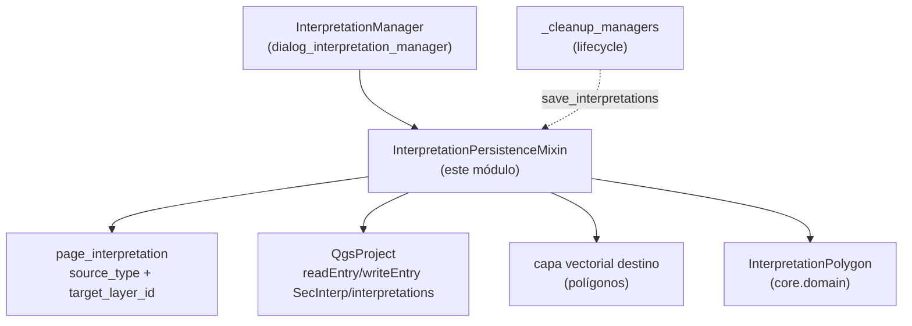

---
tags:
  - secinterp
  - code-walkthrough
  - gui
  - mixins
aliases:
  - interpretation_persistence_mixin.py
  - InterpretationPersistenceMixin
cssclass: secinterp-note
---

# `gui/interpretation_persistence_mixin.py`

> [!abstract] Resumen en una línea
> Mixin que persiste polígonos de interpretación en dos destinos excluyentes — JSON del proyecto QGIS o capa vectorial externa — con sincronización filtrada por extent, serializador tolerante a `QVariant` y descriptores de campo por nombre.

**Ruta**: `gui/interpretation_persistence_mixin.py` (177 líneas)
**Clase principal**: `InterpretationPersistenceMixin`
**Capa**: GUI (mixin de presentación · E/S contra proyecto y capas)
**Tags**: #secinterp #gui #mixins

---

## 🎯 ¿Por qué existe este archivo?

Las interpretaciones son trabajo de usuario que debe sobrevivir al cierre: si se
quedan solo en memoria, una sesión perdida borra horas de digitalización. Pero
"guardar" significa dos cosas distintas según el flujo (proyecto ligero vs capa
GIS interoperable), y leer rasgos de una capa exige geometría y campos QGIS:

| Problema | Solución |
|----------|----------|
| Perder interpretaciones al cerrar el diálogo o QGIS | `save_interpretations` en cada alta, vaciado y cierre (vía `_cleanup_managers`) |
| Parte de los usuarios las quiere como capa editable del proyecto, no como blob JSON | Destino dual: `source_type == "layer"` escribe/lee una capa de polígonos; si no, JSON en `project.writeEntry` |
| Los atributos QGIS (`QVariant`, nulos) rompen `json.dumps` | `json_serial` convierte `QVariant` nulo → `None`, resto → `.value()` o `str()` |
| El esquema de la capa puede variar (campos ausentes) | `get_field_val`/`set_field` resuelven por nombre con `indexOf` y defaults; nunca por posición |

> [!important] Nota arquitectónica
> **Elector de destino (source election)**: `page_interpretation.get_data()` decide
> (`source_type`, `target_layer_id`) y los cuatro métodos bifurcan igual. El
> diálogo nunca elige destino directamente; la página de interpretación es la
> única fuente de esa decisión.

---

## 🧬 Diagrama de relaciones



> [!tip] Cómo leer
> Flecha sólida = lee/escribe; punteada = el ciclo de vida invoca el guardado al
> cerrar. Los imports QGIS (`QgsProject`, `QgsFeature…`) son todos lazy dentro de
> los métodos.

---

## 📦 Imports — lectura arquitectónica

```python
# gui/interpretation_persistence_mixin.py
from __future__ import annotations
import json
from typing import Any
from sec_interp.core.domain import InterpretationPolygon
from sec_interp.logger_config import get_logger

logger = get_logger(__name__)
```

| # | Observación |
|---|-------------|
| ① | **Cero imports QGIS a nivel de módulo**: `QgsProject`, `QgsFeature`, `QgsGeometry`, `QgsPointXY`, `QgsFeatureRequest`, `QgsWkbTypes` se importan dentro de cada método. El módulo se puede importar sin QGIS (tests de colección). |
| ② | `json` es el formato del destino primario (proyecto); la capa es el secundario. |
| ③ | `Any` para capas, rasgos y valores de campo: el mixin no tipa objetos QGIS (frontera GUI explícita, tipado dinámico documentado). |
| ④ | `InterpretationPolygon` es el único tipo fuerte: todo lo que entra o sale se convierte a este DTO en el borde del mixin. |
| ⑤ | Tres niveles de log: `info` al cargar/sincronizar (nº de interpretaciones), `debug` al guardar JSON, `exception` si el JSON corrompe. |

---

## 🏗️ Inventario de estructura

**Clases:** 1 — `InterpretationPersistenceMixin` (4 métodos públicos + 2 closures anidadas).

| Método | Destino | Rol |
|--------|---------|-----|
| `load_interpretations()` | capa o JSON | Rehidrata `self.interpretations` al arrancar |
| `save_interpretations()` | capa o JSON | Persiste la lista viva tras cada mutación |
| `sync_from_layer(layer)` | capa → memoria | Reconstruye DTOs desde rasgos poligonales con petición filtrada por extent |
| `save_to_layer(layer)` | memoria → capa | Reescribe la capa (borra + añade) en edición |

**Closures anidadas:** `json_serial` (en `save_interpretations`), `get_field_val` (en `sync_from_layer`), `set_field` (en `save_to_layer`).

---

## 📁 Archivos del paquete

| Archivo | Rol frente a este mixin |
|---|---|
| `gui/dialog_interpretation_manager.py` | `InterpretationManager` hereda el mixin; `clear_interpretations` y el flujo de alta invocan `save_interpretations` |
| `gui/interpretation_inheritance_mixin.py` | Base hermana: enriquece antes de persistir |
| `gui/dialog_lifecycle_mixin.py` | `_cleanup_managers` guarda al cerrar (última oportunidad) |
| `gui/dialog_facade_mixin.py` | `_load/_save_interpretations` reexponen estos métodos |
| `gui/ui/pages/interpretation_page.py` | `get_data()`: `source_type`, `target_layer_id` (elector de destino) |
| `core/domain/` | `InterpretationPolygon(id, name, type, vertices_2d, attributes, color, created_at)` |

---

## 📖 Recorrido método por método

### `load_interpretations`

```python
def load_interpretations(self) -> None:
    interp_config = self.dialog.page_interpretation.get_data()
    if interp_config.get("source_type") == "layer":
        target_layer_id = interp_config.get("target_layer_id")
        if target_layer_id:
            from qgis.core import QgsProject
            target_layer = QgsProject.instance().mapLayer(target_layer_id)
            if target_layer and target_layer.isValid():
                self.sync_from_layer(target_layer)
                return
    if not self.dialog.project:
        return
    json_data, ok = self.dialog.project.readEntry("SecInterp", "interpretations", "[]")
    if not ok or not json_data:
        return
    try:
        data = json.loads(json_data)
        self.interpretations = []
        for item in data:
            interp = InterpretationPolygon(id=item.get("id", ""), ...,
                vertices_2d=[tuple(v) for v in item.get("vertices_2d", [])], ...)
            self.interpretations.append(interp)
        logger.info(f"Loaded {len(self.interpretations)} interpretations from project")
    except Exception:
        logger.exception("Failed to load interpretations")
```

Cascada de 4 salidas: (1) capa válida → `sync_from_layer` y `return`; (2) sin
proyecto → `return` silencioso (tests huérfanos); (3) entrada ausente → `return`;
(4) JSON corrupto → `logger.exception` con la lista anterior intacta (no se vacía
antes de parsear con éxito: el `self.interpretations = []` ocurre dentro del
`try`, así que un JSON roto conserva lo que hubiera). Los vértices se
reconstruyen como `tuple(v)` porque JSON solo conoce listas.

### `save_interpretations` + `json_serial`

```python
def save_interpretations(self) -> None:
    interp_config = self.dialog.page_interpretation.get_data()
    if interp_config.get("source_type") == "layer":
        ... # capa válida → self.save_to_layer(target_layer); return
    if not self.dialog.project:
        return
    data = [{"id": i.id, "name": i.name, "type": i.type, "vertices_2d": i.vertices_2d,
             "attributes": i.attributes, "color": i.color, "created_at": i.created_at}
            for i in self.interpretations]
    def json_serial(obj):
        if hasattr(obj, "isNull"):      # QVariant (qgis.PyQt/PyQGIS)
            return None if obj.isNull() else obj.value()
        return str(obj)
    json_data = json.dumps(data, default=json_serial)
    self.dialog.project.writeEntry("SecInterp", "interpretations", json_data)
```

Simétrica a la carga: capa → delegar; sin proyecto → no-op. El esquema JSON de 7
claves es el contrato de compatibilidad entre versiones (ver sección dedicada).
`json_serial` existe porque `attributes` puede contener `QVariant` llegados de
la capa: nulo → `None`, con valor → `.value()`, resto exótico → `str()`.

### `sync_from_layer` + `get_field_val`

```python
def sync_from_layer(self, layer: Any) -> None:
    from qgis.core import QgsFeatureRequest, QgsWkbTypes
    self.interpretations = []
    request = QgsFeatureRequest().setFilterRect(layer.extent())
    for feature in layer.getFeatures(request):
        geom = feature.geometry()
        if geom.isNull() or geom.type() != QgsWkbTypes.GeometryType.PolygonGeometry:
            continue
        vertices = [(pt.x(), pt.y()) for pt in (geom.asPolygon()[0] if geom.asPolygon() else [])]
        ...
        def get_field_val(name, default="", _attrs=attrs, _fields=fields):
            idx = _fields.indexOf(name)
            return _attrs[idx] if idx != -1 and not isinstance(_attrs[idx], type(None)) else default
        interp = InterpretationPolygon(id=str(get_field_val("id", feature.id())), ...,
            attributes={}, color=str(get_field_val("color", "#FF0000")), ...)
    logger.info(f"Synchronized {len(self.interpretations)} interpretations from layer {layer.name()}")
```

Tres decisiones: (1) `setFilterRect(layer.extent())` sirve la petición por índice
espacial en vez de escanear sin filtro (hay test que lo fija:
`test_sync_from_layer_uses_filtered_request`); (2) solo polígonos (`PolygonGeometry`,
anillo exterior `[0]`); los nulos y otros tipos se saltan; (3) campos por nombre
con default (`id` cae a `feature.id()`, `name` a `Interp_<id>`). `attributes`
se sincroniza como `{}` vacío — el comentario `# Add custom attribute sync here
if wanted` marca la extensión pendiente sin romper el esquema actual.

### `save_to_layer` + `set_field`

```python
def save_to_layer(self, layer: Any) -> None:
    from qgis.core import QgsFeature, QgsGeometry, QgsPointXY
    if not layer.isEditable():
        layer.startEditing()
    layer.deleteFeatures([f.id() for f in layer.getFeatures()])
    features_to_add = []
    fields = layer.fields()
    for interp in self.interpretations:
        feat = QgsFeature(fields)
        ring = [QgsPointXY(x, y) for x, y in interp.vertices_2d]
        feat.setGeometry(QgsGeometry.fromPolygonXY([ring]))
        def set_field(name, value, _feat=feat, _fields=fields):
            idx = _fields.indexOf(name)
            if idx != -1:
                _feat.setAttribute(idx, value)
        set_field("id", interp.id); set_field("name", interp.name); ...
    layer.addFeatures(features_to_add)
    layer.commitChanges()
```

Reescritura total: abre edición si hace falta, borra todos los rasgos y añade
uno por interpretación con `QgsFeature(fields)` (atributos por defecto del
esquema) más los 5 campos conocidos. `set_field` ignora campos ausentes (`idx ==
-1` → no-op), así que capas con esquema parcial no rompen. Nótese lo que
**no** hace: no guarda `attributes` ni `vertices` como campos (van en la
geometría), y `commitChanges` cierra siempre — sin rollback parcial.

---

## 🔄 Flujo de datos

| Fase | Entrada | Transformación | Salida |
|------|---------|----------------|--------|
| Cargar (capa) | `target_layer_id` + capa válida | `sync_from_layer` (extent + solo polígonos + campos por nombre) | `self.interpretations` rehidratada |
| Cargar (JSON) | `readEntry("SecInterp", "interpretations")` | `json.loads` + `tuple(v)` por vértice | lista de DTOs o lista anterior intacta si corrompe |
| Guardar (capa) | lista viva | borrar todo + añadir rasgos + `commitChanges` | capa espejo de la memoria |
| Guardar (JSON) | lista viva | 7 claves + `json_serial` (QVariant) | `writeEntry` con el JSON |

---

## 🏛️ Patrones de diseño presentes

| Patrón | Dónde | Propósito |
|--------|-------|-----------|
| **Mixin** | la clase | Persistencia compuesta en el mánager |
| **Source election** | `source_type` en los 4 métodos | Un flag de página elige JSON o capa |
| **DTO boundary** | `InterpretationPolygon` en ambos bordes | Capas/JSON nunca fugan al resto del diálogo |
| **Name-based fields** | `get_field_val`/`set_field` | Tolerancia a esquemas parciales |
| **Serializer fallback** | `json_serial` | `QVariant` y exóticos sin romper `json.dumps` |

---

## 🧾 Resumen de la API

| Símbolo | Firma | Uso típico |
|---------|-------|------------|
| `InterpretationPersistenceMixin` | `class …:` (sin bases) | primera base de `InterpretationManager` |
| `load_interpretations` | `() -> None` | arranque (`_init_managers`) y reapertura |
| `save_interpretations` | `() -> None` | tras alta, vaciado, Accept y cierre |
| `sync_from_layer` | `(layer: Any) -> None` | capa → memoria (filtrada por extent) |
| `save_to_layer` | `(layer: Any) -> None` | memoria → capa (reescritura + commit) |
| `json_serial` | `(obj) -> Any` | `default=` de `json.dumps` |
| Esquema JSON | 7 claves (`id/name/type/vertices_2d/attributes/color/created_at`) | contrato entre versiones |

---

## 🛡️ Manejo de errores

- **Capa inválida o ausente**: se ignora y se sigue con JSON; nunca se lanza por un `target_layer_id` obsoleto.
- **JSON corrupto**: `except Exception` + `logger.exception`; la lista anterior sobrevive porque el vaciado ocurre dentro del `try` tras parsear.
- **Sin proyecto**: no-op silencioso en ambas direcciones (diálogos huérfanos en tests).
- **Campos ausentes en capa**: defaults por nombre; `None` explícito también cae al default (`isinstance(..., type(None))`).
- **Riesgo honesto**: `save_to_layer` borra antes de añadir; si `addFeatures` falla a mitad, la capa queda parcialmente escrita (sin transacción).

---

## 🧪 Tests asociados

- `tests/gui/test_dialog_interpretation_manager.py` — `TestDialogInterpretationManager`:
  - `test_load_interpretations_success` / `test_load_interpretations_fail` — JSON válido y corrupto.
  - `test_save_interpretations` — escritura JSON.
  - `test_json_serial_special` — `QVariant` nulo/con valor y objetos exóticos.
  - `test_no_project_guards` — no-op sin proyecto.
  - `test_sync_from_layer_uses_filtered_request` — petición filtrada por extent.
- `tests/gui/test_main_dialog_interpretation.py` — `TestInterpretationManager::test_load_interpretations_empty/valid`, `test_save_interpretations`.
- `tests/gui/test_interpretation_export.py` — `TestInterpretationExport::test_interpretation_layer_included_in_render` (la capa destino también se renderiza).

---

## 📐 Esquema JSON — contrato entre versiones

```json
{
  "id": "uuid…",
  "name": "Granito",
  "type": "geology",
  "vertices_2d": [[0.0, 0.0], [10.0, 0.0], [10.0, 5.0]],
  "attributes": {"fuente": "heredada"},
  "color": "#FF0000",
  "created_at": "2026-…"
}
```

| Regla | Detalle |
|-------|---------|
| 7 claves fijas | Añadir una clave exige valor por defecto en `load` (`.get`) para proyectos viejos |
| `vertices_2d` como listas | JSON no tiene tuplas; `load` reconvierte con `tuple(v)` |
| `attributes` libre | Dict de usuario; `json_serial` lo hace tolerante a `QVariant` |
| Clave de proyecto | `("SecInterp", "interpretations")`, default `"[]"` |

---

## 🧪 Ejemplo de round-trip (JSON → memoria → capa)

Polígono `Granito` con 4 vértices, primero en modo JSON y luego cambiando la
página a `source_type = "layer"`:

| Paso | Operación | Estado resultante |
|------|-----------|-------------------|
| 1. Alta | `handle_interpretation_finished` → `save_interpretations` (JSON) | `writeEntry("SecInterp", "interpretations", '[{…Granito…}]')` |
| 2. Reinicio | `load_interpretations` lee la entrada | `self.interpretations == [Granito]` (`tuple(v)` por vértice) |
| 3. Cambio a capa | usuario elige capa `interp_2026` en `page_interpretation` | `source_type = "layer"`, `target_layer_id = <id>` |
| 4. Guardado | `save_interpretations` → `save_to_layer` | capa con 1 rasgo poligonal (`id/name/type/color/created_at`) |
| 5. Relectura | `load_interpretations` → `sync_from_layer` | `Granito` reconstruido; `attributes == {}` (pérdida documentada) |
| 6. Cierre | `_cleanup_managers` guarda de nuevo | capa y memoria idénticas |

> [!tip] Dónde se pierde información
> Solo en el paso 5: la capa no tiene columna de atributos libres, así que
> `sync_from_layer` fija `attributes = {}`. El JSON (pasos 1–2) es sin pérdidas.

---

## 📐 Contrato de atributos (qué debe aportar el huésped)

| Atributo | Proveedor | Consumido por |
|----------|-----------|---------------|
| `self.dialog` | `InterpretationManager.__init__` | `page_interpretation.get_data()` en `load/save` |
| `self.dialog.page_interpretation` | `SecInterpMainWindow` | elector `source_type`/`target_layer_id` |
| `self.dialog.project` | `main_dialog.__init__` (`QgsProject.instance()`) | `readEntry`/`writeEntry` del JSON |
| `self.interpretations` | `InterpretationManager` | lista viva leída y reasignada aquí |

> [!note] Sin `QgsProject` global
> La rama de capa usa `QgsProject.instance().mapLayer(...)` (lazy) porque el id
> destino puede apuntar a un proyecto recargado; la rama JSON usa
> `self.dialog.project` porque es el proyecto que el diálogo ya resolvió.

---

## 👀 Observaciones y notas

> [!success] Fortalezas
> - Imports QGIS 100% lazy: el módulo se importa sin QGIS.
> - Destino dual con un solo flag de página; la carga degrada con elegancia (capa → JSON → vacío).
> - Campos por nombre con defaults: robusto a capas con esquema parcial.

> [!warning] Puntos de atención
> - `save_to_layer` no es transaccional: borra primero, añade después; un fallo intermedio deja la capa a medias.
> - `sync_from_layer` descarta `attributes` (`{}`): ida y vuelta capa→memoria→capa pierde atributos personalizados.
> - `except Exception` en `load` captura también `KeyboardInterrupt`-like no críticos… en la práctica solo fallos de parseo, pero es amplio.

> [!question] Preguntas abiertas
> - ¿Guardar `attributes` en un campo JSON de la capa para un round-trip sin pérdidas?
> - ¿Envolver `deleteFeatures + addFeatures + commitChanges` en edición con rollback si `addFeatures` falla?

---

## 🔗 Notas relacionadas

- [[Index]] — índice de la bóveda
- [[dialog_interpretation_manager]] — orquestador (`clear_interpretations`, flujo de alta)
- [[interpretation_inheritance_mixin]] — base hermana (enriquece antes de persistir)
- [[dialog_facade_mixin]] — `_load/_save_interpretations` y `accept_handler`
- [[dialog_lifecycle_mixin]] — `_cleanup_managers` guarda al cerrar
- [[interpretation_properties_dialog]] — edita lo que aquí se persiste
- [[interpretation_page]] — `source_type`/`target_layer_id` (elector)
- [[interpretations]] — DTO `InterpretationPolygon` y esquema
- [[preview_state]] — caché (no persistencia; no confundir)
- [[dialog_settings_persistence]] — ajustes del diálogo (proyecto vs este JSON de interpretaciones)

---

*Nota de la bóveda SecInterp Code Walkthrough v2 — v3.8.0*
