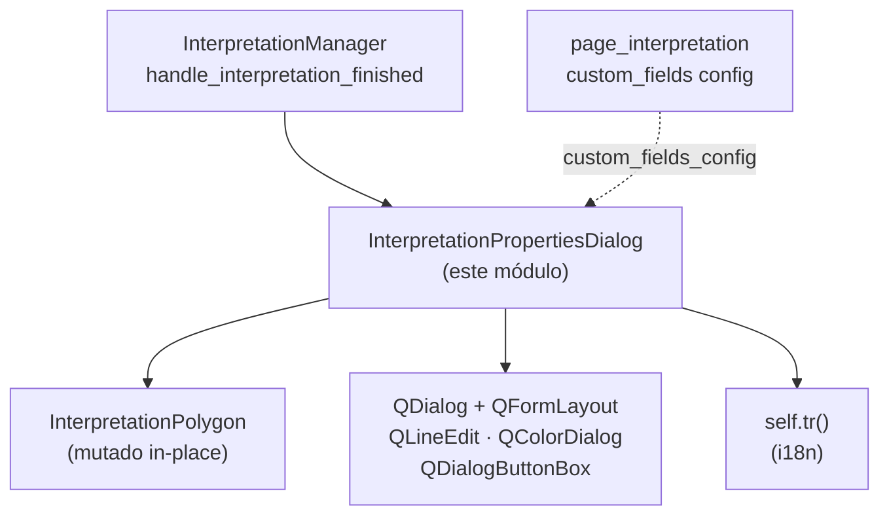

---
tags:
  - secinterp
  - code-walkthrough
  - gui
  - dialogs
aliases:
  - interpretation_properties_dialog.py
  - InterpretationPropertiesDialog
cssclass: secinterp-note
---

# `gui/dialogs/interpretation_properties_dialog.py`

> [!abstract] Resumen en una línea
> Diálogo modal programático (sin `.ui`) que edita nombre, tipo, color y atributos personalizados de una interpretación recién digitalizada, mutando el DTO in-place y desconectando sus señales al cerrar para evitar fugas.

**Ruta**: `gui/dialogs/interpretation_properties_dialog.py` (149 líneas)
**Clase principal**: `InterpretationPropertiesDialog`
**Capa**: GUI (diálogo modal · `QDialog` programático)
**Tags**: #secinterp #gui #dialogs

---

## 🎯 ¿Por qué existe este archivo?

Tras digitalizar un polígono (con herencia opcional ya aplicada), el usuario debe
confirmar sus propiedades antes de que se persista. Sin este diálogo, el nombre
heredado sería definitivo y no habría forma de añadir atributos personalizados:

| Problema | Solución |
|----------|----------|
| El polígono recién creado necesita confirmación/edición antes de persistir | Modal `QDialog` con `exec()`; `Accepted (1)` guarda, cualquier otra cosa descarta |
| Los campos personalizados los define la página de interpretación, no el diálogo | `custom_fields_config: list[dict]` genera `QLineEdit`s dinámicos en el `QFormLayout` |
| Los diálogos efímeros acumulan conexiones si no se desconectan | `disconnect_signals()` en `accept()` y `reject()` con `suppress`/try-except |

> [!important] Nota arquitectónica
> **UI 100% programática**: sin `.ui` ni `uic`; `_setup_ui` construye
> `QVBoxLayout → QFormLayout + QDialogButtonBox` en código, siguiendo el
> framework UI propio del plugin. Mutación in-place del DTO: el diálogo no
> devuelve valores, edita `self.interpretation` directamente.

---

## 🧬 Diagrama de relaciones



> [!tip] Cómo leer
> Flecha sólida = crea/muta; punteada = la config de campos personalizados entra
> por constructor (inyectada por el mánager desde `page_interpretation`).

---

## 📦 Imports — lectura arquitectónica

```python
# gui/dialogs/interpretation_properties_dialog.py
from __future__ import annotations
import contextlib
from typing import TYPE_CHECKING, Any
from qgis.PyQt.QtGui import QColor
from qgis.PyQt.QtWidgets import (QColorDialog, QDialog, QDialogButtonBox, QFormLayout,
    QHBoxLayout, QLabel, QLineEdit, QPushButton, QVBoxLayout, QWidget)

if TYPE_CHECKING:
    from sec_interp.core.domain import InterpretationPolygon
```

| # | Observación |
|---|-------------|
| ① | `qgis.PyQt` (no `PyQt5` directo): import agnóstico preparado para QGIS 4.x — el diálogo ya cumple la guía de migración. |
| ② | `InterpretationPolygon` solo en `TYPE_CHECKING`: en runtime el DTO es opaco; el diálogo lo muta por duck typing (`name`, `type`, `color`, `attributes`). |
| ③ | Nueve widgets Qt importados nominalmente: el diálogo construye toda su UI a mano; no hay cargador `.ui`. |
| ④ | `contextlib` para `suppress(TypeError, RuntimeError)` en `disconnect_signals`: desconectar dos veces o con objetos destruidos no debe lanzar. |
| ⑤ | Sin `get_logger`: el diálogo no registra nada; el mánager loguea aceptar/cancelar. Decisión correcta (los modales no diagnostican). |

---

## 🏗️ Inventario de estructura

**Clases:** 1 — `InterpretationPropertiesDialog(QDialog)` (constructor + 5 métodos).

| Método | Rol |
|--------|-----|
| `__init__(interpretation, custom_fields_config, parent=None)` | Título i18n, tamaño 400×300, `_setup_ui()` |
| `_setup_ui()` | Construye formulario: estándar (nombre/tipo/color) + separador + personalizados + botones |
| `_set_preview_color(hex_color)` | `setStyleSheet` del parche de color (`background + border`) |
| `_pick_color()` | `QColorDialog.getColor`; si válido, muta `interpretation.color` y repinta el parche |
| `reject()` | `disconnect_signals()` + `super().reject()` (cancelar sin guardar) |
| `disconnect_signals()` | Desconecta `btn_change_color` y `button_box` con tolerancia a doble llamada |
| `accept()` | Vuelca widgets al DTO (`name`, `type`, `attributes`), desconecta y `super().accept()` |

**Widgets construidos:** `name_edit`, `type_edit` (`QLineEdit`); `color_preview` (`QLabel` 30×20), `btn_change_color`; `field_widgets: dict[str, QLineEdit]`; `button_box` (Ok/Cancel).

---

## 📁 Archivos del paquete

| Archivo | Rol frente a este diálogo |
|---|---|
| `gui/dialog_interpretation_manager.py` | Único instanciador: `InterpretationPropertiesDialog(interpretation, custom_fields, dialog)` + `exec()`; acepta → append, cancela → descarte |
| `gui/ui/pages/interpretation_page.py` | `get_data()["custom_fields"]`: `[{"name":…, "default":…}]` que generan filas dinámicas |
| `gui/interpretation_inheritance_mixin.py` | Pre-rellena `name/type/attributes/color` antes de que el diálogo se abra |
| `gui/interpretation_persistence_mixin.py` | Persiste el DTO mutado tras `Accepted` |
| `gui/dialogs/` | Paquete de diálogos modales (este es el editor de propiedades de interpretación) |

---

## 📖 Recorrido método por método

### `__init__`

```python
def __init__(self, interpretation, custom_fields_config, parent=None):
    super().__init__(parent)
    self.interpretation = interpretation
    self.custom_fields_config = custom_fields_config
    self.setWindowTitle(self.tr("Interpretation Properties"))
    self.resize(400, 300)
    self.field_widgets: dict[str, QLineEdit] = {}
    self._setup_ui()
```

Referencia viva al DTO (no copia): todo lo que el usuario edite se refleja al
aceptar sin paso de retorno. `parent = self.dialog` (el diálogo principal) da
modalidad y centrado correctos. El título nace traducido con `self.tr()`.

### `_setup_ui` — campos estándar y color

```python
def _setup_ui(self) -> None:
    layout = QVBoxLayout(self)
    form_layout = QFormLayout()
    self.name_edit = QLineEdit(self.interpretation.name)
    form_layout.addRow(self.tr("Name:"), self.name_edit)
    self.type_edit = QLineEdit(self.interpretation.type)
    form_layout.addRow(self.tr("Type:"), self.type_edit)
    color_layout = QHBoxLayout()
    self.color_preview = QLabel()
    self.color_preview.setFixedSize(30, 20)
    self._set_preview_color(self.interpretation.color)
    self.btn_change_color = QPushButton(self.tr("Change..."))
    self.btn_change_color.clicked.connect(self._pick_color)
    ...
    form_layout.addRow(self.tr("Color:"), color_layout)
    form_layout.addRow(QLabel("<hr>"))
```

Pre-relleno con los valores heredados (`name`, `type`, `color`): si la herencia
acertó, el usuario solo confirma. El selector de color es parche + botón
(`QHBoxLayout` con `addStretch`); el `<hr>` separa estándar de personalizados.
Cada etiqueta visible usa `self.tr()`.

### `_setup_ui` — campos personalizados y botones

```python
    if self.custom_fields_config:
        form_layout.addRow(QLabel("<b>" + self.tr("Custom Attributes") + "</b>"))
        for field in self.custom_fields_config:
            name, default = field["name"], field["default"]
            edit = QLineEdit(str(default))
            self.field_widgets[name] = edit
            form_layout.addRow(f"{name}:", edit)
    layout.addLayout(form_layout)
    layout.addStretch()
    self.button_box = QDialogButtonBox(Ok | Cancel)
    self.button_box.accepted.connect(self.accept)
    self.button_box.rejected.connect(self.reject)
    layout.addWidget(self.button_box)
```

Los personalizados se generan por config (`name`/`default` por dict) y se
indexan en `field_widgets` para el volcado en `accept()`. Nótese: el **nombre**
del campo (`f"{name}:"`) no se traduce — es dato de configuración, no UI; solo
el encabezado `"Custom Attributes"` lleva `tr()`. El `button_box` conecta
`accepted → self.accept` (sobrescrito, no el slot Qt por defecto) y
`rejected → self.reject`.

### `_set_preview_color` / `_pick_color`

```python
def _set_preview_color(self, hex_color: str) -> None:
    self.color_preview.setStyleSheet(
        f"background-color: {hex_color}; border: 1px solid black;")

def _pick_color(self) -> None:
    color = QColor(self.interpretation.color)
    new_color = QColorDialog.getColor(color, self, self.tr("Select Color"))
    if new_color.isValid():
        self.interpretation.color = new_color.name()
        self._set_preview_color(self.interpretation.color)
```

El color se escribe **en caliente** en el DTO al elegir (`interpretation.color =
new_color.name()`), no al aceptar: si el usuario cancela tras cambiar el color,
el DTO conserva el color nuevo aunque se descarte el polígono (detalle sutil —
el descarte hace irrelevante la mutación, porque el objeto no se añade a la
lista). `isValid()` cubre el cierre del selector sin elegir.

### `reject` / `disconnect_signals`

```python
def reject(self) -> None:
    self.disconnect_signals()
    super().reject()

def disconnect_signals(self) -> None:
    with contextlib.suppress(TypeError, RuntimeError):
        self.btn_change_color.clicked.disconnect(self._pick_color)
    try:
        self.button_box.accepted.disconnect(self.accept)
        self.button_box.rejected.disconnect(self.reject)
    except (TypeError, RuntimeError):
        pass
```

Desconexión defensiva en dos estilos (demuestra ambas formas del proyecto):
`suppress` para el botón de color, try/except para el `button_box`. Cubre doble
`disconnect` (`TypeError`: sin conexión) y objetos Qt destruidos (`RuntimeError`).
`reject` no toca el DTO: cancelar deja nombre/tipo intactos (salvo el matiz del
color en caliente).

### `accept`

```python
def accept(self) -> None:
    self.interpretation.name = self.name_edit.text()
    self.interpretation.type = self.type_edit.text()
    for name, widget in self.field_widgets.items():
        self.interpretation.attributes[name] = widget.text()
    self.disconnect_signals()
    super().accept()
```

Volcado widget → DTO: nombre, tipo y cada personalizado (siempre como string —
`widget.text()`). Luego desconexión y `super().accept()`, que cierra con
`QDialog.Accepted (1)`, el valor que el mánager compara en `dlg.exec() != 1`.

---

## 🔄 Flujo de datos

| Fase | Entrada | Transformación | Salida |
|------|---------|----------------|--------|
| Apertura | DTO (heredado) + `custom_fields` + padre | `_setup_ui` pre-rellena | modal visible |
| Edición | texto, color, personalizados | widgets + mutación en caliente del color | estado pendiente en widgets/DTO |
| Aceptar | click OK | volcado + `disconnect` + `super().accept()` → `exec() == 1` | DTO mutado; el mánager añade y persiste |
| Cancelar | click Cancelar / Esc | `disconnect` + `super().reject()` → `exec() != 1` | DTO descartado con la lista |

---

## 🏛️ Patrones de diseño presentes

| Patrón | Dónde | Propósito |
|--------|-------|-----------|
| **Modal dialog** | `exec()` + `Accepted/Rejected` | Confirmación bloqueante con descarte seguro |
| **In-place mutation** | `self.interpretation` | Sin valores de retorno ni señales de resultado |
| **Dynamic form** | `custom_fields_config → field_widgets` | Esquema de la página, no del diálogo |
| **Defensive disconnect** | `disconnect_signals` | Sin conexiones colgadas en diálogos efímeros |
| **Programmatic UI** | `_setup_ui` | Sin `.ui`; layout en código |

---

## 🧾 Resumen de la API

| Símbolo | Firma | Uso típico |
|---------|-------|------------|
| `InterpretationPropertiesDialog` | `(QDialog)` | `InterpretationPropertiesDialog(interp, custom_fields, parent)` |
| `__init__` | `(interpretation, custom_fields_config: list[dict], parent=None)` | solo el mánager la invoca |
| `field_widgets` | `dict[str, QLineEdit]` | índice de personalizados para `accept()` |
| `_pick_color` | `() -> None` | slot de `btn_change_color` |
| `accept` / `reject` | `() -> None` | `button_box`; `accept` vuelca, `reject` descarta |
| `disconnect_signals` | `() -> None` | idempotente y tolerante a Qt destruido |

---

## 🛡️ Manejo de errores

- **Sin validación de contenido**: nombre vacío o tipo arbitrario se aceptan; la validación de dominio vive en capas superiores (el diálogo es editor, no validador).
- **`custom_fields_config = None`**: el `if` lo trata como "sin personalizados"; una lista con dicts sin `"name"` lanzaría `KeyError` (contrato: la página garantiza el esquema).
- **Color inválido**: `QColor(hex)` con texto roto da color inválido pero no lanza; el parche muestra el stylesheet tal cual.
- **Doble cierre**: `disconnect_signals` idempotente; `accept`/`reject` tras destrucción parcial están cubiertos por `suppress`/try-except.

---

## 🧪 Tests asociados

Sin archivo dedicado (`test_interpretation_properties_dialog.py` no existe);
cobertura honesta a través del mánager con el diálogo simulado:

- `tests/gui/test_dialog_interpretation_manager.py` — `TestDialogInterpretationManager`:
  - `test_handle_interpretation_finished_accepted` — rama `exec() == 1` (mock aceptado).
  - `test_handle_interpretation_finished_rejected` — rama `exec() != 1` (mock cancelado).
- `tests/gui/test_main_dialog_interpretation.py` — flujo desde el diálogo principal.
- Hueco documentado: `_pick_color` (requiere `QColorDialog` nativo), `disconnect_signals` idempotente y el volcado de `field_widgets` no tienen test directo; son testeables con `pytest-qt`/`offscreen` sin refactor.

---

## 🌐 i18n del diálogo

| Cadena (`self.tr`) | Dónde |
|--------------------|-------|
| `"Interpretation Properties"` | título de ventana |
| `"Name:"`, `"Type:"`, `"Color:"` | filas estándar |
| `"Change..."` | botón de color |
| `"Custom Attributes"` | encabezado de personalizados (solo si hay) |
| `"Select Color"` | título del `QColorDialog` |

Los nombres de campos personalizados (`f"{name}:"`) no se traducen a propósito:
son configuración del usuario/página, no UI del plugin. Todos los `tr()` usan
`self.tr` (contexto `QObject` del diálogo), extraíbles por `update-strings.sh`.

> [!note] `self.tr` frente a `tr()` estático
> Al ser `QDialog` un `QObject`, `self.tr()` resuelve el contexto de traducción
> al nombre de la clase (`InterpretationPropertiesDialog`), de modo que
> `"Name:"` aquí no colisiona con otros `"Name:"` del plugin en los `.ts`.

---

## 🧪 Ejemplo de sesión completa

Polígono digitalizado sobre `granito` con `custom_fields = [{"name": "litologia_detalle", "default": ""}]`:

| Paso | Actor | Qué ocurre |
|------|-------|------------|
| 1. Herencia | mánager | `name = "Granito"`, `type = "geology"`, `color = "#FF5733"` precargados |
| 2. Apertura | mánager | `InterpretationPropertiesDialog(interp, custom_fields, dialog).exec()` bloquea |
| 3. UI inicial | diálogo | `name_edit = "Granito"`, `type_edit = "geology"`, parche `#FF5733`, fila `litologia_detalle: ""` |
| 4. Edición | usuario | cambia color a `#00AA00` (mutación en caliente), escribe `litologia_detalle = "alterado"` |
| 5. Accept | usuario | `name/type/attributes` volcados; `exec()` retorna `1` |
| 6. Alta | mánager | `append` + `save_interpretations` + resumen HTML + refresco del preview |

Si en el paso 5 el usuario pulsa Cancelar o Esc, `exec()` retorna `0`, el
polígono (incluido su color en caliente) se descarta y `btn_interpret` se
desmarca sin persistir nada.

---

## 📐 Modal vs no-modal — por qué bloquea

| Alternativa | Problema que evita el modal |
|-------------|------------------------------|
| Panel lateral no-modal | El usuario podría digitalizar otro polígono mientras edita: dos DTOs a medio editar |
| Edición directa en canvas | Sin lugar para `custom_fields` dinámicos ni selector de color |
| Aceptación implícita (sin diálogo) | Sin confirmación del nombre heredado; errores de herencia se fosilizan |

El coste del modal (bloquea el canvas) es aceptable porque la edición dura
segundos y el descarte es barato. El `parent` (diálogo principal) mantiene el
modal centrado y siempre visible.

---

## 👀 Observaciones y notas

> [!success] Fortalezas
> - `qgis.PyQt` agnóstico: listo para QGIS 4.x sin cambios.
> - Mutación in-place elimina una clase de bugs (sin sincronizar retorno ↔ DTO).
> - Desconexión defensiva: los modales efímeros no fugan conexiones.

> [!warning] Puntos de atención
> - El color se muta en caliente en `_pick_color`: cancelar tras cambiar el color deja el DTO teñido (irrelevante al descartarse, pero sorprendente al leer el código).
> - Sin validación: un nombre vacío persiste tal cual; si se exige no-vacío, debe añadirse aquí o en el mánager.
> - `field["name"]`/`field["default"]` sin `.get`: config malformada → `KeyError` en construcción.

> [!question] Preguntas abiertas
> - ¿Mover la escritura del color a `accept()` para que cancelar sea 100% sin efectos?
> - ¿Validar nombre no vacío con `QValidator` o aviso antes de `super().accept()`?

---

## 🔗 Notas relacionadas

- [[Index]] — índice de la bóveda
- [[dialog_interpretation_manager]] — único instanciador (`exec()`, ramas aceptar/cancelar)
- [[interpretation_inheritance_mixin]] — pre-relleno antes de abrir
- [[interpretation_persistence_mixin]] — persiste el DTO mutado
- [[interpretation_page]] — `custom_fields` que generan filas dinámicas
- [[dialog_facade_mixin]] — `on_interpretation_finished`, entrada del flujo
- [[main_window]] — `SecInterpMainWindow`, padre de los diálogos
- [[interpretations]] — DTO `InterpretationPolygon` mutado aquí
- [[gui_ui_pages_settings]] — guía i18n con `self.tr()`

---

*Nota de la bóveda SecInterp Code Walkthrough v2 — v3.9.1*
