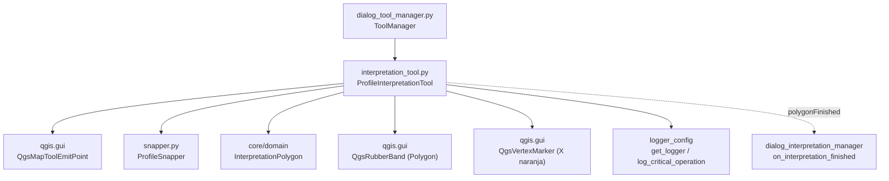

---
tags:
  - secinterp
  - code-walkthrough
  - gui
  - tools
aliases:
  - interpretation_tool.py
  - ProfileInterpretationTool
cssclass: secinterp-note
---

# `gui/tools/interpretation_tool.py`

> [!abstract] Resumen en una línea
> Map tool interactivo (`QgsMapToolEmitPoint`) para digitalizar polígonos de interpretación sobre el canvas del perfil: vértices con snapping, rubber band de previsualización y emisión de un `InterpretationPolygon` del dominio al finalizar.

**Ruta**: `gui/tools/interpretation_tool.py` (269 líneas)
**Clase principal**: `ProfileInterpretationTool(QgsMapToolEmitPoint)`
**Capa**: GUI · Tools (eventos del canvas + feedback visual; el dato sale como DTO del core)
**Tags**: #secinterp #gui #tools

---

## 🎯 ¿Por qué existe este archivo?

El preview del perfil es de solo lectura hasta que el usuario interpreta: necesita dibujar polígonos (litología, fallas, alteraciones) directamente sobre la vista, con asistencia de snapping y cancelación segura.

| Problema | Solución |
|----------|----------|
| Digitalizar polígonos sobre el canvas del perfil con feedback en vivo | `ProfileInterpretationTool`: clic añade vértice, el movimiento actualiza la rubber band |
| Los vértices deben caer sobre la geometría existente, no en el aire | Delega todo el snapping en `ProfileSnapper` (vértice + arista, tolerancia 12 px) |
| El dígito debe editarse antes de confirmar (quitar último, cancelar) | Clic derecho quita el último vértice; `Escape` resetea; `Enter`/doble clic finaliza (mínimo 3 puntos) |
| El resultado debe entrar al dominio sin acoplar la GUI al core | `finalize_polygon()` construye un `InterpretationPolygon` (DTO) y lo emite vía `polygonFinished` |

> [!important] Nota arquitectónica
> Tool del lado **Extract/Present**: vive en `qgis.gui`, dibuja con `QgsRubberBand`/`QgsVertexMarker`, pero el producto que entrega es un DTO QGIS-agnóstico (`InterpretationPolygon` con `vertices_2d: list[tuple[float, float]]`). El ciclo de vida (activar/desactivar, `reset()`, `disconnect_signals()`) lo orquesta `ToolManager` en [[dialog_tool_manager]].

---

## 🧬 Diagrama de relaciones



> [!tip] Cómo leer
> Flecha sólida = importa/delega; punteada = señal emitida. `ToolManager` posee la instancia y conecta `polygonFinished` con el handler de interpretaciones del diálogo.

---

## 📦 Imports — lectura arquitectónica

```python
# gui/tools/interpretation_tool.py
from __future__ import annotations

import contextlib
import datetime
import random
import uuid
from typing import Any

from qgis.core import (
    QgsPointXY,
    QgsWkbTypes,
)
from qgis.gui import (
    QgsMapCanvas,
    QgsMapToolEmitPoint,
    QgsRubberBand,
    QgsVertexMarker,
)
from qgis.PyQt.QtCore import QCoreApplication, Qt, pyqtSignal
from qgis.PyQt.QtGui import QColor

from sec_interp.core.domain import InterpretationPolygon
from sec_interp.gui.tools.snapper import ProfileSnapper
from sec_interp.logger_config import get_logger, log_critical_operation
```

| # | Observación |
|---|-------------|
| ① | Stdlib de apoyo a la edición: `contextlib.suppress` (limpieza que nunca debe fallar), `datetime` (sello `created_at`), `random` + `uuid` (color e id del polígono). |
| ② | `QgsWkbTypes` solo se usa para el tipo `PolygonGeometry` de la rubber band; `QgsPointXY` es el tipo de cada vértice. |
| ③ | Hereda de `QgsMapToolEmitPoint` y usa `QgsRubberBand` + `QgsVertexMarker`: tool canvas-nativo con overlay gráfico propio. |
| ④ | `QCoreApplication.translate("ProfileInterpretationTool", "New Interpretation")` — el nombre por defecto es traducible (i18n). |
| ⑤ | Único import del core: el DTO `InterpretationPolygon`. La frontera Extract está intacta: ningún servicio del core aparece aquí. |
| ⑥ | `ProfileSnapper` inyectado por composición en `__init__`, no heredado: snapping reutilizable también por `ProfileMeasureTool`. |
| ⑦ | `log_critical_operation` marca `activate`/`deactivate`/`reset`/`finalize_polygon` como operaciones auditadas en el log. |

---

## 🏗️ Inventario de estructura

**Clases (1):** `ProfileInterpretationTool(QgsMapToolEmitPoint)` — 1 señal + 15 métodos.

**Señal:**

| Señal | Payload | Quién conecta |
|-------|---------|---------------|
| `polygonFinished` | `InterpretationPolygon` | `ToolManager.connect_signals()` → `on_interpretation_finished` |

**Estado interno:**

| Atributo | Tipo | Rol |
|----------|------|-----|
| `points` | `list[QgsPointXY]` | Vértices confirmados del polígono en curso |
| `rubber_band` | `QgsRubberBand \| None` | Previsualización del polígono (relleno rojo semitransparente) |
| `vertex_markers` | `list[QgsVertexMarker]` | Marcadores X naranjas por vértice |
| `snapper` | `ProfileSnapper` | Snapping a capas del canvas |
| `cursor` | `Qt.CursorShape.CrossCursor` | Cursor en cruz al activar |
| `is_drawing` | `bool` (dinámico, en `reset()`) | Flag de dibujo en curso |

**Métodos:**

| Método | Firma | Rol |
|--------|-------|-----|
| `__init__` | `(canvas: QgsMapCanvas) -> None` | Inicializa estado + snapper |
| `activate` | `() -> None` | Activa base, pone cursor en cruz, audita |
| `deactivate` | `() -> None` | `reset()` + desactiva base |
| `disconnect_signals` | `() -> None` | Desconecta `polygonFinished` (anti-fugas) |
| `reset` | `() -> None` | Limpieza determinista total |
| `canvasReleaseEvent` | `(event: Any) -> None` | Clic izq. añade (con snap); clic der. quita último |
| `canvasMoveEvent` | `(event: Any) -> None` | Actualiza rubber band con punto s physical |
| `canvasDoubleClickEvent` | `(event: Any) -> None` | Finaliza si hay ≥ 3 puntos |
| `keyPressEvent` | `(event: Any) -> None` | `Enter` finaliza, `Escape` cancela |
| `_add_point` | `(point: QgsPointXY) -> None` | Añade vértice (anti-duplicados 1e-6) |
| `_remove_last_point` | `() -> None` | Quita último vértice y reconstruye banda |
| `_add_vertex_marker` | `(point: QgsPointXY) -> None` | Marcador X naranja tamaño 10, ancho 2 |
| `_ensure_rubber_band` | `() -> None` | Crea la banda poligonal roja si falta |
| `_update_rubber_band` | `(current_point: QgsPointXY) -> None` | Redibuja puntos + cursor |
| `finalize_polygon` | `() -> None` | Construye el DTO, emite la señal, no resetea |

---

## 📁 Archivos del paquete

| Archivo | Líneas | Rol |
|---|--:|---|
| `interpretation_tool.py` | 269 | Esta nota: digitalización de polígonos |
| `measure_tool.py` | 330 | Hermano: medición multipunto con `measurementChanged/Cleared/Finished` |
| `snapper.py` | 112 | `ProfileSnapper` compartido por ambos tools |
| `__init__.py` | — | Marcador de paquete |

---

## 📖 Recorrido método por método

### `__init__`

```python
def __init__(self, canvas: QgsMapCanvas) -> None:
    super().__init__(canvas)
    self.canvas = canvas
    self.points: list[QgsPointXY] = []
    self.rubber_band: QgsRubberBand | None = None
    self.vertex_markers: list[QgsVertexMarker] = []
    self.snapper = ProfileSnapper(canvas)
    self.cursor = Qt.CursorShape.CrossCursor
```

Conserva el canvas, arranca con estado vacío y compone el snapper sobre el mismo canvas. El cursor en cruz comunica "modo dibujo" en cuanto se activa.

### `activate` / `deactivate`

```python
def activate(self) -> None:
    log_critical_operation(logger, "activate_interpretation_tool")
    super().activate()
    self.canvas.setCursor(self.cursor)

def deactivate(self) -> None:
    log_critical_operation(logger, "deactivate_interpretation_tool")
    self.reset()
    super().deactivate()
```

Simetría estricta: activar solo cambia el cursor; desactivar **siempre** resetea primero, de modo que al salir del tool no quedan bandas ni marcadores huérfanos. Ambas están auditadas con `log_critical_operation`.

### `disconnect_signals`

```python
def disconnect_signals(self) -> None:
    with contextlib.suppress(TypeError):
        self.polygonFinished.disconnect()
```

Desconexión total de `polygonFinished` (sin argumentos = todos los slots). El `suppress(TypeError)` cubre el caso "nada conectado". `ToolManager.disconnect_signals()` lo complementa desde fuera con `suppress(TypeError, RuntimeError)`. Sin esto, cada reapertura del diálogo duplicaría el handler y un polígono se registraría N veces.

### `reset`

```python
def reset(self) -> None:
    self.points = []
    if self.rubber_band:
        with contextlib.suppress(Exception):
            self.rubber_band.reset(QgsWkbTypes.GeometryType.PolygonGeometry)
            self.canvas.scene().removeItem(self.rubber_band)
        self.rubber_band = None
    for marker in self.vertex_markers:
        with contextlib.suppress(Exception):
            self.canvas.scene().removeItem(marker)
    self.vertex_markers = []
    self.is_drawing = False
    if self.canvas:
        self.canvas.refresh()
```

Limpieza determinista en tres tiempos: vacía puntos, retira la banda de la escena (`reset()` + `removeItem`, cada paso protegido porque los objetos C++ pueden haber muerto), retira cada marcador y refresca el canvas. Cada `removeItem` va en `suppress(Exception)` para no romper el cierre del diálogo por un objeto ya destruido. Es el método que `deactivate()` y `Escape` invocan.

### `canvasReleaseEvent` / `canvasMoveEvent`

```python
def canvasReleaseEvent(self, event: Any) -> None:
    if event.button() == Qt.MouseButton.RightButton:
        if self.points:
            self._remove_last_point()
        return
    snapped_point = self.snapper.snap(event.pos())
    self._add_point(snapped_point)

def canvasMoveEvent(self, event: Any) -> None:
    if not self.points:
        return
    current_point = self.snapper.snap(event.pos())
    self._update_rubber_band(current_point)
```

Clic izquierdo: convierte el píxel a coordenadas con snap y añade el vértice. Clic derecho: deshace el último (no cancela todo, a diferencia de `ProfileMeasureTool` donde el derecho resetea). El movimiento solo trabaja si ya hay vértices y también pasa por el snapper, así la previsualización "imanta" igual que el clic final.

### `canvasDoubleClickEvent` / `keyPressEvent`

```python
MIN_POLYGON_POINTS = 3
if len(self.points) >= MIN_POLYGON_POINTS:
    self.finalize_polygon()
```

Doble clic y `Enter`/`Return` finalizan con el mismo umbral de 3 puntos; `Escape` invoca `reset()` y consume el evento (`event.accept()`). Otras teclas se delegan a `super().keyPressEvent(event)`.

| Entrada | Condición | Efecto |
|---------|-----------|--------|
| Doble clic | ≥ 3 puntos | `finalize_polygon()` |
| `Enter` / `Return` | ≥ 3 puntos | `finalize_polygon()` + `event.accept()` |
| `Enter` con < 3 puntos | — | nada (sin `accept`, sin emisión) |
| `Escape` | siempre | `reset()` + `event.accept()` |

### `_add_point` / `_remove_last_point`

```python
def _add_point(self, point: QgsPointXY) -> None:
    if self.points and self.points[-1].compare(point, 1e-6):
        return
    self.points.append(point)
    self._ensure_rubber_band()
    self.rubber_band.addPoint(point, True)
    self._add_vertex_marker(point)
```

El guarda anti-duplicados (`compare` con tolerancia 1e-6) evita vértices dobles por clics lentos que generan dos releases en el mismo píxel. `_remove_last_point()` hace el camino inverso: `pop()` de puntos y marcadores; si no quedan puntos destruye la banda, y si quedan la reconstruye vértice a vértice con `addPoint(p, False)`.

### `_ensure_rubber_band` / `_add_vertex_marker` / `_update_rubber_band`

Banda poligonal roja semitransparente (`QColor(255, 0, 0, 100)`, ancho 2) creada de forma perezosa; marcadores X naranjas (`255, 165, 0`, tamaño 10, ancho 2) uno por vértice. `_update_rubber_band` resetea y re-añade todos los puntos fijos más el cursor como punto "móvil" (`addPoint(current, True)`), que es lo que da el efecto elástico.

### `finalize_polygon`

```python
vertices_2d = [(p.x(), p.y()) for p in self.points]
hue = random.randint(0, 359)   # nosec B311
sat = random.randint(200, 255)  # nosec B311
val = random.randint(150, 255)  # nosec B311
rand_color = QColor.fromHsv(hue, sat, val)
color_hex = rand_color.name()

interp = InterpretationPolygon(
    id=str(uuid.uuid4()),
    name=QCoreApplication.translate("ProfileInterpretationTool", "New Interpretation"),
    type="lithology",
    vertices_2d=vertices_2d,
    attributes={},
    color=color_hex,
    created_at=datetime.datetime.now().isoformat(),
)
self.polygonFinished.emit(interp)
```

Convierte los vértices a tuplas `(dist, elev)` planas (el DTO no conoce `QgsPointXY`), genera un color vívido aleatorio en HSV (saturación y valor altos para distinguer cada interpretación) serializado a `#RRGGBB`, y emite el DTO. **No llama a `reset()`**: el comentario del fuente lo prohíbe expresamente; el handler del diálogo desactiva el tool y `deactivate()` limpia. Con menos de 3 puntos registra un `warning` y aborta sin emitir.

---

## 🔄 Flujo de datos

| Fase | Entrada | Transformación | Salida |
|------|---------|----------------|--------|
| Activación | `ToolManager.toggle_interpretation_tool(True)` | `reset()` + `setMapTool` + cursor en cruz | tool listo |
| Digitalización | clics del ratón (píxeles) | `ProfileSnapper.snap()` → `QgsPointXY` | `points` + banda + marcadores |
| Edición | clic derecho / `Escape` | `pop()` + reconstrucción de banda / `reset()` | estado corregido o vacío |
| Finalización | ≥ 3 vértices + `Enter`/doble clic | tuplas `(x, y)` + `uuid` + color HSV + `translate` | `InterpretationPolygon` emitido |
| Cierre | `deactivate()` del manager | `reset()` + `super().deactivate()` | escena limpia, cursor normal |

---

## 🏛️ Patrones de diseño presentes

| Patrón | Dónde | Propósito |
|--------|-------|-----------|
| **Map Tool (QGIS)** | Herencia de `QgsMapToolEmitPoint` | Integrarse en el canvas con eventos estándar |
| **Observer (señal)** | `polygonFinished.emit(interp)` | Desacoplar el dibujo del registro en el diálogo |
| **Composición** | `self.snapper = ProfileSnapper(canvas)` | Reutilizar snapping sin heredar |
| **DTO de salida** | `InterpretationPolygon` | Cruzar la frontera GUI→dominio sin tipos QGIS |
| **Deterministic cleanup** | `reset()` / `deactivate()` / `disconnect_signals()` | Cero bandas, marcadores o conexiones huérfanas |
| **Audit logging** | `log_critical_operation(...)` | Trazar activación, reseteo y finalización |

---

## 🧾 Resumen de la API

| Símbolo | Firma / Hereda | Uso típico |
|---------|----------------|------------|
| `ProfileInterpretationTool` | `QgsMapToolEmitPoint` | `ProfileInterpretationTool(canvas)` (lo crea `ToolManager`) |
| `polygonFinished` | `pyqtSignal(InterpretationPolygon)` | Conectar a `on_interpretation_finished` |
| `activate` / `deactivate` | `() -> None` | Vía `ToolManager.toggle_interpretation_tool()` |
| `reset` | `() -> None` | Cancelar el dibujo en curso |
| `finalize_polygon` | `() -> None` | Confirmar desde botón o atajo (≥ 3 puntos) |
| `disconnect_signals` | `() -> None` | Al cerrar el diálogo |

---

## 🛡️ Manejo de errores

| Situación | Comportamiento |
|-----------|----------------|
| Finalizar con < 3 puntos | `warning` en log y retorno silencioso, sin emisión |
| Doble punto consecutivo (clic lento) | Ignorado por `compare(point, 1e-6)` |
| Objetos C++ ya destruidos en `reset()` | `suppress(Exception)` por ítem; la limpieza continúa |
| `polygonFinished` sin conexiones al desconectar | `suppress(TypeError)` |
| Snapper con capa problemática | El snapper captura y continúa; el tool recibe el punto crudo |

El módulo no lanza excepciones propias: los errores de dominio (polígono inválido, persistencia) los gestiona el handler de interpretaciones aguas abajo.

---

## 🧪 Tests asociados

Cobertura real en `tests/gui/test_interpretation_tool.py` (clase `TestInterpretationTool`, con canvas mockeado y `toMapCoordinates` identidad):

- `test_snapper_skips_and_continues` — capas ráster se omiten (`_is_snappable`) y locators inválidos no rompen el `snap()`.
- Casos con `QgsPointLocator` parcheado: `nearestVertex`/`nearestEdge` válidos e inválidos, `_get_locator` que lanza o devuelve `None`.
- Tests del tool: añadir/finalizar polígono, `reset()`, `disconnect_signals()`, doble clic y teclado.

Relacionados: `tests/gui/test_main_dialog_tools.py` (ciclo vía `ToolManager`), `tests/gui/test_main_dialog_interpretation.py` y `tests/gui/test_dialog_interpretation_manager.py` (handler `on_interpretation_finished`), `tests/gui/test_interpretation_export.py` (el DTO ya persistido). En `tests/core/` el DTO se cubre indirectamente vía tests de interpretaciones/exporters, no de este tool.

---

## 👀 Observaciones y notas

> [!success] Fortalezas
> - Salida como DTO del dominio: el tool no arrastra QGIS aguas abajo.
> - Edición antes de confirmar (deshacer último, anti-duplicados, umbral de 3 puntos).
> - Limpieza en tres niveles (`reset`, `deactivate`, `disconnect_signals`) sin fugas de escena ni de señales.
> - Nombre inicial traducible y color aleatorio vívido: cada interpretación nace distinguible.

> [!warning] Puntos de atención
> - `is_drawing` se crea dinámicamente en `reset()`, no en `__init__`: leerlo antes del primer `reset()` lanza `AttributeError`.
> - `random` sin semilla: colores no reproducibles entre sesiones (asumido, pero documentado con `nosec B311`).
> - `finalize_polygon()` no resetea por diseño: si el handler olvida desactivar el tool, los puntos viejos siguen en `points`.

> [!question] Preguntas abiertas
> - ¿Inicializar `is_drawing = False` en `__init__` y alternarlo en `_add_point`/`reset()`?
> - ¿Persistir el color en la paleta de `ColorManager` para que la leyenda y el polígono compartan fuente cromática?

---

## 🔗 Notas relacionadas

- [[Index]] — índice de la bóveda
- [[gui_tools]] — nota de familia de map tools del perfil
- [[dialog_tool_manager]] — `ToolManager`: posee el tool, conecta `polygonFinished`, alterna con pan/medición
- [[snapper]] — `ProfileSnapper`: snapping a vértice/arista que este tool consume
- [[measure_tool]] — tool hermano con el mismo snapper y distinta semántica de clic derecho
- [[domain]] — `InterpretationPolygon`: forma del DTO emitido
- [[main_dialog]] — diálogo que aloja el canvas y el handler de interpretaciones
- [[preview_task_orchestrator]] — el cálculo pesado sigue en `QgsTask`; este tool solo digitaliza

---

*Nota de la bóveda SecInterp Code Walkthrough v2 — v3.8.0*
