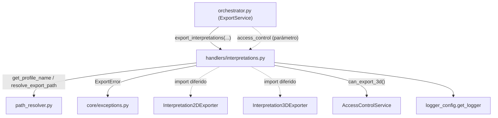

---
tags:
  - secinterp
  - code-walkthrough
  - core
  - export
  - handlers
aliases:
  - interpretations.py
  - export_interpretations
cssclass: secinterp-note
---

# `core/services/export/handlers/interpretations.py`

> [!abstract] Resumen en una línea
> Handler de exportación de **interpretaciones**: exporta los polígonos en 2D de forma obligatoria y, si el control de acceso lo permite y la línea de sección es válida, los exporta también en 3D.

**Ruta**: `core/services/export/handlers/interpretations.py` (93 líneas)
**Función principal**: `export_interpretations`
**Capa**: Core (QGIS-agnóstico, con acceso duck-typed a la capa de sección)
**Tags**: #secinterp #core #export #handlers

---

## 🎯 ¿Por qué existe este archivo?

Las interpretaciones (polígonos 2D digitados) tienen una salida 2D **obligatoria** y
una salida 3D **condicionada**: solo si el usuario tiene permiso (feature "3D Export")
y si la línea de sección es válida para georreferenciar el polígono en el espacio.

| Problema | Solución |
|----------|----------|
| Salida 2D siempre, 3D opcional y con permiso | `export_interpretations` + gate `can_export_3d()` |
| El 3D necesita la geometría de la línea de sección | `_export_interpretations_3d` extrae `line_layer.getFeatures()` |
| Restringir features según el usuario | `access_control: AccessControlService` inyectado |

> [!important] Nota arquitectónica
> Es el **único** handler con control de acceso. La capa de sección (`line_layer`) es un
> objeto QGIS tipado `Any` y accedido por duck-typing (`isValid()`, `getFeatures()`,
> `.geometry()`) — la zona gris documentada del core, sin importar `qgis.core`.

---

## 🧬 Diagrama de relaciones



> [!tip] Cómo leer
> `access_control` se inyecta desde el orquestador; `Interpretation2DExporter`/`3D` se
> importan de forma diferida. La línea discontinua hacia `AccessControlService` es la
> llamada de gate `can_export_3d()`.

---

## 📦 Imports — lectura arquitectónica

```python
# core/services/export/handlers/interpretations.py
from __future__ import annotations

from pathlib import Path
from typing import Any

from sec_interp.core.exceptions import ExportError
from sec_interp.core.services.export.path_resolver import get_profile_name, resolve_export_path
from sec_interp.logger_config import get_logger
```

```python
# imports diferidos (dentro de cada función)
from sec_interp.exporters import Interpretation2DExporter
from sec_interp.exporters import Interpretation3DExporter
```

| # | Observación |
|---|-------------|
| ① | Solo importa `ExportError` (no `DataMissingError`): no valida datos vacíos como error. |
| ② | Sin importación de `qgis.*`; la capa de sección se accede por duck-typing vía `Any`. |
| ③ | Dos exporters importados de forma diferida, cada uno en su función. |
| ④ | `access_control: Any | None` en la firma; el gate es opcional (si es `None`, no hay 3D). |

---

## 🏗️ Inventario de estructura

**Funciones/Métodos:**
- `export_interpretations(folder, data, line_layer, crs, msg, controller, settings, ext, access_control) -> None`
- `_export_interpretations_3d(folder, data, line_layer, crs, msg, controller, settings, ext) -> None` (privada)

**Dependencias:**
- `Interpretation2DExporter`, `Interpretation3DExporter` (de `sec_interp.exporters`)
- `AccessControlService` (inyectado, método `can_export_3d()`)

Una función pública que orquesta 2D + 3D y delega el 3D en una función privada.

---

## 📖 Recorrido método por método

### `export_interpretations`

```python
def export_interpretations(
    folder: Path,
    data: list[Any] | None,
    line_layer: Any,
    crs: Any,
    msg: list[str],
    controller: Any | None,
    settings: Any | None,
    ext: str,
    access_control: Any | None,
) -> None:
    """Export interpretation data (2D mandatory, 3D gated)."""
    if not data:
        logger.info("No interpretations provided for export.")
        return

    from sec_interp.exporters import Interpretation2DExporter

    logger.info("✓ Saving interpretation data...")
```

**Guard con log**: a diferencia de otros handlers, el vacío se anuncia con
`logger.info` (no es silencioso). Luego se importa el exporter 2D.

```python
    try:
        profile_name = get_profile_name(controller)
        pattern = getattr(settings, "naming_pattern", None) if settings else None
        path, path_layer = resolve_export_path(
            folder, "interpretations", profile_name, pattern, ext
        )
        exporter = Interpretation2DExporter({})
        ok = exporter.export(path, {"interpretations": data, "crs": crs}, layer_name=path_layer)
        if ok:
            msg.append(f"  - {path.relative_to(folder)}")
        else:
            logger.warning(f"Failed to write 2D interpretations to {path}")
```

**2D obligatorio**: exporta los polígonos con payload `{"interpretations", "crs"}`.

```python
        if access_control and access_control.can_export_3d():
            _export_interpretations_3d(
                folder, data, line_layer, crs, msg, controller, settings, ext
            )
        else:
            logger.info("3D Export features are restricted for this user.")
```

**Gate 3D**: si hay `access_control` **y** `can_export_3d()` devuelve `True`, delega en
la función privada; si no, registra que el feature está restringido.

```python
    except Exception as e:
        logger.exception(f"Interpretation export failed: {e}")
        raise ExportError(f"Interpretation export failed: {e!s}") from e
```

**Único `except Exception`**: a diferencia del patrón de doble `except` del resto de
handlers, aquí hay un solo bloque genérico que traduce a `ExportError`.

### `_export_interpretations_3d`

```python
def _export_interpretations_3d(
    folder: Path,
    data: list[Any],
    line_layer: Any,
    crs: Any,
    msg: list[str],
    controller: Any | None,
    settings: Any | None,
    ext: str,
) -> None:
    """Export interpretation polygons to 3D space."""
    from sec_interp.exporters import Interpretation3DExporter

    logger.info("✓ Saving 3D interpretation data...")
    if line_layer and line_layer.isValid():
        line_geom = next(line_layer.getFeatures()).geometry()

        profile_name = get_profile_name(controller)
        pattern = getattr(settings, "naming_pattern", None) if settings else None
        path, path_layer = resolve_export_path(
            folder, "interpretations_3d", profile_name, pattern, ext
        )
        exporter = Interpretation3DExporter({})

        ok = exporter.export(
            str(path),
            {"interpretations": data, "section_line": line_geom, "crs": crs},
            layer_name=path_layer,
        )
        if ok:
            msg.append(f"  - {path.relative_to(folder)} (3D)")
        else:
            logger.warning(f"Failed to write 3D interpretations to {path}")
    else:
        logger.warning("Invalid section line layer, skipping 3D export.")
```

**Georreferenciación 3D**:

1. Valida `line_layer.isValid()` (duck-typing sobre el objeto QGIS tipado `Any`).
2. Extrae la geometría de la sección con `next(line_layer.getFeatures()).geometry()`.
3. Exporta con payload `{"interpretations", "section_line", "crs"}` y `base_name`
   `"interpretations_3d"`.
4. Ojo: pasa `str(path)` (no `Path`) al exporter 3D — firma distinta a la del 2D.
5. Si la capa no es válida, salta la exportación 3D con un `warning`.

---

## 🔄 Flujo de datos

| Fase | Entrada | Transformación | Salida |
|------|---------|----------------|--------|
| Guard | `data` (`None`/vacío) | log + return | — |
| 2D | `data`, `crs` | `Interpretation2DExporter.export` | capa 2D + `msg` |
| Gate | `access_control` | `can_export_3d()` | decisión sí/no |
| 3D | `data`, `line_layer`, `crs` | extraer `line_geom` + `Interpretation3DExporter.export` | capa 3D + `msg` |

---

## 🏛️ Patrones de diseño presentes

| Patrón | Dónde | Propósito |
|--------|-------|-----------|
| **Guard clause** | `if not data` | salida temprana (con log) |
| **Facade** | `export_interpretations` | ocultar 2D + gate 3D tras una firma |
| **Private method / Template** | `_export_interpretations_3d` | extraer la fase 3D |
| **Authorization gate** | `access_control.can_export_3d()` | restringir feature por usuario |
| **Lazy import (deferred)** | exporters 2D/3D | ahorrar carga sin datos |
| **Exception translation** | `except Exception → ExportError` | normalizar fallos |

---

## 🧾 Resumen de la API

| Símbolo | Firma / Hereda | Uso típico |
|---------|----------------|------------|
| `export_interpretations` | `(folder, data, line_layer, crs, msg, controller, settings, ext, access_control) -> None` | Exportar 2D + 3D condicional |
| `_export_interpretations_3d` | `(folder, data, line_layer, crs, msg, controller, settings, ext) -> None` | Exportar polígonos al espacio 3D |
| `Interpretation2DExporter` | `BaseExporter` (import diferido) | Escribir polígonos 2D |
| `Interpretation3DExporter` | `BaseExporter` (import diferido) | Escribir polígonos 3D georreferenciados |

---

## 🛡️ Manejo de errores

| Caso | Comportamiento |
|------|----------------|
| `data` vacío | `logger.info` + `return` (no es error) |
| `access_control` ausente o sin permiso | `logger.info` "restricted"; no hay 3D |
| `line_layer` inválida | `logger.warning` + skip de 3D |
| Excepción en 2D/3D | `logger.exception` + `raise ExportError(...) from e` |

> [!warning] Un solo `except Exception`
> A diferencia de los demás handlers (que separan `OSError/ValueError/TypeError/
> DataMissingError` de `Exception`), aquí hay un único `except Exception`. Es más
> simple, pero no distingue fallos esperados de los críticos.

---

## 🧪 Tests asociados

- `tests/core/test_export_service.py::test_export_interpretation_3d_invalid_line` —
  línea de sección inválida → se salta la exportación 3D.
- `tests/core/test_export_service.py::test_export_interpretation_error` — fallo del
  exporter → `ExportError`.
- `tests/core/test_export_service.py::test_export_data_3d_restricted` — gate de acceso
  restringe el 3D.
- `tests/exporters/test_interpretation_exporters.py` — lógica de `Interpretation2DExporter`.
- `tests/exporters/test_interpretation_3d_exporter.py` — lógica de `Interpretation3DExporter`.

---

## 👀 Observaciones y notas

> [!success] Fortalezas
> - Gate de acceso explícito para el feature 3D (único en el paquete).
> - Separación clara 2D (obligatorio) vs 3D (condicional) en dos funciones.
> - Degradación elegante: capa inválida o sin permiso ⇒ skip con log, no excepción.

> [!warning] Puntos de atención
> - `next(line_layer.getFeatures())` asume al menos un feature; si la capa está vacía
>   lanza `StopIteration`.
> - `str(path)` vs `Path` (2D) es una asimetría de firma entre exporters.
> - La extracción de `line_geom` depende de `line_layer` (QGIS) tipado `Any`: zona gris.

> [!question] Preguntas abiertas
> - ¿Proteger `next(...)` con un `try/except StopIteration` o `is not None`?
> - ¿Unificar la firma de los exporters para recibir siempre `Path`?

---

## 🔗 Notas relacionadas

- [[Index]] — índice de la bóveda
- [[core_services_export_handlers]] — paquete `handlers/` al que pertenece
- [[orchestrator]] — delega en `export_interpretations` bajo el flag `exp_interp`
- [[path_resolver]] — `get_profile_name` / `resolve_export_path`
- [[compat]] — `_export_interpretations` wrapper de compatibilidad
- [[controller]] — origen del `access_control` y la lógica de sección
- [[entities]] — `InterpretationPolygon` / `InterpretationPolygon25D`

---

*Nota de la bóveda SecInterp Code Walkthrough v2 — v3.9.1*
