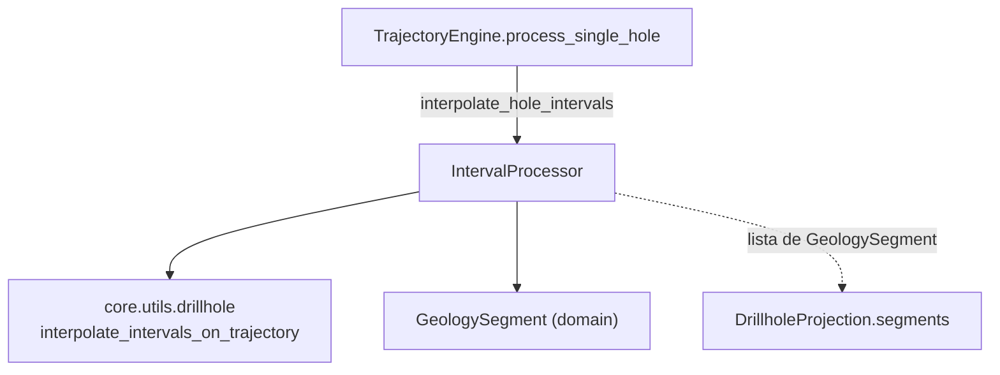

---
tags:
  - secinterp
  - code-walkthrough
  - core
  - processors
aliases:
  - interval_processor.py
  - IntervalProcessor
cssclass: secinterp-note
---

# `core/services/drillhole/interval_processor.py`

> [!abstract] Resumen en una línea
> Procesador **puro** que convierte los tramos litológicos `(from, to, litología)` en objetos `GeologySegment` con sus puntos 2D, 3D y proyectados, interpolándolos a lo largo de una trayectoria ya proyectada sobre la sección.

**Ruta**: `core/services/drillhole/interval_processor.py` (50 líneas)
**Clase/Función principal**: `IntervalProcessor`
**Capa**: Core (QGIS-agnóstico)
**Tags**: #secinterp #core #processors

---

## 🎯 ¿Por qué existe este archivo?

La trayectoria del sondaje ya está calculada y proyectada (ver [[drillhole]] y
[[trajectory_engine]]). Falta el paso que da **significado geológico** a esa
polilínea: repartir los tramos litológicos sobre ella y empaquetarlos en el DTO que
el resto del sistema sabe dibujar.

| Problema | Solución |
|----------|----------|
| Los intervalos llegan como tuplas crudas `(from, to, lith)` | se enriquecen a `{"unit", "from", "to"}` |
| La interpolación pura vive en `core/utils` | se delega a `scu.interpolate_intervals_on_trajectory` |
| El render espera `GeologySegment`, no tuplas | se construye un `GeologySegment` por tramo |

> [!important] Nota arquitectónica
> **QGIS-agnóstico** y **adaptador delgado**: este módulo no calcula geometría, solo
> adapta la salida de `core.utils.drillhole` al DTO de dominio. Es el eslabón final
> del pipeline `collar → trayectoria → intervalos`; su entrada y su salida son tipos
> puros (tuplas y `GeologySegment`).

---

## 🧬 Diagrama de relaciones



> [!tip] Cómo leer
> Flecha sólida = importa/delega; punteada = el resultado se incrusta en
> `DrillholeProjection.segments` (ver [[trajectory_engine]]). `IntervalProcessor` es
> una **hoja** que solo consume el util puro y el DTO.

---

## 📦 Imports — lectura arquitectónica

```python
# interval_processor.py
from __future__ import annotations

from sec_interp.core import utils as scu
from sec_interp.core.domain import GeologySegment
```

| # | Observación |
|---|-------------|
| ① | `from sec_interp.core import utils as scu` — alias corto del paquete de utilidades puras; accede a `scu.interpolate_intervals_on_trajectory`. |
| ② | `GeologySegment` es el único DTO importado: la salida del módulo. |
| ③ | **Sin** `typing`, **sin** `math`, **sin** `qgis.*`: dependencia mínima, dos imports internos. |

> [!note] El alias `scu` es idioma del paquete
> `trajectory_engine.py` usa el mismo alias (`from sec_interp.core import utils as
> scu`). Refleja que ambos módulos delegan la trigonometría a `core/utils`, que reexporta
> `calculate_drillhole_trajectory`, `project_trajectory_to_section` e
> `interpolate_intervals_on_trajectory` (ver [[drillhole]]).

---

## 🏗️ Inventario de estructura

**Clases:** `class IntervalProcessor` — 1 método público

**Funciones/Métodos:**
- `interpolate_hole_intervals(traj, intervals, buffer_width) -> list[GeologySegment]`

Sin constantes ni métodos privados: todo el trabajo es una única transformación.

---

## 📁 Archivos del paquete

| Archivo | Nota |
|---------|------|
| `interval_processor.py` | esta nota |
| `collar_processor.py` | [[collar_processor]] — proyección del collar |
| `trajectory_engine.py` | [[trajectory_engine]] — orquesta y llama a este módulo |
| `projection_engine.py` | [[core_services_drillhole]] — proyección punto-línea |
| `survey_processor.py` | [[core_services_drillhole]] — profundidad final |

---

## 📖 Recorrido método por método

### `interpolate_hole_intervals`

```python
def interpolate_hole_intervals(
    self,
    traj: list[tuple[float, float, float, float, float, float, float, float]],
    intervals: list[tuple[float, float, str]],
    buffer_width: float,
) -> list[GeologySegment]:
```

Punto de entrada único. Flujo completo:

```python
if not intervals:
    return []

rich_intervals = [
    (fd, td, {"unit": lith, "from": fd, "to": td}) for fd, td, lith in intervals
]
# Scu returns (attr, points_2d, points_3d, points_3d_proj)
tuples = scu.interpolate_intervals_on_trajectory(traj, rich_intervals, buffer_width)

segments = []
for attr, points_2d, points_3d, points_3d_proj in tuples:
    segments.append(
        GeologySegment(
            unit_name=str(attr.get("unit", "Unknown")),
            geometry_wkt=None,
            attributes=attr,
            points=points_2d,
            points_3d=points_3d,
            points_3d_projected=points_3d_proj,
        )
    )
return segments
```

1. **Guard clause**: sin intervalos → `[]` (no hay nada que repartir).
2. **Enriquecimiento**: cada `(from, to, lith)` pasa a `(fd, td, {"unit", "from",
   "to"})`. El tercer elemento deja de ser un `str` y se convierte en un `dict` de
   atributos, que es lo que `scu.interpolate_intervals_on_trajectory` espera como
   `attr`.
3. **Delegación**: la interpolación real (partir puntos por profundidad, filtrar por
   `offset ≤ buffer_width`) la hace `scu`. El resultado es una lista de tuplas
   `(attr, points_2d, points_3d, points_3d_proj)`.
4. **Construcción de DTO**: por cada tupla se monta un `GeologySegment`, copiando el
   dict `attr` completo en `attributes` y repartiendo los tres conjuntos de puntos.

> [!note] `geometry_wkt=None`
> El `GeologySegment` se crea **sin geometría WKT** (`geometry_wkt=None`). El segmento
> se describe por sus listas de puntos (`points`, `points_3d`, `points_3d_projected`),
> no por una cadena WKT. Es coherente con el patrón del dominio: las coordenadas viajan
> como tuplas planas.

### Esquema de `traj` (8-tupla)

La entrada `traj` ya viene proyectada desde [[trajectory_engine]] (que a su vez la
obtuvo de `scu.project_trajectory_to_section`):

| Índice | 0 | 1 | 2 | 3 | 4 | 5 | 6 | 7 |
|:---:|---|---|---|---|---|---|---|---|
| Campo | `depth` | `x` | `y` | `z` | `dist_along` | `offset` | `proj_x` | `proj_y` |

`IntervalProcessor` **no reinterpreta** estos índices: los pasa opacos a
`scu.interpolate_intervals_on_trajectory`. El acoplamiento posicional está encapsulado
en `core/utils/drillhole.py` (ver [[drillhole]]), no aquí.

---

## 🔄 Flujo de datos

| Fase | Entrada | Transformación | Salida |
|------|---------|----------------|--------|
| Guard | `intervals` vacío | — | `[]` |
| Enriquecer | `(from, to, lith)` | `→ (fd, td, {"unit", "from", "to"})` | `rich_intervals` |
| Interpolar | `traj` + `rich_intervals` | `scu.interpolate_intervals_on_trajectory` | `(attr, p2d, p3d, p3dp)` |
| Empaquetar | tuplas | `GeologySegment(...)` | `list[GeologySegment]` |

> [!tip] Encadenamiento canónico
> `TrajectoryEngine.process_single_hole` llama a `interpolate_hole_intervals` con la
> trayectoria **ya filtrada** (`p[5] <= buffer_width`) y el resultado se incrusta en
> `DrillholeProjection.segments`. Este módulo es la bisagra entre "matemática de
> trayectoria" y "objeto geológico dibujable".

---

## 🏛️ Patrones de diseño presentes

| Patrón | Dónde | Propósito |
|--------|-------|-----------|
| **Adapter / Mapper** | bucle de construcción de `GeologySegment` | Tupla cruda → DTO de dominio |
| **Facade (delegación)** | `scu.interpolate_...` | Ocultar la mecánica de interpolación |
| **Guard clause** | `if not intervals` | Salida temprana ante datos vacíos |
| **Data-enrichment** | `rich_intervals` | Añadir claves `unit`/`from`/`to` al atributo |

---

## 🧾 Resumen de la API

| Símbolo | Firma / Hereda | Uso típico |
|---------|----------------|------------|
| `interpolate_hole_intervals` | `(traj: list[tuple[8 floats]], intervals: list[tuple[float,float,str]], buffer_width: float) -> list[GeologySegment]` | Repartir tramos litológicos sobre la trayectoria |

---

## 🛡️ Manejo de errores

No lanza excepciones; el único caso especial es el **vacío**:

| Caso | Comportamiento |
|------|----------------|
| `intervals` vacío | `[]` (guard clause) |
| Intervalo fuera del rango de profundidades de `traj` | `scu` lo omite (0 segmentos para ese tramo) |
| Punto con `offset > buffer_width` | filtrado dentro de `scu`, no aquí |

> [!note] El `attr` siempre trae `unit`
> En `rich_intervals` se garantiza la clave `"unit"`; el fallback `"Unknown"` en
> `attr.get("unit", "Unknown")` es defensivo (no debería dispararse). Si llegara a
> faltar, el segmento se etiqueta `"Unknown"` en lugar de romper.

---

## 🔢 Ejemplo numérico — un tramo

`traj = [(0,0,0,100,0,0,0,0), (10,10,0,90,10,0.5,10,0)]`,
`intervals = [(0, 5, "LithA")]`, `buffer_width = 2.0`:

1. `rich_intervals = [(0, 5, {"unit": "LithA", "from": 0, "to": 5})]`.
2. `scu` interpola y devuelve una tupla `(attr, p2d, p3d, p3dp)` con los puntos en el
   rango de profundidad `[0, 5]`.
3. Se construye `GeologySegment(unit_name="LithA", geometry_wkt=None,
   attributes={"unit": "LithA", "from": 0, "to": 5}, points=p2d, ...)`.

El test equivalente (`test_interpolate_hole_intervals_basic` en
`tests/core/services/drillhole/test_processors.py`) verifica `len(results) == 1` y
`results[0].unit_name == "LithA"`.

---

## 🧪 Tests asociados

Mapeo a los tests reales bajo `tests/core/`:

- `tests/core/services/drillhole/test_processors.py::TestIntervalProcessor::test_interpolate_hole_intervals_empty` —
  sin intervalos → `[]`.
- `tests/core/services/drillhole/test_processors.py::TestIntervalProcessor::test_interpolate_hole_intervals_basic` —
  construye `GeologySegment` con `unit_name` y `attributes["from"]`.
- `tests/core/test_drillhole_service.py::test_process_context_projects_collar` —
  verifica indirectamente que `drillhole_data[0].segments` no está vacío.
- `tests/core/test_drillhole_utils.py::TestInterpolateIntervalsOnTrajectory` — cubre la
  mecánica pura que este módulo delega (formato de puntos, buffer, múltiples tramos).

> [!note] Cobertura indirecta
> Al ser un adaptador fino, la mayoría de la lógica está en `core/utils/drillhole.py`
> y se cubre vía `test_drillhole_utils.py`. Aquí los tests validan el **mapeo** a
> `GeologySegment`, no la interpolación en sí.

---

## 👀 Observaciones y notas

> [!success] Fortalezas
> - Módulo mínimo y enfocado: una sola responsabilidad (mapear a DTO).
> - 100 % QGIS-agnóstico; dos imports internos, sin estado.
> - Enriquecimiento de atributos explícito y legible.

> [!warning] Puntos de atención
> - `geometry_wkt=None` deja el segmento sin geometría WKT; si un consumidor la exige,
>   fallará silenciosamente.
> - El fallback `"Unknown"` puede enmascarar datos de litología ausentes.
> - Acoplamiento posicional de `traj` (8-tupla) heredado de `core/utils/drillhole.py`.

> [!question] Preguntas abiertas
> - ¿Debería este módulo construir también la `geometry_wkt` para exportadores?
> - ¿Tipar `intervals` con un alias (`list[Interval]`) en lugar de tuplas anónimas?

---

## 🔗 Notas relacionadas

- [[Index]] — índice de la bóveda
- [[trajectory_engine]] — consumidor principal de `interpolate_hole_intervals`
- [[drillhole]] — `interpolate_intervals_on_trajectory` (la mecánica delegada)
- [[drillhole_service]] — orquesta el pipeline completo
- [[dtos]] / [[entities]] — `GeologySegment` y sus campos
- [[core_services_drillhole]] — el resto del paquete

---

*Nota de la bóveda SecInterp Code Walkthrough v2 — v3.9.1*
