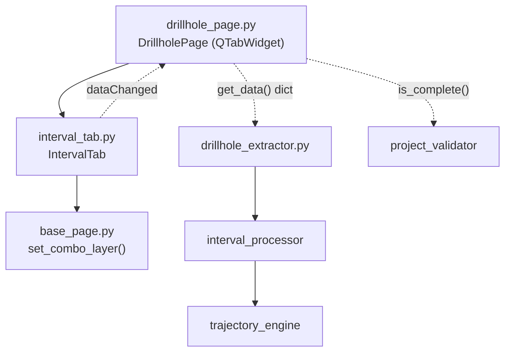

---
tags:
  - secinterp
  - code-walkthrough
  - gui
  - pages
aliases:
  - interval_tab.py
  - IntervalTab
cssclass: secinterp-note
---

# `gui/ui/pages/drillhole/interval_tab.py`

> [!abstract] Resumen en una línea
> Pestaña de configuración de intervalos del sondaje: selector de capa tabular (puntos o sin geometría) más mapeo de campos (ID, desde, hasta, litología), que alimenta el `DrillholeContext` del lado Extract.

**Ruta**: `gui/ui/pages/drillhole/interval_tab.py` (144 líneas)
**Clase principal**: `IntervalTab`
**Capa**: GUI (QGIS-dependiente · página secundaria / tab)
**Tags**: #secinterp #gui #pages

---

## 🎯 ¿Por qué existe este archivo?

Los intervalos (tramos desde-hasta con litología) viven normalmente en una
tabla sin geometría, no en una capa de puntos. Este tab encapsula esa
particularidad: filtro de capa dual y cuatro mapeos de campo.

| Problema | Solución |
|----------|----------|
| La tabla de intervalos puede no tener geometría | Filtro `PointLayer \| NoGeometry` |
| Cuatro campos deben seguir a la capa elegida | `layerChanged` conectado a los cuatro `setLayer` |
| La página padre agrega tres formularios homogéneos | Mismo contrato que `CollarTab`/`SurveyTab` |
| `Qgis.LayerFilters` no existe en QGIS antiguos | `try/except` con fallback a `QgsMapLayerProxyModel` |

> [!important] Nota arquitectónica
> Tab de la fase **Extract**: expone `interval_from`/`interval_to` como nombres
> de campo; el core ([[interval_processor]]) los convierte en tramos numéricos
> validados (`from < to`, sin solapes).

---

## 🧬 Diagrama de relaciones



> [!tip] Cómo leer
> Flecha sólida = importa/delega; punteada = callback/flujo de datos hacia el padre
> o hacia el core.

---

## 📦 Imports — lectura arquitectónica

```python
# gui/ui/pages/drillhole/interval_tab.py
from __future__ import annotations
import contextlib
from typing import Any
from qgis.core import Qgis, QgsMapLayerProxyModel
from qgis.gui import QgsFieldComboBox, QgsMapLayerComboBox
from qgis.PyQt.QtCore import QCoreApplication, pyqtSignal
from qgis.PyQt.QtWidgets import QGridLayout, QLabel, QWidget
from sec_interp.gui.ui.pages.base_page import set_combo_layer
from sec_interp.logger_config import get_logger
```

| # | Observación |
|---|-------------|
| ① | Importa además `QgsMapLayerProxyModel`: fallback para QGIS sin `Qgis.LayerFilters`. |
| ② | Sin `QCheckBox`: este tab no tiene modos alternativos (compárese con `CollarTab`). |
| ③ | `QGridLayout` con contador `row` incremental en vez de índices literales. |
| ④ | `set_combo_layer` y `get_logger` igual que en los tabs hermanos. |
| ⑤ | `dataChanged` idéntica: el padre conecta los tres tabs en bucle. |

---

## 🏗️ Inventario de estructura

**Clase:** `IntervalTab(QWidget)` — 1 señal, 8 métodos.

| Miembro | Tipo | Rol |
|---------|------|-----|
| `dataChanged` | `pyqtSignal()` | Aviso al padre de que cambió algún campo |
| `i_layer` | `QgsMapLayerComboBox` | Capa/tabla de intervalos |
| `i_id` | `QgsFieldComboBox` | Campo Hole ID (enlace con collar) |
| `i_from` | `QgsFieldComboBox` | Profundidad inicial del tramo |
| `i_to` | `QgsFieldComboBox` | Profundidad final del tramo |
| `i_lith` | `QgsFieldComboBox` | Litología o atributo del tramo |

**Métodos:**

| Método | Firma | Propósito |
|--------|-------|-----------|
| `__init__` | `(parent=None) -> None` | Construye y llama `_setup_ui` |
| `tr` | `(message: str) -> str` | Traduce con contexto `"IntervalTab"` |
| `_setup_ui` | `() -> None` | Grilla de 5 filas + stretch |
| `get_data` | `() -> dict[str, Any]` | Valores vivos para validación/extract |
| `dump` | `() -> dict[str, Any]` | Estado persistible (claves `dh_interval_*`) |
| `load` | `(data: dict) -> None` | Aplica estado persistido |
| `reset` | `() -> None` | Limpia la capa |
| `connect_signals` | `() -> None` | Cablea capa y campos |
| `disconnect_signals` | `() -> None` | Descablea todo sin lanzar |

---

## 📁 Archivos del paquete

| Archivo | Líneas | Rol |
|---|---|---|
| `drillhole/__init__.py` | 9 | Re-exporta `CollarTab`, `IntervalTab`, `SurveyTab` |
| `collar_tab.py` | 180 | Formulario del collar (ver [[collar_tab]]) |
| `interval_tab.py` | 144 | Esta nota: formulario de intervalos |
| `survey_tab.py` | 144 | Formulario de desviaciones (ver [[survey_tab]]) |
| `../drillhole_page.py` | 130 | Padre con `QTabWidget` (ver [[drillhole_page]]) |

---

## 📖 Recorrido método por método

### `__init__` + `tr`

```python
def __init__(self, parent: QWidget | None = None) -> None:
    super().__init__(parent)
    self._setup_ui()

def tr(self, message: str) -> str:
    return QCoreApplication.translate("IntervalTab", message)
```

Idéntico patrón que los hermanos: construcción delegada y contexto de
traducción propio (`"IntervalTab"`).

### `_setup_ui` — filtro dual de capa

```python
layout = QGridLayout(self)
row = 0

layout.addWidget(QLabel(self.tr("Interval Layer:")), row, 0)
self.i_layer = QgsMapLayerComboBox()
try:
    self.i_layer.setFilters(
        Qgis.LayerFilters(Qgis.LayerFilter.PointLayer | Qgis.LayerFilter.NoGeometry)
    )
except (AttributeError, TypeError):
    self.i_layer.setFilters(
        QgsMapLayerProxyModel.Filter.PointLayer | QgsMapLayerProxyModel.Filter.NoGeometry
    )
self.i_layer.setAllowEmptyLayer(True)
self.i_layer.setCurrentIndex(0)
```

| Fila | Widgets | Detalle |
|------|---------|---------|
| 0 | Etiqueta + `i_layer` | Filtro `PointLayer \| NoGeometry` con fallback |
| 1 | Etiqueta + `i_id` | Hole ID para enlazar con collar |
| 2 | Etiqueta + `i_from` | Profundidad inicial |
| 3 | Etiqueta + `i_to` | Profundidad final |
| 4 | Etiqueta + `i_lith` | Litología/atributo + `setRowStretch` |

> [!note] Fallback de compatibilidad
> `Qgis.LayerFilters` (combinación con `|`) solo existe en QGIS recientes; el
> `except (AttributeError, TypeError)` cae a `QgsMapLayerProxyModel.Filter`,
> la API clásica. `CollarTab` no necesita este fallback (filtro simple).

### `get_data` — valores vivos

```python
def get_data(self) -> dict[str, Any]:
    return {
        "interval_layer": self.i_layer.currentLayer(),
        "interval_id": self.i_id.currentField(),
        "interval_from": self.i_from.currentField(),
        "interval_to": self.i_to.currentField(),
        "interval_lith": self.i_lith.currentField(),
    }
```

Cinco claves sin prefijo que `DrillholePage.get_data()` fusiona con las del
collar y el survey. `interval_from`/`interval_to` son nombres de campo, no
números: la conversión ocurre en el core.

### `dump` — estado persistible

```python
def dump(self) -> dict[str, Any]:
    return {
        "dh_interval_layer": self.i_layer.currentLayer(),
        "dh_interval_id": self.i_id.currentField(),
        "dh_interval_from": self.i_from.currentField(),
        "dh_interval_to": self.i_to.currentField(),
        "dh_interval_lith": self.i_lith.currentField(),
    }
```

Claves `dh_interval_*` alineadas con `DrillholeSettings` del core
(`interval_id_field`, `interval_from_field`, …) vía `ConfigService`
(ver [[config]] y [[settings_model]]).

### `load` — aplicar estado persistido

```python
def load(self, data: dict[str, Any]) -> None:
    i_layer = data.get("dh_interval_layer")
    if i_layer is not None:
        set_combo_layer(self.i_layer, i_layer)
        for w in (self.i_id, self.i_from, self.i_to, self.i_lith):
            w.setLayer(i_layer)

    for key, combo in [
        ("dh_interval_id", self.i_id),
        ("dh_interval_from", self.i_from),
        ("dh_interval_to", self.i_to),
        ("dh_interval_lith", self.i_lith),
    ]:
        field = data.get(key)
        if field:
            combo.setField(field)
```

Sin checkbox que restaurar (a diferencia de `CollarTab.load`): solo capa más
cuatro campos. El orden importa — primero `setLayer`, después `setField`—.

### `reset`

```python
def reset(self) -> None:
    self.i_layer.setLayer(None)
```

Minimalista: limpiar la capa vacía los combos de campo automáticamente.

### `connect_signals`

```python
def connect_signals(self) -> None:
    self.i_layer.layerChanged.connect(self.i_id.setLayer)
    self.i_layer.layerChanged.connect(self.i_from.setLayer)
    self.i_layer.layerChanged.connect(self.i_to.setLayer)
    self.i_layer.layerChanged.connect(self.i_lith.setLayer)
    self.i_layer.layerChanged.connect(self.dataChanged.emit)

    self.i_id.fieldChanged.connect(self.dataChanged.emit)
    self.i_from.fieldChanged.connect(self.dataChanged.emit)
    self.i_to.fieldChanged.connect(self.dataChanged.emit)
    self.i_lith.fieldChanged.connect(self.dataChanged.emit)
```

Cuatro `setLayer` más reemisión de `dataChanged` en cada cambio de capa o de
campo. Sin `_toggle_*` intermedio: no hay widgets condicionales.

### `disconnect_signals`

```python
def disconnect_signals(self) -> None:
    with contextlib.suppress(TypeError, RuntimeError):
        self.i_layer.layerChanged.disconnect(self.i_id.setLayer)
        ...  # 4 más
    with contextlib.suppress(TypeError, RuntimeError):
        self.i_id.fieldChanged.disconnect(self.dataChanged.emit)
    ...  # un bloque por combo
```

Cinco bloques `suppress`: uno agrupado para `layerChanged` y cuatro
individuales para cada `fieldChanged`. Idempotente y seguro ante widgets
destruidos.

---

## 🔄 Flujo de datos

| Fase | Entrada | Transformación | Salida |
|------|---------|----------------|--------|
| Setup | `parent` | `_setup_ui` con filtro dual | Widgets listos |
| Edición | Clic del usuario | `layerChanged`/`fieldChanged` | `dataChanged` al padre |
| Extract | Widgets | `get_data()` lee capa + campos | `dict` con claves `interval_*` |
| Agregación | Tres tabs | `DrillholePage.get_data()` fusiona | `dict` completo del sondaje |
| Validación | `dict` fusionado | `resolve_layer_metadata` + `ProjectValidator.is_drillhole_complete` | `bool` en `is_complete()` |
| Compute | Contexto | [[interval_processor]] valida tramos | Intervalos proyectados |
| Persistencia | Widgets | `dump()` con claves `dh_interval_*` | `QgsSettings` vía `ConfigService` |
| Restauración | `QgsSettings` | `load()` con `set_combo_layer` | Widgets restaurados |

---

## 🏛️ Patrones de diseño presentes

| Patrón | Dónde | Propósito |
|--------|-------|-----------|
| **Composite (tab)** | `DrillholePage` + 3 tabs | Contrato uniforme entre hermanos |
| **Observer** | `dataChanged` | Propagación tab → página → diálogo |
| **Extract** | `get_data` | Solo nombres de campo; el core tipa y valida |
| **Memento** | `dump` / `load` | Estado persistible y restaurable |
| **Adapter de compatibilidad** | `try/except` de filtros | Soporta QGIS con y sin `Qgis.LayerFilters` |
| **Guarded disconnect** | `contextlib.suppress` | Desconexión idempotente |

---

## 🧾 Resumen de la API

| Símbolo | Firma / Hereda | Uso típico |
|---------|----------------|------------|
| `IntervalTab` | `QWidget` | `DrillholePage.tab_widget.addTab(IntervalTab(), ...)` |
| `dataChanged` | `pyqtSignal()` | `tab.dataChanged.connect(self.dataChanged.emit)` |
| `get_data()` | `-> dict[str, Any]` | Lectura viva para validar/extraer |
| `dump()` | `-> dict[str, Any]` | Persistencia (claves `dh_interval_*`) |
| `load(data)` | `(dict) -> None` | Restaurar sesión |
| `reset()` | `-> None` | Limpiar formulario |
| `connect_signals()` | `-> None` | Cablear al mostrar la página |
| `disconnect_signals()` | `-> None` | Descablear al cerrar |

---

## 🛡️ Manejo de errores

Estrategia defensiva sin excepciones de dominio:

- `load` ignora claves ausentes y campos vacíos: un estado parcial no rompe.
- `set_combo_layer` bloquea señales durante la restauración de la capa.
- El `try/except (AttributeError, TypeError)` del filtro cubre diferencias de
  API entre versiones de QGIS en lugar de fallar en `_setup_ui`.
- `disconnect_signals` suprime `TypeError`/`RuntimeError`.

---

## 🧪 Tests asociados

Sin `tests/gui/test_interval_tab.py` dedicado; cobertura vía la página padre
con mocks QGIS:

- `tests/gui/test_drillhole_page.py::TestDrillholePage::test_tabs_are_composed` — el tab de intervalos existe.
- `test_get_data_contract` — claves `interval_*` presentes.
- `test_dump_contract` — claves `dh_interval_*` presentes.
- `test_load_reset_roundtrip` — `load` + `reset` sin lanzar.
- `test_connect_disconnect_signals` — cableado idempotente.
- `test_is_complete_returns_bool` — completitud con metadatos resueltos.

---

## 🌐 i18n y notas de migración

- Etiquetas traducidas con contexto `"IntervalTab"`: `"Interval Layer:"`,
  `"Hole ID:"`, `"From Depth:"`, `"To Depth:"`, `"Lithology/Attribute:"`.
- El fallback `QgsMapLayerProxyModel.Filter` mantiene soporte de QGIS
  anteriores a `Qgis.LayerFilters`.
- Sin lógica condicional de visibilidad: menos estados que traducir o probar.

---

## 👀 Observaciones y notas

> [!success] Fortalezas
> - El filtro dual acepta tablas sin geometría, el caso real más común.
> - Fallback de compatibilidad explícito en vez de exigir QGIS reciente.
> - Contrato idéntico al de los hermanos: cero ramas especiales en el padre.

> [!warning] Puntos de atención
> - No valida que `from != to` ni que sean numéricos: eso ocurre tarde, en el core.
> - `reset` no limpia `i_lith` explícitamente; depende del vaciado por capa.
> - Cuatro bloques `suppress` casi idénticos podrían factorizarse en un bucle.

> [!question] Preguntas abiertas
> - ¿Validación temprana de que los campos from/to existen y difieren?
> - ¿Unificar el fallback de filtros en un helper compartido con `survey_tab`?

---

## 🔗 Notas relacionadas

- [[Index]] — índice de la bóveda
- [[drillhole_page]] — página padre con el `QTabWidget`
- [[gui_ui_pages_drillhole]] — paquete de tabs de sondajes
- [[collar_tab]] — tab hermano del collar
- [[survey_tab]] — tab hermano de desviaciones
- [[interval_processor]] — core que valida los tramos
- [[trajectory_engine]] — posiciona intervalos sobre la trayectoria
- [[drillhole_extractor]] — adapter Extract hacia `DrillholeContext`
- [[project_validator]] — `is_drillhole_complete` usado por el padre
- [[settings_model]] — `DrillholeSettings` del core

---

*Nota de la bóveda SecInterp Code Walkthrough v2 — v3.8.0*
