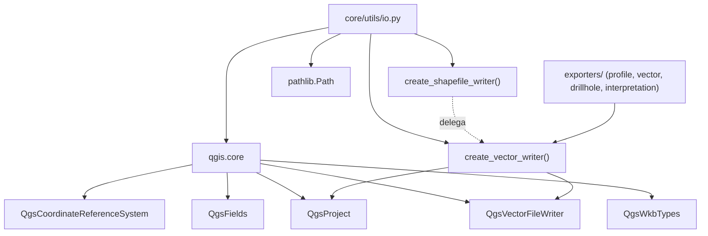

---
tags:
  - secinterp
  - code-walkthrough
  - core
  - utils
  - io
aliases:
  - io.py
  - create_vector_writer
  - create_shapefile_writer
cssclass: secinterp-note
---

# `core/utils/io.py`

> [!abstract] Resumen en una línea
> Fábrica de `QgsVectorFileWriter` que unifica la escritura de archivos vectoriales (Shapefile, GeoPackage, DXF) detrás de una única función, resolviendo el driver por extensión y aplicando políticas específicas de sobrescritura y codificación.

**Ruta**: `core/utils/io.py` (101 líneas)
**Clase/Función principal**: `create_vector_writer`
**Capa**: Core · Utilities (con acoplamiento QGIS — ver nota arquitectónica)
**Tags**: #secinterp #core #utils #io

---

## 🎯 ¿Por qué existe este archivo?

Escribir un archivo vectorial en QGIS exige repetir una secuencia frágil: elegir el
driver por extensión, montar `SaveVectorOptions`, manejar la sobrescritura de
GeoPackage y comprobar errores del writer. Centralizar esto evita duplicación en
los múltiples exporters.

| Problema | Solución |
|----------|----------|
| Cada exporter repetía la lógica de creación del writer | `create_vector_writer` centraliza driver, opciones y chequeo de error |
| El driver depende de la extensión (`.shp`, `.gpkg`, `.dxf`) | Diccionario `drivers` mapea extensión → nombre de driver GDAL/OGR |
| GeoPackage necesita una política de sobrescritura distinta | Ramas específicas para `CreateOrOverwriteLayer` vs `AppendToLayerAddFields` |
| DXF colisiona con nombres de atributos reservados de CAD | Se usa `QgsFields()` vacío para DXF salvo atributos CAD explícitos |

> [!important] Nota arquitectónica — acoplamiento QGIS **honesto**
> A diferencia del resto de `core/utils/`, este módulo **sí importa `qgis.core`** y
> llama a `QgsProject.instance().transformContext()`. Es una excepción deliberada a
> la regla "core 100% QGIS-agnóstico": se trata de una **utilidad de escritura** que
> por naturaleza vive pegada a la API de QGIS. El resto del core (parsing, rendering,
> drilling) permanece agnóstico; `io.py` es la única frontera de escritura.

---

## 🧬 Diagrama de relaciones



> [!tip] Cómo leer
> Flecha sólida = importa/delega; punteada = `create_shapefile_writer` es un *shim*
> obsoleto que reenvía a `create_vector_writer`. Los `exporters/*` son los únicos
> consumidores reales.

---

## 📦 Imports — lectura arquitectónica

```python
# core/utils/io.py
from __future__ import annotations

from pathlib import Path

from qgis.core import (
    QgsCoordinateReferenceSystem,
    QgsFields,
    QgsProject,
    QgsVectorFileWriter,
    QgsWkbTypes,
)
```

| # | Observación |
|---|-------------|
| ① | `from __future__ import annotations` → anotaciones perezosas, alineado con el estándar del proyecto. |
| ② | `pathlib.Path` es la única dependencia de la stdlib; `str | Path` acepta ambas formas de ruta. |
| ③ | El bloque `qgis.core` es el **único** en `core/utils/` que importa QGIS ⇒ excepción a la regla de agnosticismo. |
| ④ | `QgsProject` solo se usa para `QgsProject.instance().transformContext()` (contexto de transformación al escribir). |
| ⑤ | `QgsVectorFileWriter` aporta tanto la clase como los enums anidados (`SymbologyExport`, `ActionOnExistingFile`, `WriterError`). |
| ⑥ | No hay importación de `qgis.gui` ni de `PyQt5`/`PyQt6` ⇒ escribe sin tocar la capa de UI. |

---

## 🏗️ Inventario de estructura

**Funciones (2):**

- `create_vector_writer(...) -> QgsVectorFileWriter` — fábrica principal del writer (96 líneas).
- `create_shapefile_writer(*args, **kwargs) -> QgsVectorFileWriter` — *shim* obsoleto que delega.

**Constantes/datos en línea:**

- `drivers` (dict): `.shp → "ESRI Shapefile"`, `.gpkg → "GPKG"`, `.dxf → "DXF"`.

**Sin clases ni estado global:** módulo de funciones puras sobre la API de QGIS.

---

## 📁 Archivos del paquete

`io.py` vive en `core/utils/`, paquete de utilidades puras:

| Archivo | Líneas | Rol |
|---|--:|---|
| [[io]] | 101 | Escritura de vectores (`create_vector_writer`) |
| [[metadata_reader]] | 129 | Lectura de `metadata.txt` (versión, autor) |
| [[parsing]] | 222 | Parsing de strike/dip, acimut cardinal y atributos |
| [[rendering]] | 129 | Bounds, transformada de coordenadas, intervalos "bonitos" |
| [[safe_loader]] | 79 | Importación y carga perezosa segura |
| [[drillhole]] | 298 | Trayectoria y proyección de sondajes |
| `geology.py` | 40 | Dip aparente (`calculate_apparent_dip`) |
| `sampling.py` | 43 | Interpolación de elevación |
| `spatial.py` | 30 | Azimut de línea (`calculate_line_azimuth`) |

> [!note] `io.py` es el único miembro con acoplamiento QGIS
> Los demás módulos del paquete son "pure math" o manejan primitivos/DTOs. Ver [[core_utils]].

---

## 📖 Recorrido método por método

### `create_vector_writer`

```python
def create_vector_writer(
    output_path: str | Path,
    crs: QgsCoordinateReferenceSystem,
    fields: QgsFields,
    geometry_type: QgsWkbTypes.GeometryType = QgsWkbTypes.Type.LineString,
    layer_name: str | None = None,
    overwrite_layer: bool = True,
    symbology_export: QgsVectorFileWriter.SymbologyExport = (
        QgsVectorFileWriter.SymbologyExport.NoSymbology
    ),
) -> QgsVectorFileWriter:
    path = Path(output_path)
    ext = path.suffix.lower()

    drivers = {".shp": "ESRI Shapefile", ".gpkg": "GPKG", ".dxf": "DXF"}
    if ext not in drivers:
        raise ValueError(f"Unsupported vector extension: {ext}")

    options = QgsVectorFileWriter.SaveVectorOptions()
    options.driverName = drivers[ext]
    options.fileEncoding = "UTF-8"
    options.symbologyExport = symbology_export
    if layer_name:
        options.layerName = layer_name

    if ext == ".gpkg" and path.exists() and layer_name:
        options.actionOnExistingFile = (
            QgsVectorFileWriter.ActionOnExistingFile.CreateOrOverwriteLayer
            if overwrite_layer
            else QgsVectorFileWriter.ActionOnExistingFile.AppendToLayerAddFields
        )

    effective_fields = fields
    if ext == ".dxf":
        effective_fields = QgsFields()  # evitar nombres CAD reservados

    writer = QgsVectorFileWriter.create(
        str(path), effective_fields, geometry_type, crs,
        QgsProject.instance().transformContext(), options,
    )
    if writer.hasError() != QgsVectorFileWriter.WriterError.NoError:
        raise OSError(f"Error creating vector file {path}: {writer.errorMessage()}")
    return writer
```

Es el corazón del módulo. El flujo es: **normalizar ruta** → **resolver driver** →
**montar opciones** → **política de sobrescritura GeoPackage** → **campos efectivos
para DXF** → **crear writer** → **verificar error**.

> [!tip] Resolución de driver por extensión
> `path.suffix.lower()` normaliza `.SHP`/`.Shp` a `.shp`. El diccionario `drivers`
> actúa como un *strategy map*: añadir un formato nuevo es insertar una entrada.

### `create_shapefile_writer`

```python
def create_shapefile_writer(*args, **kwargs) -> QgsVectorFileWriter:
    """Delegate to create_vector_writer (deprecated shim)."""
    return create_vector_writer(*args, **kwargs)
```

Compatibilidad hacia atrás: mantiene la firma `*args, **kwargs` sin acoplar a la
signatura de `create_vector_writer`. No añade lógica; es un alias documentado como
obsoleto.

---

## 🔄 Flujo de datos

| Fase | Entrada | Transformación | Salida |
|------|---------|----------------|--------|
| Resolución de formato | `output_path` (`.shp`/`.gpkg`/`.dxf`) | `path.suffix.lower()` + `drivers[ext]` | `driverName` |
| Configuración | `layer_name`, `symbology_export` | `SaveVectorOptions` | opciones del writer |
| Política GeoPackage | `path.exists()`, `overwrite_layer` | rama condicional | `ActionOnExistingFile` |
| Campos DXF | `fields` | descarte a `QgsFields()` | campos efectivos |
| Escritura | `crs`, `fields`, `geometry_type`, `transformContext` | `QgsVectorFileWriter.create` | `QgsVectorFileWriter` |
| Verificación | `writer.hasError()` | comparación con `NoError` | writer o `OSError` |

---

## 🏛️ Patrones de diseño presentes

| Patrón | Dónde | Propósito |
|--------|-------|-----------|
| **Factory Method** | `QgsVectorFileWriter.create(...)` | Crear el writer sin conocer el formato |
| **Strategy map (dict)** | `drivers = {".shp": ...}` | Resolver driver por extensión sin `if/elif` en cadena |
| **Facade** | `create_vector_writer` | Ocultar la complejidad de `SaveVectorOptions` + create + verificación |
| **Compatibility shim** | `create_shapefile_writer` | Mantener API antigua delegando a la nueva |
| **Guard clause** | `raise ValueError` / `raise OSError` | Fallar temprano ante extensión o error de escritura |

---

## 🧾 Resumen de la API

| Símbolo | Firma / Hereda | Uso típico |
|---------|----------------|------------|
| `create_vector_writer` | `(output_path, crs, fields, geometry_type=LineString, layer_name=None, overwrite_layer=True, symbology_export=NoSymbology) -> QgsVectorFileWriter` | Exportar una capa de perfil a shp/gpkg/dxf |
| `create_shapefile_writer` | `(*args, **kwargs) -> QgsVectorFileWriter` | Shim obsoleto; delega al anterior |

---

## 🧭 Formatos soportados

| Extensión | Driver GDAL/OGR | Notas |
|-----------|-----------------|-------|
| `.shp` | `ESRI Shapefile` | Una capa por archivo; `layerName` se ignora a efectos prácticos |
| `.gpkg` | `GPKG` | Contenedor multi-capa; requiere `layer_name` para sobrescribir/anexar |
| `.dxf` | `DXF` | Formato CAD; se vacían los atributos para evitar nombres reservados |

> [!note] ¿Por qué solo estos tres?
> Son los tres formatos que consume el flujo de exportación del perfil (vectorial,
> geopackage y CAD). Añadir, por ejemplo, GeoJSON, es una línea en `drivers`:
> `".geojson": "GeoJSON"`.

### Ejemplo de uso desde un exporter

```python
from sec_interp.core.utils.io import create_vector_writer
from qgis.core import QgsFields, QgsWkbTypes

writer = create_vector_writer(
    output_path="/tmp/perfil.gpkg",
    crs=line_layer.crs(),
    fields=QgsFields(),
    geometry_type=QgsWkbTypes.Type.LineString,
    layer_name="topo",
    overwrite_layer=True,
)
# ... writer.addFeature(...) ...
del writer  # libera el archivo y lo deja accesible
```

> [!important] El llamador debe liberar el writer
> `create_vector_writer` devuelve un objeto que **mantiene el archivo abierto**. El
> exporter es responsable de cerrarlo (`del writer` o `writer = None`) para que el
> archivo quede disponible para otros procesos.

---

## ♻️ Política de sobrescritura GeoPackage

La rama específica de GeoPackage solo se evalúa si `path.exists()` **y** hay
`layer_name`:

| `overwrite_layer` | `ActionOnExistingFile` | Efecto |
|:---:|---|---|
| `True` | `CreateOrOverwriteLayer` | Reemplaza la capa homónima dentro del `.gpkg` |
| `False` | `AppendToLayerAddFields` | Anexa *features* y añade los campos que falten |

> [!warning] GeoPackage sin `layer_name` omite la rama
> Si no se pasa `layer_name`, `ActionOnExistingFile` queda con su valor por defecto y
> el comportamiento de sobrescritura no está controlado por este módulo. Los
> exporters siempre pasan `layer_name` para los GeoPackage.

---

## 🧱 DXF y los nombres reservados de CAD

```python
effective_fields = fields
if ext == ".dxf":
    effective_fields = QgsFields()  # evitar nombres CAD reservados
```

El driver DXF de QGIS puede chocar con atributos reservados del estándar CAD (como
`Layer`). Para evitarlo, el módulo **descarta los atributos** salvo que el llamador
quiera explícitamente atributos CAD. Es una decisión conservadora y documentada.

---

## 🛡️ Manejo de errores

Dos excepciones explícitas, ambas con mensaje rico en contexto:

| Caso | Excepción | Mensaje |
|------|-----------|---------|
| Extensión no soportada | `ValueError` | `"Unsupported vector extension: {ext}"` |
| Error del writer | `OSError` | `"Error creating vector file {path}: {errorMessage()}"` |

```python
# Fallo temprano ante extensión desconocida
if ext not in drivers:
    raise ValueError(f"Unsupported vector extension: {ext}")

# Verificación post-creación
if writer.hasError() != QgsVectorFileWriter.WriterError.NoError:
    raise OSError(f"Error creating vector file {path}: {writer.errorMessage()}")
```

> [!warning] `ValueError`/`OSError`, no `SecInterpError`
> A diferencia del resto del core, aquí se lanzan excepciones de la stdlib, no de
> `core/exceptions.py`. Es coherente con su rol de frontera de escritura, pero rompe
> la convención de la jerarquía propia (ver [[exceptions]]). Posible refactor futuro.

> [!tip] `errorMessage()` es más útil que el enum
> El enum `WriterError` se usa para comparar, pero el mensaje legible viene de
> `writer.errorMessage()`, que se propaga al log/UI del llamador.

---

## 🧪 Tests asociados

No existe un `test_io.py` dedicado: `create_vector_writer` se ejercita de forma
**indirecta** al *mockear* su salida en los tests de exporters (Mock-first):

- `tests/core/test_profile_exporters.py` — `@patch(...scu_io.create_vector_writer)` para `ProfileLineVectorExporter`, `GeologyVectorExporter`, `StructureVectorExporter`, axes.
- `tests/exporters/test_vector_exporter.py` — simula un writer que reporta `NoError`.
- `tests/exporters/test_drillhole_export_objects.py`, `test_drillhole_3d_exporter.py`, `test_interpretation_exporters.py` — mismo patrón de parcheo.

> [!note] Los tests no tocan el driver real
> `create_vector_writer` se reemplaza por un `MagicMock`; nadie escribe un `.shp`
> real en la suite. Por eso las ramas de driver/sob-rescritura no tienen cobertura
> unitaria directa.

---

## 👀 Observaciones y notas

> [!success] Fortalezas
> - Firma rica con defaults sensatos (`LineString`, `NoSymbology`, `overwrite=True`).
> - `pathlib.Path` + `suffix.lower()` normaliza extensiones en mayúsculas/minúsculas.
> - Manejo específico y correcto de GeoPackage (sobrescribir vs. anexar) y DXF (CAD).

> [!warning] Puntos de atención
> - **Rompe la regla de agnosticismo**: importa `qgis.core` y usa `QgsProject.instance()`.
> - Lanza `ValueError`/`OSError` en vez de `SecInterpError` (inconsistencia con el core).
> - Sin test unitario directo; solo cobertura indirecta vía mocks en exporters.

> [!question] Preguntas abiertas
> - ¿Debería `io.py` migrar a la jerarquía `SecInterpError` (p. ej. `ExportError`)?
> - ¿Vale la pena extraer la resolución de driver a una tabla/constante reutilizable?
> - ¿Se justifica mover `io.py` fuera de `core/` dada su dependencia de QGIS?

---

## 🔗 Notas relacionadas

- [[Index]] — índice de la bóveda
- [[core_utils]] — paquete `core/utils/` y sus utilidades puras
- [[rendering]] — bounds y transformada usadas antes de exportar
- [[parsing]] — extracción de atributos que alimenta los exporters
- [[metadata_reader]] — lee `metadata.txt` (versión/autor) que acompaña la escritura
- [[controller]] — orquesta el flujo de exportación
- [[exceptions]] — jerarquía de errores que `io.py` aún no adopta

---

*Nota de la bóveda SecInterp Code Walkthrough v2 — v3.8.0*
