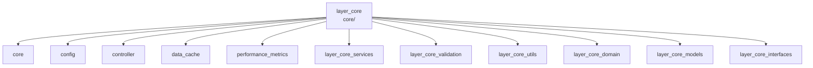

---
tags:
  - secinterp
  - code-walkthrough
  - layer
  - core
aliases:
  - layer_core
  - core/
cssclass: secinterp-note
---

# 🧭 Capa `core/` — Núcleo QGIS-agnóstico

> [!abstract]
> Hub de navegación del paquete `core/`: la capa de negocio QGIS-agnóstica de
> SecInterp. Reúne el orquestador central (`controller`), la persistencia de
> configuración (`config`), el caché en memoria (`data_cache`), la telemetría de
> rendimiento (`performance_metrics`) y seis subcapas (servicios, validación,
> utilidades, dominio, modelos e interfaces) que implementan el lado *Compute*
> del patrón Extract-then-Compute.

**Ruta**: `core/` (paquete raíz del núcleo)
**Capa**: Core (QGIS-agnóstico, con áreas grises documentadas en `config`)
**Tags**: #secinterp #code-walkthrough #layer #core

---

## 🎯 ¿Por qué existe esta capa?

Todo el cálculo geológico del plugin vive aquí, aislado de la API QGIS para que
sea testeable sin QGIS, seguro en hilos (`QgsTask`) y reutilizable:

| Principio | Cómo se aplica en esta capa |
|-----------|-----------------------------|
| Extract-then-Compute | La GUI extrae DTOs; `controller` y los servicios solo computan |
| Inversión de dependencias | Los servicios se consumen vía los puertos de [[layer_core_interfaces]] |
| Datos tipados en la frontera | Los DTOs y entidades viven en [[layer_core_domain]] |
| Configuración validada | `config` devuelve el `PluginSettings` de [[layer_core_models]] |
| Validación por niveles | La puerta de entrada de datos es [[layer_core_validation]] |
| Observabilidad | [[performance_metrics]] mide sin dependencias externas |

> [!important] Regla de la capa
> Ningún módulo del core importa `qgis.gui`. Las únicas dependencias puntuales
> de `qgis.core` (`QgsSettings`, `QCoreApplication.tr()`) están documentadas
> como áreas grises en sus notas. Los tipos que cruzan la frontera son WKT,
> dicts, primitivos y DTOs del dominio.

---

## 🧬 Mini-mapa

> [!tip] Cómo leer
> Los cinco miembros directos son los módulos raíz del paquete; cada sub-hub
> `layer_*` agrupa un subpaquete completo con sus propias notas de navegación.

---

## 📦 Miembros

| Nota | Fuente | Rol |
|------|--------|-----|
| [[core]] | `core/` (2 archivos, 20 líneas) | Raíz del paquete: docstring de capa y `algorithms.py` residual |
| [[config]] | `core/config.py` (253 líneas) | `ConfigService`: persistencia vía `QgsSettings` y `PluginSettings` validado |
| [[controller]] | `core/controller.py` (425 líneas) | `ProfileController`: orquesta los 4 dominios con adapters y caché granular |
| [[data_cache]] | `core/data_cache.py` (169 líneas) | `DataCache`: caché en memoria por buckets con TTL (`ICacheService`) |
| [[performance_metrics]] | `core/performance_metrics.py` (321 líneas) | `MetricsCollector` y `@performance_monitor` con solo stdlib |

### Sub-hubs de esta capa

| Nota | Paquete | Rol |
|------|---------|-----|
| [[layer_core_services]] | `core/services/` | Cómputo por dominio (sondajes, geología, estructuras, preview, export) |
| [[layer_core_validation]] | `core/validation/` | Validación en 3 niveles: campos, capas/proyecto y reglas de negocio |
| [[layer_core_utils]] | `core/utils/` | Helpers puros reutilizables (geometría, parsing, rendering, IO) |
| [[layer_core_domain]] | `core/domain/` + `core/exceptions.py` | DTOs, entidades, enums y jerarquía de excepciones |
| [[layer_core_models]] | `core/models/` | Dataclasses de configuración validados (`PluginSettings`) |
| [[layer_core_interfaces]] | `core/interfaces/` | Puertos `I*Service`: contratos que desacoplan consumidores |

---

## 📖 Miembro por miembro

### [[core]] — raíz del paquete

**Fuente**: `core/` (2 archivos, 20 líneas)
**Rol**: Docstring que declara la capa de negocio QGIS-agnóstica y módulo
`algorithms.py` reservado para algoritmos puros.
**Leer cuando**: necesites el punto de entrada conceptual del núcleo o verificar
qué significa "QGIS-agnóstico" en este proyecto.

### [[config]] — persistencia de configuración

**Fuente**: `core/config.py` (253 líneas)
**Rol**: `ConfigService` envuelve `QgsSettings`, centraliza valores por
defecto, aplica coerción de tipos (booleanos como string) y devuelve un
`PluginSettings` validado del hub [[layer_core_models]].
**Leer cuando**: investigues de dónde salen los valores de configuración o cómo
se valida la configuración antes de usarse.

### [[controller]] — orquestador central

**Fuente**: `core/controller.py` (425 líneas)
**Rol**: `ProfileController` coordina topografía, geología, estructuras y
sondajes con adapters inyectados y caché granular por componente, devolviendo
una tupla unificada de resultados. Es el consumidor principal de los contratos
de [[layer_core_interfaces]].
**Leer cuando**: quieras entender el flujo completo de generación de un perfil
o cómo se invalida el caché por componente.

### [[data_cache]] — caché en memoria

**Fuente**: `core/data_cache.py` (169 líneas)
**Rol**: `DataCache` implementa `ICacheService` con buckets (`topo`, `geol`,
`struct`, `drill`), expiración TTL, claves hash deterministas y metadatos
arbitrarios (LOD).
**Leer cuando**: investigues rendimiento, invalidación de resultados o cómo el
[[controller]] evita recalcular componentes sin cambios.

### [[performance_metrics]] — telemetría

**Fuente**: `core/performance_metrics.py` (321 líneas)
**Rol**: `MetricsCollector` recolecta tiempos y contadores,
`PerformanceTimer`/`PerformanceMonitor.measure_operation` cronometran
operaciones y `@performance_monitor` decora funciones, todo con solo la stdlib.
**Leer cuando**: investigues cuellos de botella o añadas instrumentación a
una operación nueva del core.

### [[layer_core_services]] — sub-hub de servicios

**Paquete**: `core/services/`
**Rol**: Agrupa el cómputo por dominio: sondajes, geología, estructuras,
preview, exageración vertical y el pipeline de exportación.
**Leer cuando**: busques dónde se calcula algo (no dónde se valida ni se define).

### [[layer_core_validation]] — sub-hub de validación

**Paquete**: `core/validation/`
**Rol**: Agrupa la validación en 3 niveles: validadores de campo, validadores
espaciales/de proyecto y helpers de negocio con acumulación de errores.
**Leer cuando**: investigues por qué un dato se rechaza o dónde añadir una
regla nueva.

### [[layer_core_utils]] — sub-hub de utilidades

**Paquete**: `core/utils/`
**Rol**: Agrupa helpers atómicos y puros (geometría de sondajes, parsing,
rendering, sampling, espacial, IO, i18n) reutilizados por servicios y GUI.
**Leer cuando**: necesites una función pequeña ya probada antes de escribir
una nueva.

### [[layer_core_domain]] — sub-hub de dominio

**Paquete**: `core/domain/` + `core/exceptions.py`
**Rol**: Agrupa la moneda de cambio del core: DTOs de entrada/salida,
entidades, enums espaciales y la jerarquía `SecInterpError`.
**Leer cuando**: diseñes una firma nueva o necesites el tipo exacto que cruza
la frontera GUI → Core.

### [[layer_core_models]] — sub-hub de modelos

**Paquete**: `core/models/`
**Rol**: Agrupa los dataclasses de configuración validados: 8 sub-modelos por
página agrupados en el contenedor raíz `PluginSettings`.
**Leer cuando**: añadas una opción de configuración o cambies un valor por
defecto.

### [[layer_core_interfaces]] — sub-hub de puertos

**Paquete**: `core/interfaces/`
**Rol**: Agrupa los 6 contratos (`ICacheService`, `IDrillholeService`,
`IGeologyService`, `IRenderer3D`, `IPreviewService`, `IStructureService`) que
permiten a consumidores y tests depender de abstracciones.
**Leer cuando**: añadas un servicio sustituible o mockees el core en un test.

---

## 🔄 Cómo encajan los miembros

El flujo típico atraviesa la capa en este orden: `config` aporta el
`PluginSettings` validado; [[layer_core_validation]] filtra los datos de
entrada; el [[controller]] pide a [[layer_core_services]] el cómputo de cada
dominio sobre DTOs de [[layer_core_domain]]; los resultados se guardan en
[[data_cache]] por buckets para invalidación granular; y
[[performance_metrics]] instrumenta las operaciones costosas. [[core]] es solo
el contenedor documental de todo lo anterior, mientras
[[layer_core_interfaces]] define los contratos que mantienen el grafo
desacoplado y [[layer_core_utils]] provee los helpers que todos reutilizan.

| Fase | Quién | Con qué tipos |
|------|-------|---------------|
| Configurar | [[config]] | `QgsSettings` → `PluginSettings` |
| Validar | [[layer_core_validation]] | capas/metadata → errores acumulados |
| Orquestar | [[controller]] | DTOs → tupla de resultados |
| Computar | [[layer_core_services]] | contextos puros → segmentos/proyecciones |
| Cachear | [[data_cache]] | bucket + key → `Any` / `None` |
| Medir | [[performance_metrics]] | funciones decoradas → tiempos/contadores |

---

## 🔗 Hubs relacionados

- [[Index]] — índice de la bóveda
- [[layer_core_services]] — cómputo por dominio y exportación
- [[layer_core_validation]] — validación en 3 niveles
- [[layer_core_utils]] — helpers puros reutilizables
- [[layer_core_domain]] — DTOs, entidades y excepciones
- [[layer_core_models]] — configuración validada
- [[layer_core_interfaces]] — puertos y contratos

---

*Nota de la bóveda SecInterp Code Walkthrough v2 — v3.8.0*
