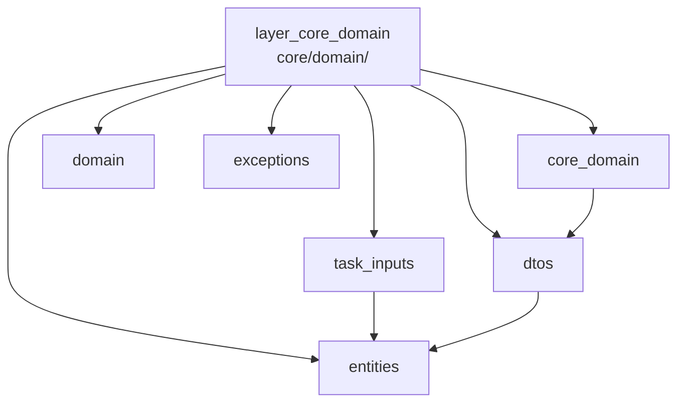

---
tags:
  - secinterp
  - code-walkthrough
  - layer
  - core
aliases:
  - layer_core_domain
  - core/domain/
cssclass: secinterp-note
---

# 🧭 Capa `core/domain/` — Tipos del Dominio

> [!abstract]
> Hub de navegación del dominio del core: los tipos que dan nombre y forma a
> todo lo que cruza la frontera GUI → Core. La fachada re-exporta 24 símbolos,
> los DTOs de entrada desacoplan el trabajo asíncrono, los DTOs complejos
> consolidan el preview, las entidades nombran los resultados, los auxiliares
> aportan enums y metadatos espaciales, y las excepciones jerarquizan los
> fallos de dominio.

**Ruta**: `core/domain/` + `core/exceptions.py`
**Capa**: Core (tipos puros; sin lógica ni QGIS)
**Tags**: #secinterp #code-walkthrough #layer #core

---

## 🎯 ¿Por qué existe esta capa?

Sin tipos de dominio, la frontera GUI/Core sería un mar de dicts y tuplas
anónimas. El dominio pone nombre a cada cosa que viaja:

| Principio | Cómo se aplica en esta capa |
|-----------|-----------------------------|
| Frontera tipada | [[task_inputs]]: contextos desacoplados para tareas async |
| Salida consolidada | [[dtos]]: `PreviewParams` entra, `PreviewResult` sale |
| Resultados con nombre | [[entities]]: segmentos, mediciones, polígonos, proyecciones |
| Auxiliares expresivos | [[core_domain]]: `FieldType` sin PyQt, `SpatialMeta` 2D/3D |
| Fallos clasificados | [[exceptions]]: `SecInterpError` y su jerarquía |
| Import único | [[domain]]: fachada de 24 símbolos para todo el core |

> [!important] Regla de la capa
> El dominio no contiene lógica: solo dataclasses, alias, enums y
> excepciones. Si un tipo necesita un objeto QGIS vivo, el diseño está mal.

---

## 🧬 Mini-mapa

> [!tip] Cómo leer
> [[domain]] es la puerta de importación; [[core_domain]] cubre los auxiliares
> (`enums`, `spatial_meta`); el resto son los bloques de tipos por rol.

---

## 📦 Miembros

| Nota | Fuente | Rol |
|------|--------|-----|
| [[core_domain]] | `core/domain/` (2 archivos, 70 líneas) | Auxiliares: `FieldType` (enum sin PyQt) y `SpatialMeta` (puente 2D/3D) |
| [[domain]] | `core/domain/__init__.py` (68 líneas) | Fachada: re-exporta 24 símbolos para import único |
| [[task_inputs]] | `core/domain/task_inputs.py` (79 líneas) | DTOs desacoplados para async: `OutcropSegments`, `GeologyContext`, `DrillholeContext` |
| [[dtos]] | `core/domain/dtos.py` (199 líneas) | `PreviewParams` (entrada) y `PreviewResult` (salida con helpers) |
| [[entities]] | `core/domain/entities.py` (161 líneas) | Entidades y alias: `StructureMeasurement`, `GeologySegment`, interpretaciones, proyecciones |
| [[exceptions]] | `core/exceptions.py` (65 líneas) | Jerarquía `SecInterpError(message, details)` por causa |

---

## 📖 Miembro por miembro

### [[core_domain]] — tipos auxiliares

**Fuente**: `core/domain/` (2 archivos, 70 líneas)
**Rol**: Los tipos auxiliares que no son entidades ni DTOs: `FieldType` (enum
de tipos de campo sin PyQt) y `SpatialMeta` (metadatos espaciales puente entre
2D y 3D).
**Leer cuando**: tipes un campo sin arrastrar Qt o necesites los metadatos
que acompañan a una geometría proyectada.
**Cubre además**: los valores de `FieldType`, los campos de `SpatialMeta` y
por qué estos tipos viven aparte de entidades y DTOs.

### [[domain]] — fachada de importación

**Fuente**: `core/domain/__init__.py` (68 líneas)
**Rol**: Re-exporta los 24 símbolos públicos de `dtos.py`, `entities.py`,
`enums.py`, `spatial_meta.py` y `task_inputs.py` para import único desde
`core.domain`.
**Leer cuando**: importes tipos del dominio (usa la fachada) o registres un
símbolo nuevo en la API pública.
**Cubre además**: la lista de 24 símbolos, el criterio de lo que se exporta y
el patrón facade aplicado a tipos.

### [[task_inputs]] — entradas desacopladas

**Fuente**: `core/domain/task_inputs.py` (79 líneas)
**Rol**: DTOs de entrada que la GUI entrega al core para procesamiento
asíncrono —`OutcropSegments`, `GeologyContext`, `DrillholeContext`— todos sin
objetos QGIS vivos.
**Leer cuando**: lances un `QgsTask` o diseñes el contexto de entrada de un
servicio nuevo.
**Cubre además**: cada contexto y sus campos, la garantía "sin QGIS vivos" y
el ciclo Extract (GUI) → Compute (servicio).

### [[dtos]] — preview consolidado

**Fuente**: `core/domain/dtos.py` (199 líneas)
**Rol**: DTOs complejos de la frontera: `PreviewParams` (entrada consolidada
de generación) y `PreviewResult` (salida consolidada con helpers de rango de
elevación/distancia).
**Leer cuando**: consumas o produzcas el resultado del preview, o uses sus
helpers de rangos.
**Cubre además**: los campos de params y result, los helpers de rango y quién
produce/consume cada DTO.

### [[entities]] — resultados con nombre

**Fuente**: `core/domain/entities.py` (161 líneas)
**Rol**: Entidades del dominio (dataclasses) y alias de tipo: mediciones
estructurales, segmentos geológicos, polígonos de interpretación y
proyecciones de sondaje.
**Leer cuando**: accedas a los campos de un resultado (segmento, medición,
polígono) o crees una entidad nueva.
**Cubre además**: cada entidad y sus campos, los alias de colección y las
convenciones de construcción.

### [[exceptions]] — fallos clasificados

**Fuente**: `core/exceptions.py` (65 líneas)
**Rol**: Jerarquía de excepciones con base `SecInterpError(message, details)`
que distingue validación, procesamiento, geometría, export y configuración.
**Leer cuando**: lances o captures un error de dominio, o decidas qué
subclase crear.
**Cubre además**: cada subclase y su causa, el campo `details` y el criterio
de captura por nivel.

---

## 🔄 Cómo encajan los miembros

La GUI construye los [[task_inputs]] y [[dtos]] de entrada (Extract), los
servicios los consumen y devuelven [[entities]] (Compute), los auxiliares de
[[core_domain]] adornan esos resultados con tipos de campo y metadatos
espaciales, y cualquier fallo viaja como [[exceptions]] en vez de
`ValueError` genéricos. [[domain]] es la puerta única por la que todo el core
importa estos símbolos.

| Fase | Quién | Papel |
|------|-------|-------|
| Entrada async | [[task_inputs]] | contextos sin QGIS para `QgsTask` |
| Entrada preview | [[dtos]] (`PreviewParams`) | parámetros consolidados |
| Salida preview | [[dtos]] (`PreviewResult`) | resultado + helpers de rango |
| Resultados | [[entities]] | segmentos, mediciones, polígonos |
| Adorno | [[core_domain]] | `FieldType`, `SpatialMeta` |
| Fallos | [[exceptions]] | jerarquía `SecInterpError` |
| Import | [[domain]] | 24 símbolos desde un punto |

---

## 📚 Orden de lectura sugerido

1. [[domain]] — el catálogo de 24 símbolos (vista aérea).
2. [[entities]] — los resultados que todo produce.
3. [[task_inputs]] — las entradas que todo consume.
4. [[dtos]] — el caso consolidado del preview.
5. [[core_domain]] — auxiliares (`FieldType`, `SpatialMeta`).
6. [[exceptions]] — cómo viajan los fallos (corta y autocontenida).

---

## 🔗 Hubs relacionados

- [[Index]] — índice de la bóveda
- [[layer_core]] — hub padre del núcleo
- [[layer_core_services]] — servicios que consumen y producen estos tipos
- [[layer_core_validation]] — valida sobre `LayerMetadata`/`ValidationParams`
- [[layer_core_interfaces]] — contratos firmados con estos DTOs

---

*Nota de la bóveda SecInterp Code Walkthrough v2 — v3.9.1*
