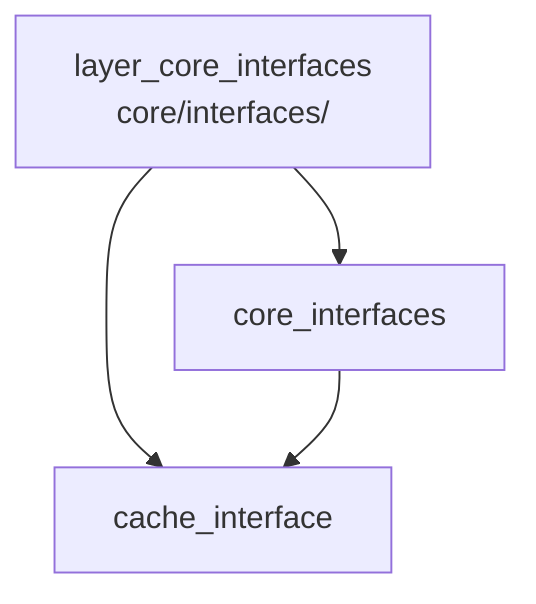

---
tags:
  - secinterp
  - code-walkthrough
  - layer
  - core
aliases:
  - layer_core_interfaces
  - core/interfaces/
cssclass: secinterp-note
---

# 🧭 Capa `core/interfaces/` — Puertos y Contratos

> [!abstract]
> Hub de navegación del paquete `core/interfaces/`: los puertos del núcleo en
> el sentido hexagonal. La nota paquete recorre los 6 contratos (`ICacheService`,
> `IDrillholeService`, `IGeologyService`, `IRenderer3D`, `IPreviewService`,
> `IStructureService`) con su criterio `Protocol` vs `ABC`, mientras la nota
> del caché detalla el contrato estructural del caché por buckets que `DataCache`
> cumple sin heredar.

**Ruta**: `core/interfaces/` (7 archivos, ~148 líneas)
**Capa**: Core (contratos puros; cero imports QGIS)
**Tags**: #secinterp #code-walkthrough #layer #core

---

## 🎯 ¿Por qué existe esta capa?

La inversión de dependencias exige que el controller, la GUI y los exporters
programen contra contratos, no contra clases concretas, para poder sustituir
implementaciones y mockear en tests:

| Principio | Cómo se aplica en esta capa |
|-----------|-----------------------------|
| Puertos hexagonales | Cada servicio tiene su `I*` que fija la firma |
| Estructural vs nominal | `ICacheService` es `Protocol`; el resto, `ABC` |
| `runtime_checkable` | El caché admite `isinstance` sin herencia |
| DTOs en las firmas | Contextos del dominio, nunca capas QGIS |
| Callbacks inyectados | `elevation_sampler` cruza como `Callable`, no como raster |
| `feedback` como `Any` | Progreso/cancelación sin importar `QgsTask` |

> [!important] Regla de la capa
> Un servicio nuevo merece interfaz solo si tiene múltiples implementaciones,
> se mockea en tests de consumidores o es punto de extensión externo. Lo de un
> solo uso no necesita `I*`.

---

## 🧬 Mini-mapa

> [!tip] Cómo leer
> [[core_interfaces]] es la vista completa de los 6 contratos con
> implementadores y guía de uso; [[cache_interface]] profundiza en el único
> `Protocol` del paquete. La flecha indica "detalla a".

---

## 📦 Miembros

| Nota | Fuente | Rol |
|------|--------|-----|
| [[core_interfaces]] | `core/interfaces/` (7 archivos, ~148 líneas) | Los 6 puertos: ABCs/Protocols, implementadores y guía de uso |
| [[cache_interface]] | `core/interfaces/cache_interface.py` (62 líneas) | `ICacheService`: 5 métodos por buckets con tipado estructural |

---

## 📖 Miembro por miembro

### [[core_interfaces]] — los 6 puertos

**Fuente**: `core/interfaces/` (7 archivos, ~148 líneas)
**Rol**: Declara los puertos del core —ABCs y Protocols que definen qué debe
saber hacer cada servicio— para que controller, GUI y exporters dependan de
contratos: `ICacheService`, `IDrillholeService`, `IGeologyService`,
`IRenderer3D`, `IPreviewService`, `IStructureService`.
**Leer cuando**: implementes o consumas un servicio, mockees el core en un
test o decidas si un servicio nuevo necesita interfaz.
**Cubre además**: cada contrato con su firma, el criterio `Protocol` vs `ABC`,
la tabla contrato→implementador real, el patrón cache-aside del caché, la
cancelación cooperativa vía `feedback`, la guía "cuándo crear un contrato" y
el maridaje contrato↔DTO del dominio.
**Contratos y firmas**: `ICacheService.get/set/invalidate/clear/get_metadata`;
`IDrillholeService.process_context`; `IGeologyService.build_segments`;
`IRenderer3D.render_3d/clear`; `IPreviewService.generate_all`;
`IStructureService.project_structures` con `elevation_sampler` inyectado.

### [[cache_interface]] — el contrato estructural

**Fuente**: `core/interfaces/cache_interface.py` (62 líneas)
**Rol**: Define `ICacheService`, el contrato del caché por buckets: 5 métodos
(`get`, `set`, `invalidate`, `clear`, `get_metadata`) con tipado estructural
y `runtime_checkable`, cumplido por `DataCache` sin herencia obligatoria.
**Leer cuando**: sustituyas el caché (p. ej. en tests), invalides por bucket
o clave, o entiendas el patrón cache-aside del plugin.
**Cubre además**: la semántica por buckets (`topo`, `geol`, `struct`,
`drill`), la granularidad de `invalidate`, los metadatos arbitrarios (LOD) y
por qué este contrato es `Protocol` mientras los demás son `ABC`.
**Verificación**: `isinstance(DataCache(), ICacheService)` pasa por forma,
no por herencia; así los mocks de tests cumplen el contrato con una clase
mínima.

---

## 🔄 Cómo encajan los miembros

[[core_interfaces]] es el mapa y [[cache_interface]] la lupa sobre su contrato
más singular: el paquete define 6 puertos con dos estilos (estructural para
el caché sustituible, nominal para los servicios de firma rígida); los
consumidores importan solo el contrato y las implementaciones viven fuera
(core, GUI, exporters); el caché, detallado en [[cache_interface]], es el
único que admite cumplimiento por forma, lo que simplifica mocks y
sustitutos.

| Contrato | Estilo | Implementador | Detalle en |
|----------|--------|---------------|------------|
| `ICacheService` | `Protocol` | `DataCache` (core) | [[cache_interface]] |
| `IDrillholeService` | `ABC` | `DrillholeService` | [[core_interfaces]] |
| `IGeologyService` | `ABC` | `GeologyService` | [[core_interfaces]] |
| `IStructureService` | `ABC` | `StructureService` | [[core_interfaces]] |
| `IPreviewService` | `ABC` | `PreviewService` | [[core_interfaces]] |
| `IRenderer3D` | `ABC` | exporter 3D | [[core_interfaces]] |

---

## 📚 Orden de lectura sugerido

1. [[core_interfaces]] — los 6 contratos, implementadores y reglas de uso.
2. [[cache_interface]] — el caso `Protocol` en detalle.
3. El hub [[layer_core_domain]] — los DTOs que firman estos contratos.

> [!note] Implementar un puerto
> Hereda del `ABC` (o cumple la forma del `Protocol`), firma con DTOs del
> dominio, acepta `feedback: Any | None` para cancelación cooperativa y lanza
> la jerarquía `SecInterpError` en fallos. Los tres puntos están cubiertos
> entre [[core_interfaces]] y el hub [[layer_core_domain]].

---

## 🧩 Dónde se usa en el plugin

| Consumidor | Contrato que importa | Para qué |
|------------|----------------------|----------|
| Controller | `IDrillholeService`, `IGeologyService`, `IStructureService` | cómputo desacoplado |
| Controller | `ICacheService` | caché granular por componente |
| Preview | `IPreviewService` | generación consolidada |
| Exporters | `IRenderer3D` | render 3D del `PreviewResult` |
| Tests | todos (mocks) | consumidores sin implementaciones reales |

> [!tip] Mock-first
> En tests, los consumidores se prueban con mocks que cumplen el contrato, no
> con servicios reales. El `Protocol` del caché hace esos mocks triviales.

---

## 🔗 Hubs relacionados

- [[Index]] — índice de la bóveda
- [[layer_core]] — hub padre del núcleo
- [[layer_core_services]] — implementadores de estos contratos
- [[layer_core_domain]] — DTOs y excepciones de las firmas

---

*Nota de la bóveda SecInterp Code Walkthrough v2 — v3.9.1*
