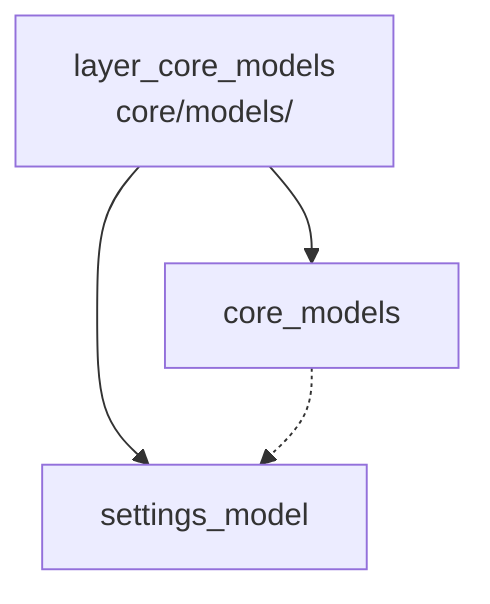

---
tags:
  - secinterp
  - code-walkthrough
  - layer
  - core
aliases:
  - layer_core_models
  - core/models/
cssclass: secinterp-note
---

# 🧭 Capa `core/models/` — Configuración Validada

> [!abstract]
> Hub de navegación del paquete `core/models/`: los dataclasses de
> configuración validada del plugin. La nota paquete describe el namespace y
> su estado actual, mientras el módulo de settings define los 8 sub-modelos
> por página agrupados en el contenedor raíz `PluginSettings`, con validación
> y clamp en `__post_init__` para que ninguna opción inválida llegue al
> cómputo.

**Ruta**: `core/models/` (paquete de modelos del core)
**Capa**: Core (dataclasses puros con validación propia)
**Tags**: #secinterp #code-walkthrough #layer #core

---

## 🎯 ¿Por qué existe esta capa?

La configuración del plugin cruza todas las páginas del diálogo y todos los
servicios; sin un modelo único, cada lector aplicaría sus propios defaults:

| Principio | Cómo se aplica en esta capa |
|-----------|-----------------------------|
| Un contenedor raíz | `PluginSettings` agrupa los 8 sub-modelos |
| Un sub-modelo por página | Section, Dem, Geology, Structure, Drillhole, Interpretation, Preview, Export |
| Validación en construcción | `__post_init__` + `validate_and_clamp`, sin setters tardíos |
| Productor único | `ConfigService` ([[config]]… ver hub [[layer_core]]) construye el modelo |
| Consumidores tipados | Servicios y GUI leen atributos, no dicts de settings |

> [!important] Regla de la capa
> Los modelos describen y validan; no leen `QgsSettings` ni pintan UI. La
> lectura vive en el servicio de configuración; el formulario, en la GUI.

---

## 🧬 Mini-mapa

> [!tip] Cómo leer
> [[core_models]] explica el contenedor (hoy un `__init__` vacío con nota
> propia); [[settings_model]] es el contenido real. La flecha punteada indica
> "documenta a", no dependencia de código.

---

## 📦 Miembros

| Nota | Fuente | Rol |
|------|--------|-----|
| [[core_models]] | `core/models/` (1 archivo, 0 líneas) | Vista paquete: namespace cuyo único módulo real tiene nota propia |
| [[settings_model]] | `core/models/settings_model.py` (179 líneas) | 8 sub-modelos por página + `PluginSettings` con `validate_and_clamp` |

---

## 📖 Miembro por miembro

### [[core_models]] — vista de conjunto

**Fuente**: `core/models/` (1 archivo, 0 líneas)
**Rol**: Nota del namespace de modelos del core: hoy solo contiene un
`__init__.py` vacío porque su único módulo real, `settings_model.py`, tiene
nota propia en este mismo hub.
**Leer cuando**: necesites el mapa del paquete o entiendas por qué un paquete
de un archivo merece hub (reserva de crecimiento para futuros modelos).
**Cubre además**: el estado actual del namespace, el criterio de cuándo un
nuevo modelo entraría aquí y la relación con el servicio de configuración que
construye estos modelos.
**Convención**: los paquetes con un solo módulo real documentan el contenedor
y el módulo por separado para que el crecimiento (un segundo modelo) no
rompa la navegación.

### [[settings_model]] — los 8 sub-modelos

**Fuente**: `core/models/settings_model.py` (179 líneas)
**Rol**: Define los dataclasses de configuración validados: 8 sub-modelos por
página (`Section`, `Dem`, `Geology`, `Structure`, `Drillhole`,
`Interpretation`, `Preview`, `Export`) agrupados en el contenedor raíz
`PluginSettings`, con validación por `validate_and_clamp` en `__post_init__`.
**Leer cuando**: añadas una opción (nuevo campo + default + clamp), cambies un
valor por defecto o traces de dónde sale un parámetro del cómputo.
**Cubre además**: cada sub-modelo y sus campos, la mecánica de
`validate_and_clamp`, los rangos aplicados en `__post_init__` y cómo el
contenedor raíz agrupa las 8 páginas.
**Ejemplo de flujo**: la GUI guarda → `ConfigService` lee `QgsSettings` →
construye `PluginSettings` (aquí se valida) → los servicios leen atributos
tipados sin revalidar.

---

## 🔄 Cómo encajan los miembros

[[core_models]] es el sobre y [[settings_model]] la carta: el paquete existe
para dar namespace y punto de crecimiento, y el módulo define el único modelo
vigente. El productor (`ConfigService`) instancia `PluginSettings` una vez y
los consumidores (controller, servicios, páginas de settings) leen atributos
ya validados, de modo que la validación ocurre en un solo punto.

| Fase | Quién | Entrada → Salida |
|------|-------|------------------|
| Contenedor | [[core_models]] | namespace + criterio de crecimiento |
| Definición | [[settings_model]] | campos + defaults → dataclasses validados |
| Construcción | servicio de configuración | `QgsSettings` → `PluginSettings` |
| Consumo | controller, servicios, GUI | atributos tipados (sin revalidar) |

---

## 📚 Orden de lectura sugerido

1. [[core_models]] — el mapa mínimo del paquete (lectura de 2 minutos).
2. [[settings_model]] — los 8 sub-modelos y el contenedor raíz.
3. La nota del servicio de configuración (hub [[layer_core]]) — quién construye
   el modelo en la práctica.

> [!note] Añadir una opción
> Campo con default en el sub-modelo de su página → rango en
> `validate_and_clamp` → clave en el servicio de configuración → control en la
> página de settings de la GUI. Los cuatro pasos están cubiertos entre este
> hub y el hub [[layer_core]].

---

## 🧩 Dónde se usa en el plugin

| Consumidor | Qué lee | Para qué |
|------------|---------|----------|
| Servicio de configuración | sub-modelos | construir el `PluginSettings` |
| Controller y servicios | atributos validados | parámetros del cómputo |
| Validación (fábricas) | campos del dataclass | coerción y rangos |
| Páginas de settings (GUI) | sub-modelo por página | mostrar/editar opciones |

> [!tip] Direccionalidad
> La dependencia apunta siempre hacia los modelos, nunca al revés: ningún
> import sale de `core/models/` hacia servicios, GUI o QGIS.

---

## 🔗 Hubs relacionados

- [[Index]] — índice de la bóveda
- [[layer_core]] — hub padre: servicio de configuración y controller
- [[layer_core_validation]] — fábricas que validan campos de dataclass
- [[layer_core_domain]] — DTOs de cómputo (no confundir con modelos de config)

---

*Nota de la bóveda SecInterp Code Walkthrough v2 — v3.9.1*
