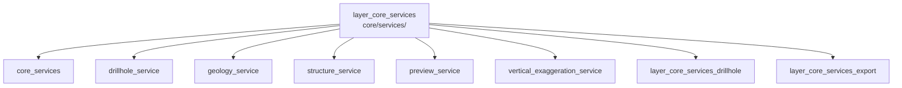

---
tags:
  - secinterp
  - code-walkthrough
  - layer
  - core
aliases:
  - layer_core_services
  - core/services/
cssclass: secinterp-note
---

# 🧭 Capa `core/services/` — Servicios de Cómputo

> [!abstract]
> Hub de navegación del paquete `core/services/`: los servicios de cómputo puro
> del núcleo. Cada servicio por dominio (sondajes, geología, estructuras,
> preview, exageración vertical) transforma contextos ya desacoplados en
> resultados listos para dibujar o exportar, mientras dos sub-hubs agrupan los
> procesadores de sondajes y el pipeline de exportación.

**Ruta**: `core/services/` (paquete de servicios del core)
**Capa**: Core (QGIS-agnóstico)
**Tags**: #secinterp #code-walkthrough #layer #core

---

## 🎯 ¿Por qué existe esta capa?

Los servicios son el *Compute* del patrón Extract-then-Compute: reciben DTOs
que la GUI ya extrajo de las capas QGIS y devuelven estructuras de dominio, sin
importar nunca `qgis.*`:

| Principio | Cómo se aplica en esta capa |
|-----------|-----------------------------|
| Un servicio por dominio | Sondajes, geología, estructuras, preview y VE separados |
| Entrada desacoplada | `DrillholeContext`, `GeologyContext`, `struct_data` + callbacks |
| Composición sobre herencia | [[drillhole_service]] coordina procesadores puros del sub-hub [[layer_core_services_drillhole]] |
| Exportación por handlers | [[layer_core_services_export]] delega cada entidad a su handler |
| Progreso cooperativo | Parámetro `feedback` (`Any`) para `QgsTask` sin importar Qt |

> [!important] Regla de la capa
> Si un cálculo necesita una capa, un raster o el canvas, no vive aquí: la GUI
> lo extrae y lo pasa como DTO, lista de dicts o callback (p. ej.
> `elevation_sampler`). Ver [[preview_service]] y [[structure_service]].

---

## 🧬 Mini-mapa

> [!tip] Cómo leer
> Los seis miembros directos son los servicios y el `__init__` re-exportador;
> los dos sub-hubs agrupan subpaquetes con navegación propia.

---

## 📦 Miembros

| Nota | Fuente | Rol |
|------|--------|-----|
| [[core_services]] | `core/services/` (3 archivos, ~68 líneas) | `__init__` re-exportador + control de acceso + shim de compatibilidad |
| [[drillhole_service]] | `core/services/drillhole_service.py` (113 líneas) | Orquesta collar, survey, intervalo y trayectoria desde un `DrillholeContext` |
| [[geology_service]] | `core/services/geology_service.py` (87 líneas) | Construye `GeologySegment`s interpolando sobre el perfil maestro |
| [[structure_service]] | `core/services/structure_service.py` (187 líneas) | Proyecta estructuras: estación, cota y buzamiento aparente |
| [[preview_service]] | `core/services/preview_service.py` (175 líneas) | Genera topografía + estructuras del preview en un `PreviewResult` |
| [[vertical_exaggeration_service]] | `core/services/vertical_exaggeration_service.py` (186 líneas) | VE adaptativa sin estado desde relación de aspecto y densidad |

### Sub-hubs de esta capa

| Nota | Paquete | Rol |
|------|---------|-----|
| [[layer_core_services_drillhole]] | `core/services/drillhole/` | Procesadores puros de sondajes (collar, intervalos, trayectoria) |
| [[layer_core_services_export]] | `core/services/export/` | Fachada, compatibilidad, rutas y handlers de exportación |

---

## 📖 Miembro por miembro

### [[core_services]] — fachada del paquete

**Fuente**: `core/services/` (3 archivos, ~68 líneas)
**Rol**: El `__init__` re-exporta los servicios principales
(`DrillholeService`, `GeologyService`, `StructureService`),
`access_control_service` gestiona permisos vía `QgsSettings` y
`export_service` es un shim de compatibilidad.
**Leer cuando**: necesites la lista oficial de servicios públicos o entiendas
por qué existe una capa de control de acceso junto al cómputo.

### [[drillhole_service]] — orquestador de sondajes

**Fuente**: `core/services/drillhole_service.py` (113 líneas)
**Rol**: Servicio orquestador que, desde un `DrillholeContext` desacoplado,
coordina cuatro procesadores puros (collar, survey, intervalo, trayectoria) y
devuelve `(geol_data, drillhole_data)` sin tocar QGIS. Delega el trabajo fino
al sub-hub [[layer_core_services_drillhole]].
**Leer cuando**: traces el recorrido completo de un sondaje desde el contexto
hasta la proyección dibujable.

### [[geology_service]] — segmentos geológicos

**Fuente**: `core/services/geology_service.py` (87 líneas)
**Rol**: Servicio de cómputo puro que construye `GeologySegment`s desde un
`GeologyContext` desacoplado, interpolando elevaciones sobre el perfil maestro.
**Leer cuando**: investigues cómo nace un segmento geológico o por qué un
contacto cae en una cota concreta.

### [[structure_service]] — proyección estructural

**Fuente**: `core/services/structure_service.py` (187 líneas)
**Rol**: Proyecta mediciones estructurales sobre el plano de la sección
(estación, elevación vía callback `elevation_sampler`, buzamiento aparente),
sin importar QGIS.
**Leer cuando**: depures un símbolo estructural mal ubicado o el cálculo del
buzamiento aparente.

### [[preview_service]] — preview consolidado

**Fuente**: `core/services/preview_service.py` (175 líneas)
**Rol**: Orquestador síncrono que genera topografía y estructuras del preview
en un `PreviewResult` consolidado, apoyado en adapters y servicios del
controller inyectado.
**Leer cuando**: sigas el camino del botón "preview" hasta el
`PreviewResult` que pinta la GUI.

### [[vertical_exaggeration_service]] — exageración vertical

**Fuente**: `core/services/vertical_exaggeration_service.py` (186 líneas)
**Rol**: Servicio sin estado que calcula la VE adaptativa desde la relación de
aspecto (rango de elevación / rango de distancia) modulada por la densidad de
estructuras.
**Leer cuando**: ajustes la escala vertical automática o entiendas por qué una
sección se ve "aplanada".

### [[layer_core_services_drillhole]] — sub-hub de sondajes

**Paquete**: `core/services/drillhole/`
**Rol**: Agrupa los procesadores puros del dominio de sondajes: proyección del
collar, interpolación de intervalos y orquestación de trayectorias.
**Leer cuando**: bajes un nivel desde [[drillhole_service]] al detalle por
sondaje.

### [[layer_core_services_export]] — sub-hub de exportación

**Paquete**: `core/services/export/`
**Rol**: Agrupa la fachada de exportación, el mixin de compatibilidad, el
resolutor de rutas y los handlers por entidad.
**Leer cuando**: sigas el camino desde los datos calculados hasta los archivos
CSV/vectoriales en disco.

---

## 🔄 Cómo encajan los miembros

Cada servicio es independiente y combina con los demás solo a través del
controller: [[drillhole_service]] delega en los procesadores de
[[layer_core_services_drillhole]]; [[geology_service]] y [[structure_service]]
producen los segmentos y símbolos que [[preview_service]] consolida junto a la
topografía en el `PreviewResult`; [[vertical_exaggeration_service]] ajusta la
escala de ese resultado; y [[layer_core_services_export]] vuelca todo a disco
cuando el usuario exporta. [[core_services]] es la fachada documental que
re-exporta la API pública del paquete.

| Flujo | Entrada | Servicio | Salida |
|-------|---------|----------|--------|
| Sondajes | `DrillholeContext` | [[drillhole_service]] + sub-hub drillhole | `(geol_data, drillhole_data)` |
| Geología | `GeologyContext` | [[geology_service]] | `GeologySegment`s |
| Estructuras | `struct_data` + `elevation_sampler` | [[structure_service]] | `StructureData` |
| Preview | params + transform context | [[preview_service]] | `PreviewResult` |
| Escala | rangos + densidad | [[vertical_exaggeration_service]] | factor VE |
| Export | datos calculados + opciones | [[layer_core_services_export]] | archivos CSV/vectoriales |

---

## 🔗 Hubs relacionados

- [[Index]] — índice de la bóveda
- [[layer_core]] — hub padre del núcleo
- [[layer_core_services_drillhole]] — procesadores de sondajes
- [[layer_core_services_export]] — pipeline de exportación
- [[layer_core_domain]] — DTOs que consumen estos servicios
- [[layer_core_interfaces]] — contratos que implementan estos servicios

---

*Nota de la bóveda SecInterp Code Walkthrough v2 — v3.9.1*
