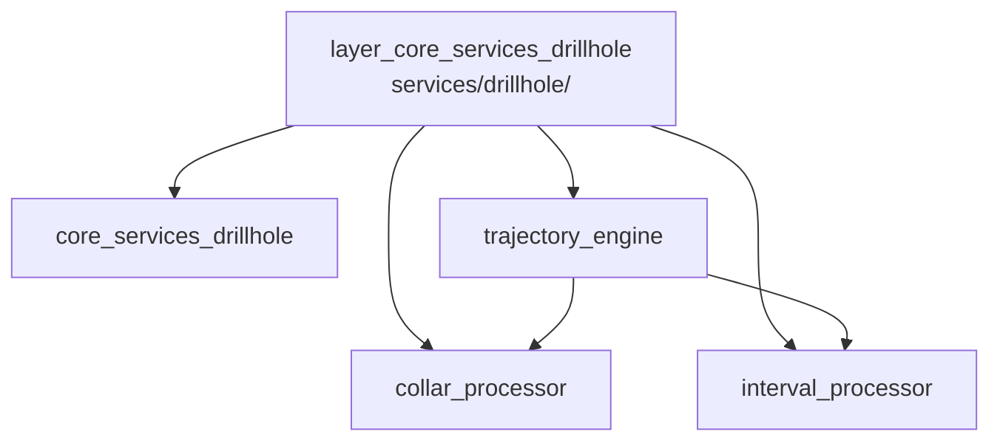

---
tags:
  - secinterp
  - code-walkthrough
  - layer
  - core
aliases:
  - layer_core_services_drillhole
  - core/services/drillhole/
cssclass: secinterp-note
---

# 🧭 Capa `core/services/drillhole/` — Procesadores de Sondajes

> [!abstract]
> Hub de navegación del subpaquete `core/services/drillhole/`: los procesadores
> puros del dominio de sondajes. La nota paquete describe el conjunto, mientras
> el collar, los intervalos litológicos y la trayectoria de cada sondaje se
> resuelven en tres módulos especializados que el orquestador
> `DrillholeService` coordina sin tocar QGIS.

**Ruta**: `core/services/drillhole/` (6 archivos, 309 líneas)
**Capa**: Core (QGIS-agnóstico)
**Tags**: #secinterp #code-walkthrough #layer #core

---

## 🎯 ¿Por qué existe esta capa?

Un sondaje combina tres problemas geométricos distintos (dónde emboca, cómo
desvía en 3D, qué litología atraviesa) que conviene resolver por separado:

| Principio | Cómo se aplica en esta capa |
|-----------|-----------------------------|
| Separación de problemas | Collar, trayectoria e intervalos en módulos propios |
| Pureza total | Solo primitivos y DTOs; ni `qgis.*` ni GUI |
| Orquestación en dos niveles | `trajectory_engine` orquesta por sondaje; `DrillholeService` por contexto |
| Resultado dibujable | Todo converge en `DrillholeProjection` + `GeologySegment` |
| Fuera de sección = `None` | El collar fuera del buffer descarta el sondaje sin excepciones |

> [!important] Regla de la capa
> Estos procesadores nunca ven capas QGIS: reciben coordenadas, surveys y
> tramos ya extraídos. La extracción vive en la GUI; aquí solo hay geometría.

---

## 🧬 Mini-mapa

> [!tip] Cómo leer
> [[core_services_drillhole]] es la vista de conjunto del paquete;
> [[trajectory_engine]] es quien combina a [[collar_processor]] e
> [[interval_processor]] por cada sondaje.

---

## 📦 Miembros

| Nota | Fuente | Rol |
|------|--------|-----|
| [[core_services_drillhole]] | `core/services/drillhole/` (6 archivos, 309 líneas) | Vista paquete: procesadores puros consumidos por `DrillholeService` |
| [[collar_processor]] | `core/services/drillhole/collar_processor.py` (100 líneas) | Proyecta el collar y extrae cota/profundidad; `None` si queda fuera |
| [[interval_processor]] | `core/services/drillhole/interval_processor.py` (50 líneas) | Convierte tramos `(from, to, litología)` en `GeologySegment`s |
| [[trajectory_engine]] | `core/services/drillhole/trajectory_engine.py` (111 líneas) | Orquesta por sondaje: 3D → proyección → intervalos → `DrillholeProjection` |

---

## 📖 Miembro por miembro

### [[core_services_drillhole]] — vista de conjunto

**Fuente**: `core/services/drillhole/` (6 archivos, 309 líneas)
**Rol**: Nota paquete que agrupa los procesadores puros del dominio de
sondajes —proyección del collar, profundidad final, interpolación de
intervalos y orquestación de trayectorias— todos QGIS-agnósticos y consumidos
por el servicio orquestador de nivel superior.
**Leer cuando**: necesites el mapa del subpaquete antes de bajar al detalle de
un procesador concreto.
**Cubre además**: el criterio de descarte por buffer, la convención de
`DrillholeProjection` como resultado y cómo encajan los seis archivos.

### [[collar_processor]] — embocadura del sondaje

**Fuente**: `core/services/drillhole/collar_processor.py` (100 líneas)
**Rol**: Procesador puro que proyecta el collar sobre la línea de sección y
extrae su elevación y profundidad total desde datos desacoplados, devolviendo
un `DrillholeProjection` o `None` si el collar queda fuera del buffer.
**Leer cuando**: un sondaje desaparece del perfil (casi siempre es el buffer
del collar) o quieras saber de dónde sale la cota de embocadura.
**Cubre además**: la proyección punto→línea, la tolerancia del buffer y la
extracción de la profundidad total sin objetos QGIS vivos.

### [[interval_processor]] — tramos litológicos

**Fuente**: `core/services/drillhole/interval_processor.py` (50 líneas)
**Rol**: Procesador puro que convierte los tramos `(from, to, litología)` en
objetos `GeologySegment` con puntos 2D, 3D y proyectados, interpolándolos a lo
largo de una trayectoria ya proyectada sobre la sección.
**Leer cuando**: los colores litológicos del sondaje no coinciden con la tabla
de intervalos o depures la interpolación tramo→geometría.
**Cubre además**: el reparto de distancias medidas sobre la trayectoria, la
construcción de los tres juegos de puntos y el enlace tramo→segmento.

### [[trajectory_engine]] — orquestador por sondaje

**Fuente**: `core/services/drillhole/trajectory_engine.py` (111 líneas)
**Rol**: Orquestador puro por sondaje: calcula la trayectoria 3D, la proyecta
sobre la sección, interpola los tramos litológicos y empaqueta el resultado en
un `DrillholeProjection` con `SpatialMeta` y `GeologySegment`.
**Leer cuando**: sigas el ciclo de vida completo de un sondaje o entiendas
quién llama a [[collar_processor]] e [[interval_processor]] y en qué orden.
**Cubre además**: la desviación 3D desde surveys, la proyección al plano de
sección, el ensamblado del `DrillholeProjection` final y los metadatos
espaciales que acompañan al resultado.

---

## 🔄 Cómo encajan los miembros

Por cada sondaje del contexto, el motor [[trajectory_engine]] pide primero a
[[collar_processor]] la posición de embocadura (si devuelve `None`, el sondaje
se descarta); con el collar válido calcula la trayectoria 3D desviada, la
proyecta sobre la sección y entrega esa geometría a [[interval_processor]],
que reparte los tramos litológicos sobre ella como `GeologySegment`s; el motor
empaqueta trayectoria + segmentos + `SpatialMeta` en el `DrillholeProjection`
final. [[core_services_drillhole]] documenta el contrato colectivo que el
servicio de nivel superior consume.

| Fase | Quién | Entrada → Salida |
|------|-------|------------------|
| Embocadura | [[collar_processor]] | coords + línea → `DrillholeProjection` / `None` |
| Desviación 3D | [[trajectory_engine]] | surveys + collar → trayectoria 3D |
| Proyección | [[trajectory_engine]] | trayectoria 3D + línea → geometría 2D |
| Litología | [[interval_processor]] | tramos + trayectoria → `GeologySegment`s |
| Empaquetado | [[trajectory_engine]] | todo lo anterior → `DrillholeProjection` |

---

## 📚 Orden de lectura sugerido

1. [[core_services_drillhole]] — el mapa del subpaquete y sus convenciones.
2. [[collar_processor]] — el primer filtro: qué sondajes sobreviven.
3. [[trajectory_engine]] — el esqueleto que ordena todo el proceso.
4. [[interval_processor]] — el detalle litológico que viste la trayectoria.

> [!note] Dependencias internas
> [[trajectory_engine]] depende de [[collar_processor]] e
> [[interval_processor]]; estos dos últimos son independientes entre sí y no se
> llaman nunca en sentido inverso.

---

## 🔗 Hubs relacionados

- [[Index]] — índice de la bóveda
- [[layer_core_services]] — hub padre de servicios
- [[layer_core_services_export]] — los handlers que exportan estos resultados
- [[layer_core_domain]] — `DrillholeProjection`, `GeologySegment`, `SpatialMeta`

---

*Nota de la bóveda SecInterp Code Walkthrough v2 — v3.9.1*
