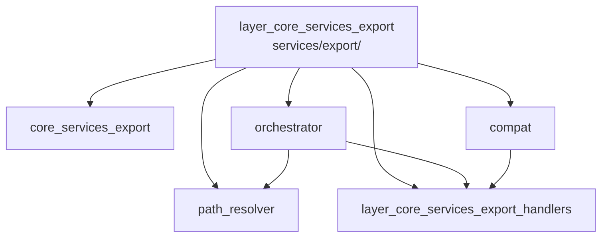

---
tags:
  - secinterp
  - code-walkthrough
  - layer
  - core
aliases:
  - layer_core_services_export
  - core/services/export/
cssclass: secinterp-note
---

# 🧭 Capa `core/services/export/` — Pipeline de Exportación

> [!abstract]
> Hub de navegación del subpaquete `core/services/export/`: el pipeline que
> lleva los datos ya calculados del perfil a archivos CSV y capas vectoriales
> en disco. La nota paquete presenta el conjunto, la fachada orquesta por
> entidad, el mixin conserva la API antigua, el resolutor unifica nombres y
> rutas, y el sub-hub de handlers ejecuta la escritura real por entidad.

**Ruta**: `core/services/export/` (paquete de exportación del core)
**Capa**: Core (con construcción aislada de `QgsMapSettings` en un módulo)
**Tags**: #secinterp #code-walkthrough #layer #core

---

## 🎯 ¿Por qué existe esta capa?

Exportar mezcla tres responsabilidades (qué escribir, con qué nombre/dónde,
cómo escribirlo) que el paquete separa en piezas con un único motivo de
cambio:

| Principio | Cómo se aplica en esta capa |
|-----------|-----------------------------|
| Fachada única | [[orchestrator]] es el único punto de entrada de la exportación |
| Tabla declarativa | Cada handler se activa por flags de opciones, no por `if`s dispersos |
| Rutas uniformes | [[path_resolver]] deriva nombre de perfil, ruta y nombre de capa |
| Compatibilidad sin deuda | [[compat]] conserva la API `_export_*` delegando a handlers |
| Errores normalizados | Fallos de escritura se traducen a `ExportError` |
| QGIS aislado | La construcción de `QgsMapSettings` vive en un único módulo factoría |

> [!important] Regla de la capa
> Los handlers reciben datos ya calculados (perfil, segmentos, mediciones),
> nunca capas vivas. Resolver CRS, capas y formato es tarea de la fachada, no
> de cada escritor.

---

## 🧬 Mini-mapa

> [!tip] Cómo leer
> [[core_services_export]] presenta el paquete y la factoría de map settings;
> [[orchestrator]] dirige; [[path_resolver]] nombra; [[compat]] traduce la API
> vieja; el sub-hub de handlers escribe.

---

## 📦 Miembros

| Nota | Fuente | Rol |
|------|--------|-----|
| [[core_services_export]] | `core/services/export/` (2 archivos, ~43 líneas) | Vista paquete: API pública + factoría aislada de `QgsMapSettings` |
| [[compat]] | `core/services/export/compat.py` (129 líneas) | Mixin `_export_*` que delega la API antigua a los handlers |
| [[orchestrator]] | `core/services/export/orchestrator.py` (207 líneas) | Fachada: orquesta la escritura CSV/vectorial por entidad y opciones |
| [[path_resolver]] | `core/services/export/path_resolver.py` (60 líneas) | Deriva nombre de perfil, ruta de salida y nombre lógico de capa |

### Sub-hub de esta capa

| Nota | Paquete | Rol |
|------|---------|-----|
| [[layer_core_services_export_handlers]] | `core/services/export/handlers/` | Escritura real por entidad (topo, geología, sondajes, 3D, estructuras, interpretaciones) |

---

## 📖 Miembro por miembro

### [[core_services_export]] — vista de conjunto

**Fuente**: `core/services/export/` (2 archivos, ~43 líneas)
**Rol**: El `__init__.py` re-exporta la API pública (`ExportService`,
`create_map_settings`, `get_profile_name`, `resolve_export_path`) y
`map_settings_factory.py` aísla la construcción de `QgsMapSettings` en un
único módulo, conteniendo el único acoplamiento QGIS del paquete.
**Leer cuando**: necesites el mapa del pipeline o entiendas dónde se permite
tocar `QgsMapSettings` y dónde está prohibido.
**Cubre además**: la lista de símbolos públicos, el criterio de aislamiento
QGIS y cómo la factoría mantiene el resto del paquete agnóstico.

### [[compat]] — retrocompatibilidad

**Fuente**: `core/services/export/compat.py` (129 líneas)
**Rol**: Mixin que conserva la antigua API privada `_export_*` de
`ExportService`, delegando cada wrapper al handler correspondiente del
paquete `handlers/` sin acoplar tipos QGIS.
**Leer cuando**: encuentres llamadas `_export_topography` o similares y
quieras saber a qué handler moderno redirigen.
**Cubre además**: la tabla de equivalencia API antigua → handler, el patrón
mixin como deuda contenida y por qué no se eliminó la API vieja de golpe.

### [[orchestrator]] — fachada de exportación

**Fuente**: `core/services/export/orchestrator.py` (207 líneas)
**Rol**: Fachada que recibe los datos ya calculados del perfil y orquesta la
escritura CSV/vectorial por entidad, delegando en los handlers según las
opciones y resolviendo capas, CRS y formato.
**Leer cuando**: traces una exportación de principio a fin o añadas una
entidad exportable nueva al pipeline.
**Cubre además**: el despacho por opciones, la resolución de CRS/formato, el
orden de escritura (topografía primero) y la propagación de `ExportError`.

### [[path_resolver]] — nombres y rutas

**Fuente**: `core/services/export/path_resolver.py` (60 líneas)
**Rol**: Resuelve dónde y con qué nombre se escribe cada archivo: deriva el
nombre del perfil y compone la ruta de salida (y el nombre lógico de capa) de
forma uniforme para todos los exporters.
**Leer cuando**: un archivo exported aparezca con nombre inesperado o añadas
una convención de nombres nueva.
**Cubre además**: la derivación del nombre de perfil, la composición de rutas
por entidad y el nombre lógico de capa que ve el usuario en QGIS.

### [[layer_core_services_export_handlers]] — sub-hub de handlers

**Paquete**: `core/services/export/handlers/`
**Rol**: Agrupa la escritura real por entidad: topografía, geología, sondajes
2D y 3D, estructuras e interpretaciones, cada una con su CSV y su capa
vectorial.
**Leer cuando**: bajes desde la fachada al código que realmente escribe bytes
en disco.

---

## 🔄 Cómo encajan los miembros

El usuario invoca la fachada [[orchestrator]], que pide a [[path_resolver]]
el nombre y la ruta de cada salida, consulta las opciones para saber qué
entidades están activas y despacha cada una a su handler del sub-hub
[[layer_core_services_export_handlers]]; si el llamante usa la API antigua,
[[compat]] intercepta el `_export_*` y lo redirige al mismo handler, de modo
que ambas APIs convergen en un único código de escritura. [[core_services_export]]
documenta el contrato colectivo y aísla la factoría de `QgsMapSettings`.

| Fase | Quién | Entrada → Salida |
|------|-------|------------------|
| Contrato | [[core_services_export]] | imports públicos + factoría QGIS aislada |
| Fachada | [[orchestrator]] | datos + opciones → despacho por entidad |
| Nombres | [[path_resolver]] | perfil + entidad → ruta + nombre de capa |
| Escritura | [[layer_core_services_export_handlers]] | filas + ruta → CSV + capa vectorial |
| Legado | [[compat]] | `_export_*` → handler moderno |

---

## 📚 Orden de lectura sugerido

1. [[core_services_export]] — el mapa y la API pública del pipeline.
2. [[orchestrator]] — el flujo de despacho que todo lo ordena.
3. [[path_resolver]] — cómo se nombran las salidas (corto y autocontenido).
4. [[layer_core_services_export_handlers]] — la escritura real por entidad.
5. [[compat]] — solo si mantienes código que usa la API antigua.

> [!note] Dependencias internas
> [[orchestrator]] depende de [[path_resolver]] y de los handlers; [[compat]]
> depende solo de los handlers; [[path_resolver]] no depende de nadie del
> paquete (utilidad pura de nombres).

---

## 🔗 Hubs relacionados

- [[Index]] — índice de la bóveda
- [[layer_core_services]] — hub padre de servicios
- [[layer_core_services_drillhole]] — produce los datos de sondajes que se exportan
- [[layer_core_services_export_handlers]] — escritura por entidad
- [[layer_core_domain]] — `ExportError` y tipos exportados

---

*Nota de la bóveda SecInterp Code Walkthrough v2 — v3.9.1*
