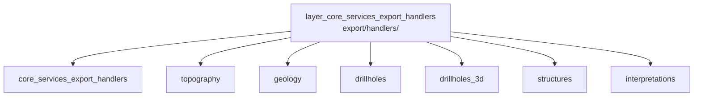

---
tags:
  - secinterp
  - code-walkthrough
  - layer
  - core
aliases:
  - layer_core_services_export_handlers
  - core/services/export/handlers/
cssclass: secinterp-note
---

# 🧭 Capa `core/services/export/handlers/` — Handlers por Entidad

> [!abstract]
> Hub de navegación de los handlers de exportación: un módulo por entidad del
> perfil (topografía, geología, sondajes 2D y 3D, estructuras,
> interpretaciones) que vuelca datos ya calculados a CSV y a capa vectorial.
> La nota paquete describe el contenedor, y cada handler documenta su tabla de
> tareas, sus columnas CSV y su traducción de fallos a `ExportError`.

**Ruta**: `core/services/export/handlers/` (paquete de handlers)
**Capa**: Core (escritura de archivos + capas vectoriales de salida)
**Tags**: #secinterp #code-walkthrough #layer #core

---

## 🎯 ¿Por qué existe esta capa?

Cada entidad del perfil tiene su propia forma (línea, puntos, polígonos, trazas
3D) y sus propias columnas; un único exporter monolítico mezclaría seis
formatos distintos:

| Principio | Cómo se aplica en esta capa |
|-----------|-----------------------------|
| Un handler por entidad | Topo, geología, sondajes, 3D, estructuras, interpretaciones |
| CSV + vectorial siempre | Cada handler produce ambas salidas con las mismas filas lógicas |
| Rutas por perfil | Todos resuelven rutas con el mismo resolutor, sin lógica propia |
| Fallos normalizados | Excepciones de escritura → `ExportError` con contexto |
| Activación por flags | Tareas 3D/2D y variantes real/proyectado dirigidas por opciones |
| Acceso controlado | Interpretaciones 3D gated por control de acceso y línea válida |

> [!important] Regla de la capa
> Los handlers no calculan: derivan filas de `GeologySegment`s, mediciones y
> perfiles ya computados. Si falta un dato, el error es de entrada, no del
> handler.

---

## 🧬 Mini-mapa

> [!tip] Cómo leer
> [[core_services_export_handlers]] describe el contenedor (ejes + `__init__`);
> los seis handlers son independientes entre sí y comparten convenciones.

---

## 📦 Miembros

| Nota | Fuente | Rol |
|------|--------|-----|
| [[core_services_export_handlers]] | `core/services/export/handlers/` (2 archivos, ~39 líneas) | Vista paquete: handler de ejes + `__init__` vacío |
| [[topography]] | `core/services/export/handlers/topography.py` (63 líneas) | Perfil topo a CSV (dist, elev) + capa de línea; primer paso del pipeline |
| [[geology]] | `core/services/export/handlers/geology.py` (66 líneas) | Segmentos litológicos a CSV (dist, elev, unidad) + capa vectorial |
| [[drillholes]] | `core/services/export/handlers/drillholes.py` (70 líneas) | Sondajes 2D: trazas e intervalos como capas, rutas por perfil |
| [[drillholes_3d]] | `core/services/export/handlers/drillholes_3d.py` (82 líneas) | Sondajes 3D real/proyectado por tabla declarativa de tareas y flags |
| [[structures]] | `core/services/export/handlers/structures.py` (77 líneas) | Mediciones a CSV (dist, dip aparente) + capa, con escala por raster |
| [[interpretations]] | `core/services/export/handlers/interpretations.py` (93 líneas) | Polígonos 2D siempre + 3D si el acceso y la línea lo permiten |

---

## 📖 Miembro por miembro

### [[core_services_export_handlers]] — vista de conjunto

**Fuente**: `core/services/export/handlers/` (2 archivos, ~39 líneas)
**Rol**: Nota paquete que agrupa el handler de ejes del perfil (`axes.py`) y
un `__init__.py` vacío; los seis handlers por entidad se documentan en notas
individuales de este mismo hub.
**Leer cuando**: necesites el mapa del paquete o entiendas qué son los "ejes"
 frente a las "entidades".
**Cubre además**: el criterio de separación ejes/entidades, por qué el
`__init__` no re-exporta nada y el inventario de handlers con su estado.

### [[topography]] — perfil topográfico

**Fuente**: `core/services/export/handlers/topography.py` (63 líneas)
**Rol**: Vuelca el perfil topográfico a CSV (dist, elev) y a una capa
vectorial de línea de perfil, como primer paso del pipeline de exportación.
**Leer cuando**: la exportación base falle (todo lo demás depende de que la
topo exista) o revises el formato de columnas dist/elev.
**Cubre además**: el muestreo del perfil a filas, la creación de la capa de
línea y por qué este handler corre antes que los demás.

### [[geology]] — segmentos litológicos

**Fuente**: `core/services/export/handlers/geology.py` (66 líneas)
**Rol**: Vuelca los segmentos litológicos a CSV (dist, elev, unidad) y a capa
vectorial, derivando las filas de un `GeologySegment` y normalizando errores
a `ExportError`.
**Leer cuando**: falte una unidad en el CSV o el volcado vectorial no
coincida con los segmentos calculados.
**Cubre además**: la derivación fila←segmento, las columnas de unidad y la
normalización de errores de escritura.

### [[drillholes]] — sondajes 2D

**Fuente**: `core/services/export/handlers/drillholes.py` (70 líneas)
**Rol**: Exporta trazas (polilíneas) e intervalos (litología) como capas
vectoriales 2D, resolviendo rutas por perfil y traduciendo fallos a
`ExportError`.
**Leer cuando**: depures la exportación de sondajes proyectados o las rutas
de salida por perfil.
**Cubre además**: la distinción traza/intervalo, la resolución de rutas y el
mapeo de atributos litológicos a campos vectoriales.

### [[drillholes_3d]] — sondajes 3D

**Fuente**: `core/services/export/handlers/drillholes_3d.py` (82 líneas)
**Rol**: Exporta trazas e intervalos en 3D, cada uno en dos variantes (real y
proyectado), dirigidos por una tabla declarativa de tareas y activados por
flags de opciones.
**Leer cuando**: añadas una variante de exportación o entiendas la matriz
real/proyectado × traza/intervalo.
**Cubre además**: la tabla declarativa de tareas, los flags que activan cada
variante y la diferencia entre geometría real y proyectada.

### [[structures]] — mediciones estructurales

**Fuente**: `core/services/export/handlers/structures.py` (77 líneas)
**Rol**: Vuelca las mediciones a CSV (dist, dip aparente) y a capa vectorial,
leyendo la resolución del raster para escalar el dip.
**Leer cuando**: los dips exportados no coincidan con los símbolos del perfil
o revises el escalado por resolución.
**Cubre además**: las columnas dist/dip, el escalado por resolución del
raster y la serialización de mediciones a features.

### [[interpretations]] — polígonos interpretados

**Fuente**: `core/services/export/handlers/interpretations.py` (93 líneas)
**Rol**: Exporta los polígonos en 2D de forma obligatoria y, si el control de
acceso lo permite y la línea de sección es válida, también en 3D.
**Leer cuando**: la variante 3D no se genere (revisa acceso + línea) o
cambies las condiciones de gate.
**Cubre además**: el gate de control de acceso, la validación de la línea de
sección y la doble salida 2D/3D de polígonos.

---

## 🔄 Cómo encajan los miembros

Los seis handlers son independientes y no se llaman entre sí: la fachada los
invoca en orden (topografía primero, resto después) con los mismos datos
calculados y las mismas opciones. Todos comparten tres convenciones: resuelven
rutas con el mismo criterio por perfil, escriben CSV + capa vectorial desde
las mismas filas lógicas, y traducen cualquier fallo a `ExportError`.
[[core_services_export_handlers]] documenta el contenedor y el handler de
ejes, que es transversal a las entidades.

| Handler | Filas lógicas | Salidas |
|---------|---------------|---------|
| [[topography]] | (dist, elev) del perfil | CSV + línea de perfil |
| [[geology]] | (dist, elev, unidad) | CSV + capa de segmentos |
| [[drillholes]] | trazas + intervalos 2D | capas vectoriales |
| [[drillholes_3d]] | trazas + intervalos × real/proyectado | capas 3D por tarea |
| [[structures]] | (dist, dip aparente) | CSV + capa de mediciones |
| [[interpretations]] | polígonos 2D (+ 3D con gate) | capas de interpretación |

---

## 📚 Orden de lectura sugerido

1. [[core_services_export_handlers]] — contenedor, ejes y convenciones.
2. [[topography]] — el handler más simple; fija el patrón CSV + capa.
3. [[geology]] — el mismo patrón aplicado a segmentos.
4. [[drillholes]] y [[drillholes_3d]] — el caso matricial (variantes por flags).
5. [[structures]] e [[interpretations]] — los casos con gate (raster, acceso).

---

## 🔗 Hubs relacionados

- [[Index]] — índice de la bóveda
- [[layer_core_services_export]] — hub padre: fachada, rutas y compatibilidad
- [[layer_core_services]] — servicios que calculan lo que aquí se vuelca
- [[layer_core_services_drillhole]] — origen de los datos de sondajes

---

*Nota de la bóveda SecInterp Code Walkthrough v2 — v3.9.0*
