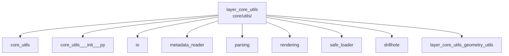

---
tags:
  - secinterp
  - code-walkthrough
  - layer
  - core
aliases:
  - layer_core_utils
  - core/utils/
cssclass: secinterp-note
---

# 🧭 Capa `core/utils/` — Utilidades Puras

> [!abstract]
> Hub de navegación del paquete `core/utils/`: los helpers atómicos y puros
> que todo el plugin reutiliza. La nota paquete cubre el grupo geología/i18n/
> sampling/espacial, la fachada re-exporta 14 símbolos, y cada módulo
> especializado (geometría de sondajes, parsing, rendering, IO, metadata,
> carga segura) resuelve un problema pequeño y bien acotado, con la geometría
> planar agrupada en su propio sub-hub.

**Ruta**: `core/utils/` (paquete de utilidades del core)
**Capa**: Core (mayoría pura; `io` envuelve `QgsVectorFileWriter`)
**Tags**: #secinterp #code-walkthrough #layer #core

---

## 🎯 ¿Por qué existe esta capa?

Los servicios y la GUI comparten docenas de operaciones pequeñas (proyectar un
punto, parsear un rumbo, interpolar una cota) que no merecen un servicio pero
tampoco deben duplicarse:

| Principio | Cómo se aplica en esta capa |
|-----------|-----------------------------|
| Funciones puras primero | Sin estado, sin QGIS, testeables con asserts simples |
| Fachada única | [[core_utils___init___py]] re-exporta 14 helpers (`scu.*`) |
| Un módulo, un tema | Geometría, parsing, rendering, IO, metadata, carga |
| Tolerancia al ruido | [[parsing]] acepta formatos variados de strike/dip y acimuts |
| Degradación elegante | [[safe_loader]] devuelve `None`/fallback si un opcional falla |
| Geometría con sub-hub | Lo planar vive en [[layer_core_utils_geometry_utils]] |

> [!important] Regla de la capa
> Un helper nuevo entra aquí solo si lo usan ≥2 consumidores o si su lógica es
> lo bastante sutil para merecer tests propios. Lo de un solo uso se queda en
> su módulo.

---

## 🧬 Mini-mapa

> [!tip] Cómo leer
> [[core_utils]] cubre el grupo base (geología, i18n, sampling, espacial);
> [[core_utils___init___py]] es la fachada; el resto son especialidades.

---

## 📦 Miembros

| Nota | Fuente | Rol |
|------|--------|-----|
| [[core_utils]] | `core/utils/` (grupo `geology`, `i18n`, `sampling`, `spatial`) | Buzamiento aparente, mixin i18n, interpolación de cota, azimut |
| [[core_utils___init___py]] | `core/utils/__init__.py` (82 líneas) | Fachada: 14 helpers re-exportados + `__all__` (`scu.*`) |
| [[io]] | `core/utils/io.py` (101 líneas) | Fábrica de `QgsVectorFileWriter` (SHP, GPKG, DXF) por extensión |
| [[metadata_reader]] | `core/utils/metadata_reader.py` (129 líneas) | `metadata.txt` vía `ConfigParser` como dict cacheado |
| [[parsing]] | `core/utils/parsing.py` (222 líneas) | Strike/dip ruidosos y acimuts → primitivos Python limpios |
| [[rendering]] | `core/utils/rendering.py` (129 líneas) | Bbox con padding, transform datos→píxeles, ejes "bonitos" |
| [[safe_loader]] | `core/utils/safe_loader.py` (79 líneas) | Imports perezosos con fallback (`None`) ante fallos |
| [[drillhole]] | `core/utils/drillhole.py` (298 líneas) | Trayectoria 3D, proyección a sección y reparto de intervalos |

### Sub-hub de esta capa

| Nota | Paquete | Rol |
|------|---------|-----|
| [[layer_core_utils_geometry_utils]] | `core/utils/geometry_utils/` | Geometría planar pura: medición, simplificación, densificación |

---

## 📖 Miembro por miembro

### [[core_utils]] — grupo base

**Fuente**: `core/utils/` (`geology.py`, `i18n.py`, `sampling.py`, `spatial.py`)
**Rol**: Nota paquete del grupo C: `geology` (buzamiento aparente), `i18n`
(mixin de traducción), `sampling` (interpolación de cota) y `spatial` (azimut
de línea), helpers atómicos reutilizados por servicios y GUI.
**Leer cuando**: busques la función pequeña ya existente (azimut, cota,
buzamiento) antes de escribir la tuya.
**Cubre además**: el criterio del "grupo C", la firma de cada helper y quién
los consume.

### [[core_utils___init___py]] — fachada

**Fuente**: `core/utils/__init__.py` (82 líneas)
**Rol**: Re-exporta 14 helpers puros (geología, sondajes, parsing, rendering,
sampling, espacial) y define `__all__` para `from sec_interp.core import utils
as scu`.
**Leer cuando**: importes utilidades (usa la fachada, no rutas profundas) o
registres un helper nuevo en la API pública.
**Cubre además**: la lista de 14 símbolos, el alias `scu` y el criterio para
añadir una exportación.

### [[io]] — escritura vectorial

**Fuente**: `core/utils/io.py` (101 líneas)
**Rol**: Fábrica de `QgsVectorFileWriter` que unifica Shapefile, GeoPackage y
DXF tras una única función, resolviendo el driver por extensión y aplicando
políticas de sobrescritura y codificación.
**Leer cuando**: escribas un archivo vectorial nuevo o cambies la política de
sobrescritura.
**Cubre además**: la resolución driver←extensión, las políticas por formato y
la codificación aplicada.

### [[metadata_reader]] — metadatos del plugin

**Fuente**: `core/utils/metadata_reader.py` (129 líneas)
**Rol**: Lee el `metadata.txt` estándar de QGIS con `ConfigParser` y lo expone
como dict cacheado: única fuente de verdad para nombre, versión, autor y
email.
**Leer cuando**: muestres la versión en la UI o evites hardcodear metadatos.
**Cubre además**: el parseo con `ConfigParser`, el cacheo y las claves
expuestas.

### [[parsing]] — entradas ruidosas

**Fuente**: `core/utils/parsing.py` (222 líneas)
**Rol**: Convierte entradas estructurales crudas (strike/dip variados,
acimuts cardinales, atributos de features) a primitivos limpios, tolerantes
a ruido, listos para el Compute puro.
**Leer cuando**: un rumbo con formato raro falle o añadas un formato de
entrada nuevo.
**Cubre además**: los formatos aceptados, la tolerancia al ruido y la
conversión atributo→primitivo.

### [[rendering]] — utilidades de dibujo

**Fuente**: `core/utils/rendering.py` (129 líneas)
**Rol**: Calcula el bbox con padding, construye la función datos→píxeles (con
exageración vertical) y genera intervalos "bonitos" para ejes.
**Leer cuando**: ajustes encuadres, escalas o el etiquetado de ejes del
preview.
**Cubre además**: el padding del bbox, la transformada con VE y el algoritmo
de ticks bonitos.

### [[safe_loader]] — carga defensiva

**Fuente**: `core/utils/safe_loader.py` (79 líneas)
**Rol**: Carga módulos y clases de forma perezosa y segura, capturando errores
de import/instanciación y devolviendo `None` (o fallback) para que el plugin
siga funcional sin un componente opcional.
**Leer cuando**: integres una dependencia opcional o depures un `None`
inesperado de un import diferido.
**Cubre además**: la carga perezosa, la captura de errores y la convención
de fallbacks.

### [[drillhole]] — geometría de sondajes

**Fuente**: `core/utils/drillhole.py` (298 líneas)
**Rol**: Calcula la trayectoria 3D desde surveys, la proyecta sobre la línea
de sección y reparte los intervalos litológicos sobre ella, todo sin tocar
QGIS.
**Leer cuando**: depures geometría de sondajes a bajo nivel (debajo de los
procesadores del sub-hub de servicios).
**Cubre además**: la desviación desde surveys, la proyección a sección y el
reparto de intervalos sobre la trayectoria.

### [[layer_core_utils_geometry_utils]] — sub-hub planar

**Paquete**: `core/utils/geometry_utils/`
**Rol**: Agrupa la geometría planar pura para perfiles: medición
(proyección, métricas), optimización (Douglas-Peucker, curvatura) y
procesamiento (densificación, interpolación).
**Leer cuando**: trabajes con polilíneas de perfil a bajo nivel.

---

## 🔄 Cómo encajan los miembros

Los módulos son independientes entre sí y se combinan solo en sus
consumidores: los servicios usan [[drillhole]] y [[core_utils]] (sampling,
espacial) para geometría, [[parsing]] para limpiar entradas, [[rendering]]
para el preview, [[io]] para escribir salidas, [[metadata_reader]] para
identidad del plugin y [[safe_loader]] para opcionales; la geometría planar
de detalle vive en [[layer_core_utils_geometry_utils]]. [[core_utils___init___py]]
es la puerta única que re-exporta lo más usado.

| Necesidad | Helper | Consumidor típico |
|-----------|--------|-------------------|
| Azimut / cota / buzamiento | [[core_utils]] | servicios y GUI |
| Trayectoria de sondaje | [[drillhole]] | procesadores de sondajes |
| Polilíneas de perfil | [[layer_core_utils_geometry_utils]] | preview y topo |
| Entradas ruidosas | [[parsing]] | servicios estructurales |
| Dibujo y ejes | [[rendering]] | preview |
| Escribir vectorial | [[io]] | handlers de exportación |
| Versión/autor | [[metadata_reader]] | UI y logging |
| Opcionales frágiles | [[safe_loader]] | arranque del plugin |

---

## 📚 Orden de lectura sugerido

1. [[core_utils___init___py]] — qué está disponible tras `import utils as scu`.
2. [[core_utils]] — el grupo base más usado.
3. Tu especialidad: [[drillhole]], [[parsing]], [[rendering]] o [[io]].
4. [[layer_core_utils_geometry_utils]] — geometría planar de detalle.
5. [[metadata_reader]] + [[safe_loader]] — infraestructura (raramente cambia).

---

## 🔗 Hubs relacionados

- [[Index]] — índice de la bóveda
- [[layer_core]] — hub padre del núcleo
- [[layer_core_utils_geometry_utils]] — geometría planar en detalle
- [[layer_core_services]] — principal consumidor de estos helpers

---

*Nota de la bóveda SecInterp Code Walkthrough v2 — v3.8.0*
