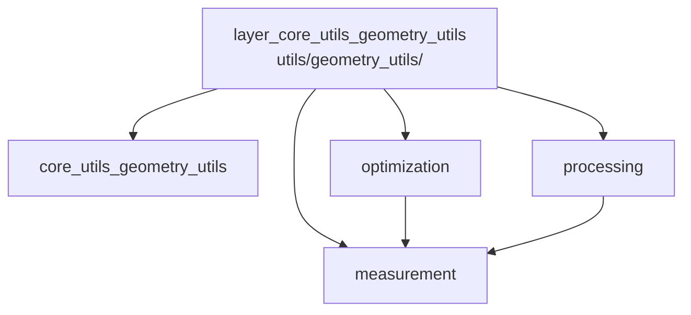

---
tags:
  - secinterp
  - code-walkthrough
  - layer
  - core
aliases:
  - layer_core_utils_geometry_utils
  - core/utils/geometry_utils/
cssclass: secinterp-note
---

# 🧭 Capa `core/utils/geometry_utils/` — Geometría Planar

> [!abstract]
> Hub de navegación del subpaquete `core/utils/geometry_utils/`: geometría
> planar pura para perfiles topográficos, sin QGIS ni estado. La nota paquete
> describe el contenedor de 4 archivos, mientras la medición proyecta puntos y
> agrega métricas, la optimización simplifica y muestrea según curvatura, y el
> procesamiento densifica e interpola cotas sobre polilíneas.

**Ruta**: `core/utils/geometry_utils/` (4 archivos, ~416 líneas)
**Capa**: Core (geometría planar pura, QGIS-agnóstica)
**Tags**: #secinterp #code-walkthrough #layer #core

---

## 🎯 ¿Por qué existe esta capa?

Las polilíneas del perfil (línea de sección, topo muestreada, ejes) necesitan
tres operaciones distintas que evolucionan a ritmos distintos:

| Principio | Cómo se aplica en esta capa |
|-----------|-----------------------------|
| Medir ≠ simplificar ≠ densificar | Un módulo por operación sobre polilíneas |
| Pureza matemática | Listas de tuplas `(x, y)`; sin geometrías QGIS |
| Preview fluido | [[optimization]] reduce vértices donde no aportan |
| Cotas continuas | [[processing]] interpola elevación entre vértices |
| Preguntas agregadas | [[measurement]] responde longitud, desnivel, pendiente |
| Sin re-exports | El `__init__` es marcador de namespace (ver [[core_utils_geometry_utils]]) |

> [!important] Regla de la capa
> Todo entra y sale como secuencias de tuplas. La conversión desde/hacia
> `QgsGeometry` ocurre fuera, en la GUI o en los servicios.

---

## 🧬 Mini-mapa

> [!tip] Cómo leer
> [[core_utils_geometry_utils]] es la vista paquete; los tres módulos son
> independientes, con [[measurement]] como vocabulario base que los otros dos
> reutilizan conceptualmente.

---

## 📦 Miembros

| Nota | Fuente | Rol |
|------|--------|-----|
| [[core_utils_geometry_utils]] | `core/utils/geometry_utils/` (4 archivos, ~416 líneas) | Vista paquete: namespace sin re-exports + reparto medición/optimización/proceso |
| [[measurement]] | `core/utils/geometry_utils/measurement.py` (136 líneas) | Proyección punto→polilínea y métricas agregadas (longitud, desnivel, pendiente) |
| [[optimization]] | `core/utils/geometry_utils/optimization.py` (197 líneas) | Douglas-Peucker, curvatura por desviación angular y muestreo adaptativo |
| [[processing]] | `core/utils/geometry_utils/processing.py` (80 líneas) | Densificación por vértices intermedios e interpolación (dist, elev) |

---

## 📖 Miembro por miembro

### [[core_utils_geometry_utils]] — vista de conjunto

**Fuente**: `core/utils/geometry_utils/` (4 archivos, ~416 líneas)
**Rol**: Nota paquete: `__init__` como marcador de namespace, `measurement`
(medición), `optimization` (simplificación) y `processing`
(densificación/interpolación); geometría planar pura para perfiles, sin
re-exports en el `__init__`.
**Leer cuando**: necesites el mapa del subpaquete o decidas dónde va una
función geométrica nueva (medir, simplificar o densificar).
**Cubre además**: el criterio de reparto entre los tres módulos, la convención
de tuplas `(x, y)` y por qué el `__init__` no re-exporta (imports explícitos
por módulo).

### [[measurement]] — medir polilíneas

**Fuente**: `core/utils/geometry_utils/measurement.py` (136 líneas)
**Rol**: Proyecta un punto sobre una polilínea y calcula métricas agregadas
(distancia total, horizontal, cambio de cota, pendiente media), sin tocar
QGIS.
**Leer cuando**: necesites la estación de un punto sobre la sección o
resúmenes numéricos de un perfil.
**Cubre además**: la proyección punto→segmento con estación acumulada, cada
métrica agregada y los casos degenerados (polilínea vacía, punto coincidente).

### [[optimization]] — simplificar con criterio

**Fuente**: `core/utils/geometry_utils/optimization.py` (197 líneas)
**Rol**: Simplifica polilíneas con Douglas-Peucker, estima la curvatura local
por desviación angular y muestrea de forma adaptativa según la curvatura,
para renders de preview fluidos sin perder forma.
**Leer cuando**: el preview se arrastre con líneas densas o ajustes el
equilibrio fidelidad/rendimiento.
**Cubre además**: el algoritmo Douglas-Peucker y su tolerancia, la estimación
de curvatura, el muestreo adaptativo y cuándo NO simplificar.

### [[processing]] — densificar e interpolar

**Fuente**: `core/utils/geometry_utils/processing.py` (80 líneas)
**Rol**: Densifica polilíneas insertando vértices intermedios y convierte
distancias límite de un intervalo en puntos `(dist, elev)` con cota
muestreada, sin tocar QGIS.
**Leer cuando**: necesites más resolución en una polilínea o mapear un
intervalo de distancias a puntos con cota.
**Cubre además**: el criterio de inserción de vértices, la interpolación de
cota entre vértices y la conversión intervalo→puntos.

---

## 🔄 Cómo encajan los miembros

El ciclo típico sobre una polilínea de perfil es: [[processing]] la densifica
para tener resolución suficiente, los servicios muestrean cotas sobre ella,
[[measurement]] responde preguntas (estaciones, longitudes, pendientes) y
[[optimization]] la simplifica antes de pintarla para que el preview siga
fluido. [[core_utils_geometry_utils]] documenta el contrato colectivo: todo
son tuplas, sin estado y sin QGIS.

| Fase | Quién | Entrada → Salida |
|------|-------|------------------|
| Preparar | [[processing]] | polilínea gruesa → polilínea densa |
| Preguntar | [[measurement]] | punto/polilínea → estación o métricas |
| Aligerar | [[optimization]] | polilínea densa → polilínea simplificada |
| Contrato | [[core_utils_geometry_utils]] | convenciones del paquete |

---

## 📚 Orden de lectura sugerido

1. [[core_utils_geometry_utils]] — convenciones y reparto del paquete.
2. [[measurement]] — el vocabulario base (estación, distancias).
3. [[processing]] — cómo se construyen las polilíneas que se miden.
4. [[optimization]] — cómo se aligeran antes de pintar (el módulo más largo).

> [!note] Dependencias internas
> Los tres módulos son import-independientes; la dependencia es conceptual:
> optimizar y procesar solo tienen sentido sobre las nociones que define
> [[measurement]].

---

## 🔗 Hubs relacionados

- [[Index]] — índice de la bóveda
- [[layer_core_utils]] — hub padre de utilidades
- [[layer_core_services]] — servicios que consumen esta geometría
- [[layer_core_domain]] — `SpatialMeta`, el puente 2D/3D de estas polilíneas

---

*Nota de la bóveda SecInterp Code Walkthrough v2 — v3.9.1*
