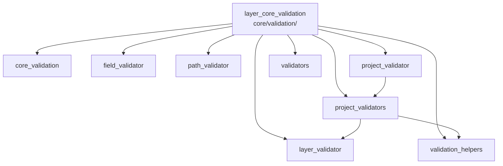

---
tags:
  - secinterp
  - code-walkthrough
  - layer
  - core
aliases:
  - layer_core_validation
  - core/validation/
cssclass: secinterp-note
---

# 🧭 Capa `core/validation/` — Validación en 3 Niveles

> [!abstract]
> Hub de navegación del paquete `core/validation/`: la puerta de entrada de
> datos del núcleo. La nota paquete declara la interfaz `IValidator`, el DTO
> `LayerMetadata` y el `ValidationPipeline`; los validadores de campo, capa y
> proyecto filtran entradas en niveles crecientes, y los helpers aportan
> acumulación de errores, reglas condicionales y fábricas reutilizables.

**Ruta**: `core/validation/` (paquete de validación del core)
**Capa**: Core (QGIS-agnóstico; trabaja sobre `LayerMetadata` desacoplado)
**Tags**: #secinterp #code-walkthrough #layer #core

---

## 🎯 ¿Por qué existe esta capa?

Ningún cálculo debería correr sobre datos malformados. La validación se
estratifica para fallar pronto en lo barato (tipos) y acumular contexto en lo
caro (reglas de negocio):

| Principio | Cómo se aplica en esta capa |
|-----------|-----------------------------|
| Nivel 1: campos | [[field_validator]] y [[validators]] coercionan y tipan |
| Nivel 1/2: capas | [[layer_validator]] y [[path_validator]] comprueban geometría, CRS, raster y rutas |
| Nivel 2: negocio | [[validation_helpers]] acumula errores y reglas condicionales |
| Nivel 3: proyecto | [[project_validator]] y [[project_validators]] orquestan por componente |
| Desacoplado de QGIS | Todo valida sobre `LayerMetadata` y `ValidationParams`, no capas vivas |
| Contrato común | `IValidator.validate(params, context)` en [[core_validation]] |

> [!important] Regla de la capa
> Validar ≠ procesar. Estos módulos nunca calculan geometría ni escriben
> archivos: devuelven errores/avisos o lanzan `ValidationError`/`SecInterpError`.

---

## 🧬 Mini-mapa

> [!tip] Cómo leer
> [[core_validation]] define el contrato; [[project_validator]] orquesta;
> [[project_validators]] implementa por componente; el resto son piezas.

---

## 📦 Miembros

| Nota | Fuente | Rol |
|------|--------|-----|
| [[core_validation]] | `core/validation/` (4 archivos, ~148 líneas) | `IValidator`, `LayerMetadata`, `ValidationPipeline` y API pública |
| [[field_validator]] | `core/validation/field_validator.py` (184 líneas) | Nivel 1: coerción numérica y existencia/tipo de campos |
| [[layer_validator]] | `core/validation/layer_validator.py` (200 líneas) | Nivel 1/2 espacial: features, geometría, raster, CRS, requisitos |
| [[path_validator]] | `core/validation/path_validator.py` (111 líneas) | Rutas seguras: traversal, confinamiento, creación y escritura |
| [[project_validator]] | `core/validation/project_validator.py` (151 líneas) | `ValidationParams` + orquestador `ProjectValidator` por dominio |
| [[project_validators]] | `core/validation/project_validators.py` (240 líneas) | Validadores por componente (sección, DEM, geología, sondajes, salida) |
| [[validation_helpers]] | `core/validation/validation_helpers.py` (195 líneas) | Nivel 2: contexto acumulador, error rico, reglas y rangos razonables |
| [[validators]] | `core/validation/validators.py` (252 líneas) | Fábricas reutilizables para campos de dataclass + `FieldValidator` |

---

## 📖 Miembro por miembro

### [[core_validation]] — contrato y pipeline

**Fuente**: `core/validation/` (4 archivos, ~148 líneas)
**Rol**: Declara la interfaz `IValidator`, el DTO `LayerMetadata`, el
orquestador `ValidationPipeline` y el `__init__` que re-exporta la API
pública de validación, todo QGIS-agnóstico.
**Leer cuando**: crees un validador nuevo (implementa `IValidator`) o
entiendas qué datos desacoplados ve la validación.
**Cubre además**: la firma `validate(params, context)`, la forma de
`LayerMetadata` y el encadenamiento del pipeline.

### [[field_validator]] — campos y atributos

**Fuente**: `core/validation/field_validator.py` (184 líneas)
**Rol**: Validadores QGIS-agnósticos de nivel 1 para campos y atributos:
convierten cadenas a números/enteros y comprueban existencia y tipo de campos
sobre un `LayerMetadata` desacoplado.
**Leer cuando**: un campo "existe pero falla" (suele ser tipo o coerción) o
añadas la comprobación de un campo nuevo.
**Cubre además**: la coerción tolerante de strings, la comprobación de
existencia/tipo y los mensajes de error por campo.

### [[layer_validator]] — capas y geometría

**Fuente**: `core/validation/layer_validator.py` (200 líneas)
**Rol**: Validadores espaciales de nivel 1/2: capa con features y geometría
esperada, raster con la banda pedida, requisitos de geología/estructura y
compatibilidad de CRS sobre `LayerMetadata`.
**Leer cuando**: una capa válida "no pasa" (geometría, CRS o banda) o definas
los requisitos de un dominio nuevo.
**Cubre además**: el chequeo de features no vacías, la geometría esperada por
dominio, la banda raster y la comparación de CRS.

### [[path_validator]] — rutas de salida

**Fuente**: `core/validation/path_validator.py` (111 líneas)
**Rol**: Validación segura de rutas con `pathlib.Path`: null bytes, traversal
de directorios, confinamiento a un directorio base, existencia/creación y
escritura real en disco.
**Leer cuando**: una exportación falle por ruta o endurezcas la política de
destinos permitidos.
**Cubre además**: el test de escritura real, el confinamiento al directorio
base y la creación de directorios intermedios.

### [[project_validator]] — orquestador del proyecto

**Fuente**: `core/validation/project_validator.py` (151 líneas)
**Rol**: Define el DTO `ValidationParams` (todos los parámetros de capa a
validar) y el orquestador `ProjectValidator`, que compone el pipeline de
validadores especializados y expone helpers de "completitud" por dominio.
**Leer cuando**: lances la validación completa del proyecto o entiendas qué
significa "proyecto completo" por dominio.
**Cubre además**: la forma de `ValidationParams`, la composición del pipeline
y los helpers de completitud.

### [[project_validators]] — validadores por componente

**Fuente**: `core/validation/project_validators.py` (240 líneas)
**Rol**: Validadores especializados por componente (sección, DEM, geología,
estructuras, sondajes, salida), cada uno implementando
`IValidator.validate(params, context)` para acumular errores de negocio.
**Leer cuando**: un dominio concreto reporte errores o añadas las reglas de un
componente nuevo.
**Cubre además**: la regla por componente, la acumulación sobre
`ValidationParams` y los errores de negocio típicos de cada dominio.

### [[validation_helpers]] — negocio de nivel 2

**Fuente**: `core/validation/validation_helpers.py` (195 líneas)
**Rol**: `ValidationContext` para acumular errores/avisos en vez de fallar
rápido, `RichValidationError` como error con contexto, `DependencyRule` para
reglas condicionales y `validate_reasonable_ranges` para valores extremos.
**Leer cuando**: diseñes reglas "si A entonces B" o decidas entre error duro
y aviso.
**Cubre además**: el patrón acumulador vs fail-fast, las reglas de
dependencia y los umbrales de rangos razonables.

### [[validators]] — fábricas reutilizables

**Fuente**: `core/validation/validators.py` (252 líneas)
**Rol**: Fábricas de validadores para campos de dataclass: funciones de orden
superior que validan/coercionan y lanzan `ValidationError`, compuestas vía la
clase `FieldValidator` (encadenamiento) más helpers (porcentaje,
probabilidad, entero positivo).
**Leer cuando**: valides un campo de `PluginSettings` o compongas una cadena
de coerciones.
**Cubre además**: el encadenamiento `FieldValidator`, las fábricas de orden
superior y los helpers numéricos de conveniencia.

---

## 🔄 Cómo encajan los miembros

[[project_validator]] recibe los `ValidationParams` y ejecuta el pipeline de
[[core_validation]], que despacha a cada validador de [[project_validators]];
estos usan [[field_validator]] y [[layer_validator]] para lo atómico,
[[path_validator]] para los destinos, [[validation_helpers]] para acumular
errores y reglas condicionales, y [[validators]] para coercionar campos de
configuración. El resultado es una lista de errores/avisos por dominio, no una
excepción al primer fallo.

| Fase | Quién | Entrada → Salida |
|------|-------|------------------|
| Contrato | [[core_validation]] | `IValidator` + `LayerMetadata` + pipeline |
| Orquesta | [[project_validator]] | `ValidationParams` → errores por dominio |
| Componente | [[project_validators]] | params + context → errores acumulados |
| Atómico | [[field_validator]] / [[layer_validator]] | campo/capa → ok o error |
| Rutas | [[path_validator]] | ruta candidata → ruta segura o error |
| Negocio | [[validation_helpers]] | reglas → errores/avisos acumulados |
| Fábricas | [[validators]] | valor crudo → valor coercionado |

---

## 📚 Orden de lectura sugerido

1. [[core_validation]] — contrato, DTO y pipeline (el marco).
2. [[project_validator]] — qué se valida y qué es "completo".
3. [[project_validators]] — las reglas por componente.
4. [[field_validator]] + [[layer_validator]] — lo atómico.
5. [[validation_helpers]] + [[validators]] — acumulación y fábricas.
6. [[path_validator]] — el caso especial de rutas (autocontenido).

---

## 🔗 Hubs relacionados

- [[Index]] — índice de la bóveda
- [[layer_core]] — hub padre del núcleo
- [[layer_core_domain]] — `LayerMetadata`, `ValidationParams` y excepciones
- [[layer_core_models]] — cuyos campos validan las fábricas

---

*Nota de la bóveda SecInterp Code Walkthrough v2 — v3.8.0*
