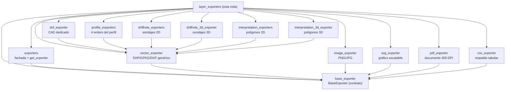

---
tags:
  - secinterp
  - code-walkthrough
  - layer
  - exporters
aliases:
  - layer_exporters
  - capa exporters
  - exporters (capa)
cssclass: secinterp-note
---

# Capa `exporters/` — Escritura de resultados del perfil

> [!abstract] Mapa de navegación
> La capa `exporters/` es el **lado "Write"** del plugin: convierte los datos ya
> calculados del perfil (topografía, geología, estructuras, sondajes,
> interpretaciones) en archivos reales — vectoriales 2D/3D, CSV, DXF, PNG/JPG,
> SVG y PDF — bajo el contrato `BaseExporter` y la factory `get_exporter()`.

**Ruta**: `exporters/` (13 notas de esta capa)
**Contrato**: `BaseExporter` (ver [[base_exporter]])
**Factory**: `get_exporter()` (ver [[exporters]])
**Capa**: Exporters (GUI · QGIS-dependiente, salvo `CSVExporter`)
**Tags**: #secinterp #code-walkthrough #layer #exporters

---

## 🎯 ¿Por qué existe esta capa?

El core calcula (Compute) y la GUI extrae (Extract). Falta el tercer verbo:
**persistir**. Sin esta capa, cada diálogo o servicio escribiría ficheros a mano,
duplicando validación de rutas, elección de driver OGR y render de mapa:

| Problema | Solución en la capa |
|----------|---------------------|
| Cada formato valida rutas y extensiones a su manera | `BaseExporter` fija el Template Method y la validación |
| Los consumidores memorizan rutas internas de 12 writers | `exporters/__init__.py` re-exporta y ofrece `get_exporter()` |
| Los datos vectoriales necesitan respaldo tabular auditable | `CSVExporter` acompaña a cada salida vectorial de los handlers |
| El perfil 2D debe verse en 3D y en CAD | Writers 3D dedicados + `DXFExporter` con validación defensiva |
| La vista previa debe congelarse para informes | Writers de render (imagen, SVG, PDF) sobre `QgsMapSettings` |

> [!important] Regla de la capa
> Los writers **no calculan**: reciben datos ya proyectados (coordenadas
> `distancia, elevación` o `PolygonZ`/`LineStringZ`) y solo escriben. El cálculo
> vive en el core y la orquestación por entidad en [[orchestrator]].

---

## 🧬 Mini-mapa de la capa

> [!tip] Cómo leer
> [[exporters]] es la puerta de entrada (qué writer usar) y [[base_exporter]] es
> el contrato (cómo debe comportarse). Todo writer concreto cuelga de uno de
> esos dos nodos.

---

## 📦 Miembros de la capa

| Nota | Fuente | Rol |
|---|---|---|
| [[exporters]] | `exporters/__init__.py` | Fachada del paquete: re-exporta los 16 writers y ofrece `get_exporter()` por extensión |
| [[base_exporter]] | `exporters/base_exporter.py` | Contrato abstracto `BaseExporter`: Template Method, validación de rutas y acceso a settings |
| [[csv_exporter]] | `exporters/csv_exporter.py` | Writer tabular puro en stdlib: `headers` + `rows` a CSV UTF-8 sin tocar QGIS |
| [[drillhole_3d_exporter]] | `exporters/drillhole_3d_exporter.py` | Sondajes a 3D (`LineStringZ` de trazas e intervalos) con conmutador `use_projected` |
| [[drillhole_exporters]] | `exporters/drillhole_exporters.py` | Sondajes en 2D del perfil (`distancia, elevación`): trazas con `hole_id`, intervalos con `from_depth/to_depth/unit` |
| [[dxf_exporter]] | `exporters/dxf_exporter.py` | Salida CAD dedicada: mismo pipeline OGR con `_prepare_fields` defensivo y logs propios |
| [[image_exporter]] | `exporters/image_exporter.py` | Raster PNG/JPG vía `QgsMapRendererCustomPainterJob` sobre `QImage` con leyenda opcional |
| [[interpretation_3d_exporter]] | `exporters/interpretation_3d_exporter.py` | Polígonos de interpretación a `PolygonZ` sobre el plano vertical, con estilo QML 2D y renderer 3D por reglas |
| [[interpretation_exporters]] | `exporters/interpretation_exporters.py` | Polígonos de interpretación 2D como `Polygon` con 5 campos fijos más columnas custom |
| [[pdf_exporter]] | `exporters/pdf_exporter.py` | Documento PDF a 300 DPI sobre `QPdfWriter` con página a medida, márgenes cero y leyenda opcional |
| [[profile_exporters]] | `exporters/profile_exporters.py` | Cuatro writers 2D del perfil: línea topográfica, segmentos geológicos, ticks estructurales y ejes |
| [[svg_exporter]] | `exporters/svg_exporter.py` | Gráfico SVG escalable vía `QSvgGenerator` con título/descripción traducibles y leyenda opcional |
| [[vector_exporter]] | `exporters/vector_exporter.py` | Writer vectorial genérico SHP/GPKG/DXF vía `QgsVectorFileWriter` con tipos inferidos del primer feature |

---

## 🧭 Recorrido por grupos

### Contrato y fachada

Todo empieza en [[base_exporter]]: `export()` y `get_supported_extensions()`
fijan la forma que cada formato debe cumplir, mientras la validación segura de
rutas y la lectura de settings evitan que cada writer reinvente lo mismo.
[[exporters]] completa el dúo como punto único de importación: re-exporta las
16 clases writer y resuelve clase por extensión con `get_exporter()`, de modo
que la GUI pide un writer por nombre de archivo y no por ruta de módulo.

### Vectoriales 2D del perfil

[[vector_exporter]] es el motor genérico: convierte listas de
`{geometry, attributes}` en capas OGR reales con CRS y campos correctos.
Encima de él se especializan [[profile_exporters]] (los cuatro writers del
perfil en coordenadas `distancia, elevación`), [[drillhole_exporters]]
(trazas e intervalos de sondaje en el mismo plano) e
[[interpretation_exporters]] (polígonos con 5 campos fijos más atributos
custom). [[dxf_exporter]] reutiliza el mismo pipeline con validación de
entrada más estricta para el intercambio con CAD.

### Salto a 3D

[[drillhole_3d_exporter]] y [[interpretation_3d_exporter]] recolocan la
sección 2D en el mundo real: trazas e intervalos como `LineStringZ` y
polígonos como `PolygonZ` sobre el plano vertical de la sección. El de
interpretaciones añade además el estilo QML 2D categorizado y el renderer 3D
por reglas, cerrando el ciclo entre digitalización 2D y visualización 3D.

### Render para informes

[[image_exporter]], [[svg_exporter]] y [[pdf_exporter]] congelan el
`QgsMapSettings` de la vista previa con el mismo motor
(`QgsMapRendererCustomPainterJob`) sobre tres lienzos distintos: `QImage`
para raster, `QSvgGenerator` para vectorial editable y `QPdfWriter` a 300 DPI
para el documento imprimible. Los tres comparten leyenda opcional y títulos
traducibles donde aplica.

### Respaldo tabular

[[csv_exporter]] es el único writer 100 % QGIS-agnóstico (solo `csv` +
`pathlib`): escribe `headers` + `rows` en UTF-8 como representación legible y
auditable que acompaña a cada archivo vectorial producido por los handlers.

---

## 🔄 Flujo de datos

| Fase | Actor | Entrada → Salida |
|------|-------|------------------|
| Compute | [[controller]] | Capas QGIS → tupla unificada de resultados del perfil |
| Orquestación | [[orchestrator]] | Resultados + opciones → delegación por entidad a handlers |
| Escritura vectorial/tabular | Writers 2D/3D + CSV | DTOs y geometrías → SHP/GPKG/DXF/CSV en disco |
| Escritura de imagen | [[dialog_export_manager]] + writers de render | `QgsMapSettings` → PNG/JPG/SVG/PDF |

El camino típico es: el diálogo pide datos al controlador, el servicio de
exportación decide qué entidades escribir y con qué formato, y cada writer
persiste su parte. Para la imagen del perfil, el manager de exportación del
diálogo resuelve el writer con `get_exporter()` según la extensión elegida y
renderiza los ajustes de mapa actuales.

> [!note] Dónde vive cada decisión
> **Qué** se exporta lo decide [[orchestrator]]; **con qué clase** lo resuelve
> [[exporters]]; **cómo** se escribe lo implementa cada writer bajo el contrato
> [[base_exporter]]; **cuándo** lo dispara la GUI lo coordina
> [[dialog_export_manager]].

---

## 🏛️ Patrones de la capa

| Patrón | Dónde | Propósito |
|--------|-------|-----------|
| **Template Method** | [[base_exporter]] | Fijar `export` y validación común, delegar la escritura |
| **Facade + Factory** | [[exporters]] | Un solo importe y resolución por extensión (`get_exporter`) |
| **Strategy por formato** | Cada writer | Intercambiar raster, vectorial, CAD y documento sin cambiar llamadores |
| **Extract-then-Compute-then-Write** | Capa completa | El core computa, el orquestador delega, el writer persiste |

---

## 🔗 Notas relacionadas

- [[Index]] — índice de la bóveda
- [[orchestrator]] — orquesta la escritura CSV/vectorial por entidad y delega en handlers
- [[controller]] — produce la tupla unificada de resultados que los writers persisten
- [[dialog_export_manager]] — dispara desde la GUI la exportación de imagen y de datos

---

*Nota de la bóveda SecInterp Code Walkthrough v2 — v3.8.0*
