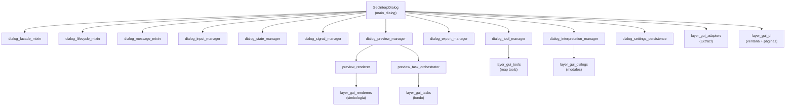

---
tags:
  - secinterp
  - code-walkthrough
  - layer
  - gui
aliases:
  - gui/
  - capa GUI
  - layer/gui
cssclass: secinterp-note
---

# 🖥️ Capa GUI — composición, managers y preview

> [!abstract] Propósito
> Nota hub (MOC) de la **capa GUI**: el diálogo principal `SecInterpDialog`, sus
> managers especializados, los mixins de ciclo de vida y fachada, y todo el
> pipeline del preview (caché, tareas, factoría de capas, render y leyenda).
> Es el lado **Extract + Present** de la arquitectura: la GUI extrae DTOs
> desacoplados de QGIS y presenta los resultados del core.

**Alcance**: `gui/` — diálogo, managers, mixins, preview y utilidades (31 notas)
**Sub-hubs**: 6 (`adapters`, `renderers`, `tasks`, `tools`, `ui`, `dialogs`)
**Capa**: GUI (depende de QGIS; el core nunca depende de ella)
**Tags**: #secinterp #code-walkthrough #layer #gui

---

## 🧭 Mapa de la capa

> [!tip] Cómo leer
> `SecInterpDialog` es la **raíz de composición**: no implementa lógica, solo
> cablea managers. Cada flecha es una delegación (`_init_managers`). El preview
> cuelga de `dialog_preview_manager`, que a su vez posee renderer y orquestador.

---

## 📦 Miembros

| Nota | Fuente | Rol |
|---|---|---|
| [[gui]] | `gui/` (paquete, 37 líneas) | Fachada pública + contenedor `Pages` de dependencias |
| [[main_dialog]] | `gui/main_dialog.py` (193 líneas) | Raíz de composición: combina mixins y cablea 9 managers |
| [[main_dialog_config]] | `gui/main_dialog_config.py` (195 líneas) | Constantes, valores iniciales y mensajes i18n del diálogo |
| [[dialog_export_manager]] | `gui/dialog_export_manager.py` (218 líneas) | Salidas del diálogo: imagen del preview + datos SHP/CSV |
| [[dialog_facade_mixin]] | `gui/dialog_facade_mixin.py` (166 líneas) | API pública estable como proxies finos a los managers |
| [[dialog_input_manager]] | `gui/dialog_input_manager.py` (200 líneas) | Agrega las páginas en `ValidationParams`; puertas `can_preview`/`can_export` |
| [[dialog_interpretation_manager]] | `gui/dialog_interpretation_manager.py` (107 líneas) | Orquesta polígonos: herencia → propiedades → persistir → refrescar |
| [[dialog_settings_persistence]] | `gui/dialog_settings_persistence.py` (198 líneas) | Persistencia triple nivel: proyecto, `ConfigService` y resolución de capas |
| [[dialog_lifecycle_mixin]] | `gui/dialog_lifecycle_mixin.py` (77 líneas) | Limpieza determinista en 4 fases + autoguardado al cerrar |
| [[dialog_message_mixin]] | `gui/dialog_message_mixin.py` (78 líneas) | Barra de mensajes QGIS + errores centralizados (`SecInterpError` vs resto) |
| [[dialog_preview_manager]] | `gui/dialog_preview_manager.py` (244 líneas) | Orquesta el preview: valida, genera, cachea por hash y delega lo pesado |
| [[dialog_signal_manager]] | `gui/dialog_signal_manager.py` (354 líneas) | Concentrador de señales en 4 grupos, idempotente y sin fugas |
| [[dialog_state_manager]] | `gui/dialog_state_manager.py` (117 líneas) | Orquesta estado visual, persistencia y conexiones propias |
| [[dialog_tool_manager]] | `gui/dialog_tool_manager.py` (203 líneas) | Herramientas del canvas (pan/medir/interpretar) + zoom con rueda |
| [[interpretation_inheritance_mixin]] | `gui/interpretation_inheritance_mixin.py` (190 líneas) | Hereda atributos desde el segmento o intervalo más cercano |
| [[interpretation_persistence_mixin]] | `gui/interpretation_persistence_mixin.py` (177 líneas) | Persiste en JSON del proyecto o en capa vectorial externa |
| [[layer_notification_manager]] | `gui/layer_notification_manager.py` (73 líneas) | Invalida buckets del `DataCache` ante `dataChanged` (nota real, no hub) |
| [[legend_widget]] | `gui/legend_widget.py` (81 líneas) | Overlay de leyenda sobre el canvas, sin interceptar el ratón |
| [[main_dialog_utils]] | `gui/main_dialog_utils.py` (50 líneas) | Helpers estáticos de acceso a entidades QGIS para la fachada |
| [[preview_axes_manager]] | `gui/preview_axes_manager.py` (204 líneas) | Rejilla y etiquetas del preview con intervalos "agradables" 1-2-5 |
| [[preview_callbacks_mixin]] | `gui/preview_callbacks_mixin.py` (127 líneas) | Recibe las señales de los `QgsTask` async y re-renderiza |
| [[preview_layer_factory]] | `gui/preview_layer_factory.py` (471 líneas) | Convierte cada rama del `PreviewResult` en capas de memoria con estilo |
| [[preview_legend_renderer]] | `gui/preview_legend_renderer.py` (178 líneas) | Dibuja la leyenda sobre `QPainter` con tamaño auto-calculado |
| [[preview_param_hasher]] | `gui/preview_param_hasher.py` (133 líneas) | Hash SHA-256 estable de `PreviewParams` para el caché |
| [[preview_render_mixin]] | `gui/preview_render_mixin.py` (129 líneas) | Pipeline de render: LOD + exageración vertical + debounce ante zoom |
| [[preview_renderer]] | `gui/preview_renderer.py` (315 líneas) | Orquestador del render al canvas + limpieza sin fugas |
| [[preview_reporter]] | `gui/preview_reporter.py` (181 líneas) | Formatea el `PreviewResult` en el texto de resultados del diálogo |
| [[preview_state]] | `gui/preview_state.py` (57 líneas) | Contenedores compartidos `PreviewCache` + `RenderState` |
| [[preview_task_orchestrator]] | `gui/preview_task_orchestrator.py` (158 líneas) | Dueño de los `QgsTask` de geología y sondajes |
| [[ui_status_manager]] | `gui/ui_status_manager.py` (221 líneas) | Estado visual: iconos de validez, botones y checkboxes; avisos CRS |
| [[gui_utils_py]] | `gui/utils.py` (76 líneas) | `create_memory_layer` + `show_user_message` transversales |

> [!note] Nota real entre los miembros
> [[layer_notification_manager]] es una **nota de archivo** (no un hub): se
> enlaza aquí como miembro porque vive en `gui/` y participa en la
> invalidación del caché, pero su contenido describe un único módulo.

---

## 🗂️ Sub-hubs de la capa

| Hub | Paquete | Rol |
|---|---|---|
| [[layer_gui_adapters]] | `gui/adapters/` | Fase Extract: QGIS vivo → DTOs desacoplados |
| [[layer_gui_renderers]] | `gui/renderers/` | Lado Present: simbología QGIS sobre capas extraídas |
| [[layer_gui_tasks]] | `gui/tasks/` | `QgsTask` de fondo para geología y sondajes |
| [[layer_gui_tools]] | `gui/tools/` | Map tools interactivos del canvas de perfil |
| [[layer_gui_ui]] | `gui/ui/` | Ventana principal, sidebar y páginas de configuración |
| [[layer_gui_dialogs]] | `gui/dialogs/` | Diálogos modales (propiedades de interpretación) |

---

## 🧩 Familias dentro de la capa

### Composición del diálogo

[[main_dialog]] no contiene lógica de negocio: hereda tres mixins
([[dialog_facade_mixin]], [[dialog_lifecycle_mixin]], [[dialog_message_mixin]])
y en `_init_managers` construye los nueve managers. [[main_dialog_config]]
aporta las constantes y [[main_dialog_utils]] aísla el acceso a `QgsProject`
para que la fachada nunca lo llame directamente.

### Managers de estado y señales

[[dialog_input_manager]] agrega las seis páginas en un diccionario plano o un
`ValidationParams` y expone `can_preview()` / `can_export()` como puertas de
la UI. [[dialog_state_manager]] delega lo visual en [[ui_status_manager]] y la
persistencia en [[dialog_settings_persistence]], mientras
[[dialog_signal_manager]] concentra las conexiones en cuatro grupos
idempotentes con desconexión quirúrgica.

### Pipeline del preview

[[dialog_preview_manager]] valida entradas, genera el `PreviewResult` vía el
`PreviewService` del core y cachea por el hash de [[preview_param_hasher]].
Lo pesado corre en [[preview_task_orchestrator]] (`QgsTask`), cuyos resultados
recoge [[preview_callbacks_mixin]]; el dibujado lo ejecutan
[[preview_render_mixin]] + [[preview_renderer]] con capas de
[[preview_layer_factory]], rejilla de [[preview_axes_manager]], leyenda de
[[preview_legend_renderer]] / [[legend_widget]] e informe de
[[preview_reporter]]. El estado compartido vive en [[preview_state]].

### Interpretaciones y salidas

[[dialog_interpretation_manager]] combina [[interpretation_inheritance_mixin]]
y [[interpretation_persistence_mixin]] con el flujo de finalización (diálogo
de propiedades → añadir → persistir → refrescar). [[dialog_export_manager]]
concentra las dos salidas (imagen + datos) y [[dialog_tool_manager]] posee las
herramientas del canvas. [[layer_notification_manager]] cierra el ciclo
invalidando el caché del core cuando una capa cambia.

---

## 🔄 Flujo de datos

| Fase | Quién | Entrada → Salida |
|---|---|---|
| Configurar | páginas de [[layer_gui_ui]] | widgets → `get_data()` / `dump()` |
| Agregar | [[dialog_input_manager]] | seis páginas → `ValidationParams` |
| Extraer | [[layer_gui_adapters]] | capas QGIS → contextos desacoplados |
| Computar | core (`PreviewService`, etc.) | contextos → `PreviewResult` (en `QgsTask`) |
| Presentar | [[preview_renderer]] + familia preview | `PreviewResult` → capas de memoria + canvas |
| Exportar | [[dialog_export_manager]] | preview / datos → PNG, PDF, SVG, SHP, CSV |

La regla de la capa es **Extract-then-Compute**: ningún objeto QGIS vivo
cruza al core ni a los hilos de fondo; solo viajan WKT, dicts y DTOs.

---

## 🏛️ Patrones de diseño presentes

| Patrón | Dónde | Propósito |
|---|---|---|
| **Composition root** | [[main_dialog]] | Cablear managers con dependencias inyectadas |
| **Facade** | [[dialog_facade_mixin]] | API pública estable sobre managers internos |
| **Mixin** | lifecycle, message, render, callbacks | Composición horizontal sin herencia profunda |
| **Cache-aside por hash** | [[preview_param_hasher]] + preview manager | Evitar regenerar el preview si nada cambió |
| **Observer (señales)** | [[dialog_signal_manager]] | Conexión centralizada e idempotente |
| **Factory** | [[preview_layer_factory]] | `PreviewResult` → capas de memoria con estilo |

---

## 🔗 Notas relacionadas

- [[Index]] — índice de la bóveda
- [[layer_gui_adapters]] — Extract: de QGIS a DTOs
- [[layer_gui_renderers]] — simbología del preview
- [[layer_gui_tasks]] — tareas de fondo `QgsTask`
- [[layer_gui_tools]] — map tools del canvas
- [[layer_gui_ui]] — ventana, sidebar y páginas
- [[layer_gui_dialogs]] — diálogos modales
- [[gui]] — nota de paquete raíz de `gui/`
- [[main_dialog]] — raíz de composición del diálogo

---

*Nota de la bóveda SecInterp Code Walkthrough v2 — v3.9.1*
