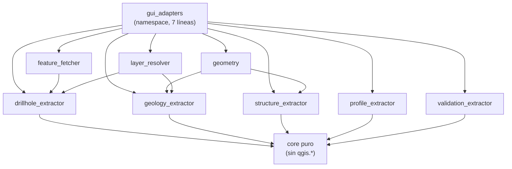

---
tags:
  - secinterp
  - code-walkthrough
  - layer
  - gui
aliases:
  - gui/adapters/
  - adaptadores Extract
  - layer/gui/adapters
cssclass: secinterp-note
---

# 🔌 Capa GUI/Adapters — fase Extract (QGIS → DTOs)

> [!abstract] Propósito
> Nota hub (MOC) del paquete `gui/adapters/`: la **fase Extract** del patrón
> Extract-then-Compute. Sus ocho extractores leen objetos QGIS vivos (capas,
> features, DEM) y devuelven contextos y registros desacoplados (`DrillholeContext`,
> `GeologyContext`, `SectionContext`, `ProfileData`, `LayerMetadata`), de modo
> que el core nunca importa `qgis.*`.

**Alcance**: `gui/adapters/` — namespace + 8 módulos extractores (9 notas)
**Capa**: GUI / Extract (único punto donde se tocan `QgsVectorLayer` y raster)
**Sub-hub de**: [[layer_gui]]
**Tags**: #secinterp #code-walkthrough #layer #gui

---

## 🧭 Mapa del sub-hub

> [!tip] Cómo leer
> Las flechas entre extractores son **dependencias de ayuda** (`feature_fetcher`
> sirve al extractor de sondajes; `geometry` sirve a geología y estructuras;
> `layer_resolver` resuelve capas para todos). Las flechas hacia el core son
> **entregas de DTOs**, nunca de objetos QGIS.

---

## 📦 Miembros

| Nota | Fuente | Rol |
|---|---|---|
| [[gui_adapters]] | `gui/adapters/` (namespace, 7 líneas) | Declara el contrato del paquete puente hacia el core |
| [[drillhole_extractor]] | `gui/adapters/drillhole_extractor.py` (369 líneas) | Sondajes: collares + surveys + intervalos → `DrillholeContext` |
| [[feature_fetcher]] | `gui/adapters/feature_fetcher.py` (84 líneas) | Una pasada por capa hija con expresión `IN`; tuplas planas por profundidad |
| [[geology_extractor]] | `gui/adapters/geology_extractor.py` (235 líneas) | Densifica, muestrea el perfil maestro e intersecta → `GeologyContext` |
| [[geometry]] | `gui/adapters/geometry.py` (226 líneas) | Toolkit QGIS: densificado, vértices, rangos y muestreo DEM |
| [[layer_resolver]] | `gui/adapters/layer_resolver.py` (113 líneas) | Resuelve ID/nombre/objeto → `QgsMapLayer` con caché singleton (nota real) |
| [[profile_extractor]] | `gui/adapters/profile_extractor.py` (86 líneas) | Muestrea el DEM sobre la sección → `ProfileData` + intervalo LOD |
| [[structure_extractor]] | `gui/adapters/structure_extractor.py` (226 líneas) | Filtra por buffer y desconecta a `SectionContext` + elevaciones |
| [[validation_extractor]] | `gui/adapters/validation_extractor.py` (176 líneas) | Capas → `LayerMetadata` + `ValidationParams` puros para el validador |

> [!note] Nota real entre los miembros
> [[layer_resolver]] es una **nota de archivo** (no un hub): se enlaza como
> miembro porque resuelve las capas que los extractores consumen, pero describe
> un único módulo con su caché a nivel de clase.

---

## 👀 Recorrido por miembros

### [[gui_adapters]] — el contrato del paquete

Su `__init__.py` de 7 líneas no agrupa re-exports: declara la **intención**
del paquete (puente entre objetos QGIS vivos y core agnóstico). Es la puerta
de entrada conceptual; los ocho extractores hermanos viven en sus notas
propias y se enlazan desde aquí.

### [[drillhole_extractor]] — el extractor grande

Lee la línea de sección y las tres capas de sondaje (collares, surveys,
intervalos) y devuelve un `DrillholeContext` totalmente desconectado. Delega
la lectura de capas hijas en [[feature_fetcher]] y la resolución de capas en
[[layer_resolver]]: es el mayor de los extractores (369 líneas) porque
coordina tres fuentes heterogéneas.

### [[feature_fetcher]] — una pasada por capa

`DataFetcher` minimalista (84 líneas): lee surveys e intervalos en una sola
pasada por capa con expresión `IN` y devuelve tuplas planas ordenadas por
profundidad. Gracias a él, el core nunca ve un `QgsFeatureRequest`.

### [[geology_extractor]] — densificar, muestrear, intersectar

Densifica la línea de sección sobre el DEM, muestrea el perfil maestro
topográfico e intersecta la línea con los polígonos de afloramiento para
devolver un `GeologyContext` desacoplado a `GeologyService`. Usa el toolkit
[[geometry]] para el densificado y el muestreo.

### [[geometry]] — toolkit que huyó del core

Funciones QGIS sin clases (`QgsDistanceArea`, densificado, vértices, rangos,
muestreo DEM) que antes vivían en `core/utils` y se movieron aquí
precisamente para mantener el core QGIS-agnóstico. Lo comparten
[[geology_extractor]] y [[structure_extractor]].

### [[layer_resolver]] — resolución centralizada

Convierte referencias ID, nombre u objeto en `QgsMapLayer` válidas vía
`QgsProject`, con caché singleton a nivel de clase. Evita que cada diálogo
repita la lógica `mapLayer` / `mapLayersByName`.

### [[profile_extractor]] — topografía pura

`ProfileExtractor` (86 líneas) muestrea elevaciones DEM a lo largo de la
sección y devuelve `ProfileData` (`list[(distancia, elevación)]` redondeada),
más el cálculo del intervalo LOD que el preview usa para diezmar.

### [[structure_extractor]] — buffer y desconexión

Lee la línea de sección y la capa de mediciones, filtra por buffer,
desconecta puntos y atributos a primitivos (`SectionContext`) y muestrea
elevaciones DEM, para que `StructureService` nunca toque QGIS.

### [[validation_extractor]] — validar sin QGIS

Solo funciones, sin clases: convierte referencias y capas en registros
`LayerMetadata` desacoplados y construye `ValidationParams` puros, de modo
que el `ProjectValidator` del core valida sin importar QGIS.

---

## 🔄 Flujo de datos

| Fase | Quién | Entrada → Salida |
|---|---|---|
| Resolver | [[layer_resolver]] | ID / nombre / objeto → `QgsMapLayer` válida |
| Leer hijas | [[feature_fetcher]] | capas survey/intervalos → tuplas planas |
| Muestrear | [[geometry]] + [[profile_extractor]] | DEM + línea → `ProfileData` / elevaciones |
| Extraer | [[drillhole_extractor]], [[geology_extractor]], [[structure_extractor]], [[validation_extractor]] | capas + perfil → contextos desacoplados |
| Computar | core | contextos → segmentos, estructuras, preview |

Todo lo que cruza hacia el core son primitivos, WKT y DTOs. Los extractores
se ejecutan siempre en el **hilo principal** (los objetos QGIS vivos no son
thread-safe); solo los DTOs resultantes viajan a los `QgsTask` de
[[layer_gui_tasks]].

---

## 🏛️ Patrones de diseño presentes

| Patrón | Dónde | Propósito |
|---|---|---|
| **Adapter (Extract)** | los cuatro extractores | QGIS vivo → DTOs puros |
| **Facade de lectura** | [[feature_fetcher]] | Una pasada por capa hija |
| **Singleton (caché)** | [[layer_resolver]] | Resolver capas sin repetir `QgsProject` |
| **Funciones puras de ayuda** | [[geometry]], [[validation_extractor]] | Toolkit sin estado, testeable sin QGIS |

---

## 🔗 Notas relacionadas

- [[Index]] — índice de la bóveda
- [[layer_gui]] — hub padre de toda la capa GUI
- [[layer_gui_tasks]] — los `QgsTask` que consumen estos DTOs
- [[layer_gui_ui_pages_drillhole]] — tabs que configuran las capas de sondaje
- [[gui_adapters]] — nota del namespace del paquete
- [[drillhole_extractor]] / [[geology_extractor]] / [[structure_extractor]] — los tres extractores grandes
- [[layer_resolver]] — resolución centralizada de capas

---

*Nota de la bóveda SecInterp Code Walkthrough v2 — v3.9.0*
