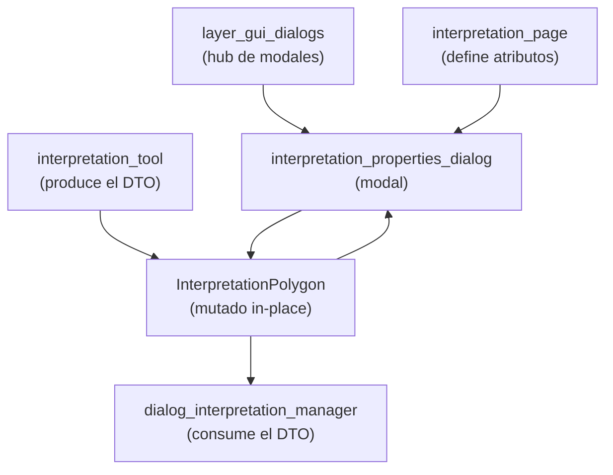

---
tags:
  - secinterp
  - code-walkthrough
  - layer
  - gui
aliases:
  - gui/dialogs/
  - diálogos modales
  - layer/gui/dialogs
cssclass: secinterp-note
---

# 💬 Capa GUI/Dialogs — diálogos modales

> [!abstract] Propósito
> Nota hub (MOC) del paquete `gui/dialogs/`: los diálogos modales del plugin.
> Hoy contiene el diálogo de propiedades de interpretación —que edita nombre,
> tipo, color y atributos de un polígono recién digitalizado mutando el DTO
> in-place— y enlaza como relacionados a su productor y su consumidor.

**Alcance**: `gui/dialogs/` — 1 diálogo modal + 2 notas relacionadas
**Capa**: GUI / Interacción (modal programático, sin `.ui`, sin fugas)
**Sub-hub de**: [[layer_gui]]
**Tags**: #secinterp #code-walkthrough #layer #gui

---

## 🧭 Mapa del sub-hub

> [!tip] Cómo leer
> El DTO nace en el map tool ([[layer_gui_tools]]), el modal lo edita
> **in-place** (sin copias ni retornos) y el manager lo persiste. La página
> de interpretación aporta los atributos personalizados que el diálogo ofrece.
> Es el único punto síncrono del flujo: todo lo demás es async o diferido.

---

## 📦 Miembros

| Nota | Fuente | Rol |
|---|---|---|
| [[interpretation_properties_dialog]] | `gui/dialogs/interpretation_properties_dialog.py` (149 líneas) | Modal que edita nombre, tipo, color y atributos mutando el DTO in-place |

---

## 🧷 Notas relacionadas (productor y consumidor)

| Nota | Rol en el flujo |
|---|---|
| [[dialog_interpretation_manager]] | Orquesta el flujo completo: herencia → este diálogo → añadir → persistir → refrescar |
| [[interpretation_page]] | Define origen de almacén y atributos personalizados que el diálogo edita |

---

## 👀 El flujo completo del polígono

### Digitalizar → [[interpretation_tool]]

El usuario digitaliza vértices sobre el canvas del perfil con snapping y
rubber band. Al finalizar, la herramienta emite un `InterpretationPolygon`
del dominio con geometría y atributos heredados pendientes (ver
[[layer_gui_tools]] y [[interpretation_inheritance_mixin]] en [[layer_gui]]).

### Editar → [[interpretation_properties_dialog]]

El manager abre este modal **antes** de añadir el polígono: nombre, tipo,
color y atributos personalizados (los que define [[interpretation_page]]).
El diálogo muta el DTO in-place y al cerrar desconecta sus señales para no
dejar fugas — no devuelve nada, no copia nada.

### Persistir → [[dialog_interpretation_manager]]

De vuelta en el manager: el polígono editado se añade a la colección, se
persiste (JSON del proyecto o capa externa vía
[[interpretation_persistence_mixin]]) y se refresca el preview. Si el usuario
cancela el modal, el polígono se descarta sin efectos laterales.

---

## 🔄 Flujo de datos

| Fase | Quién | Entrada → Salida |
|---|---|---|
| Digitalizar | `interpretation_tool` ([[layer_gui_tools]]) | gesto → `InterpretationPolygon` |
| Heredar | `interpretation_inheritance_mixin` | segmento/intervalo cercano → atributos |
| Editar | [[interpretation_properties_dialog]] | DTO → DTO mutado (o descarte al cancelar) |
| Persistir | [[dialog_interpretation_manager]] | DTO → JSON del proyecto / capa externa |
| Refrescar | preview ([[layer_gui]]) | colección → canvas actualizado |

El modal es el único punto síncrono del flujo: todo lo demás (extracción,
tareas, render) es async o diferido. Por eso vive en su propio paquete:
marca la frontera entre captura interactiva y persistencia.

---

## 🏛️ Patrones de diseño presentes

| Patrón | Dónde | Propósito |
|---|---|---|
| **Modal editor** | [[interpretation_properties_dialog]] | Edición bloqueante antes de confirmar |
| **Mutación in-place** | DTO compartido | Sin copias ni valores de retorno |
| **Desconexión al cerrar** | señales del diálogo | Cero fugas en aperturas repetidas |
| **Coordinador** | [[dialog_interpretation_manager]] | El diálogo no persiste; el manager sí |

---

## ➕ Cómo añadir un modal nuevo

Para un segundo diálogo del paquete sin romper el esquema:

1. Construirlo programático (sin `.ui`), como [[interpretation_properties_dialog]].
2. Recibir el DTO y mutarlo in-place; nada de retornos complejos.
3. Desconectar señales al cerrar para evitar fugas acumuladas.
4. Dejar la persistencia al manager coordinador, nunca al modal.
5. Registrar el hub aquí como nuevo miembro de la tabla.

---

## 🔗 Notas relacionadas

- [[Index]] — índice de la bóveda
- [[layer_gui]] — hub padre de toda la capa GUI
- [[interpretation_properties_dialog]] — el modal de propiedades
- [[dialog_interpretation_manager]] — coordinador del flujo
- [[interpretation_page]] — atributos personalizados editables
- [[layer_gui_tools]] — el map tool que produce el DTO
- [[interpretation_inheritance_mixin]] — herencia previa al diálogo
- [[interpretation_persistence_mixin]] — persistencia posterior al diálogo

---

*Nota de la bóveda SecInterp Code Walkthrough v2 — v3.9.0*
