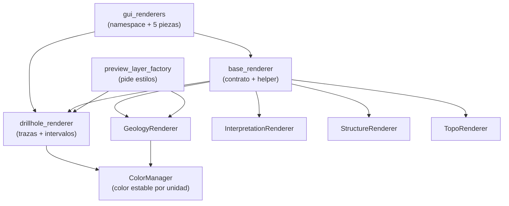

---
tags:
  - secinterp
  - code-walkthrough
  - layer
  - gui
aliases:
  - gui/renderers/
  - renderers del preview
  - layer/gui/renderers
cssclass: secinterp-note
---

# 🎨 Capa GUI/Renderers — simbología del preview

> [!abstract] Propósito
> Nota hub (MOC) del paquete `gui/renderers/`: el **lado Present** de la
> arquitectura. Sus renderers aplican simbología QGIS sobre capas de memoria
> ya extraídas (trazas de sondaje, tramos litológicos, geología, estructuras,
> topografía) sin tocar nunca la fase Extract ni el core.

**Alcance**: `gui/renderers/` — namespace + piezas Present (4 notas con nota propia)
**Capa**: GUI / Present (solo `qgis.core` de simbología, sin lógica geológica)
**Sub-hub de**: [[layer_gui]]
**Tags**: #secinterp #code-walkthrough #layer #gui

---

## 🧭 Mapa del sub-hub

> [!tip] Cómo leer
> `base_renderer` es la **base polimórfica**: todo renderer hereda
> `apply_style()`. `preview_layer_factory` (documentada en [[layer_gui]])
> consume estos estilos al construir las capas de memoria. `ColorManager`
> garantiza que una misma unidad geológica siempre pinte del mismo color.

---

## 📦 Miembros

| Nota | Fuente | Rol |
|---|---|---|
| [[gui_renderers]] | `gui/renderers/` (6 archivos, 170 líneas) | Namespace + las cinco piezas Present con `ColorManager` |
| [[base_renderer]] | `gui/renderers/base_renderer.py` (60 líneas) | Contrato `apply_style()` + helper de líneas categorizadas |
| [[drillhole_renderer]] | `gui/renderers/drillhole_renderer.py` (71 líneas) | Trazas grises etiquetadas + intervalos categorizados por unidad |
| [[topo_renderer]] | `gui/renderers/topo_renderer.py` (71 líneas) | Perfil topográfico: gradiente (rampa) o color único |

---

## 👀 Recorrido por miembros

### [[gui_renderers]] — el namespace y sus cinco piezas

El `__init__.py` está vacío (0 líneas): el paquete es puro agrupador. La nota
documenta el conjunto — `ColorManager` (color estable por unidad geológica),
`GeologyRenderer`, `InterpretationRenderer`, `StructureRenderer` y
`TopoRenderer` — que aplican simbología QGIS sobre capas ya extraídas. De
esas piezas, `base_renderer` y `drillhole_renderer` tienen nota propia (son
los miembros de este hub); el resto se describe dentro de la nota de grupo.

### [[base_renderer]] — el contrato polimórfico

Define `BasePreviewRenderer.apply_style()` y el helper
`build_categorized_line_style()`: la base sobre la que los cinco renderers
aplican simbología sin duplicar código. Es el único acoplamiento permitido
hacia `qgis.core` de estilos (`QgsCategorizedSymbolRenderer`,
`QgsLineSymbol`): un cambio de API de simbología se absorbe aquí una sola vez.

### [[drillhole_renderer]] — doble rol en el pozo

Pinta las trazas de sondaje como líneas grises finas etiquetadas con
`hole_id` y los tramos litológicos categorizados por unidad con los colores
estables de `ColorManager`. Es el renderer con más lógica visual del paquete
porque combina dos simbologías distintas sobre el mismo pozo.

---

## 🔄 Flujo de datos

| Fase | Quién | Entrada → Salida |
|---|---|---|
| Construir | `preview_layer_factory` ([[layer_gui]]) | rama del `PreviewResult` → capa de memoria |
| Estilizar | renderer concreto (`apply_style()`) | capa + colores de `ColorManager` → simbología aplicada |
| Registrar | [[preview_renderer]] | capas con estilo → proyecto (sin leyenda) + canvas |

Los renderers nunca leen capas del proyecto ni consultan el core: reciben la
capa de memoria ya construida y solo le aplican símbolos y etiquetas. Por eso
son **puros Present** y se prueban con capas sintéticas.

---

## 🏛️ Patrones de diseño presentes

| Patrón | Dónde | Propósito |
|---|---|---|
| **Template Method** | [[base_renderer]] (`apply_style`) | Esqueleto común, detalle por renderer |
| **Helper / Builder** | `build_categorized_line_style()` | Construir simbología categorizada sin repetir |
| **Registry de color** | `ColorManager` | Estabilidad visual entre sesiones y ramas |

---

## ➕ Cómo añadir un renderer nuevo

Para cubrir una rama nueva del `PreviewResult` sin romper lo existente:

1. Heredar de `BasePreviewRenderer` ([[base_renderer]]) e implementar `apply_style()`.
2. Reutilizar `build_categorized_line_style()` si la simbología es por categorías.
3. Pedir los colores a `ColorManager` en lugar de hardcodear RGB.
4. Registrar el renderer en la factoría (`preview_layer_factory`, ver [[layer_gui]]).
5. Probar con una capa de memoria sintética: los renderers no necesitan proyecto.

> [!warning] Regla de la capa
> Un renderer jamás lee `QgsProject` ni llama al core: recibe la capa ya
> construida y devuelve la misma capa con estilo. Si necesitas datos nuevos,
> van en la factoría o en un extractor de [[layer_gui_adapters]], no aquí.

---

## 🔗 Notas relacionadas

- [[Index]] — índice de la bóveda
- [[layer_gui]] — hub padre de toda la capa GUI
- [[gui_renderers]] — nota del paquete y sus cinco piezas
- [[base_renderer]] — contrato base de estilos
- [[drillhole_renderer]] — estilos de sondajes
- [[preview_renderer]] — consumidor que vuelca las capas al canvas
- [[preview_layer_factory]] — factoría que pide estos estilos

---

*Nota de la bóveda SecInterp Code Walkthrough v2 — v3.9.0*
