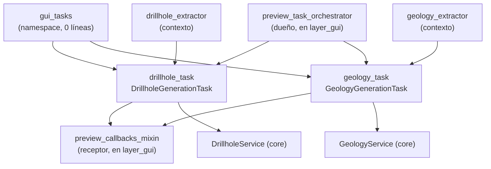

---
tags:
  - secinterp
  - code-walkthrough
  - layer
  - gui
aliases:
  - gui/tasks/
  - tareas QgsTask
  - layer/gui/tasks
cssclass: secinterp-note
---

# ⚙️ Capa GUI/Tasks — generación en segundo plano

> [!abstract] Propósito
> Nota hub (MOC) del paquete `gui/tasks/`: las dos tareas `QgsTask` que
> ejecutan los servicios puros del core en hilos de fondo recibiendo solo
> DTOs desacoplados y devolviendo resultados por señal al hilo principal, sin
> tocar jamás objetos QGIS vivos en el worker.

**Alcance**: `gui/tasks/` — namespace + 2 tareas de fondo (3 notas)
**Capa**: GUI / Background (frontera de hilos: DTOs dentro, señales fuera)
**Sub-hub de**: [[layer_gui]]
**Tags**: #secinterp #code-walkthrough #layer #gui

---

## 🧭 Mapa del sub-hub

> [!tip] Cómo leer
> El orquestador ([[preview_task_orchestrator]], en [[layer_gui]]) extrae los
> contextos en el hilo principal y lanza cada tarea; la tarea ejecuta el
> servicio del core en fondo y emite el resultado; los callbacks
> ([[preview_callbacks_mixin]]) lo recogen y re-renderizan. Las tareas son el
> puente thread-safe entre ambos.

---

## 📦 Miembros

| Nota | Fuente | Rol |
|---|---|---|
| [[gui_tasks]] | `gui/tasks/` (namespace, 0 líneas) | Agrupa las dos tareas de fondo con nota propia |
| [[drillhole_task]] | `gui/tasks/drillhole_task.py` (107 líneas) | Proyecta sondajes en fondo con `DrillholeContext` + servicio |
| [[geology_task]] | `gui/tasks/geology_task.py` (101 líneas) | Construye segmentos geológicos en fondo con `GeologyContext` |

---

## 👀 Recorrido por miembros

### [[gui_tasks]] — el namespace vacío

Su `__init__.py` tiene 0 líneas: el paquete existe solo para agrupar. La nota
documenta el rol del conjunto — ejecutar los servicios puros del core en
hilos `QgsTask` recibiendo solo DTOs desacoplados y devolviendo resultados
por señal — y enlaza a las dos tareas hermanas con nota propia.

### [[drillhole_task]] — sondajes en fondo

`QgsTask` cancelable que proyecta sondajes con DTOs desconectados
(`DrillholeContext` + `DrillholeService`), emite resultados diferidos al hilo
principal y nunca toca objetos QGIS vivos en el worker. El contexto se
extrae antes de lanzar la tarea, en el hilo principal, vía
[[drillhole_extractor]].

### [[geology_task]] — geología en fondo

`QgsTask` cancelable que construye segmentos geológicos
(`GeologyContext` + `GeologyService.build_segments()`), con entrega diferida
al hilo principal y worker libre de objetos QGIS vivos. Simétrica a la de
sondajes: mismo ciclo extraer → lanzar → emitir → recoger.

---

## 🔄 Flujo de datos

| Fase | Quién | Entrada → Salida |
|---|---|---|
| Extraer (hilo principal) | extractores de [[layer_gui_adapters]] | capas QGIS → contexto desacoplado |
| Lanzar | [[preview_task_orchestrator]] | contexto + servicio → `QgsTask` en marcha |
| Computar (fondo) | [[drillhole_task]] / [[geology_task]] | contexto → resultado puro (+ `feedback`) |
| Recoger (hilo principal) | [[preview_callbacks_mixin]] | señal → caché + re-render + informe |

La cancelación es cooperativa: el servicio consulta `feedback.isCanceled()`
y la tarea emite resultados parciales. El orquestador ancla las tareas para
que Qt6 no las recoja antes de terminar (ver [[preview_task_orchestrator]]).

---

## 🏛️ Patrones de diseño presentes

| Patrón | Dónde | Propósito |
|---|---|---|
| **Background Task** | [[drillhole_task]], [[geology_task]] | No bloquear la UI en cómputos largos |
| **DTO de frontera** | contextos de [[layer_gui_adapters]] | Cruzar hilos sin objetos QGIS vivos |
| **Señal diferida** | emisión al hilo principal | Entrega thread-safe de resultados |
| **Cancelación cooperativa** | `feedback` | Abortar sin excepciones de control de flujo |

---

## ➕ Cómo añadir una tarea nueva

Para llevar otro servicio del core al fondo sin romper el esquema:

1. Extraer el contexto desacoplado en el hilo principal (nuevo extractor o existente).
2. Crear el `QgsTask` siguiendo el molde de [[geology_task]]: DTOs dentro, señales fuera.
3. Registrar lanzamiento y anclaje en [[preview_task_orchestrator]].
4. Recoger el resultado en [[preview_callbacks_mixin]] (caché + re-render).

> [!warning] Regla de hilos
> El worker jamás toca `QgsVectorLayer`, canvas ni widgets: solo el contexto
> y el servicio puro. Todo acceso a QGIS vive antes del `run()` (extracción)
> o después, en el slot de la señal (presentación).

---

## 🔗 Notas relacionadas

- [[Index]] — índice de la bóveda
- [[layer_gui]] — hub padre de toda la capa GUI
- [[layer_gui_adapters]] — extractores que producen los contextos
- [[gui_tasks]] — nota del namespace del paquete
- [[drillhole_task]] — tarea de sondajes
- [[geology_task]] — tarea de geología
- [[preview_task_orchestrator]] — dueño que lanza y ancla las tareas
- [[preview_callbacks_mixin]] — receptor que cachea y re-renderiza

---

*Nota de la bóveda SecInterp Code Walkthrough v2 — v3.9.1*
