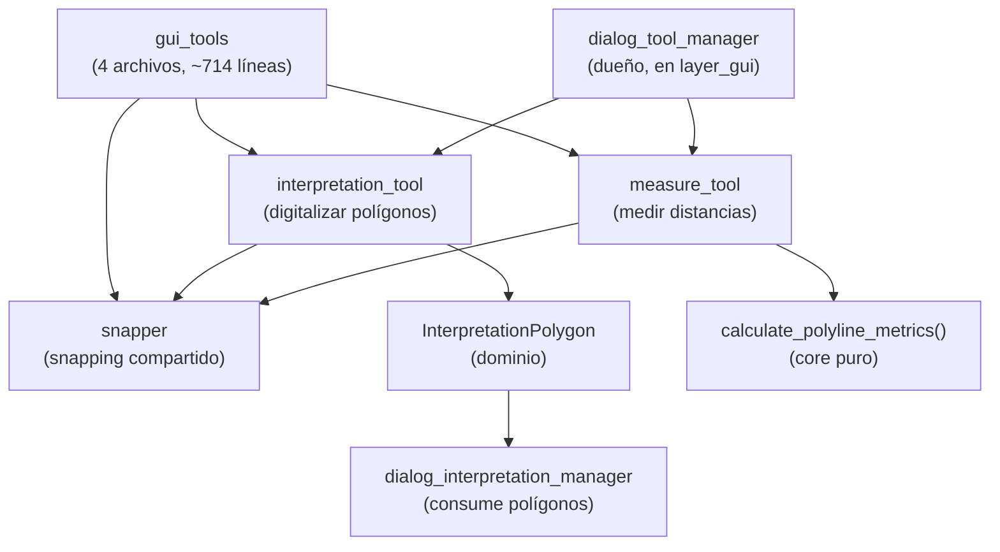

---
tags:
  - secinterp
  - code-walkthrough
  - layer
  - gui
aliases:
  - gui/tools/
  - map tools del perfil
  - layer/gui/tools
cssclass: secinterp-note
---

# 🧰 Capa GUI/Tools — map tools del canvas de perfil

> [!abstract] Propósito
> Nota hub (MOC) del paquete `gui/tools/`: las herramientas interactivas
> `QgsMapTool` de la vista de perfil — digitalización de polígonos de
> interpretación, medición de distancias y el ayudante compartido de snapping —
> sin lógica geológica, solo interacción con el canvas.

**Alcance**: `gui/tools/` — paquete + 3 herramientas (4 notas)
**Capa**: GUI / Interacción (canvas del preview, sin fase Extract ni core)
**Sub-hub de**: [[layer_gui]]
**Tags**: #secinterp #code-walkthrough #layer #gui

---

## 🧭 Mapa del sub-hub

> [!tip] Cómo leer
> `snapper` es el **ayudante compartido**: ambas herramientas lo usan para
> imantar el ratón. `interpretation_tool` emite un DTO del dominio que consume
> [[dialog_interpretation_manager]]; `measure_tool` delega las métricas a una
> función pura del core. El dueño de ambas es [[dialog_tool_manager]].

---

## 📦 Miembros

| Nota | Fuente | Rol |
|---|---|---|
| [[gui_tools]] | `gui/tools/` (4 archivos, ~714 líneas) | Herramientas `QgsMapTool` de la vista de perfil, sin lógica geológica |
| [[interpretation_tool]] | `gui/tools/interpretation_tool.py` (269 líneas) | Digitaliza polígonos y emite un `InterpretationPolygon` del dominio |
| [[measure_tool]] | `gui/tools/measure_tool.py` (330 líneas) | Polilínea multipunto con métricas del core puro |
| [[snapper]] | `gui/tools/snapper.py` (112 líneas) | Píxeles → `QgsPointXY` imantado (12 px, caché de `QgsPointLocator`) |

---

## 👀 Recorrido por miembros

### [[gui_tools]] — el paquete de interacción

Documenta el conjunto de cuatro archivos (~714 líneas): dibujo de polígonos
de interpretación, medición de distancias y el ayudante de snapping. Su
contrato implícito es "solo interacción con el canvas": ninguna herramienta
calcula geología, solo captura gestos y los convierte en datos.

### [[interpretation_tool]] — digitalizar y emitir

Map tool interactivo (`QgsMapToolEmitPoint`) para digitalizar polígonos sobre
el canvas del perfil: vértices con snapping (vía [[snapper]]), rubber band de
previsualización y emisión de un `InterpretationPolygon` del dominio al
finalizar. Ese DTO es lo que [[dialog_interpretation_manager]] hereda,
persiste y refresca.

### [[measure_tool]] — medir con el core puro

Map tool multipunto: polilínea con snapping, métricas calculadas por la
función pura del core `calculate_polyline_metrics()` y ciclo de vida con
medición finalizada persistente. Ejemplo de manual de la frontera GUI/core:
la herramienta captura puntos, el core calcula.

### [[snapper]] — el imán compartido

Helper sin estado geológico: convierte píxeles del ratón en `QgsPointXY`
imantados al vértice o arista más cercanos (tolerancia 12 px) con caché de
`QgsPointLocator` por capa. Evita que cada tool reinvente el snapping y
mantiene la tolerancia en un único punto de ajuste.

---

## 🔄 Flujo de datos

| Fase | Quién | Entrada → Salida |
|---|---|---|
| Activar | [[dialog_tool_manager]] | conmutación exclusiva pan / medir / interpretar |
| Capturar | [[interpretation_tool]] / [[measure_tool]] | clics + [[snapper]] → vértices imantados |
| Previsualizar | rubber band | vértices → geometría temporal en el canvas |
| Finalizar | `interpretation_tool` → DTO / `measure_tool` → métricas | gesto → `InterpretationPolygon` o medición persistente |
| Consumir | [[dialog_interpretation_manager]] | DTO → herencia, propiedades, persistencia |

Las herramientas viven y mueren con el canvas del preview: al desactivarse
limpian su rubber band y liberan el tool anterior, ciclo que orquesta
[[dialog_tool_manager]] con conexión idempotente de señales.

---

## 🏛️ Patrones de diseño presentes

| Patrón | Dónde | Propósito |
|---|---|---|
| **MapTool (QGIS)** | [[interpretation_tool]], [[measure_tool]] | Interacción nativa con el canvas |
| **Helper compartido** | [[snapper]] | Snapping único para todos los tools |
| **DTO de salida** | `InterpretationPolygon` | Desacoplar el gesto de su consumo |
| **Función pura delegada** | `calculate_polyline_metrics()` | Métricas testeables sin QGIS |

---

## 🧪 Testabilidad

Los tools se prueban en dos niveles: [[snapper]] con lienzos sintéticos
(tolerancia y caché de localizadores sin proyecto real) y los map tools con
clics simulados que verifican el DTO emitido o la métrica calculada. La
lógica geológica nunca vive aquí, así que ningún test necesita el core:
basta con QGIS mockeado (ver `tests/base_test.py`).

---

## 🔗 Notas relacionadas

- [[Index]] — índice de la bóveda
- [[layer_gui]] — hub padre de toda la capa GUI
- [[gui_tools]] — nota del paquete de herramientas
- [[interpretation_tool]] — digitalización de polígonos
- [[measure_tool]] — medición de distancias
- [[snapper]] — snapping compartido
- [[dialog_tool_manager]] — dueño con conmutación exclusiva
- [[dialog_interpretation_manager]] — consumidor de los polígonos
- [[layer_gui_dialogs]] — diálogo de propiedades tras digitalizar

---

*Nota de la bóveda SecInterp Code Walkthrough v2 — v3.9.0*
