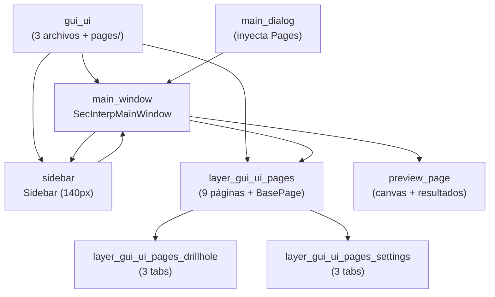

---
tags:
  - secinterp
  - code-walkthrough
  - layer
  - gui
aliases:
  - gui/ui/
  - ventana principal
  - layer/gui/ui
cssclass: secinterp-note
---

# 🪟 Capa GUI/UI — ventana principal y páginas

> [!abstract] Propósito
> Nota hub (MOC) del paquete `gui/ui/`: el ensamblaje programático de la
> ventana principal — `SecInterpMainWindow` (diálogo con `QSplitter` +
> `QStackedWidget`) y `Sidebar` (navegación por lista) — sobre las páginas de
> configuración de `pages/` (documentadas en su propio sub-hub).

**Alcance**: `gui/ui/` — ventana + sidebar + paquete `pages/` (3 notas + 1 sub-hub)
**Capa**: GUI / Presentación (todo programático, sin archivos `.ui`)
**Sub-hub de**: [[layer_gui]]
**Tags**: #secinterp #code-walkthrough #layer #gui

---

## 🧭 Mapa del sub-hub

> [!tip] Cómo leer
> `main_window` ensambla tres paneles (sidebar, páginas apiladas, preview) en
> un `QSplitter`; `sidebar` convierte filas en índices de página. Las páginas
> cuelgan del sub-hub [[layer_gui_ui_pages]], y [[main_dialog]] inyecta el
> contenedor `Pages` con todas ellas a los managers.

---

## 📦 Miembros

| Nota | Fuente | Rol |
|---|---|---|
| [[gui_ui]] | `gui/ui/` (3 archivos + `pages/`, ~228 líneas) | Ensamblaje programático: ventana + sidebar sobre `pages/` |
| [[main_window]] | `gui/ui/main_window.py` (158 líneas) | `QDialog` con `QSplitter` de tres paneles y hoja premium |
| [[sidebar]] | `gui/ui/sidebar.py` (63 líneas) | `QListWidget` de 140px que convierte filas en índices de página |

---

## 🗂️ Sub-hub dependiente

| Hub | Paquete | Rol |
|---|---|---|
| [[layer_gui_ui_pages]] | `gui/ui/pages/` | Las 9 páginas + protocolo `BasePage`, con 2 sub-hubs de tabs |

---

## 👀 Recorrido por miembros

### [[gui_ui]] — el paquete de ensamblaje

Documenta el conjunto (3 archivos + subpaquete `pages/`): la ventana
programática `SecInterpMainWindow` y la navegación `Sidebar` sobre las
páginas. Su valor es arquitectónico: separa el **marco** (ventana, splitter,
navegación) del **contenido** (páginas), de modo que añadir una página no
toca el marco.

### [[main_window]] — tres paneles, cero `.ui`

`SecInterpMainWindow`: el `QDialog` programático que ensambla sidebar, siete
páginas apiladas y preview en un `QSplitter` de tres paneles, con hoja de
estilo premium y navegación por `currentRowChanged`. Todo el layout se
construye en código (estándar `ui-framework` del proyecto), sin Qt Designer.

### [[sidebar]] — filas que son índices

`Sidebar`: un `QListWidget` de 140px con estética de diálogo de opciones de
QGIS que convierte filas en índices de página para el `QStackedWidget` de la
ventana principal. Es deliberadamente tonto: no conoce páginas, solo enteros.

---

## 🔄 Flujo de datos

| Fase | Quién | Entrada → Salida |
|---|---|---|
| Ensamblar | [[main_window]] | sidebar + páginas + preview → `QSplitter` visible |
| Navegar | [[sidebar]] | `currentRowChanged(fila)` → índice del `QStackedWidget` |
| Leer | páginas ([[layer_gui_ui_pages]]) | widgets → `get_data()` por página |
| Agregar | [[dialog_input_manager]] | `Pages` inyectado → `ValidationParams` |
| Persistir | protocolo `dump`/`load`/`reset` | estado ↔ proyecto QGIS + `ConfigService` |

La ventana nunca lee valores directamente: expone el contenedor `Pages` y
deja que [[dialog_input_manager]] agregue y [[dialog_settings_persistence]]
persista. El marco no conoce el dominio.

---

## 🏛️ Patrones de diseño presentes

| Patrón | Dónde | Propósito |
|---|---|---|
| **Composite programático** | [[main_window]] | Ensamblar marco + contenido en código |
| **Navegación por índice** | [[sidebar]] → `QStackedWidget` | Desacoplar la lista de las páginas |
| **Inyección de Pages** | `dialog_dependencies.py` (ver [[gui]]) | Managers reciben solo lo que necesitan |
| **Protocolo de página** | `BasePage` (ver [[layer_gui_ui_pages]]) | `get_data/dump/load/reset/validate` uniforme |

---

## ➕ Cómo añadir una página

Para una octava página sin tocar el marco:

1. Crear la página implementando el protocolo [[base_page]].
2. Registrarla en el `QStackedWidget` de [[main_window]] con su entrada de menú.
3. Añadir la fila correspondiente en [[sidebar]] (mismo orden, mismo índice).
4. Exponerla en el contenedor `Pages` para [[dialog_input_manager]].
5. Documentarla como miembro de [[layer_gui_ui_pages]].

---

## 🔗 Notas relacionadas

- [[Index]] — índice de la bóveda
- [[layer_gui]] — hub padre de toda la capa GUI
- [[layer_gui_ui_pages]] — las 9 páginas de configuración
- [[layer_gui_ui_pages_drillhole]] — tabs de sondajes
- [[layer_gui_ui_pages_settings]] — tabs de ajustes
- [[gui_ui]] — nota del paquete `gui/ui/`
- [[main_window]] — ensamblaje de la ventana
- [[sidebar]] — navegación por lista
- [[main_dialog]] — raíz que inyecta `Pages` a los managers

---

*Nota de la bóveda SecInterp Code Walkthrough v2 — v3.9.0*
