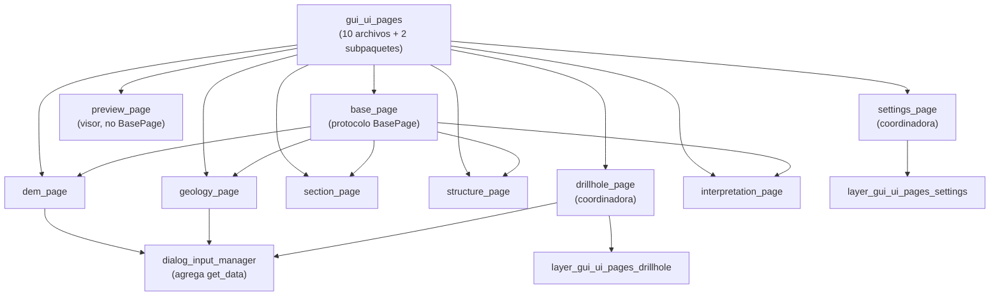

---
tags:
  - secinterp
  - code-walkthrough
  - layer
  - gui
aliases:
  - gui/ui/pages/
  - páginas de configuración
  - layer/gui/ui/pages
cssclass: secinterp-note
---

# 📄 Capa GUI/UI/Pages — páginas de configuración

> [!abstract] Propósito
> Nota hub (MOC) del paquete `gui/ui/pages/`: el registro-namespace de las
> páginas de configuración programáticas y hogar del protocolo compartido
> `BasePage` (`get_data` / `dump` / `load` / `reset` / `validate` + señales)
> que todas las páginas implementan para lectura, persistencia y validación.

**Alcance**: `gui/ui/pages/` — namespace + 9 páginas (~1346 líneas, 10 notas)
**Capa**: GUI / Presentación (widgets programáticos, protocolo `BasePage`)
**Sub-hub de**: [[layer_gui_ui]] · **Sub-hubs**: drillhole + settings
**Tags**: #secinterp #code-walkthrough #layer #gui

---

## 🧭 Mapa del sub-hub

> [!tip] Cómo leer
> `base_page` es el **contrato**: toda página (salvo el visor `preview_page`)
> implementa el mismo esqueleto. Las coordinadoras (`drillhole_page`,
> `settings_page`) agregan tabs de sus sub-hubs. [[dialog_input_manager]]
> solo invoca `get_data()` / `validate()`: nunca toca widgets.

---

## 📦 Miembros

| Nota | Fuente | Rol |
|---|---|---|
| [[gui_ui_pages]] | `gui/ui/pages/` (10 archivos, ~1346 líneas) | Registro-namespace + hogar del protocolo `BasePage` |
| [[base_page]] | `gui/ui/pages/base_page.py` (105 líneas) | Esqueleto `get_data/dump/load/reset/validate/connect/disconnect` |
| [[dem_page]] | `gui/ui/pages/dem_page.py` (271 líneas) | Ráster DEM: capa, banda, resolución y exageración vertical |
| [[drillhole_page]] | `gui/ui/pages/drillhole_page.py` (130 líneas) | Coordinadora: `QTabWidget` Collars/Survey/Intervals hacia el diálogo |
| [[geology_page]] | `gui/ui/pages/geology_page.py` (120 líneas) | Afloramientos: capa poligonal + campo de unidad + `dataChanged` |
| [[interpretation_page]] | `gui/ui/pages/interpretation_page.py` (230 líneas) | Almacén JSON/capa, atributos personalizados y herencia automática |
| [[preview_page]] | `gui/ui/pages/preview_page.py` (262 líneas) | Visor: `QgsMapCanvas` + controles colapsables + área de resultados |
| [[section_page]] | `gui/ui/pages/section_page.py` (117 líneas) | Línea de sección: capa lineal + testigo + buffer de estructuras |
| [[settings_page]] | `gui/ui/pages/settings_page.py` (124 líneas) | Coordinadora: tabs Default/Advanced/Info vía `QgsSettings` |
| [[structure_page]] | `gui/ui/pages/structure_page.py` (166 líneas) | Mediciones: capa de puntos + buzamiento/rumbo + escala |

---

## 🗂️ Sub-hubs dependientes

| Hub | Paquete | Rol |
|---|---|---|
| [[layer_gui_ui_pages_drillhole]] | `gui/ui/pages/drillhole/` | Los 3 formularios agregados por `drillhole_page` |
| [[layer_gui_ui_pages_settings]] | `gui/ui/pages/settings/` | Los tabs agregados por `settings_page` (info_tab vive en la nota de grupo) |

---

## 🧩 Familias dentro del paquete

### Páginas de fuente de datos

[[section_page]], [[dem_page]], [[geology_page]] y [[structure_page]] siguen
el mismo molde: combo de capa con filtro moderno/clásico, refresco de campos
y señal `dataChanged` hacia el diálogo. [[section_page]] añade el buffer de
estructuras vecinas y un `validate` obligatorio; [[dem_page]] aporta la
exageración vertical manual o adaptativa.

### Coordinadoras con tabs

[[drillhole_page]] y [[settings_page]] no tienen widgets propios de dominio:
contienen un `QTabWidget` y fusionan lectura, persistencia, reseteo y señales
de sus tabs. Sus formularios viven en [[layer_gui_ui_pages_drillhole]] y
[[layer_gui_ui_pages_settings]] respectivamente.

### Interpretación y visor

[[interpretation_page]] concentra origen de almacenamiento, tabla de
atributos personalizados y herencia automática. [[preview_page]] es la
excepción del paquete: un `QWidget` directo (no `BasePage`) con `QgsMapCanvas`,
barra de estado, controles colapsables y área de texto para el informe de
[[preview_reporter]].

---

## 🔄 Flujo de datos

| Fase | Quién | Entrada → Salida |
|---|---|---|
| Editar | página concreta | widgets → estado interno + `dataChanged` |
| Leer | [[dialog_input_manager]] | `get_data()` de las seis páginas → diccionario plano |
| Validar | `validate()` + `ProjectValidator` | datos → `can_preview()` / `can_export()` |
| Persistir | `dump()` / `load()` / `reset()` | estado ↔ proyecto QGIS + `ConfigService` |
| Previsualizar | [[preview_page]] | `PreviewResult` → canvas + texto de resultados |

El protocolo [[base_page]] es la frontera: los managers solo invocan sus
métodos y señales, de modo que cambiar un widget nunca ripplea al diálogo.

---

## 🏛️ Patrones de diseño presentes

| Patrón | Dónde | Propósito |
|---|---|---|
| **Template / Protocolo** | [[base_page]] | Esqueleto uniforme para las 9 páginas |
| **Composite coordinador** | [[drillhole_page]], [[settings_page]] | Agregar tabs tras una sola interfaz |
| **Observer** | `dataChanged` por página | El diálogo reacciona sin sondear widgets |
| **Memento (triple)** | `dump`/`load` + persistencia | Estado portable proyecto ↔ global |

---

## 🔗 Notas relacionadas

- [[Index]] — índice de la bóveda
- [[layer_gui]] — hub raíz de la capa GUI
- [[layer_gui_ui]] — ventana y sidebar que contienen las páginas
- [[layer_gui_ui_pages_drillhole]] — tabs de sondajes
- [[layer_gui_ui_pages_settings]] — tabs de ajustes
- [[gui_ui_pages]] — nota del namespace del paquete
- [[base_page]] — contrato de todas las páginas
- [[dialog_input_manager]] — agregador vía `get_data()`
- [[dialog_settings_persistence]] — persistencia vía `dump()`/`load()`

---

*Nota de la bóveda SecInterp Code Walkthrough v2 — v3.9.0*
