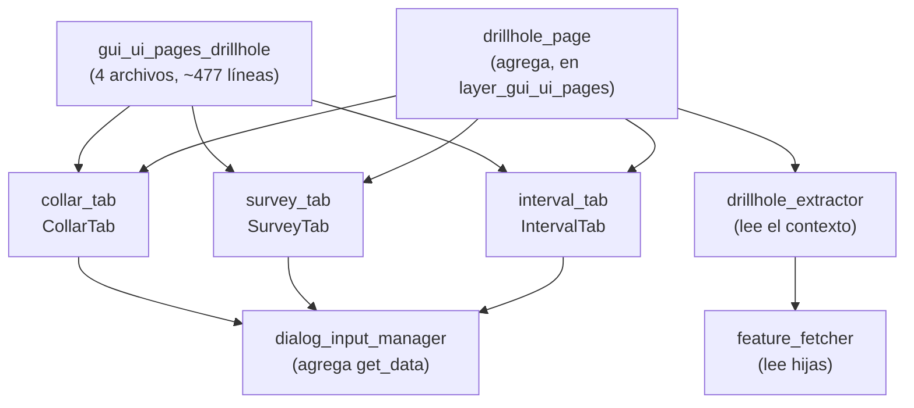

---
tags:
  - secinterp
  - code-walkthrough
  - layer
  - gui
aliases:
  - gui/ui/pages/drillhole/
  - tabs de sondajes
  - layer/gui/ui/pages/drillhole
cssclass: secinterp-note
---

# 🛢️ Capa Pages/Drillhole — tabs de collares, surveys e intervalos

> [!abstract] Propósito
> Nota hub (MOC) del paquete `gui/ui/pages/drillhole/`: los tres formularios
> de sondaje — `CollarTab` (boca de pozo), `SurveyTab` (desviaciones) e
> `IntervalTab` (tramos litológicos) — con mini-protocolo común
> (`get_data`/`dump`/`load`/`reset` + `dataChanged`) que `DrillholePage`
> agrega en un `QTabWidget`.

**Alcance**: `gui/ui/pages/drillhole/` — namespace + 3 tabs (~477 líneas, 4 notas)
**Capa**: GUI / Presentación (formularios de mapeo campo → `DrillholeContext`)
**Sub-hub de**: [[layer_gui_ui_pages]]
**Tags**: #secinterp #code-walkthrough #layer #gui

---

## 🧭 Mapa del sub-hub

> [!tip] Cómo leer
> Los tres tabs son **hermanos simétricos**: selector de capa + mapeo de
> campos + `dataChanged`. [[drillhole_page]] los apila sin conocer sus campos;
> [[drillhole_extractor]] (en [[layer_gui_adapters]]) lee las mismas capas
> para construir el `DrillholeContext` que viaja al core.

---

## 📦 Miembros

| Nota | Fuente | Rol |
|---|---|---|
| [[gui_ui_pages_drillhole]] | `gui/ui/pages/drillhole/` (4 archivos, ~477 líneas) | Namespace de los 3 formularios + mini-protocolo común |
| [[collar_tab]] | `gui/ui/pages/drillhole/collar_tab.py` (180 líneas) | Boca de pozo: capa de puntos + ID/X/Y/Z/profundidad + uso de geometría |
| [[interval_tab]] | `gui/ui/pages/drillhole/interval_tab.py` (144 líneas) | Tramos: capa tabular + ID/desde/hasta/litología |
| [[survey_tab]] | `gui/ui/pages/drillhole/survey_tab.py` (144 líneas) | Desviaciones: capa tabular + ID/profundidad/azimut/inclinación |

---

## 👀 Recorrido por miembros

### [[gui_ui_pages_drillhole]] — el namespace coordinado

Documenta el paquete de cuatro archivos (~477 líneas): los tres formularios
y su mini-protocolo común (`get_data`/`dump`/`load`/`reset` + `dataChanged`)
que `DrillholePage` agrega en un `QTabWidget`. Es el contrato que permite a la
coordinadora tratar los tres tabs de forma uniforme.

### [[collar_tab]] — dónde empieza cada pozo

Pestaña del collar: selector de capa de puntos más mapeo de campos (ID, X, Y,
Z, profundidad) con interruptor de uso de geometría. Es el tab con más
lógica porque la posición del collar admite dos fuentes: los atributos o la
geometría del punto.

### [[survey_tab]] — la trayectoria en profundidad

Pestaña de desviaciones: selector de capa tabular más mapeo de campos (ID,
profundidad, azimut, inclinación). Sin surveys el pozo es vertical; con ellos
el `DrillholeService` reconstruye la trayectoria 3D antes de proyectarla.

### [[interval_tab]] — qué atraviesa el pozo

Pestaña de intervalos: selector de capa tabular (puntos o sin geometría) más
mapeo (ID, desde, hasta, litología). Sus registros alimentan tanto la
proyección en sección como la herencia de atributos hacia interpretaciones
(ver [[interpretation_inheritance_mixin]] en [[layer_gui]]).

---

## 🔄 Flujo de datos

| Fase | Quién | Entrada → Salida |
|---|---|---|
| Mapear | cada tab | capa + campos → `get_data()` con nombres lógicos |
| Agregar | [[drillhole_page]] | 3 tabs → un dict de sondajes hacia el diálogo |
| Validar | `validate()` por tab | campos obligatorios → pozo completo / incompleto |
| Extraer | [[drillhole_extractor]] | mismas capas → `DrillholeContext` desacoplado |
| Persistir | `dump()` / `load()` | mapeos ↔ proyecto QGIS + `ConfigService` |

Los tabs nunca ven geometrías: solo guardan **referencias** (id de capa +
nombres de campo). La lectura real ocurre en la fase Extract, en el hilo
principal, justo antes de lanzar los `QgsTask` de [[layer_gui_tasks]].

---

## 🏛️ Patrones de diseño presentes

| Patrón | Dónde | Propósito |
|---|---|---|
| **Mini-protocolo** | `get_data/dump/load/reset` + `dataChanged` | Uniformidad de los 3 tabs |
| **Referencia, no dato** | mapeos capa + campo | Los tabs configuran; los extractores leen |
| **Coordinador tonto** | [[drillhole_page]] | Apilar sin conocer campos internos |

---

## 🛡️ Reglas de los tabs

> [!important] Los tabs configuran, no leen
> Un tab jamás abre la capa para leer features: guarda id de capa + nombres
> de campo y emite `dataChanged`. La lectura ocurre una sola vez en
> [[drillhole_extractor]], en el hilo principal, justo antes de lanzar los
> `QgsTask`. Violar esto duplicaría lecturas y rompería la frontera de hilos.

---

## 🔗 Notas relacionadas

- [[Index]] — índice de la bóveda
- [[layer_gui]] — hub raíz de la capa GUI
- [[layer_gui_ui_pages]] — paquete padre de páginas + `DrillholePage`
- [[gui_ui_pages_drillhole]] — nota del namespace de los tabs
- [[collar_tab]] / [[survey_tab]] / [[interval_tab]] — los tres formularios
- [[drillhole_extractor]] — extractor que lee estas mismas capas
- [[feature_fetcher]] — lector de las capas hijas survey/intervalos
- [[layer_gui_tasks]] — tareas que consumen el `DrillholeContext`

---

*Nota de la bóveda SecInterp Code Walkthrough v2 — v3.9.1*
