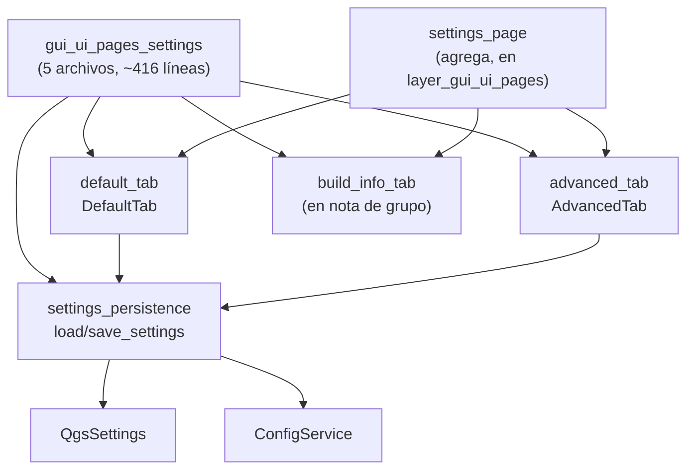

---
tags:
  - secinterp
  - code-walkthrough
  - layer
  - gui
aliases:
  - gui/ui/pages/settings/
  - tabs de ajustes
  - layer/gui/ui/pages/settings
cssclass: secinterp-note
---

# ⚙️ Capa Pages/Settings — tabs de ajustes y persistencia

> [!abstract] Propósito
> Nota hub (MOC) del paquete `gui/ui/pages/settings/`: los ajustes del plugin —
> `DefaultTab` (qué se exporta), `AdvancedTab` (toggles 3D), `build_info_tab`
> (metadatos de solo lectura) y `settings_persistence`
> (`load_settings`/`save_settings`) — que `SettingsPage` agrega en un
> `QTabWidget`.

**Alcance**: `gui/ui/pages/settings/` — namespace + 3 tabs + fachada (~416 líneas, 4 notas)
**Capa**: GUI / Presentación (preferencias vía `QgsSettings` + `ConfigService`)
**Sub-hub de**: [[layer_gui_ui_pages]]
**Tags**: #secinterp #code-walkthrough #layer #gui

---

## 🧭 Mapa del sub-hub

> [!tip] Cómo leer
> Los tabs son **tontos a propósito**: muestran widgets y emiten cambios, pero
> no conocen el almacenamiento. [[settings_persistence]] es la única fachada
> que habla con `QgsSettings` y `ConfigService`. `info_tab` no tiene nota
> propia: se documenta dentro de la nota de grupo [[gui_ui_pages_settings]].

---

## 📦 Miembros

| Nota | Fuente | Rol |
|---|---|---|
| [[gui_ui_pages_settings]] | `gui/ui/pages/settings/` (5 archivos, ~416 líneas) | Namespace + `build_info_tab`; `SettingsPage` lo agrega |
| [[advanced_tab]] | `gui/ui/pages/settings/advanced_tab.py` (106 líneas) | Toggles 3D (general, trazas, intervalos, coords reales/proyectadas) |
| [[default_tab]] | `gui/ui/pages/settings/default_tab.py` (178 líneas) | Qué generar al guardar (5 checks), formato, nombrado y reset |
| [[settings_persistence]] | `gui/ui/pages/settings/settings_persistence.py` (75 líneas) | `load_settings` hidrata; `save_settings` vuelca |

---

## 👀 Recorrido por miembros

### [[gui_ui_pages_settings]] — el namespace con info incluida

Documenta el paquete de cinco archivos (~416 líneas): `DefaultTab`,
`AdvancedTab`, `build_info_tab` (metadatos de solo lectura vía
`read_plugin_metadata`) y la fachada de persistencia. La pestaña de
información vive solo aquí —es una función constructora sin estado, no
merece nota propia— junto al contrato que `SettingsPage` consume.

### [[default_tab]] — qué sale al guardar

Pestaña por defecto: selección de qué datos generar al guardar (5 checkboxes),
formato vectorial, patrón de nombrado y botón de reset, con autoguardado vía
`ConfigService`. Es la superficie que más tocan los usuarios y la que define
el comportamiento del export de [[dialog_export_manager]].

### [[advanced_tab]] — interruptores 3D

Pestaña avanzada: interruptores de exportación 3D (activación general,
trazas, intervalos, coordenadas reales vs. proyectadas) que persisten vía
`ConfigService` y `QgsSettings`. Opciones de experto, aisladas para no
abrumar la pestaña por defecto.

### [[settings_persistence]] — la única que sabe almacenar

Fachada de persistencia: `load_settings` hidrata los tabs desde `QgsSettings`
y `save_settings` los vuelca vía `ConfigService`, sin que los widgets conozcan
el almacenamiento. Gracias a ella, los tabs se prueban sin QGIS instanciado.

---

## 🔄 Flujo de datos

| Fase | Quién | Entrada → Salida |
|---|---|---|
| Mostrar | [[default_tab]] / [[advanced_tab]] | valores persistidos → widgets |
| Cambiar | widgets + autoguardado | edición → `ConfigService` inmediato |
| Cargar | [[settings_persistence]] `load_settings` | `QgsSettings` → tabs hidratados |
| Guardar | [[settings_persistence]] `save_settings` | tabs → `ConfigService` + `QgsSettings` |
| Consumir | [[dialog_export_manager]] y exporters | ajustes → qué y cómo se exporta |

Doble almacén con roles distintos: `QgsSettings` guarda preferencias de la
aplicación (globales, sobreviven al proyecto) y `ConfigService` el estado
operativo; la fachada reconcilia ambos sin exponerlos a los tabs.

---

## 🏛️ Patrones de diseño presentes

| Patrón | Dónde | Propósito |
|---|---|---|
| **Facade de persistencia** | [[settings_persistence]] | Un solo punto que conoce el almacenamiento |
| **Widgets tontos** | [[default_tab]], [[advanced_tab]] | Mostrar y emitir, nunca almacenar |
| **Función constructora** | `build_info_tab` | Pestaña sin estado como función pura |
| **Autoguardado** | `ConfigService` en cambios | Preferencias que nunca se pierden |

---

## 🛡️ Reglas de los ajustes

> [!important] Un solo punto de almacenamiento
> Ningún widget toca `QgsSettings` directamente: todo pasa por
> [[settings_persistence]]. Así, cambiar de backend (por ejemplo, solo
> proyecto QGIS) exige editar un único módulo de 75 líneas en lugar de
> cazar accesos repartidos por los tabs.

---

## 🔗 Notas relacionadas

- [[Index]] — índice de la bóveda
- [[layer_gui]] — hub raíz de la capa GUI
- [[layer_gui_ui_pages]] — paquete padre de páginas + `SettingsPage`
- [[gui_ui_pages_settings]] — nota del namespace (incluye info_tab)
- [[advanced_tab]] / [[default_tab]] — los dos tabs con estado
- [[settings_persistence]] — fachada de carga/guardado
- [[dialog_export_manager]] — consumidor de estos ajustes al exportar
- [[dialog_settings_persistence]] — persistencia del diálogo completo

---

*Nota de la bóveda SecInterp Code Walkthrough v2 — v3.9.1*
