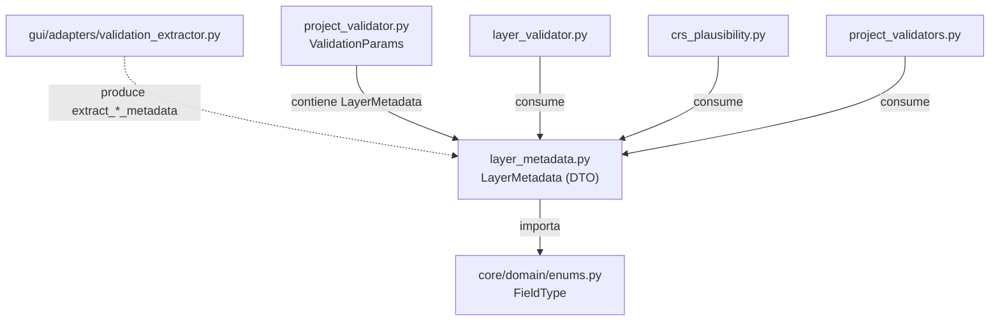
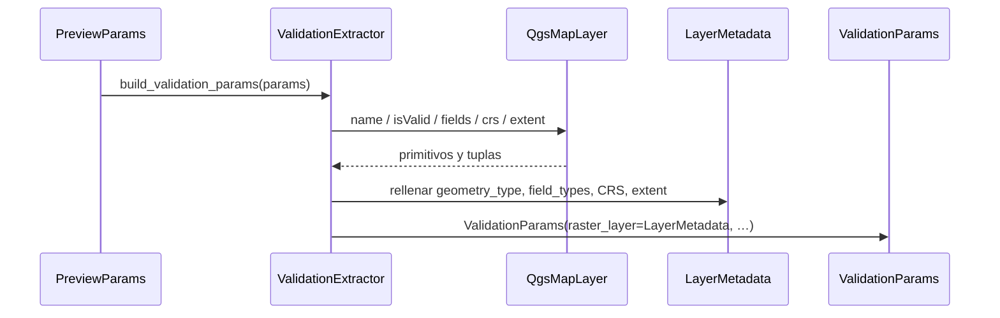

---
tags:
  - secinterp
  - code-walkthrough
  - core
  - validation
aliases:
  - layer_metadata.py
  - LayerMetadata
cssclass: secinterp-note
---

# `core/validation/layer_metadata.py`

> [!abstract] Resumen en una línea
> Define el **DTO de metadatos desacoplado de QGIS** (`LayerMetadata`): validez, tipo de capa, geometría, campos, CRS y extent como primitivos, para que los validadores del core nunca toquen objetos QGIS.

**Ruta**: `core/validation/layer_metadata.py` (61 líneas)
**Clase principal**: `LayerMetadata` (dataclass, 15 campos, 0 métodos)
**Capa**: Core (QGIS-agnóstico)
**Tags**: #secinterp #core #validation

---

## 🎯 ¿Por qué existe este archivo?

Los validadores del core (`ProjectValidator`, `layer_validator`, `crs_plausibility`)
necesitan saber si una capa existe, es vector o raster, tiene los campos correctos y
un CRS coherente. Pero el core **tiene prohibido importar `qgis.core`**. La solución es
un DTO de primitivos que la GUI rellena y el core consume:

| Problema | Solución |
|----------|----------|
| El core no puede recibir `QgsVectorLayer`/`QgsRasterLayer` | `LayerMetadata` guarda `kind`, `geometry_type`, campos… como `str`/`bool`/`float` |
| Validar "¿esta capa tiene features?" sin QGIS | `feature_count` / `band_count` como enteros |
| Detectar un CRS mal etiquetado sin leer coordenadas | `crs_authid`, `crs_is_geographic` + `extent_*` y `pixel_size_x` |
| Dos capas con CRS distintos | `crs_authid` de cada metadata |
| La existencia de campos debe validarse por nombre y tipo | `field_names` + `field_types` (`FieldType`) |

> [!important] Puente Extract-then-Compute
> Este módulo **no** extrae nada de QGIS: es solo el **contrato de datos** (DTO). Quien
> lo construye es el adapter GUI `ValidationExtractor` (`gui/adapters/validation_extractor.py`),
> que en la fase *Extract* lee el `QgsMapLayer` y rellena cada campo con primitivos.
> Así el core valida con datos planos y jamás ve un objeto QGIS.

---

## 🧬 Diagrama de relaciones



> [!tip] Cómo leer
> Sólida = importa; punteada = construye/consume. `layer_metadata.py` es el **eslabón
> central**: el único módulo del paquete de validación que importa el core y el único
> que la GUI produce.

---

## 📦 Imports — lectura arquitectónica

```python
# core/validation/layer_metadata.py
from __future__ import annotations

from dataclasses import dataclass, field

from sec_interp.core.domain import FieldType
```

| # | Observación |
|---|-------------|
| ① | `from __future__ import annotations` — anotaciones perezosas, obligatorio en el proyecto. |
| ② | `dataclass, field` — DTO de datos puros; `field` solo para `default_factory` de lista/dict. |
| ③ | Importa **solo** `FieldType` del dominio; **cero** imports de QGIS, cero Qt. |
| ④ | Tipo de retorno `list[str]` / `dict[str, FieldType]` usando sintaxis `X | None` (PEP 604). |

---

## 🏗️ Inventario de estructura

**Clase:** `class LayerMetadata` — 0 métodos (solo 15 campos con default).

**Constantes de geometría (str):** `GEOMETRY_POINT`, `GEOMETRY_LINE`, `GEOMETRY_POLYGON`, `GEOMETRY_UNKNOWN`
**Constantes de tipo de capa (str):** `KIND_VECTOR`, `KIND_RASTER`, `KIND_UNKNOWN`

```python
GEOMETRY_POINT = "point"
GEOMETRY_LINE = "line"
GEOMETRY_POLYGON = "polygon"
GEOMETRY_UNKNOWN = "unknown"

KIND_VECTOR = "vector"
KIND_RASTER = "raster"
KIND_UNKNOWN = "unknown"
```

| Constante | Valor | Significado |
|-----------|-------|-------------|
| `GEOMETRY_POINT` | `"point"` | Geom. puntual (p. ej. estructural) |
| `GEOMETRY_LINE` | `"line"` | Geom. lineal (sección) |
| `GEOMETRY_POLYGON` | `"polygon"` | Geom. poligonal (geología) |
| `GEOMETRY_UNKNOWN` | `"unknown"` | Geom. no resuelta |
| `KIND_VECTOR` | `"vector"` | Capa vectorial |
| `KIND_RASTER` | `"raster"` | Capa raster (DEM) |
| `KIND_UNKNOWN` | `"unknown"` | Tipo no reconocido |

> [!note] Centinelas, no `Enum`
> Ambos grupos son **cadenas planas** (no `Enum`). `GEOMETRY_UNKNOWN`/`KIND_UNKNOWN`
> actúan como *Null Object*: representan "no se pudo determinar" sin lanzar excepción.

---

## 📖 Recorrido campo por campo

### `LayerMetadata` — DTO de metadatos

```python
@dataclass
class LayerMetadata:
    """Detached metadata describing a QGIS layer for validation.

    Produced by the GUI ``ValidationExtractor`` adapter so that the core
    validators never touch QGIS objects directly.
    """

    name: str = ""
    is_valid: bool = False
    kind: str = KIND_UNKNOWN
    geometry_type: str | None = None
    field_names: list[str] = field(default_factory=list)
    field_types: dict[str, FieldType] = field(default_factory=dict)
    band_count: int = 0
    feature_count: int = 0
    crs_authid: str | None = None
    crs_is_geographic: bool | None = None
    extent_xmin: float | None = None
    extent_ymin: float | None = None
    extent_xmax: float | None = None
    extent_ymax: float | None = None
    pixel_size_x: float | None = None
```

Todos los campos tienen **default**, así que `LayerMetadata()` es siempre construible
(útil en tests y como "capa ausente" tipada). Los mutables usan `default_factory`
para no compartir la misma lista/dict entre instancias.

### Referencia completa de campos

| Campo | Tipo | Default | Rol | Consumido por |
|-------|------|---------|-----|---------------|
| `name` | `str` | `""` | Nombre de la capa (mensajes de error) | `layer_validator`, `crs_plausibility` |
| `is_valid` | `bool` | `False` | ¿Era válida al extraer? | todos los validadores |
| `kind` | `str` | `KIND_UNKNOWN` | `"vector"` / `"raster"` / `"unknown"` | `layer_validator`, `project_validators` |
| `geometry_type` | `str \| None` | `None` | `"point"` / `"line"` / `"polygon"` | `validate_layer_geometry` |
| `field_names` | `list[str]` | `[]` | Nombres de campos ordenados | `field_validator`, `layer_validator` |
| `field_types` | `dict[str, FieldType]` | `{}` | Campo → tipo de dominio | `validate_field_type` |
| `band_count` | `int` | `0` | Nº de bandas (raster) | `validate_raster_band` |
| `feature_count` | `int` | `0` | Nº de features (vector) | `validate_layer_has_features` |
| `crs_authid` | `str \| None` | `None` | ID de CRS (p. ej. `"EPSG:4326"`) | `validate_crs_compatibility` |
| `crs_is_geographic` | `bool \| None` | `None` | ¿CRS geográfico? (tri-estado) | `section_line_geometry_error`, `crs_plausibility` |
| `extent_xmin` | `float \| None` | `None` | Extremo mínimo X (unidades del CRS) | `crs_plausibility` |
| `extent_ymin` | `float \| None` | `None` | Extremo mínimo Y | `crs_plausibility` |
| `extent_xmax` | `float \| None` | `None` | Extremo máximo X | `crs_plausibility` |
| `extent_ymax` | `float \| None` | `None` | Extremo máximo Y | `crs_plausibility` |
| `pixel_size_x` | `float \| None` | `None` | Tamaño de píxel X (unidades del raster) | `crs_plausibility` |

> [!important] El tri-estado de `crs_is_geographic`
> No es un `bool` simple: `True`/`False` son la declaración del CRS y `None` significa
> **"no se pudo determinar"**. Los validadores lo usan como guarda: si es `None`, la
> heurística de plausibilidad queda en silencio (evita falsos positivos).

### `field_names` y `field_types`

```python
    field_names: list[str] = field(default_factory=list)
    field_types: dict[str, FieldType] = field(default_factory=dict)
```

`field_names` conserva el **orden** de la capa; `field_types` mapea cada nombre a un
`FieldType` del core, espejo numérico de `QVariant.Type`:

| `FieldType` | Valor | Uso típico |
|-------------|-------|------------|
| `NULL` | 0 | Tipo no reconocido (fallback) |
| `BOOL` | 1 | Booleanos |
| `INT` | 2 | Enteros |
| `LONG_LONG` | 4 | Enteros de 64 bits |
| `DOUBLE` | 6 | Reales (dip/strike) |
| `STRING` | 10 | Texto (litología) |
| `DATE` | 14 | Fechas |
| `DATE_TIME` | 16 | Fecha y hora |

Los validadores de estructura aceptan `[INT, DOUBLE, LONG_LONG, STRING]` para dip/strike,
de modo que el DTO permite comprobar tipos **sin** `PyQt`.

---

## 🔄 Flujo de datos

| Fase | Entrada | Transformación | Salida |
|------|---------|----------------|--------|
| Extract | `QgsVectorLayer` / `QgsRasterLayer` | `extract_vector_metadata` / `extract_raster_metadata` | `LayerMetadata` |
| Bridge | `PreviewParams` (refs QGIS) | `build_validation_params` | `ValidationParams` con `LayerMetadata` |
| Compute | `LayerMetadata` | `ProjectValidator` / `layer_validator` / `crs_plausibility` | errores y warnings |

---

## 🔌 Construcción desde la GUI (ValidationExtractor)

El DTO **no se auto-rellena**: lo produce `gui/adapters/validation_extractor.py`. El
reparto por tipo de capa es un *dispatch* explícito:

```python
def extract_layer_metadata(layer: QgsMapLayer) -> LayerMetadata:
    """Extract detached metadata from a QGIS layer object."""
    if isinstance(layer, QgsVectorLayer):
        return extract_vector_metadata(layer)
    if isinstance(layer, QgsRasterLayer):
        return extract_raster_metadata(layer)
    return LayerMetadata(name=layer.name(), is_valid=layer.isValid(), kind=KIND_UNKNOWN)
```

### Vector: `extract_vector_metadata`

```python
    metadata = LayerMetadata(
        name=layer.name(),
        is_valid=layer.isValid(),
        kind=KIND_VECTOR,
        feature_count=layer.featureCount(),
    )
    if not layer.isValid():
        return metadata

    metadata.geometry_type = _GEOMETRY_MAP.get(
        QgsWkbTypes.geometryType(layer.wkbType()), GEOMETRY_UNKNOWN
    )

    for f in layer.fields():
        metadata.field_names.append(f.name())
        metadata.field_types[f.name()] = _to_field_type(f.type())

    crs = layer.crs()
    if crs.isValid():
        metadata.crs_authid = crs.authid()
        metadata.crs_is_geographic = _is_geographic(crs)

    _populate_extent(metadata, layer)
    return metadata
```

### Raster: `extract_raster_metadata`

```python
    metadata = LayerMetadata(
        name=layer.name(),
        is_valid=layer.isValid(),
        kind=KIND_RASTER,
        band_count=layer.bandCount(),
    )
    ...
    try:
        metadata.pixel_size_x = float(layer.rasterUnitsPerPixelX())
    except (AttributeError, TypeError, ValueError, RuntimeError):
        metadata.pixel_size_x = None
```

### De campo del DTO a su fuente en QGIS

| Campo `LayerMetadata` | Origen en `validation_extractor.py` |
|------------------------|-------------------------------------|
| `name` | `layer.name()` |
| `is_valid` | `layer.isValid()` |
| `kind` | `KIND_VECTOR` / `KIND_RASTER` / `KIND_UNKNOWN` |
| `geometry_type` | `_GEOMETRY_MAP.get(QgsWkbTypes.geometryType(layer.wkbType()), GEOMETRY_UNKNOWN)` |
| `field_names` | `f.name()` por cada campo de `layer.fields()` |
| `field_types` | `_to_field_type(f.type())` → `FieldType(int(qvariant_type))` |
| `band_count` | `layer.bandCount()` (raster) |
| `feature_count` | `layer.featureCount()` (vector) |
| `crs_authid` | `crs.authid()` si `crs.isValid()` |
| `crs_is_geographic` | `_is_geographic(crs)` → `bool(crs.isGeographic())` o `None` |
| `extent_xmin/ymin/xmax/ymax` | `extent.xMinimum()/yMinimum()/xMaximum()/yMaximum()` vía `_populate_extent` |
| `pixel_size_x` | `float(layer.rasterUnitsPerPixelX())` (raster) |

> [!note] `_populate_extent` es defensivo
> Solo rellena el extent si `layer.extent()` existe, **no** lanza al leer y
> `extent.isEmpty()` es `False`; si algo falla, deja los cuatro campos en `None`.
> `_to_field_type` cae a `FieldType.NULL` ante un `QVariant` desconocido.



---

## 🔢 Ejemplo — metadata de un raster

Del test `tests/gui/test_validation_extractor.py`, una capa DEM con extent
`(-99.0, 22.7, -98.99, 23.0)` y píxel `0.000138` produce:

```python
metadata.extent_xmin   # -99.0
metadata.extent_ymin   # 22.7
metadata.extent_xmax   # -98.99
metadata.extent_ymax   # 23.0
metadata.pixel_size_x  # 0.000138
```

Con CRS `EPSG:4326` (`crs_is_geographic=True`) y coordenadas dentro de los límites
lon/lat, `implausible_crs_reason(metadata)` devuelve `""` (CRS plausible). El mismo
extent con un CRS **proyectado** dispararía el aviso de "parece grados", y un píxel de
`1e-4` en un CRS proyectado dispararía el aviso de "píxel no creíble" — ambos ejemplos
existen en `tests/core/test_crs_plausibility.py`.

---

## 🏛️ Patrones de diseño presentes

| Patrón | Dónde | Propósito |
|--------|-------|-----------|
| **DTO** | `LayerMetadata` | Transportar metadatos por la frontera GUI/Core |
| **Null Object** | `GEOMETRY_UNKNOWN`, `KIND_UNKNOWN`, defaults | Representar "desconocido" sin excepción |
| **Factory (GUI-side)** | `extract_*_metadata` | Construir el DTO a partir del `QgsMapLayer` |
| **Enum mapping** | `FieldType`, `_GEOMETRY_MAP` | Desacoplar de `QVariant` / `QgsWkbTypes` |
| **Tri-state guard** | `crs_is_geographic: bool \| None` | Distinguir "no geográfico" de "no se sabe" |

---

## 🧾 Resumen de la API

| Símbolo | Firma / Hereda | Uso típico |
|---------|----------------|------------|
| `LayerMetadata` | `@dataclass` (15 campos, 0 métodos) | DTO de metadatos desacoplado |
| `GEOMETRY_*` | `str` constantes | Claves de geometría QGIS-agnósticas |
| `KIND_*` | `str` constantes | Claves de tipo de capa QGIS-agnósticas |

---

## 🛡️ Manejo de errores

`LayerMetadata` **no lanza excepciones**: todos los campos tienen default y no hay
métodos. La robustez vive en el extractor que lo puebla:

| Situación | Comportamiento |
|-----------|----------------|
| Capa ni vector ni raster | `kind=KIND_UNKNOWN`, resto por default |
| Capa inválida (`isValid() == False`) | Rellena `name`/`is_valid`/`kind` (+ conteo) y retorna temprano |
| CRS inválido | `crs_authid` y `crs_is_geographic` quedan `None` |
| Extent `None`, vacío o ilegible | `extent_*` quedan `None` |
| `QVariant` desconocido | `FieldType.NULL` |
| `rasterUnitsPerPixelX` falla | `pixel_size_x = None` |

> [!warning] Validación de tipos diferida
> El DTO no valida sus propios invariantes (no hay `__post_init__`). Si el extractor
> dejara, p. ej., `kind="raster"` con `geometry_type` poblado, nadie lo detectaría aquí;
> la coherencia se asume aguas arriba.

---

## 🧪 Tests asociados

- `tests/gui/test_validation_extractor.py::TestRasterMetadataExtraction`
  - `test_populates_extent_and_pixel` — extent y `pixel_size_x` se copian.
  - `test_empty_extent_is_left_as_none` — extent vacío → campos `None`.
- `tests/core/test_crs_plausibility.py` — construye `LayerMetadata` a mano y verifica
  la heurística (extent/píxel geográfico vs proyectado, degenerado, ausente, `None`).
- `tests/core/test_project_validator.py` — usa `LayerMetadata` reales en `ValidationParams`.
- `tests/core/test_layer_validator.py` — geometría, features, bandas, CRS.
- `tests/core/test_field_validator.py` — existencia y tipo de campos vía `field_types`.

---

## 🌐 i18n y notas de migración

- **Sin cadenas de usuario**: el DTO solo transporta datos; los mensajes los emiten los
  validadores consumidores.
- **Thread-safety**: dataclass de primitivos con `default_factory`; sin estado compartido.
- **Migración**: `kind` y `geometry_type` son `str` libres (typos posibles); candidatos
  a `StrEnum`. `pixel_size_x` solo cubre el eje X (no hay `pixel_size_y` ni rotación).

---

## 👀 Observaciones y notas

> [!success] Fortalezas
> - DTO 100 % QGIS-agnóstico: el core se testea sin instalar QGIS.
> - Todos los campos con default → `LayerMetadata()` siempre es válido.
> - `crs_is_geographic: bool | None` evita juzgar cuando no hay certeza.
> - `default_factory` impide listas/dicts compartidos entre instancias.

> [!warning] Puntos de atención
> - `kind`/`geometry_type` como `str` en vez de `Enum`.
> - Sin `__post_init__`: los invariantes dependen del extractor.
> - No define `__all__`.
> - El extent está en unidades del CRS de la capa, no reproyectado.

> [!question] Preguntas abiertas
> - ¿Migrar `kind`/`geometry_type` a `StrEnum` para tipado fuerte?
> - ¿Añadir `pixel_size_y`/unidades de eje para heuristicias CRS más finas?
> - ¿Un classmethod `from_qgis` en el core (con inyección) para centralizar la factory?

---

## 🔗 Notas relacionadas

- [[Index]] — índice de la bóveda
- [[crs_plausibility]] — consume `extent_*`, `crs_is_geographic` y `pixel_size_x`
- [[validation_extractor]] — adapter GUI que produce `LayerMetadata`
- [[project_validator]] — `ValidationParams` que agrupa los DTOs
- [[layer_validator]] — consume `kind`, `geometry_type`, `feature_count`, `band_count`
- [[project_validators]] — validadores que leen `is_valid`/`crs_is_geographic`
- [[enums]] — define `FieldType`
- [[core_validation]] — índice del paquete `validation/`

---

*Nota de la bóveda SecInterp Code Walkthrough v2 — v3.9.0*
