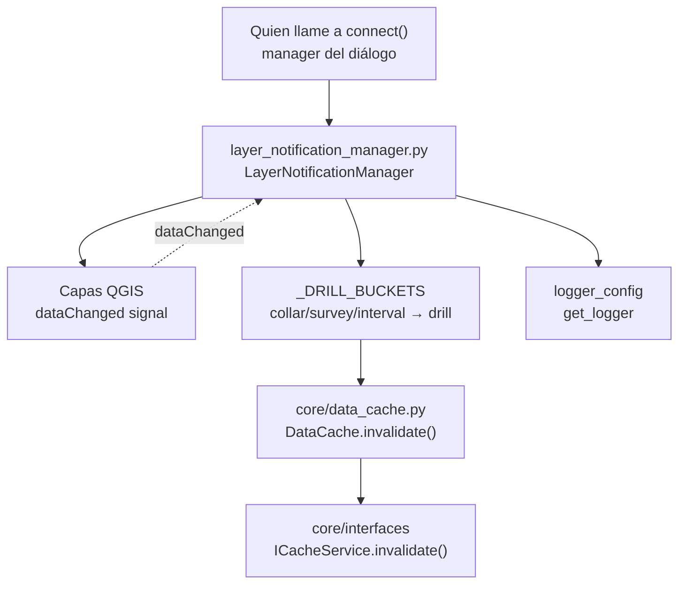

---
tags:
  - secinterp
  - code-walkthrough
  - gui
  - managers
aliases:
  - layer_notification_manager.py
  - LayerNotificationManager
cssclass: secinterp-note
---

# `gui/layer_notification_manager.py`

> [!abstract] Resumen en una línea
> Cablea las señales `dataChanged` de las capas QGIS a `DataCache.invalidate()` del core: cualquier edición invalida solo su bucket (y la sección base invalida todo), con conexión/desconexión determinista.

**Ruta**: `gui/layer_notification_manager.py` (73 líneas)
**Clase principal**: `LayerNotificationManager`
**Capa**: GUI · Managers (escucha señales QGIS; invoca Belgica puro del core)
**Tags**: #secinterp #gui #managers

---

## 🎯 ¿Por qué existe este archivo?

El `DataCache` central acelera el preview por buckets (`topo`, `geol`, `struct`, `drill`, `section`), pero un caché sin invalidación sirve datos rancios tras cada edición.

| Problema | Solución |
|----------|----------|
| Editar una capa debe refrescar el preview sin recalcularlo todo | `connect()` suscribe `layer.dataChanged` → `invalidate(bucket)` por bucket |
| Tres capas de sondajes (collar, survey, interval) comparten bucket | `_DRILL_BUCKETS` mapea las tres a `"drill"` |
| Cambiar la sección base deja obsoletos **todos** los derivados | El callback de `"section"` invoca `invalidate()` sin argumentos (todo) |
| Reconectar sin desconectar duplicaría invalidaciones | `connect()` llama a `disconnect()` primero; `disconnect()` suprime errores por callback |

> [!important] Nota arquitectónica
> Vive en GUI **porque** cablea señales QGIS, pero solo invoca el puerto `ICacheService.invalidate()` del core: la frontera se respeta (el manager no sabe cómo el caché almacena, solo qué bucket caduca). Es el patrón **Observer** más fino del plugin: reacción por bucket en vez de "limpiar todo siempre".

---

## 🧬 Diagrama de relaciones



> [!tip] Cómo leer
> Flecha sólida = llama/conecta; punteada = señal Qt que dispara el callback. El manager traduce nombres de capa a buckets y el caché decide la purga.

---

## 📦 Imports — lectura arquitectónica

```python
# gui/layer_notification_manager.py
from __future__ import annotations

import contextlib
from typing import Any

from sec_interp.logger_config import get_logger

logger = get_logger(__name__)

_DRILL_BUCKETS = {"drill_collar", "drill_survey", "drill_interval"}
```

| # | Observación |
|---|-------------|
| ① | Cero imports `qgis.*`: opera sobre capas tratadas como `Any` con `.dataChanged`, `.connect` y `.name()`. Duck typing total, testeable sin QGIS. |
| ② | `data_cache: Any` en el constructor por la misma razón: basta con que exponga `invalidate()` (el puerto `ICacheService`), sin importar el core en GUI más de lo necesario. |
| ③ | `contextlib` solo para `disconnect()` idempotente: desconectar dos veces o sobre capas muertas no debe fallar. |
| ④ | `_DRILL_BUCKETS` como constante de módulo (no atributo): el mapeo collar/survey/interval → `drill` es conocimiento estable del dominio, visible sin instanciar. |
| ⑤ | Nombres de bucket en `snake_case` de capa (`drill_collar`) vs. buckets del caché (`drill`): el manager es el diccionario entre ambos vocabularios. |

---

## 🏗️ Inventario de estructura

**Constantes (1):**

| Símbolo | Valor | Rol |
|---------|-------|-----|
| `_DRILL_BUCKETS` | `{"drill_collar", "drill_survey", "drill_interval"}` | Buckets de capa que colapsan al bucket `drill` |

**Clases (1):** `LayerNotificationManager` — 4 métodos.

| Método | Firma | Rol |
|--------|-------|-----|
| `__init__` | `(data_cache: Any) -> None` | Guarda el caché + lista vacía de conexiones |
| `connect` | `(layers: dict[str, Any]) -> None` | Desconecta previo, suscribe `dataChanged` por capa |
| `disconnect` | `() -> None` | Desengancha todo con supresión y vacía la lista |
| `_create_invalidation_callback` | `(bucket: str)` | Factoriza el closure que invalida (con regla `section`) |

**Estado:**

| Atributo | Tipo | Rol |
|----------|------|-----|
| `data_cache` | `Any` (`ICacheService` por contrato) | Caché a invalidar |
| `_connected_layers` | `list[tuple[Any, Any]]` | Pares `(layer, callback)` vivos para poder desenganchar |

---

## 📁 Archivos del paquete

| Archivo | Líneas | Rol |
|---|--:|---|
| `layer_notification_manager.py` | 73 | Esta nota: `dataChanged` → `invalidate()` |
| `dialog_signal_manager.py` | — | Conecta `dataChanged` de páginas (geología, estructuras, sondajes) a refrescos de UI |
| `adapters/layer_resolver.py` | — | `resolve_layer()` + su propio `invalidate(layer_id)` de resolución |
| `core/data_cache.py` | — | `DataCache`: buckets `topo/geol/struct/drill`, `invalidate(bucket?)` |
| `core/interfaces/cache_interface.py` | 62 | `ICacheService`: puerto `get/set/invalidate/clear/get_metadata` |

---

## 📖 Recorrido método por método

### `__init__`

```python
def __init__(self, data_cache: Any) -> None:
    self.data_cache = data_cache
    self._connected_layers: list[tuple[Any, Any]] = []
```

Sin conexión en el constructor: el manager nace inerte y solo `connect()` lo activa. Guardar los pares `(layer, callback)` —y no solo las capas— es lo que permite desenganchar **ese** callback concreto sin tumbar otras suscripciones a `dataChanged` (p. ej. las de `dialog_signal_manager`).

### `connect`

```python
def connect(self, layers: dict[str, Any]) -> None:
    self.disconnect()
    for bucket, layer in layers.items():
        if not layer:
            continue

        cache_bucket = "drill" if bucket in _DRILL_BUCKETS else bucket
        callback = self._create_invalidation_callback(cache_bucket)
        layer.dataChanged.connect(callback)
        self._connected_layers.append((layer, callback))
        logger.debug(
            f"Connected cache invalidation to layer: {layer.name()} -> bucket: {cache_bucket}"
        )
```

Idempotente por construcción: `disconnect()` primero garantiza que reconectar (p. ej. al cambiar el proyecto) nunca duplica. Salta capas `None`/falsy sin ruido. Cada capa recibe **su propio closure** ligado a su bucket, y cada conexión deja traza `debug` con `capa → bucket` para auditar el cableado.

### `disconnect`

```python
def disconnect(self) -> None:
    """Disconnect all previously connected layer signals."""
    for layer, callback in self._connected_layers:
        with contextlib.suppress(Exception):
            layer.dataChanged.disconnect(callback)
    self._connected_layers.clear()
    logger.debug("Layer signals disconnected")
```

Desenganche quirúrgico por callback (no `disconnect()` a ciegas, que afectaría a otros suscriptores) con supresión amplia: capas destruidas o callbacks ya retirados no interrumpen la barrida. El `clear()` final + `debug` dejan el manager en estado virgen.

### `_create_invalidation_callback`

```python
def _create_invalidation_callback(self, bucket: str):
    """The ``section`` bucket is the base geometry and invalidates all
    cache buckets."""

    def callback() -> None:
        """Invalidate the cache bucket."""
        if bucket == "section":
            return self.data_cache.invalidate()
        return self.data_cache.invalidate(bucket)

    return callback
```

Factory de closures con la regla de oro: la sección es la geometría base de la que derivan topo, geología, estructuras y sondajes, así que su cambio invalida **todo** (`invalidate()` sin args); cualquier otro bucket invalida solo el suyo. El `bucket` queda capturado por closure, sin `functools.partial` ni lambdas en línea.

> [!note] Granularidad = rendimiento
> Editar un intervalo de sondaje solo purga `drill`; la topo y la geología cacheadas se reutilizan. Solo mover la línea de sección paga el recálculo completo. Este es el valor entero del archivo.

### Ejemplo de cableado

```python
manager = LayerNotificationManager(data_cache)
manager.connect({
    "section": section_layer,
    "topo": None,               # omitida sin ruido
    "drill_collar": collar_lyr, # -> bucket "drill"
    "drill_interval": iv_lyr,   # -> bucket "drill"
    "geol": geol_lyr,           # -> bucket "geol"
})
# ... el usuario edita intervalos ...
# dataChanged -> callback -> data_cache.invalidate("drill")
manager.disconnect()  # al cerrar o recablear
```

Un solo `connect()` cubre todo el proyecto; editar intervalos purga `drill` y deja `geol`/`topo` intactos. Al cambiar de proyecto se llama a `connect()` de nuevo y el `disconnect()` inicial evita duplicados.

---

## 🔄 Flujo de datos

| Fase | Entrada | Transformación | Salida |
|------|---------|----------------|--------|
| Cableado | `dict[bucket, capa]` | `disconnect()` + `dataChanged.connect(closure)` por capa | `_connected_layers` poblada |
| Edición | `dataChanged` de una capa | closure captura `bucket` | `invalidate(bucket)` o `invalidate()` |
| Purga | bucket (o todo) | `DataCache` descarta entradas | próximo preview recalcula lo caducado |
| Descableado | cierre / recableado | `disconnect(callback)` por par + `clear()` | cero conexiones |

---

## 🏛️ Patrones de diseño presentes

| Patrón | Dónde | Propósito |
|--------|-------|-----------|
| **Observer (Qt signals)** | `dataChanged.connect(callback)` | Reaccionar a ediciones sin polling |
| **Factory de callbacks** | `_create_invalidation_callback()` | Un closure por bucket con la regla `section` |
| **Mapeo de vocabularios** | `_DRILL_BUCKETS` → `"drill"` | Tres capas, un bucket de caché |
| **Idempotent connect** | `connect()` empieza con `disconnect()` | Reconexión segura ante cambio de proyecto |
| **Deterministic cleanup** | `disconnect()` + lista de pares | Sin conexiones a capas muertas |
| **Dependency Inversion** | `data_cache: Any` (≈ `ICacheService`) | Depender del puerto, no de `DataCache` |

---

## 🧾 Resumen de la API

| Símbolo | Firma | Uso típico |
|---------|-------|------------|
| `LayerNotificationManager` | `(data_cache: Any)` | `LayerNotificationManager(data_cache)` |
| `connect` | `(layers: dict[str, Any]) -> None` | `connect({"section": lyr, "drill_collar": c, ...})` |
| `disconnect` | `() -> None` | Al cerrar o antes de reconectar |
| `_DRILL_BUCKETS` | `set[str]` de módulo | Mapeo collar/survey/interval → `drill` |

---

## 🛡️ Manejo de errores

| Situación | Comportamiento |
|-----------|----------------|
| Capa `None` en `connect()` | Omitida con `continue`, sin log |
| Capa destruida en `disconnect()` | `suppress(Exception)` por par, la barrida continúa |
| Callback ya retirado | Suprimido igual, `clear()` igualmente |
| `dataChanged` emitido tras `disconnect()` | Imposible: el callback ya no está suscrito |
| `invalidate()` lanza dentro del callback | Propaga al emisor Qt; el manager no lo envuelve (el caché no debe fallar aquí) |

---

## 🧪 Tests asociados

Sin test dedicado (ni `tests/gui/` ni `tests/core/`): hueco honesto con cobertura vecina fácil de citar:

- `tests/core/test_data_cache.py` + `test_data_cache_fix.py` — cubren `DataCache.invalidate(bucket?)`, el método que los callbacks invocan (la mitad receptora del contrato).
- `tests/gui/test_dialog_state_manager.py`, `test_main_dialog_signals_wiring.py` — cableado de señales del diálogo, mismo estilo de `connect`/`disconnect` idempotente.
- `tests/gui/test_cache_fix.py` — regresión del caché central.

Un test Mock-first natural (inexistente hoy): capas `MagicMock` con `dataChanged`, `connect({...})`, emitir el callback capturado y assert `invalidate("drill")` / `invalidate()` para `section`. Todo mockeable sin QGIS porque el módulo no importa `qgis.*`.

---

## 👀 Observaciones y notas

> [!success] Fortalezas
> - Invalidación por bucket: el mínimo recálculo posible tras cada edición.
> - Regla `section` → todo: la dependencia base→derivados modelada en una línea.
> - `connect` idempotente y `disconnect` quirúrgico: reconexión segura sin tumbar suscriptores ajenos.
> - Sin imports QGIS: el manager más testeable de la capa GUI.

> [!warning] Puntos de atención
> - Capas `None` se omiten en silencio: un bucket mal resuelto queda sin invalidación y sirve rancio sin aviso.
> - El callback no envuelve `invalidate()`: si el caché lanzara, la excepción sube al emisor Qt.
> - `_connected_layers` retiene referencias a capas: mientras el manager viva, esas capas no se liberan (retención intencionada, pero a documentar).
> - Sin test directo pese a ser trivialmente mockeable.

> [!question] Preguntas abiertas
> - ¿`logger.warning` cuando `connect()` recibe una capa falsy, para cazar buckets sin invalidación?
> - ¿Reutilizar este manager para invalidar los `QgsPointLocator` cacheados de [[snapper]] ante `dataChanged`?

---

## 🔗 Notas relacionadas

- [[Index]] — índice de la bóveda
- [[data_cache]] — `DataCache.invalidate()`: la mitad receptora
- [[cache_interface]] — `ICacheService`: el puerto que el manager consume
- [[controller]] — principal consumidor del caché en el core
- [[preview_task_orchestrator]] — relanza tasks tras la invalidación
- [[dialog_signal_manager]] — otro suscriptor de `dataChanged` (refrescos de UI)
- [[snapper]] — sus locators cacheados sufren el mismo problema de obsolescencia

---

*Nota de la bóveda SecInterp Code Walkthrough v2 — v3.9.1*
