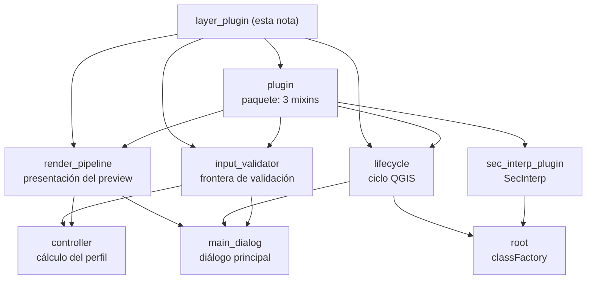

---
tags:
  - secinterp
  - code-walkthrough
  - layer
  - plugin
aliases:
  - layer_plugin
  - capa plugin
  - plugin (capa)
cssclass: secinterp-note
---

# Capa `plugin/` — Frontera QGIS del plugin

> [!abstract] Mapa de navegación
> La capa `plugin/` es la **frontera con QGIS**: el paquete de tres mixins que
> componen a `SecInterp` — [[input_validator]] valida la entrada del diálogo,
> [[lifecycle]] cablea el ciclo `initGui`/`unload` y [[render_pipeline]]
> convierte el preview calculado en escena visible — reunidos por [[plugin]].

**Ruta**: `plugin/` (4 archivos, ~392 líneas)
**Paquete**: [[plugin]] (re-exporta los tres mixins)
**Clase huésped**: `SecInterp` (ver [[sec_interp_plugin]])
**Capa**: Plugin / GUI (única que habla con `iface`, `QAction` y widgets)
**Tags**: #secinterp #code-walkthrough #layer #plugin

---

## 🎯 ¿Por qué existe esta capa?

QGIS instancia el plugin por convención (`classFactory`, `initGui`,
`unload`) y el resto del tiempo el plugin solo necesita validar entradas,
abrir su diálogo y dibujar el preview. Sin esta capa, ese cableado viviría
mezclado con el cálculo:

| Problema | Solución en la capa |
|----------|---------------------|
| Cada preview re-extrae widgets y valida a medias | [[input_validator]] centraliza Extract + validación en `PreviewParams` |
| El cableado QGIS se mezcla con el negocio | [[lifecycle]] aísla `initGui`/`unload` y la limpieza determinista |
| Entre datos calculados y sección visible hay decisiones de presentación | [[render_pipeline]] filtra visibilidad, deriva exageración y publica el render |
| Tres capacidades ortogonales en una sola clase | [[plugin]] las compone como mixins sobre `SecInterp` |

> [!important] Regla de la capa
> Esta es la **única capa que toca `iface`, el canvas y los widgets**. No
> computa geometría: extrae parámetros, delega el cálculo al core vía
> [[controller]] y presenta el resultado. Ver [[sec_interp_plugin]] como
> composición final y [[root]] como punto de carga.

---

## 🧬 Mini-mapa de la capa

> [!tip] Cómo leer
> [[plugin]] es el índice del paquete; los tres mixins son las ramas. Las
> flechas hacia fuera muestran la composición: todo confluye en
> [[sec_interp_plugin]] (la clase `SecInterp`) y se carga desde [[root]].

---

## 📦 Miembros de la capa

| Nota | Fuente | Rol |
|---|---|---|
| [[plugin]] | `plugin/__init__.py` | Paquete frontera: re-exporta los tres mixins que componen a `SecInterp` |
| [[input_validator]] | `plugin/input_validator.py` | Extrae valores del diálogo, construye y valida `PreviewParams` y arma notificaciones de capa |
| [[lifecycle]] | `plugin/lifecycle.py` | Conecta `classFactory` → `initGui`/`unload`, abre el diálogo y libera acciones, señales y renderer |
| [[render_pipeline]] | `plugin/render_pipeline.py` | Filtra por visibilidad, deriva exageración vertical y buzamiento, invoca al renderer y publica en leyenda |

---

## 🧭 Recorrido mixin por mixin

### [[plugin]] — el índice del paquete

El `__init__` del paquete no contiene lógica: re-exporta
`InputValidationMixin`, `PluginLifecycleMixin` y `RenderPipelineMixin` para
que la clase huésped los componga en una sola línea. Es el mapa de la capa en
código: quien lea el paquete sabe de inmediato que el plugin son exactamente
tres capacidades. Su nota documenta además la frontera — qué puede importar
esta capa (widgets, `iface`, validadores del core) y qué le está prohibido
(calcular geometría).

### [[input_validator]] — la frontera de validación

Extrae los valores crudos de los widgets del diálogo, construye un
`PreviewParams` tipado y lo somete al `ProjectValidator` del core antes de
que corra ningún cálculo. Es el patrón Extract aplicado a la entrada: del
widget al DTO en un solo punto, con un único mensaje de error hacia la GUI.
Además arma las notificaciones de cambio de capa, de modo que el preview sabe
cuándo sus parámetros han quedado obsoletos.

> [!note] Por qué validar aquí y no en el diálogo
> El diálogo ([[main_dialog]]) compone managers; validar en el mixin evita que
> cada manager repita la extracción y garantiza que el [[controller]] solo
> reciba parámetros ya saneados.

### [[lifecycle]] — el ciclo QGIS

Cubre la mecánica de entrada que QGIS exige: `classFactory` crea la
instancia (ver [[root]]), `initGui` registra la acción y el toolbar, y
`unload` la retira con liberación determinista de acciones, señales y
renderer. También abre el diálogo principal bajo demanda. Sin este mixin, el
ciclo de vida quedaría enredado con la validación y el render; aislado, se
puede razonar sobre fugas de recursos mirando un solo archivo de 167 líneas.

### [[render_pipeline]] — de datos a escena visible

Recibe el preview ya calculado y toma las decisiones de presentación que no
pertenecen ni al cómputo ni al renderer de bajo nivel: filtra capas por
opciones de visibilidad, deriva la exageración vertical y la longitud de las
líneas de buzamiento, invoca al renderer del preview y publica el resultado
en el estado de render y la leyenda. Es el último eslabón antes de que el
usuario vea la sección en el canvas.

---

## 🔄 Flujo de datos

| Fase | Actor | Entrada → Salida |
|------|-------|------------------|
| Carga | [[root]] | QGIS importa el paquete → `classFactory(iface)` crea `SecInterp` |
| Registro | [[lifecycle]] | Instancia → acción en toolbar y menú |
| Validación | [[input_validator]] | Widgets del [[main_dialog]] → `PreviewParams` validado |
| Cómputo | [[controller]] | `PreviewParams` → tupla de resultados del perfil |
| Presentación | [[render_pipeline]] | Resultados + opciones → escena QGIS + leyenda |

El camino típico de un preview es: el usuario abre el diálogo (ciclo de
vida), pulsa previsualizar (el validador extrae y sanea), el controlador del
core calcula, y el pipeline de render publica la escena. La clase
[[sec_interp_plugin]] orquesta estas fases sin computar: compone los tres
mixins, cablea servicios y extractores, y carga la traducción del locale.

> [!note] Dónde vive cada decisión
> **Cuándo** existe el plugin lo decide [[lifecycle]]; **con qué parámetros**
> trabaja lo decide [[input_validator]]; **cómo** se ve el resultado lo decide
> [[render_pipeline]]; **qué** se calcula lo decide [[controller]]; **quién**
> compone todo es [[sec_interp_plugin]].

---

## 🏛️ Patrones de la capa

| Patrón | Dónde | Propósito |
|--------|-------|-----------|
| **Mixin composition** | [[plugin]] + [[sec_interp_plugin]] | Tres capacidades ortogonales en una clase sin herencia profunda |
| **Boundary / Extract** | [[input_validator]] | Convertir widgets en DTO validado antes del cómputo |
| **Lifecycle / Disposable** | [[lifecycle]] | Registro y liberación determinista de recursos QGIS |
| **Pipeline de presentación** | [[render_pipeline]] | Separar decisiones visuales del cálculo y del renderer base |

---

## 🔗 Notas relacionadas

- [[Index]] — índice de la bóveda
- [[sec_interp_plugin]] — clase `SecInterp`: compone los mixins y cablea servicios vía `SafeLoader`
- [[root]] — `classFactory(iface)` con import perezoso más bootstrap de desarrollo
- [[main_dialog]] — raíz de composición del diálogo que los mixins gobiernan
- [[controller]] — orquestador del core al que la capa delega todo cálculo

---

*Nota de la bóveda SecInterp Code Walkthrough v2 — v3.8.0*
