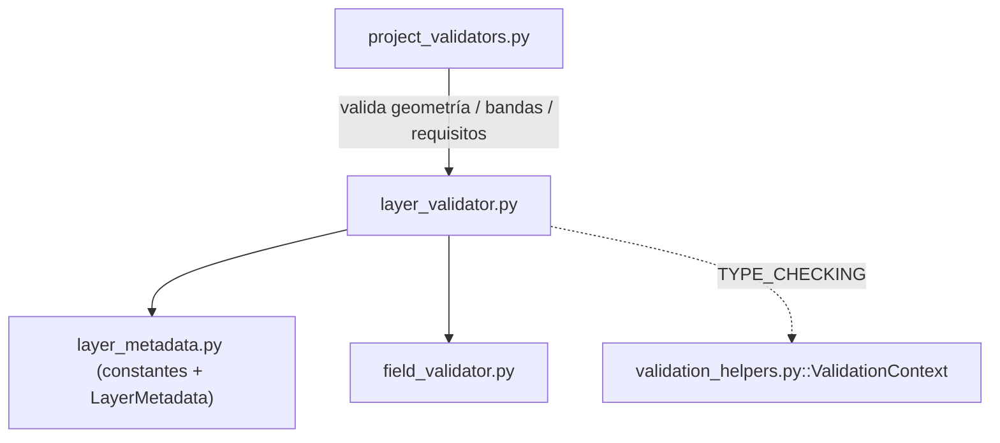

---
tags:
  - secinterp
  - code-walkthrough
  - core
  - validation
aliases:
  - layer_validator.py
  - validate_layer_has_features
  - validate_layer_geometry
  - validate_raster_band
  - validate_structural_requirements
  - validate_geology_requirements
  - validate_crs_compatibility
cssclass: secinterp-note
---

# `core/validation/layer_validator.py`

> [!abstract] Resumen en una línea
> Validadores **espaciales** QGIS-agnósticos de nivel 1/2: comprueban que una capa vectorial tiene features y la geometría esperada, que un raster tiene la banda pedida, y validan requisitos de geología/estructura y compatibilidad de CRS sobre `LayerMetadata`.

**Ruta**: `core/validation/layer_validator.py` (200 líneas)
**Funciones principales**: `validate_layer_has_features`, `validate_layer_geometry`, `validate_raster_band`, `validate_structural_requirements`, `validate_geology_requirements`, `validate_crs_compatibility`
**Capa**: Core (QGIS-agnóstico)
**Tags**: #secinterp #core #validation

---

## 🎯 ¿Por qué existe este archivo?

`field_validator.py` valida campos; este módulo valida **la capa como entidad
espacial**: si tiene features, si su geometría es la correcta, si el raster tiene la
banda solicitada, y si varias capas comparten CRS. Todo sobre el DTO `LayerMetadata`.

| Problema | Solución |
|----------|----------|
| Una línea de sección vacía no sirve para interpolar | `validate_layer_has_features` |
| El usuario elige una capa de puntos donde se espera una línea | `validate_layer_geometry` |
| La banda del DEM debe existir antes de muestrear | `validate_raster_band` |
| Los requisitos de geología/estructura combinan geometría + campos | `validate_geology_requirements` / `validate_structural_requirements` |
| Capas con CRS distintos degradan precisión | `validate_crs_compatibility` (devuelve *warning*) |

> [!important] Nota arquitectónica
> **QGIS-agnóstico total.** La geometría se representa con constantes de cadena
> (`GEOMETRY_POINT="point"`, `GEOMETRY_LINE="line"`, `GEOMETRY_POLYGON="polygon"`) y el
> CRS con `crs_authid` (`"EPSG:4326"`). Nunca se importa `qgis.core`; la GUI traduce
> `QgsWkbTypes` → cadena en el `ValidationExtractor`.

---

## 🧬 Diagrama de relaciones



> [!tip] Cómo leer
> Sólida = importa; punteada = solo en `TYPE_CHECKING`. `layer_validator` se apoya en
> `field_validator` para la comprobación de campos y expone funciones que
> `project_validators.py` consume dentro de cada `IValidator`.

---

## 📦 Imports — lectura arquitectónica

```python
# core/validation/layer_validator.py
from __future__ import annotations

from typing import TYPE_CHECKING

from sec_interp.core.domain import FieldType
from sec_interp.core.validation.layer_metadata import (
    GEOMETRY_LINE,
    GEOMETRY_POINT,
    GEOMETRY_POLYGON,
    KIND_RASTER,
    KIND_VECTOR,
    LayerMetadata,
)

from .field_validator import validate_field_exists, validate_field_type

if TYPE_CHECKING:
    from sec_interp.core.validation.validation_helpers import ValidationContext
```

| # | Observación |
|---|-------------|
| ① | `TYPE_CHECKING` — `ValidationContext` solo se importa para anotaciones, evitando un ciclo de importación en runtime. |
| ② | Importa constantes de `layer_metadata` (geometría y kind) en vez de enums QGIS. |
| ③ | Reutiliza `validate_field_exists` / `validate_field_type` de `field_validator`. |
| ④ | `FieldType` se usa en `_validate_struct_field` para admitir tipos numéricos/string. |

---

## 🏗️ Inventario de estructura

**Constantes:**

- `_TYPE_NAMES` — dict `{GEOMETRY_POINT: "Point", GEOMETRY_LINE: "Line", GEOMETRY_POLYGON: "Polygon"}` para mensajes legibles.

**Funciones públicas (6):**

- `validate_layer_has_features(metadata) -> (bool, str)`
- `validate_layer_geometry(metadata, expected_type) -> (bool, str)`
- `validate_raster_band(metadata, band_number) -> (bool, str)`
- `validate_structural_requirements(metadata, dip_field, strike_field, context=None) -> (bool, str)`
- `validate_geology_requirements(metadata, field_name, context=None) -> (bool, str)`
- `validate_crs_compatibility(metadata_list) -> (bool, str)`

**Funciones privadas (3):**

- `_check_struct_layer_validity(metadata)` — capa estructural válida y de puntos.
- `_check_geology_layer_validity(metadata)` — capa de geología válida, polígono y con features.
- `_validate_struct_field(metadata, field_name, label)` — existencia + tipo de un campo estructural.

---

## 📁 Archivos del paquete

`layer_validator.py` es la pieza espacial del paquete `core/validation/`:

| Archivo | Rol |
|---------|-----|
| `layer_validator.py` | Validación espacial (geometría, bandas, CRS) — este archivo |
| `field_validator.py` | Validación atómica de campos (reutilizada aquí) |
| `layer_metadata.py` | `LayerMetadata` + constantes `GEOMETRY_*` / `KIND_*` |
| `path_validator.py` | Validación de rutas de salida |
| `validation_helpers.py` | `ValidationContext` (acumula errores) |
| `project_validator.py` | `ProjectValidator` + `ValidationParams` |
| `project_validators.py` | Validadores especializados que consumen este módulo |
| `validators.py` | Fábricas para campos de dataclass |
| `base_validator.py` | `IValidator` (ABC) |
| `pipeline.py` | `ValidationPipeline` |

---

## 📖 Recorrido método por método

### `validate_layer_has_features`

```python
def validate_layer_has_features(metadata: LayerMetadata) -> tuple[bool, str]:
    if not metadata or not metadata.is_valid:
        return False, "Layer is not valid"
    if metadata.kind != KIND_VECTOR:
        return False, "Layer is not a vector layer"
    if metadata.feature_count == 0:
        return False, f"Layer '{metadata.name}' has no features"
    return True, ""
```

Rechaza capas vectoriales sin features (`feature_count == 0`). Es la comprobación que
evita que la interpolación corra sobre una línea o un set de afloramientos vacío.

### `validate_layer_geometry`

```python
def validate_layer_geometry(metadata: LayerMetadata, expected_type: str) -> tuple[bool, str]:
    if not metadata or not metadata.is_valid:
        return False, "Layer is not valid"
    if metadata.kind != KIND_VECTOR:
        return False, "Layer is not a vector layer"
    if metadata.geometry_type != expected_type:
        expected_name = _TYPE_NAMES.get(expected_type, f"Type {expected_type}")
        actual_name = _TYPE_NAMES.get(metadata.geometry_type, metadata.geometry_type)
        return False, (
            f"Geometry type mismatch for layer '{metadata.name}': "
            f"Found {actual_name}, but expected {expected_name}. "
            f"Please select a valid {expected_name.lower()} layer."
        )
    return True, ""
```

Compara la geometría real contra la esperada. Si no coincide, traduce ambos a nombres
legibles ("Point", "Line", "Polygon") vía `_TYPE_NAMES`, con fallback a `Type {x}` o a
la cadena cruda.

### `validate_raster_band`

```python
def validate_raster_band(metadata: LayerMetadata, band_number: int) -> tuple[bool, str]:
    if not metadata or not metadata.is_valid:
        return False, "Layer is not valid"
    if metadata.kind != KIND_RASTER:
        return False, "Layer is not a raster layer"
    band_count = metadata.band_count
    if band_number < 1 or band_number > band_count:
        return False, (
            f"Band number {band_number} is invalid. Layer '{metadata.name}' "
            f"has {band_count} band(s)"
        )
    return True, ""
```

Valida que `band_number` esté en `[1, band_count]`. Nótese que las bandas son 1-based
(la primera banda es `1`, no `0`), y que `band_count` sale del `LayerMetadata` extraído
por la GUI.

### `validate_structural_requirements`

```python
def validate_structural_requirements(
    metadata: LayerMetadata,
    dip_field: str | None,
    strike_field: str | None,
    context: ValidationContext | None = None,
) -> tuple[bool, str]:
    is_valid, msg = _check_struct_layer_validity(metadata)
    if not is_valid:
        if context:
            context.add_error(msg)
        return False, msg

    for field, label in [(dip_field, "Dip"), (strike_field, "Strike")]:
        if field:
            is_valid, msg = _validate_struct_field(metadata, field, label)
            if not is_valid:
                if context:
                    context.add_error(msg)
                return False, msg
    return True, ""
```

Orquesta la validación estructural: primero la capa (puntos), luego cada campo
configurado (dip y strike) con su etiqueta. Si recibe un `context`, **acumula** el
error en él además de devolverlo, integrando con el patrón `ValidationContext`.

### `validate_geology_requirements`

```python
def validate_geology_requirements(
    metadata: LayerMetadata,
    field_name: str | None,
    context: ValidationContext | None = None,
) -> tuple[bool, str]:
    is_valid, error = _check_geology_layer_validity(metadata)
    if not is_valid:
        if context:
            context.add_error(error, "geology_layer")
        return False, error

    if not field_name:
        msg = "Geology unit field is required when geology layer is selected"
        if context:
            context.add_error(msg, "geology_field")
        return False, msg

    is_valid, error = validate_field_exists(metadata, field_name)
    if not is_valid:
        if context:
            context.add_error(error, "geology_field")
        return False, error
    return True, ""
```

Valida la capa de geología (polígono + features) y que el campo de unidad esté
seleccionado y exista. Usa `context.add_error(msg, field)` con **clave de campo**
(`"geology_layer"`, `"geology_field"`) para que la GUI pueda resaltar el control
exacto que falló.

### `_check_struct_layer_validity` / `_check_geology_layer_validity`

```python
def _check_struct_layer_validity(metadata: LayerMetadata) -> tuple[bool, str]:
    if not metadata.is_valid:
        return False, f"Structural layer '{metadata.name}' is not valid."
    if metadata.geometry_type != GEOMETRY_POINT:
        return False, "Structural layer must be a point layer."
    return True, ""


def _check_geology_layer_validity(metadata: LayerMetadata) -> tuple[bool, str]:
    if not metadata.is_valid:
        return False, f"Geology layer '{metadata.name}' is not valid."
    is_valid, error = validate_layer_geometry(metadata, GEOMETRY_POLYGON)
    if not is_valid:
        return False, error
    is_valid, error = validate_layer_has_features(metadata)
    if not is_valid:
        return False, error
    return True, ""
```

Privados. La capa estructural debe ser de **puntos** (mediciones de dip/strike); la de
geología de **polígonos** con features (unidades aflorantes). Reutilizan los validadores
públicos en vez de repetir lógica.

### `_validate_struct_field`

```python
def _validate_struct_field(
    metadata: LayerMetadata, field_name: str, label: str
) -> tuple[bool, str]:
    is_valid, msg = validate_field_exists(metadata, field_name)
    if not is_valid:
        return False, msg
    is_valid, msg = validate_field_type(
        metadata,
        field_name,
        [FieldType.INT, FieldType.DOUBLE, FieldType.LONG_LONG, FieldType.STRING],
    )
    if not is_valid:
        return False, f"{label} field error: {msg}"
    return True, ""
```

Valida que un campo estructural exista y sea numérico o string (`INT`, `DOUBLE`,
`LONG_LONG`, `STRING`). Acepta `STRING` porque los valores de dip/strike a menudo se
almacenan como texto y se parsean después.

### `validate_crs_compatibility`

```python
def validate_crs_compatibility(metadata_list: list[LayerMetadata]) -> tuple[bool, str]:
    valid = [m for m in metadata_list if m and m.is_valid]
    if not valid:
        return True, ""
    ref = valid[0]
    incompatible = [
        f"  - {m.name}: {m.crs_authid}" for m in valid if m.crs_authid != ref.crs_authid
    ]
    if incompatible:
        warning = (
            f"⚠ CRS mismatch detected!\n\n"
            f"Reference CRS: {ref.crs_authid} ({ref.name})\n"
            f"Incompatible layers:\n" + "\n".join(incompatible) + "\n\n"
            "QGIS will reproject on-the-fly, but this may affect accuracy.\n"
        )
        return False, warning
    return True, ""
```

Compara el `crs_authid` de todas las capas contra la primera válida. Si hay
discrepancias devuelve `False` con un mensaje de **warning** (no es un error fatal:
QGIS reproyecta on-the-fly, pero avisa de posible pérdida de precisión). Filtra
primero las capas inválidas y, si no queda ninguna, retorna `(True, "")`.

> [!note] `False` + warning = semántica de aviso
> Aunque devuelve `False`, el consumidor debe tratarlo como *warning* (el mensaje ya
> empieza con `⚠`). Es una elección de diseño que aprovecha el canal `(bool, str)`
> para dos niveles: error duro vs aviso.

---

## 🔄 Flujo de datos

| Fase | Entrada | Transformación | Salida |
|------|---------|----------------|--------|
| Features | `LayerMetadata` vectorial | compara `feature_count == 0` | `(bool, str)` |
| Geometría | `LayerMetadata` + `expected_type` | compara `geometry_type` | `(bool, str)` |
| Banda | `LayerMetadata` raster + `band_number` | rango `1..band_count` | `(bool, str)` |
| Estructura | `LayerMetadata` + campos dip/strike | valida puntos + campos | `(bool, str)` + error en `context` |
| Geología | `LayerMetadata` + campo unidad | valida polígono + campo | `(bool, str)` + error en `context` |
| CRS | `list[LayerMetadata]` | compara `crs_authid` | `(bool, warning)` |

---

## 🏛️ Patrones de diseño presentes

| Patrón | Dónde | Propósito |
|--------|-------|-----------|
| **Función pura** | casi todas | Sin estado; operan sobre `LayerMetadata` |
| **Result tuple** | todos los retornos | `(bool, str)` sin excepciones |
| **Accumulator opcional** | `context: ValidationContext \| None` | Integrar con el patrón de acumulación de errores |
| **Facade / composición** | `validate_*_requirements` | Orquestar varios validadores menores |
| **DTO de frontera** | `LayerMetadata` | No tocar QGIS en core |
| **Advertencia por canal de error** | `validate_crs_compatibility` | Reusar el retorno `(False, str)` como warning |

---

## 🧾 Resumen de la API

| Símbolo | Firma / Hereda | Uso típico |
|---------|----------------|------------|
| `validate_layer_has_features` | `(metadata) -> (bool, str)` | Capa vectorial no vacía |
| `validate_layer_geometry` | `(metadata, expected_type) -> (bool, str)` | Tipo de geometría correcto |
| `validate_raster_band` | `(metadata, band_number) -> (bool, str)` | Banda del DEM existe |
| `validate_structural_requirements` | `(metadata, dip_field, strike_field, context=None) -> (bool, str)` | Requisitos estructurales |
| `validate_geology_requirements` | `(metadata, field_name, context=None) -> (bool, str)` | Requisitos de geología |
| `validate_crs_compatibility` | `(metadata_list) -> (bool, str)` | CRS consistente (warning) |

---

## 🛡️ Manejo de errores

Sin excepciones; todo por tupla `(bool, str)`:

| Situación | Comportamiento |
|-----------|----------------|
| `metadata` `None` o inválido | `(False, "Layer is not valid")` |
| Kind incorrecto (raster vs vector) | `(False, "Layer is not a ... layer")` |
| `feature_count == 0` | `(False, "Layer 'X' has no features")` |
| Geometría no coincide | `(False, "Geometry type mismatch...")` |
| Banda fuera de rango | `(False, "Band number N is invalid...")` |
| CRS divergente | `(False, "⚠ CRS mismatch detected!...")` — warning |
| Con `context` | el error se **acumula** vía `context.add_error(...)` |

> [!important] Doble canal
> Las funciones `validate_*_requirements` reciben `context` opcional: si está presente
> **acumulan** el error y devuelven el mismo `(False, msg)`. Si no, solo devuelven. Esto
> las hace útiles tanto en el pipeline (con contexto) como en llamadas aisladas (sin él).

---

## 🧪 Tests asociados

Casos puros mapeados a `tests/core/test_layer_validator.py`:

- `test_validate_layer_has_features` — con features vs vacío (`"has no features"`).
- `test_validate_layer_geometry` — punto vs línea (`"Found Point, but expected Line"`).
- `test_validate_raster_band` — banda 1 válida, banda 2 inválida (`"invalid"`).
- `test_validate_structural_requirements` — con `patch` de los validadores de campo.
- `test_validate_crs_compatibility` — CRS igual → `True`; distinto → `"CRS mismatch detected"`.

---

## 👀 Observaciones y notas

> [!success] Fortalezas
> - Traducción limpia de tipos QGIS a cadenas (`GEOMETRY_*`, `KIND_*`) sin dependencias.
> - Reutiliza `field_validator` en lugar de duplicar la comprobación de campos.
> - `context` opcional permite integrar con el acumulador de errores sin acoplarse a él.

> [!warning] Puntos de atención
> - `validate_crs_compatibility` devuelve `False` para un *warning*, lo que puede confundir a quien espera `False == error`.
> - Los mensajes de warning incluyen un emoji `⚠` en el texto (frontera de i18n, sin `TranslatableMixin`).
> - `_validate_struct_field` acepta `STRING` para dip/strike: depende de un parseo posterior correcto.

> [!question] Preguntas abiertas
> - ¿Separar warning y error en dos canales (p. ej. tupla `(ok, error, warning)`)?
> - ¿Unificar las constantes de geometría con un `StrEnum` en `layer_metadata`?

---

## 🔗 Notas relacionadas

- [[Index]] — índice de la bóveda
- [[core_validation]] — nota de paquete del directorio `validation/`
- [[core_validation]] — paquete que incluye `layer_metadata.py` (constantes y DTO)
- [[field_validator]] — `validate_field_exists`/`validate_field_type` reutilizadas
- [[project_validators]] — consumidor de estos validadores por componente
- [[project_validator]] — orquestador que dispara la cadena completa
- [[domain]] — `FieldType` usado en `_validate_struct_field`

---

*Nota de la bóveda SecInterp Code Walkthrough v2 — v3.8.0*
