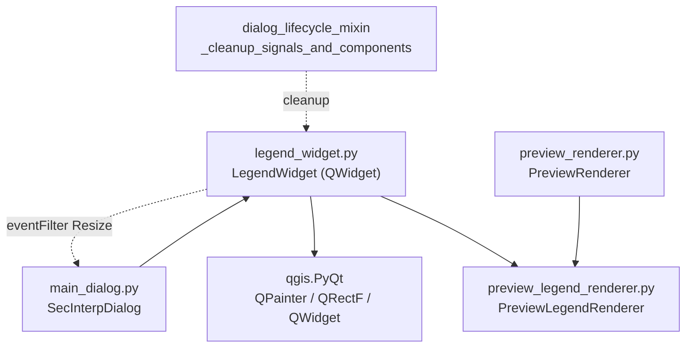

---
tags:
  - secinterp
  - code-walkthrough
  - gui
  - managers
aliases:
  - legend_widget.py
  - LegendWidget
cssclass: secinterp-note
---

# `gui/legend_widget.py`

> [!abstract] Resumen en una línea
> Overlay transparente sobre el canvas del preview que pinta la leyenda geológica delegando en `PreviewLegendRenderer.draw_legend()`, siguiiendo los resizes del diálogo y sin interceptar el ratón.

**Ruta**: `gui/legend_widget.py` (81 líneas)
**Clase principal**: `LegendWidget(QWidget)`
**Capa**: GUI · Present (overlay pasivo; el dibujo real vive en `PreviewLegendRenderer`)
**Tags**: #secinterp #gui #managers

---

## 🎯 ¿Por qué existe este archivo?

La leyenda debe flotar sobre el mapa sin bloquear la interacción ni duplicar la lógica de dibujo que ya existe para el render de leyenda.

| Problema | Solución |
|----------|----------|
| Mostrar la leyenda encima del canvas sin romper pan/zoom/clics | `QWidget` con `WA_TransparentForMouseEvents`: los eventos atraviesan al canvas |
| El overlay debe acompañar al diálogo al redimensionar | `eventFilter` sobre el diálogo que replica cada `Resize` |
| No duplicar el dibujo de la leyenda | `paintEvent()` delega en `renderer.draw_legend(painter, rect)` |
| Un repintado en medio de una actualización no debe tumbar el diálogo | `try/except (AttributeError, RuntimeError, TypeError)` con fallo silencioso |

> [!important] Nota arquitectónica
> Widget **pasivo y delegante**: no calcula `active_units`, no pinta swatches; solo presta la superficie (`QPainter` + `rect()`) al renderer que recibe en `update_legend()`. Lo crea `SecInterpDialog` (`LegendWidget(self.preview_widget.canvas)`) y lo limpia `dialog_lifecycle_mixin._cleanup_signals_and_components()`. Ver [[main_dialog]] y [[preview_legend_renderer]].

---

## 🧬 Diagrama de relaciones



> [!tip] Cómo leer
> Flecha sólida = crea/delega; punteada = observa o limpia. `PreviewRenderer` y `LegendWidget` comparten el mismo motor de dibujo (`PreviewLegendRenderer`) por dos caminos distintos.

---

## 📦 Imports — lectura arquitectónica

```python
# gui/legend_widget.py
from __future__ import annotations

from typing import TYPE_CHECKING

from qgis.PyQt.QtCore import QEvent, QObject, QRectF, Qt
from qgis.PyQt.QtGui import QPainter
from qgis.PyQt.QtWidgets import QWidget

if TYPE_CHECKING:
    from sec_interp.gui.main_dialog import SecInterpDialog

    from .preview_legend_renderer import PreviewLegendRenderer as Renderer
```

| # | Observación |
|---|-------------|
| ① | Hereda `QWidget` crudo (no `QDockWidget` ni layouts): es un overlay posicionado a mano sobre el canvas. |
| ② | Todo el tipado fuerte (`SecInterpDialog`, `Renderer`) vive bajo `TYPE_CHECKING`: en runtime el widget acepta cualquier renderer con `active_units` + `draw_legend` (duck typing defensivo en `paintEvent`). |
| ③ | `QEvent` + `QObject` solo para el filtro de resize; `QRectF` para pasarle su propio `rect()` al renderer. |
| ④ | Imports vía `qgis.PyQt` (compat Qt5/Qt6, QGIS 4.x), nunca `PyQt5` directo. |
| ⑤ | Sin imports de `core/` ni de `qgis.core`/`qgis.gui`: el widget no conoce capas ni DTOs, solo un renderer con dos miembros. |

---

## 🏗️ Inventario de estructura

**Clases (1):** `LegendWidget(QWidget)` — 4 métodos.

| Método | Firma | Rol |
|--------|-------|-----|
| `__init__` | `(dialog: SecInterpDialog) -> None` | Padre = diálogo, transparencia, filtro de resize, oculto |
| `cleanup` | `() -> None` | Retira el `eventFilter` y suelta el diálogo |
| `eventFilter` | `(obj: QObject, event: QEvent) -> bool` | Replica `Resize` del diálogo |
| `update_legend` | `(renderer: Renderer, visible: bool = True) -> None` | Instala renderer, repinta, muestra/oculta |
| `paintEvent` | `(event: QEvent) -> None` | Delega el dibujo con red de seguridad |

---

## 📁 Archivos del paquete

| Archivo | Líneas | Rol |
|---|--:|---|
| `legend_widget.py` | 81 | Esta nota: overlay de leyenda |
| `preview_legend_renderer.py` | — | Motor `draw_legend(painter, rect, active_units, ...)` |
| `preview_renderer.py` | — | Orquesta capas del preview y expone `active_units` |
| `preview_layer_factory.py` | 471 | `active_units` vive en `color_manager._active_units` |
| `main_dialog.py` | — | Crea el widget sobre `preview_widget.canvas` |
| `dialog_lifecycle_mixin.py` | — | `cleanup()` determinista al cerrar |

---

## 📖 Recorrido método por método

### `__init__`

```python
def __init__(self, dialog: SecInterpDialog) -> None:
    super().__init__(dialog)  # Use dialog as the parent
    self.dialog = dialog
    self.renderer: Renderer | None = None  # Apply UP037
    for attr_name in ["WA_TranslucentBackground", "WA_TransparentForMouseEvents"]:
        attr = getattr(Qt, attr_name, None)
        if attr is None and hasattr(Qt, "WidgetAttribute"):
            attr = getattr(Qt.WidgetAttribute, attr_name, None)
        if attr is not None:
            self.setAttribute(attr)
    self.setAutoFillBackground(False)  # Don't fill background
    self.hide()

    # Install event filter on parent to track resize
    self.dialog.installEventFilter(self)
```

Tres decisiones en una: (1) padre = diálogo para heredar ciclo de vida Qt; (2) fondo translúcido + transparencia a eventos de ratón, con **fallback Qt6** (`Qt.WidgetAttribute`) porque esos flags cambiaron de sitio entre Qt5 y Qt6; (3) arranca oculto e instala el filtro de resize. El comentario `UP037` documenta la sintaxis moderna de anotación `X | None`.

> [!note] Transparente al ratón por diseño
> `WA_TransparentForMouseEvents` hace que clics, pans y wheels "caigan" al canvas de abajo. Sin este flag, el overlay rectangular se comería toda la interacción con el mapa.

### `cleanup`

```python
def cleanup(self) -> None:
    """Remove event filter from dialog."""
    if self.dialog:
        self.dialog.removeEventFilter(self)
        self.dialog = None
```

Retira el filtro y rompe la referencia al diálogo para no retenerlo. La invoca `_cleanup_signals_and_components()` del lifecycle mixin al cerrar. Sin esto, el widget filtraría eventos de un diálogo destruido (objeto C++ muerto → crash en Qt).

### `eventFilter`

```python
def eventFilter(self, obj: QObject, event: QEvent) -> bool:
    """Handle parent resize events."""
    if obj == self.dialog and event.type() == QEvent.Type.Resize:
        self.resize(event.size())
    return super().eventFilter(obj, event)
```

Solo reacciona al `Resize` del diálogo y replica su tamaño: el overlay siempre cubre el mismo área. Devuelve lo de `super()` para no consumir el evento (el diálogo debe seguir procesándolo). Otros objetos/eventos pasan de largo.

### `update_legend`

```python
def update_legend(self, renderer: Renderer, visible: bool = True) -> None:
    """Update legend with data from renderer."""
    self.renderer = renderer
    self.update()
    if visible:
        self.show()
    else:
        self.hide()
```

Instala el renderer, pide repintado (`update()` = asíncrono, coalesca con el event loop) y muestra u oculta según haya contenido. El llamador decide `visible`: típicamente visible solo si hay `active_units`, topografía o estructuras.

| Llamador típico | Renderer instalado | `visible` |
|---|---|---|
| Preview regenerado con unidades | `PreviewRenderer` (vía `active_units`) | `True` |
| Preview sin contenido legendable | mismo renderer, `active_units` vacío | `False` |
| Cierre del diálogo | — (se invoca `cleanup()`, no `update_legend`) | — |

### `paintEvent`

```python
def paintEvent(self, event: QEvent) -> None:
    try:
        if not self.renderer or not hasattr(self.renderer, "active_units"):
            return
        if not self.renderer.active_units:
            return
        painter = QPainter(self)
        painter.setRenderHint(QPainter.RenderHint.Antialiasing)
        self.renderer.draw_legend(painter, QRectF(self.rect()))
    except (AttributeError, RuntimeError, TypeError):
        # Silent fail to avoid crashing during rapid updates
        pass
```

Doble guarda (sin renderer o sin `active_units` → nada; diccionario vacío → nada) y delegación con antialiasing. El `except` silencioso cubre la ventana de carrera: renderer destruido a mitad de repintado (`RuntimeError` de Qt), `draw_legend` con firma inesperada (`TypeError`) o atributos a medio inicializar (`AttributeError`). En un overlay que se repinta a cada refresh, fallar alto aquí sería un crash por resize.

---

## 🔄 Flujo de datos

| Fase | Entrada | Transformación | Salida |
|------|---------|----------------|--------|
| Creación | `SecInterpDialog` | `LegendWidget(preview_widget.canvas)` + filtro | overlay oculto |
| Actualización | renderer + `visible` | `update_legend()` → `update()` | `paintEvent` programado |
| Pintado | `active_units` del renderer | `draw_legend(painter, rect)` con antialiasing | leyenda sobre el canvas |
| Resize | `QEvent.Resize` del diálogo | `eventFilter` → `resize(size)` | overlay sincronizado |
| Cierre | cierre del diálogo | `cleanup()` retira el filtro | sin observadores colgados |

---

## 🏛️ Patrones de diseño presentes

| Patrón | Dónde | Propósito |
|--------|-------|-----------|
| **Overlay pasivo** | `QWidget` transparente a eventos | Decorar sin interceptar interacción |
| **Delegación** | `paintEvent` → `renderer.draw_legend()` | Un solo motor de leyenda para widget y renderer |
| **Observer (event filter)** | `eventFilter` sobre el diálogo | Seguir resizes sin heredar del diálogo |
| **Deterministic cleanup** | `cleanup()` | Retirar el filtro antes de que muera el C++ |
| **Fail-silent en pintura** | `except ...: pass` | Ningún repintado rompe la app |

---

## 🧾 Resumen de la API

| Símbolo | Firma / Hereda | Uso típico |
|---------|----------------|------------|
| `LegendWidget` | `QWidget` | `LegendWidget(self.preview_widget.canvas)` |
| `update_legend` | `(renderer, visible=True) -> None` | Tras regenerar el preview |
| `cleanup` | `() -> None` | Al cerrar el diálogo |
| `eventFilter` | `(obj, event) -> bool` | Interno Qt; sincroniza tamaño |
| `paintEvent` | `(event) -> None` | Interno Qt; delega con red de seguridad |

---

## 🛡️ Manejo de errores

| Situación | Comportamiento |
|-----------|----------------|
| Sin renderer o sin `active_units` | Retorno temprano, nada pintado |
| `active_units` vacío | Retorno temprano (leyenda sin contenido) |
| Renderer destruido a mitad de pintado | `RuntimeError` tragado, sin crash |
| Firma de `draw_legend` incompatible | `TypeError` tragado |
| `cleanup()` con diálogo ya `None` | Guarda `if self.dialog`, no-op |

El silencio es intencional pero tiene precio: un renderer mal conectado (sin `active_units`) se ve igual que "sin datos" — leyenda ausente sin ningún log.

---

## 🧪 Tests asociados

Sin test dedicado (ni en `tests/gui/` ni en `tests/core/`): el widget se ejercita **indirectamente** vía mocks del diálogo:

- `tests/gui/test_main_dialog_signals_wiring.py` — parchea `sec_interp.gui.main_dialog.LegendWidget` para aislar el cableado de señales.
- `tests/gui/test_multi_session_persistence.py` — parchea `LegendWidget` en el ciclo de persistencia multisessión.
- `tests/gui/test_preview_legend_renderer.py` — cubre el motor `draw_legend()` que el widget delega (la lógica visual real).
- `tests/gui/test_preview_renderer_custom.py` — render del preview incluyendo `active_units`.

Hueco honesto: `eventFilter`/`update_legend`/`cleanup`/`paintEvent` no tienen cobertura directa; el fallo silencioso de `paintEvent` tampoco se verifica.

---

## 👀 Observaciones y notas

> [!success] Fortalezas
> - Transparencia a eventos: la leyenda jamás bloquea el mapa.
> - Motor de dibujo único compartido con `PreviewRenderer`.
> - Fallback Qt5/Qt6 en los flags: robusto a la migración 4.x.
> - Limpieza explícita del filtro: sin observadores sobre C++ muerto.

> [!warning] Puntos de atención
> - `paintEvent` silencioso: un renderer mal cableado es indistinguible de "sin datos".
> - `resize(event.size())` copia el tamaño del **diálogo**, no del canvas: si el canvas no ocupa todo el diálogo, el overlay sobredimensiona (inocuo por transparencia, pero impreciso).
> - Sin log alguno en `cleanup()` ni en ramas vacías: depurar "leyenda que no aparece" es a ciegas.

> [!question] Preguntas abiertas
> - ¿Un `logger.debug` en las salidas tempranas de `paintEvent` para diagnosticar leyendas ausentes?
> - ¿Anclar el tamaño al canvas (`preview_widget.canvas.size()`) en vez de al diálogo?

---

## 🔗 Notas relacionadas

- [[Index]] — índice de la bóveda
- [[main_dialog]] — crea el widget y lo limpia vía lifecycle mixin
- [[preview_legend_renderer]] — motor `draw_legend()` + `active_units`
- [[preview_renderer]] — comparte el motor y expone `active_units`
- [[preview_layer_factory]] — origen de `active_units` (`color_manager._active_units`)
- [[dialog_preview_manager]] — regenera el preview que alimenta la leyenda

---

*Nota de la bóveda SecInterp Code Walkthrough v2 — v3.8.0*
