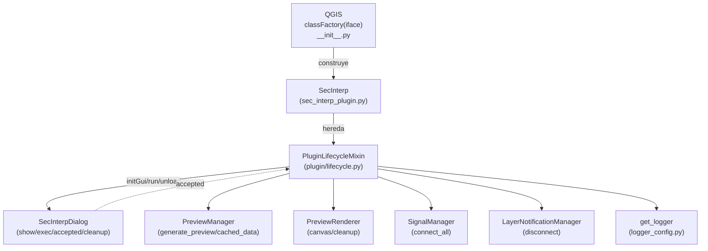
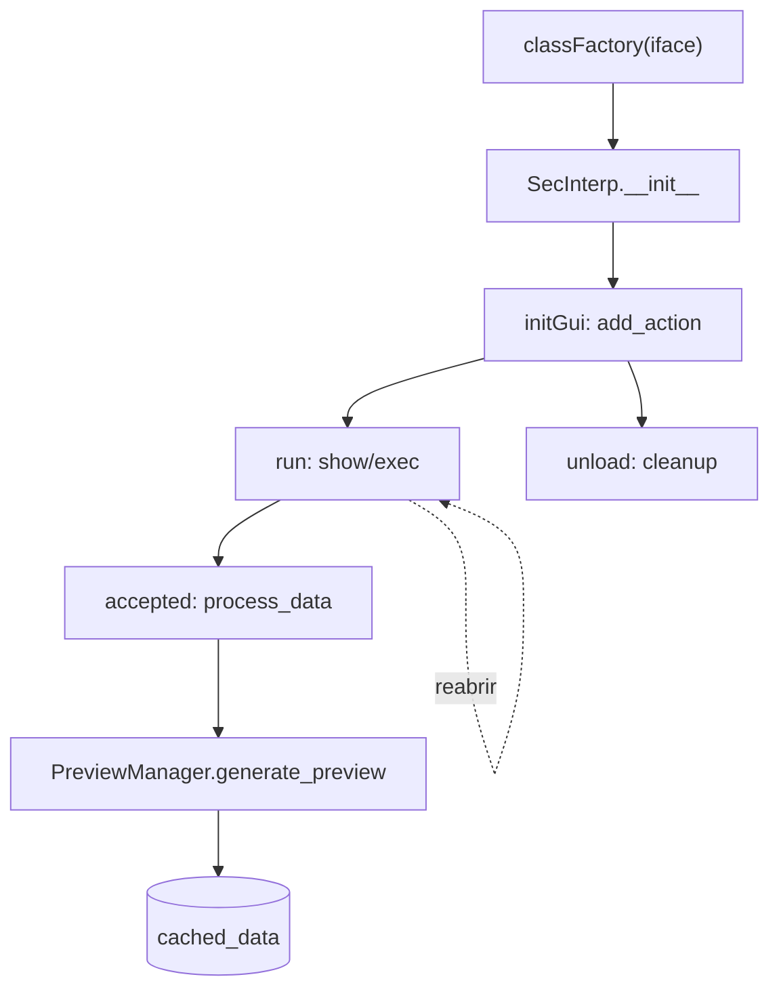

---
tags:
  - secinterp
  - code-walkthrough
  - plugin
aliases:
  - lifecycle.py
  - PluginLifecycleMixin
cssclass: secinterp-note
---

# `plugin/lifecycle.py`

> [!abstract] Resumen en una línea
> Mixin que conecta el plugin con la mecánica de entrada de QGIS (`classFactory` → `initGui`/`unload`), abre el diálogo principal y garantiza una liberación determinista de acciones, señales y renderizador.

**Ruta**: `plugin/lifecycle.py` (167 líneas)
**Clase principal**: `PluginLifecycleMixin`
**Capa**: Plugin / GUI (depende de `qgis.PyQt` y `iface`)
**Tags**: #secinterp #plugin

---

## 🎯 ¿Por qué existe este archivo?

QGIS descubre el plugin por convención (`classFactory`, `initGui`, `unload`) y el
resto del tiempo el plugin solo necesita abrir su diálogo y limpiarse al salir. Sin
este mixin, ese cableado viviría mezclado con la lógica de negocio:

| Problema | Solución |
|----------|----------|
| QGIS exige `initGui`/`unload` con nombres y firmas exactas | `initGui` crea la acción; `unload` la retira junto con toolbar y señales |
| El diálogo es pesado: no debe reconstruirse en cada clic | `run` lo reutiliza y distingue el primer arranque (`first_start`) del resto |
| Señales conectadas y capas en memoria fugan si no se sueltan | `disconnect_signals` + `preview_renderer.cleanup()` + retirada de toolbar en orden fijo |
| Un `unload` que lanza deja el plugin zombi en QGIS | Toda la limpieza usa `contextlib.suppress`; desconectar nunca lanza |

> [!important] Nota arquitectónica
> Es el **Composition Root de la GUI de QGIS**: registra la acción que QGIS
> mostrará y orquesta init → dialog → cleanup. No calcula nada geológico; delega el
> cómputo al diálogo (`preview_manager`) y la validación al mixin [[input_validator]].

---

## 🧬 Diagrama de relaciones



> [!tip] Cómo leer
> Flecha sólida = importa/delega o hereda; punteada = conexión de señal
> (`accepted → process_data`) que se crea en `run` y se suelta en `unload`.

---

## 📦 Imports — lectura arquitectónica

```python
# plugin/lifecycle.py
from __future__ import annotations

import contextlib
from typing import Any

from qgis.PyQt.QtGui import QIcon
from qgis.PyQt.QtWidgets import QAction

from sec_interp.logger_config import get_logger
```

| # | Observación |
|---|-------------|
| ① | `contextlib` es el seguro de la limpieza: `suppress(Exception)` en `unload` y `suppress(TypeError, RuntimeError)` al desconectar señales. |
| ② | `Any` tipa `callback` y `parent` de `add_action`: el mixin acepta cualquier callable sin acoplarse a su firma. |
| ③ | `QIcon` + `QAction` desde `qgis.PyQt` (no `PyQt5` directo): compatibilidad con el shim de QGIS y la migración 4.x. |
| ④ | `QMessageBox` se importa **dentro de `run`**, solo en la rama de error: no cuesta nada en el camino feliz y evita cargar widgets al importar el módulo. |
| ⑤ | Único import interno: `get_logger`. Cero dependencias del core o de la GUI: el mixin habla con el diálogo vía `self.dlg` (duck typing). |
| ⑥ | `initGui` lleva `# noqa: N802`: el nombre camelCase lo impone la API de QGIS y el linter debe perdonarlo. |

---

## 🏗️ Inventario de estructura

**Clases:** `class PluginLifecycleMixin` — 8 métodos, sin `__init__` ni estado propio.

**Funciones/Métodos:**

- `add_action(icon_path, text, callback, enabled_flag=True, add_to_menu=True, add_to_toolbar=True, status_tip=None, whats_this=None, parent=None) -> QAction` — factoría de acciones menú + toolbar.
- `initGui(self) -> None` — punto de entrada QGIS: registra la acción principal.
- `run(self) -> None` — abre (o reutiliza) el diálogo principal.
- `process_data(self, inputs=None) -> tuple | None` — delega el cómputo al `preview_manager`.
- `unload(self) -> None` — retira menú, iconos, toolbar y limpia recursos.
- `disconnect_signals(self) -> None` — desconexión agregada (acciones + diálogo + capas).
- `_disconnect_actions(self) -> None` — suelta `triggered` de cada acción.
- `_disconnect_dialog(self) -> None` — suelta `accepted` y llama a `dlg.cleanup()`.

---

## 📁 Archivos del paquete

Este módulo es uno de los tres mixins documentados en la nota de grupo [[plugin]].
Ver la tabla de archivos del paquete allí; aquí solo el recorrido de este archivo.

---

## 📖 Recorrido método por método

### `add_action` — factoría de acciones

```python
def add_action(
    self,
    icon_path: str,
    text: str,
    callback: Any,
    enabled_flag: bool = True,
    add_to_menu: bool = True,
    add_to_toolbar: bool = True,
    status_tip: str | None = None,
    whats_this: str | None = None,
    parent: Any = None,
) -> QAction:
```

Construye un `QAction` y lo registra en tres sitios:

```python
    icon = QIcon(icon_path)
    action = QAction(icon, text, parent)
    action.triggered.connect(callback)
    action.setEnabled(enabled_flag)

    if status_tip is not None:
        action.setStatusTip(status_tip)

    if whats_this is not None:
        action.setWhatsThis(whats_this)

    if add_to_toolbar:
        self.toolbar.addAction(action)
        self.iface.addToolBarIcon(action)

    if add_to_menu:
        self.iface.addPluginToMenu(self.menu, action)

    self.actions.append(action)

    return action
```

| Detalle | Razón |
|---------|-------|
| Registro doble en toolbar (`self.toolbar.addAction` + `iface.addToolBarIcon`) | La toolbar propia agrupa los iconos; `addToolBarIcon` los expone al sistema de toolbars de QGIS |
| `iface.addPluginToMenu(self.menu, action)` | Coloca la entrada bajo el menú del plugin (`self.menu = tr("&Sec Interp")`, creado en `SecInterp.__init__`) |
| `self.actions.append(action)` | Inventario para retirarlos uno por uno en `unload`; sin esta lista habría fuga de menús |
| `status_tip` / `whats_this` opcionales | Solo se fijan si no son `None`: textos de ayuda sin coste cuando no se usan |
| Retorna el `QAction` | Permite al llamador guardarlo o conectarlo más (extensibilidad de la factoría) |

### `initGui` — punto de entrada QGIS

```python
def initGui(self) -> None:  # noqa: N802
    """Create the menu entries and toolbar icons inside the QGIS GUI."""
    icon_path = str(self.plugin_dir / "icon.png")
    self.add_action(
        icon_path,
        text=self.tr("Geological data extraction"),
        callback=self.run,
        parent=self.iface.mainWindow(),
    )
    self.first_start = True
```

QGIS invoca `initGui` justo después de `classFactory(iface)` (ver `__init__.py` en
la raíz y [[sec_interp_plugin]]). Registra **una sola acción** cuyo `triggered`
dispara `run`, con padre `mainWindow()` para que Qt gestione su vida útil.
`first_start = True` marca que el diálogo aún no se mostró nunca.

### `run` — abrir el diálogo (reutilizable)

```python
def run(self) -> None:
    """Run method that performs all the real work."""
    if not self.dlg:
        from qgis.PyQt.QtWidgets import QMessageBox

        QMessageBox.critical(
            self.iface.mainWindow(),
            self.tr("Initialization Error"),
            self.tr("The plugin dialog failed to initialize. Please check the logs."),
        )
        return
```

Guarda de fallo total: si `SafeLoader` no pudo construir el diálogo en
`SecInterp.__init__`, se informa con un crítico modal y se aborta. Sin este
guardián, el clic en la acción lanzaría `AttributeError` en frío.

```python
    if self.first_start:
        self.first_start = False
        if self.preview_renderer:
            self.preview_renderer.canvas = self.dlg.preview_widget.canvas
        self.dlg.accepted.connect(self.process_data)
```

Solo en el primer arranque: se inyecta el canvas vivo del diálogo en el
`preview_renderer` (el renderer nace sin canvas porque el diálogo aún no existe en
`__init__`; ver [[preview_renderer]]) y se conecta `accepted → process_data` **una
sola vez**. Conectar en cada `run` acumularía llamadas duplicadas al aceptar.

```python
    if hasattr(self.dlg, "signal_manager"):
        self.dlg.signal_manager.connect_all()

    self.dlg._load_interpretations()
    self.dlg._load_user_settings()
    self.dlg.show()
    self.dlg.exec()
```

Cada apertura (incluida la primera): reconecta las señales del diálogo (pueden
haberse soltado), recarga interpretaciones y ajustes de usuario para reflejar
cambios externos, y muestra el diálogo de forma modal (`show()` + `exec()`).

### `process_data` — delegación del cómputo

```python
def process_data(self, inputs: dict[str, Any] | None = None) -> tuple[Any, Any, Any] | None:
    if hasattr(self, "dlg") and self.dlg:
        success, message = self.dlg.preview_manager.generate_preview()
        if not success:
            logger.warning(f"Data processing failed: {message}")
            return None

        cache = self.dlg.preview_manager.cached_data
        return cache["topo"], cache["geol"], cache["struct"]

    return None
```

Es el slot de `accepted` y, a la vez, una API programática (acepta `inputs`
pre-validados aunque hoy no los use: parámetro reservado para llamadas externas).
No calcula nada: `PreviewManager.generate_preview()` (ver
[[preview_task_orchestrator]] y [[dialog_preview_manager]]) orquesta validación,
tareas y caché, y aquí solo se desempaquetan `topo/geol/struct` del caché. Nótese
que el drillhole queda fuera de la tupla: la firma es histórica (topo, geol,
struct) y el render de sondajes viaja por el pipeline de preview, ver
[[render_pipeline]].

### `unload` — salida determinista

```python
def unload(self) -> None:
    """Remove the plugin menu item and icon from QGIS GUI."""
    self.disconnect_signals()

    if self.preview_renderer:
        with contextlib.suppress(Exception):
            self.preview_renderer.cleanup()

    for action in self.actions:
        self.iface.removePluginMenu(self.tr("&Sec Interp"), action)
        self.iface.removeToolBarIcon(action)

    if self.toolbar:
        with contextlib.suppress(Exception):
            self.iface.mainWindow().removeToolBar(self.toolbar)
        del self.toolbar
        self.toolbar = None
```

Orden de apagado (de adentro hacia afuera):

1. `disconnect_signals()` — soltar slots antes de destruir objetos.
2. `preview_renderer.cleanup()` — liberar capas temporales y rubber bands.
3. Retirar cada acción del menú y la toolbar de QGIS.
4. Retirar la toolbar propia de `mainWindow` y ponerla a `None`.

Cada paso destructivo va envuelto en `suppress` o en desconexiones tolerantes:
`unload` lo invoca QGIS al desactivar el plugin y **no puede lanzar**.

### `disconnect_signals` / `_disconnect_actions` / `_disconnect_dialog`

```python
def disconnect_signals(self) -> None:
    """Disconnect all signals to prevent memory leaks."""
    self._disconnect_actions()
    self._disconnect_dialog()
    self.disconnect_layer_notifications()
```

Tres frentes, cada uno tolerante:

```python
def _disconnect_actions(self) -> None:
    for action in self.actions:
        if action:
            with contextlib.suppress(TypeError, RuntimeError):
                action.triggered.disconnect()
```

```python
def _disconnect_dialog(self) -> None:
    if hasattr(self, "dlg") and self.dlg:
        with contextlib.suppress(TypeError, RuntimeError):
            self.dlg.accepted.disconnect(self.process_data)

        if hasattr(self.dlg, "cleanup"):
            with contextlib.suppress(Exception):
                self.dlg.cleanup()
```

| Detalle | Razón |
|---------|-------|
| `suppress(TypeError, RuntimeError)` | `disconnect()` sin conexión previa lanza `TypeError`; un objeto C++ ya borrado lanza `RuntimeError`. Ambos son normales al apagar. |
| `hasattr(self.dlg, "cleanup")` | El diálogo puede ser un mock en tests o una versión sin limpieza: duck typing defensivo. |
| `disconnect_layer_notifications()` | Cierra el tercer frente: señales `dataChanged` de capas (ver [[input_validator]] y [[layer_notification_manager]]). |

---

## 🔄 Flujo de datos

| Fase | Actor QGIS | Acción del mixin | Resultado |
|------|-----------|------------------|-----------|
| Descubrimiento | `classFactory(iface)` en `__init__.py` | construye `SecInterp(iface)` | instancia viva |
| Registro | QGIS llama `initGui()` | `add_action(icon.png, tr, run)` | menú + icono + toolbar |
| Primer uso | clic → `triggered` → `run()` | inyecta canvas, conecta `accepted`, muestra diálogo | `first_start = False` |
| Aceptar | `accepted` → `process_data()` | `generate_preview()` + desempaqueta caché | `(topo, geol, struct)` o `None` |
| Reapertura | clic → `run()` | reconecta señales, recarga ajustes, `show/exec` | diálogo fresco con estado previo |
| Salida | QGIS llama `unload()` | desconecta, limpia renderer, retira UI | sin fugas ni zombis |



---

## 🧭 CRS y contexto de transformación

Este mixin **no toca CRS ni transformaciones de coordenadas**: trabaja con acciones,
diálogo y caché, nunca con geometrías. El contexto de transformación
(`QgsCoordinateTransformContext`) se obtiene aguas abajo en
`PreviewManager._get_transform_context()` y se consume en el render y los
extractores. La decisión es correcta: el ciclo de vida no debe saber en qué
proyección se dibuja; solo garantiza que el renderer tenga su canvas antes del
primer `render()`.

---

## 🏛️ Patrones de diseño presentes

| Patrón | Dónde | Propósito |
|--------|-------|-----------|
| **Plugin entry (convención QGIS)** | `classFactory` + `initGui`/`unload` | Ciclo de vida impuesto por el host |
| **Mixin** | clase sin estado sobre `SecInterp` | Separar ciclo de vida de validación y render |
| **Lazy wiring** | canvas y `accepted` solo en `first_start` | No pagar el cableado hasta el primer uso |
| **Defensive teardown** | `suppress` en todo `unload` | Apagado que nunca lanza |
| **Facade delegation** | `process_data` → `preview_manager` | El mixin no computa; delega |

---

## 🧾 Resumen de la API

| Símbolo | Firma | Uso típico |
|---------|-------|------------|
| `PluginLifecycleMixin` | mixin sin `__init__` | heredado por `SecInterp` |
| `add_action` | `(icon_path, text, callback, ...) -> QAction` | registrar acciones menú + toolbar |
| `initGui` | `() -> None` | llamado por QGIS al cargar |
| `run` | `() -> None` | slot de la acción principal |
| `process_data` | `(inputs=None) -> tuple \| None` | slot de `accepted` / API programática |
| `unload` | `() -> None` | llamado por QGIS al desactivar |
| `disconnect_signals` | `() -> None` | limpieza agregada de señales |
| `_disconnect_actions` / `_disconnect_dialog` | `() -> None` | limpieza por frente |

---

## 🛡️ Manejo de errores

| Situación | Comportamiento |
|-----------|----------------|
| `self.dlg` es `None` en `run` | `QMessageBox.critical` + `return` (falla visible, no excepción) |
| `preview_renderer` es `None` | se omite la inyección de canvas y la limpieza (guardas `if`) |
| `generate_preview` falla | `logger.warning` + `return None` |
| Desconectar señales ya sueltas | `suppress(TypeError, RuntimeError)` |
| Capas u objetos C++ borrados | `suppress(Exception)` en `cleanup` y toolbar |
| `dlg` sin `signal_manager`/`cleanup` | `hasattr` antes de tocar |

---

## 🧪 Tests asociados

No existe un módulo dedicado `tests/plugin/test_lifecycle.py`; la cadena se cubre
por piezas:

- `tests/gui/test_dialog_preview_manager.py` — `generate_preview()` y `cached_data`, el corazón de `process_data`.
- `tests/gui/test_main_dialog_signals_wiring.py` — conexiones de señales del diálogo.
- `tests/gui/test_main_dialog_core.py` — construcción del diálogo que `run` reutiliza.
- `tests/integration/test_preview_pipeline.py` — pipeline completo preview → caché.
- `tests/integration/test_qgis_smoke.py` — humo de carga del plugin en QGIS real.

> [!note] Hueco de cobertura honesto
> `initGui`/`unload` solo se ejercitan con QGIS vivo (mocks de `iface` mediante
> `tests/mocks/` o el smoke test). `add_action` sí sería testeable con un `iface`
> mockeado: registrar, comprobar `actions` y retirar.

---

## 👀 Observaciones y notas

> [!success] Fortalezas
> - `unload` determinista y tolerante: cuatro frentes de limpieza en orden correcto.
> - `first_start` evita conexiones duplicadas de `accepted` (bug clásico de plugins).
> - Inyección tardía del canvas: el renderer no necesita el diálogo en `__init__`.
> - `process_data` reutilizable como API además de slot.

> [!warning] Puntos de atención
> - La tupla de `process_data` omite el drillhole (`topo/geol/struct`): firma histórica que desinforma sobre el caché real.
> - El parámetro `inputs` de `process_data` hoy no se usa: API reservada sin documentar.
> - `unload` retira el menú con `self.tr("&Sec Interp")` mientras el registro usó `self.menu`: mismo texto hoy, pero dos fuentes de verdad.
> - `run` llama métodos privados del diálogo (`_load_interpretations`, `_load_user_settings`): acoplamiento a su interior.

> [!question] Preguntas abiertas
> - ¿Incluir `drill` en la tupla de `process_data` o documentar por qué se excluye?
> - ¿Exponer `inputs` de verdad en `process_data` o eliminarlo de la firma?

---

## 🔗 Notas relacionadas

- [[Index]] — índice de la bóveda
- [[plugin]] — nota de grupo del paquete `plugin/`
- [[sec_interp_plugin]] — `SecInterp.__init__`: construye diálogo, renderer y managers
- [[input_validator]] — validación en la frontera antes del cómputo
- [[render_pipeline]] — dibujo del preview tras `generate_preview`
- [[main_dialog]] — diálogo reutilizado por `run`
- [[dialog_preview_manager]] — `generate_preview()` y `cached_data`
- [[preview_renderer]] — `canvas` y `cleanup()`
- [[preview_task_orchestrator]] — orquestación asíncrona del preview
- [[layer_notification_manager]] — desconexión de `dataChanged`
- [[controller]] — `ProfileController`, destino final de los parámetros
- [[logger_config]] — `get_logger`

---

*Nota de la bóveda SecInterp Code Walkthrough v2 — v3.9.1*
