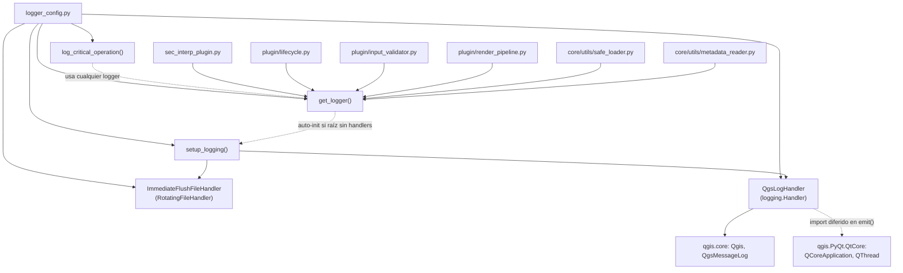

---
tags:
  - secinterp
  - code-walkthrough
  - root
  - logging
aliases:
  - logger_config.py
  - get_logger
  - setup_logging
cssclass: secinterp-note
---

# `logger_config.py`

> [!abstract] Resumen en una línea
> Configuración centralizada de logging del plugin: jerarquía `SecInterp.*` con tres destinos (panel de mensajes QGIS, archivo rotativo con `fsync` y `stderr`) y un handler seguro para hilos secundarios.

**Ruta**: `logger_config.py` (220 líneas)
**Clase/Función principal**: `get_logger`, `setup_logging`
**Capa**: Root / bootstrap (usa `qgis.core` solo para el sumidero de mensajes)
**Tags**: #secinterp #root #logging

---

## 🎯 ¿Por qué existe este archivo?

Sin un punto central, cada módulo crearía su propio logger con formatos y destinos
distintos, y los mensajes de hilos secundarios (`QgsTask`) colgarían o romperían QGIS
al tocar la GUI. Este módulo resuelve ambos problemas:

| Problema | Solución |
|----------|----------|
| Loggers dispersos sin formato ni destino común | Jerarquía única `SecInterp.*` configurada una vez en `setup_logging()` |
| `QgsMessageLog` invocado desde hilos secundarios provoca cuelgues | `QgsLogHandler` comprueba el hilo y deriva a `stderr` con marca `(BG)` |
| Un crash de QGIS pierde los logs en buffer | `ImmediateFlushFileHandler` hace `flush` + `os.fsync` tras cada registro |
| Módulos y tests necesitan loggers sin inicializar todo el plugin | `get_logger()` auto-inicializa la raíz si aún no tiene handlers |

> [!important] Nota arquitectónica
> Es infraestructura transversal, no lógica de negocio: todo el proyecto (plugin,
> `plugin/`, `core/utils/`) obtiene su logger con `get_logger(__name__)`. Los mensajes
> de log **no se traducen** (tags fijos `SecInterp`, `CRITICAL_OP`).

---

## 🧬 Diagrama de relaciones



> [!tip] Cómo leer
> Flecha sólida = importa/instancia; punteada = uso diferido o condicional. Todos los
> consumidores entran por `get_logger`, nunca instancian handlers directamente.

---

## 📦 Imports — lectura arquitectónica

```python
# logger_config.py
from __future__ import annotations

import logging
import os
import sys
from logging.handlers import RotatingFileHandler
from pathlib import Path
from typing import Any

from qgis.core import Qgis, QgsMessageLog
```

| # | Observación |
|---|-------------|
| ① | `from __future__ import annotations` + sintaxis `str \| None`: estándar del proyecto. |
| ② | Solo stdlib (`logging`, `os`, `sys`, `pathlib`, `typing`): el núcleo de logging es portable. |
| ③ | `from qgis.core import Qgis, QgsMessageLog` es la **única** dependencia QGIS, y solo se usa como sumidero de salida, nunca para leer capas o proyecto. |
| ④ | `QCoreApplication`/`QThread` se importan **dentro** de `QgsLogHandler.emit()`: import diferido para no exigir la app Qt al importar el módulo (tests, arranque temprano). |
| ⑤ | `datetime` se importa dentro de `log_critical_operation()`: mismo criterio, carga perezosa de lo accesorio. |

---

## 🏗️ Inventario de estructura

**Constantes:**

- `ROOT_LOGGER_NAME = "SecInterp"` — nombre de la raíz de la jerarquía y tag del panel QGIS.

**Clases (2):**

- `class ImmediateFlushFileHandler(RotatingFileHandler)` — fichero con volcado inmediato.
- `class QgsLogHandler(logging.Handler)` — puente hacia `QgsMessageLog`, seguro en hilos.

**Funciones (3):**

- `setup_logging(level: int = logging.DEBUG) -> logging.Logger` — configuración idempotente, una sola vez.
- `get_logger(name: str | None = None) -> logging.Logger` — factoría con jerarquía y auto-init.
- `log_critical_operation(logger, operation_name, **context) -> None` — traza de máxima persistencia antes de operaciones que podrían colgar QGIS.

---

## 📁 Archivos del paquete

`logger_config.py` vive en la **raíz del proyecto**, junto al punto de entrada del plugin:

| Archivo | Líneas | Rol |
|---|--:|---|
| [[logger_config]] | 220 | Configuración central de logging (esta nota) |
| [[sec_interp_plugin]] | 129 | Clase `SecInterp`: llama a `setup_logging()` al arrancar |
| `__init__.py` | 49 | `classFactory(iface)`: importa `SecInterp` de forma perezosa |
| `run_qgis_manage.py` | 11 | Script de desarrollo para la CLI `qgis-manage` |

> [!note] El logger es previo a todo
> `SecInterp.__init__` invoca `setup_logging()` **antes** de cargar servicios, extractores
> y el diálogo, de modo que cualquier fallo posterior ya queda registrado en los tres
> destinos. Ver [[sec_interp_plugin]] y [[root]].

---

## 📖 Recorrido símbolo por símbolo

### `ImmediateFlushFileHandler` — fichero a prueba de crashes

```python
class ImmediateFlushFileHandler(RotatingFileHandler):
    def emit(self, record: logging.LogRecord) -> None:
        super().emit(record)
        self.flush()
        # Force OS-level write to disk (slower but safer for crash analysis)
        try:
            if hasattr(self.stream, "fileno"):
                os.fsync(self.stream.fileno())
        except (OSError, AttributeError):
            # If fsync fails, continue anyway
            pass
```

Hereda la rotación de `RotatingFileHandler` (10 MB × 5 copias, ver `setup_logging`) y añade
persistencia agresiva: tras `super().emit(record)` fuerza `flush()` y luego `os.fsync()`
para que el sistema operativo escriba físicamente a disco. El `try/except (OSError,
AttributeError)` con `pass` es deliberado: si el `fsync` falla (stream sin descriptor,
disco lleno), el logging nunca debe romper el flujo principal.

| Aspecto | Detalle |
|---------|---------|
| Hereda de | `logging.handlers.RotatingFileHandler` |
| Garantía | Cada registro llega a disco antes de un posible crash |
| Coste | Más lento (llamada al SO por registro); aceptado por diagnóstico |
| Fallo de `fsync` | Silencioso por diseño (`pass`), no interrumpe |

> [!warning] `fsync` por registro: decisión forense, no de rendimiento; no reutilizar esta clase en bucles calientes.

### `QgsLogHandler` — puente seguro al panel de QGIS

```python
def __init__(self, tag: str = "SecInterp") -> None:
    super().__init__()
    self.tag = tag

def emit(self, record: logging.LogRecord) -> None:
    try:
        from qgis.PyQt.QtCore import QCoreApplication, QThread

        msg = self.format(record)

        # Map Python logging levels to QGIS levels
        if record.levelno >= logging.ERROR:
            level = Qgis.MessageLevel.Critical
        elif record.levelno >= logging.WARNING:
            level = Qgis.MessageLevel.Warning
        elif record.levelno >= logging.INFO:
            level = Qgis.MessageLevel.Info
        else:
            level = Qgis.MessageLevel.Info

        # Critical: UI updates from background threads cause segfaults in QGIS
        instance = QCoreApplication.instance()
        if instance and QThread.currentThread() == instance.thread():
            QgsMessageLog.logMessage(msg, self.tag, level)
        else:
            # Fallback to standard error for background threads
            sys.stderr.write(f"[{self.tag}] (BG) {msg}\n")
    except Exception:
        self.handleError(record)
```

Tres ideas en un solo `emit()`:

1. **Mapeo de niveles**: `ERROR+` → `Critical`, `WARNING` → `Warning`, resto → `Info`. Nótese que `DEBUG` también cae en `Info` de QGIS, pero el handler se registra con nivel `INFO`, así que el `DEBUG` nunca llega al panel (solo al fichero).
2. **Guarda de hilo**: compara `QThread.currentThread()` con el hilo de la aplicación. Solo el hilo principal puede tocar `QgsMessageLog`; desde un `QgsTask` el mensaje va a `stderr` marcado con `(BG)`, evitando segfaults.
3. **Nunca rompe**: cualquier excepción interna termina en `self.handleError(record)`, el mecanismo estándar de `logging` para fallos de handler.

> [!important] Sin i18n en los tags
> El `tag` (`"SecInterp"`) y la marca `(BG)` son **literales fijos**, no pasan por `tr()`.
> Los logs son artefactos de diagnóstico, no texto de UI, y deben ser grepeables en
> cualquier idioma. Ver [[lifecycle]] para el contraste con los strings de menú.

### `setup_logging` — configuración idempotente

```python
def setup_logging(level: int = logging.DEBUG) -> logging.Logger:
    root_logger = logging.getLogger(ROOT_LOGGER_NAME)

    # Only configure if not already configured
    if not root_logger.handlers:
        root_logger.setLevel(level)

        # 1. Create QGIS message log handler (for UI)
        qgis_handler = QgsLogHandler(tag=ROOT_LOGGER_NAME)
        qgis_handler.setLevel(logging.INFO)
        qgis_formatter = logging.Formatter("%(levelname)s - %(message)s")
        qgis_handler.setFormatter(qgis_formatter)
        root_logger.addHandler(qgis_handler)

        # 2. Create file handler for detailed crash analysis
        try:
            root_dir = Path(__file__).parent
            log_dir = root_dir / "logs"
            log_dir.mkdir(exist_ok=True)
            log_file = log_dir / "sec_interp_debug.log"

            file_handler = ImmediateFlushFileHandler(
                log_file,
                maxBytes=10 * 1024 * 1024,  # 10MB
                backupCount=5,
                encoding="utf-8",
            )
            file_handler.setLevel(logging.DEBUG)
            file_formatter = logging.Formatter(
                "%(asctime)s | %(levelname)-8s | %(name)s | "
                "%(funcName)s:%(lineno)d | Thread-%(thread)d | %(message)s",
                datefmt="%Y-%m-%d %H:%M:%S",
            )
            file_handler.setFormatter(file_formatter)
            root_logger.addHandler(file_handler)

            # 3. Add stderr handler as backup for crash scenarios
            stderr_handler = logging.StreamHandler(sys.stderr)
            stderr_handler.setLevel(logging.WARNING)
            stderr_handler.setFormatter(file_formatter)
            root_logger.addHandler(stderr_handler)

            root_logger.debug(f"Logging system initialized. Root Level: {level}")
            root_logger.debug(f"File logging path: {log_file}")

        except Exception as e:
            QgsMessageLog.logMessage(
                f"Warning: Could not initialize file logging: {e}",
                ROOT_LOGGER_NAME,
                Qgis.MessageLevel.Warning,
            )

        root_logger.propagate = True

    return root_logger
```

El guarda `if not root_logger.handlers` hace la función **idempotente**: llamarla dos veces
(recargas del plugin con *Plugin Reloader*, tests) no duplica handlers ni mensajes.

| Destino | Nivel | Formato | Propósito |
|---------|-------|---------|-----------|
| `QgsLogHandler` (panel QGIS) | `INFO` | `%(levelname)s - %(message)s` | Lo que ve el usuario |
| `ImmediateFlushFileHandler` (`logs/sec_interp_debug.log`) | `DEBUG` | timestamp, nivel, `name`, `funcName:lineno`, `Thread-id`, mensaje | Diagnóstico forense |
| `StreamHandler(sys.stderr)` | `WARNING` | mismo formato detallado | Respaldo si QGIS muere |

Detalles finos:

- `log_dir.mkdir(exist_ok=True)`: crea `logs/` junto a `logger_config.py` (raíz del plugin instalado) sin fallar si ya existe.
- Rotación `maxBytes=10MB, backupCount=5`: tope de ~60 MB en disco.
- Si el fichero falla (permisos, disco), se registra un `Warning` en el panel QGIS y el plugin sigue solo con ese destino: **el logging nunca impide arrancar**.
- `root_logger.propagate = True`: los hijos `SecInterp.*` propagan a la raíz (valor por defecto de `logging`, aquí explícito como documentación).

### `get_logger` — factoría con jerarquía

```python
def get_logger(name: str | None = None) -> logging.Logger:
    if name is None or name == ROOT_LOGGER_NAME:
        return logging.getLogger(ROOT_LOGGER_NAME)

    full_name = name if name.startswith(ROOT_LOGGER_NAME + ".") else f"{ROOT_LOGGER_NAME}.{name}"
    logger = logging.getLogger(full_name)

    # Auto-initialize if root has no handlers (for tests or standalone usage)
    root = logging.getLogger(ROOT_LOGGER_NAME)
    if not root.handlers and name != ROOT_LOGGER_NAME:
        setup_logging()

    return logger
```

Normaliza cualquier `__name__` (p. ej. `sec_interp.core.controller`) a la jerarquía
`SecInterp.<name>`, salvo que ya lleve el prefijo. El auto-init cubre el uso en tests y
módulos importados antes de `SecInterp.__init__`: si la raíz no tiene handlers, configura
todo al vuelo. Patrón de uso canónico en cada módulo consumidor:

```python
from sec_interp.logger_config import get_logger

logger = get_logger(__name__)
```

### `log_critical_operation` — traza pre-crash

```python
def log_critical_operation(logger: logging.Logger, operation_name: str, **context: Any) -> None:
    import datetime

    msg = f"CRITICAL_OP: {operation_name}"
    if context:
        ctx_str = ", ".join(f"{k}={v}" for k, v in context.items())
        msg += f" | {ctx_str}"

    logger.debug(msg)

    timestamp = datetime.datetime.now().strftime("%Y-%m-%d %H:%M:%S.%f")[:-3]
    sys.stderr.write(f"[{timestamp}] {msg}\n")
    sys.stderr.flush()

    try:
        if hasattr(sys.stderr, "fileno"):
            os.fsync(sys.stderr.fileno())
    except (OSError, AttributeError):
        pass
```

Doble escritura: por los canales normales (`logger.debug`) **y** directa a `stderr` con
timestamp de milisegundos, saltándose todos los buffers. Pensada para llamarse **antes**
de operaciones que podrían colgar QGIS (canvas, rubber bands, activación de tools), de
modo que el log forense siempre contenga la última operación intentada.

---

## 🔄 Flujo de datos

| Fase | Entrada | Transformación | Salida |
|------|---------|----------------|--------|
| Arranque | `SecInterp.__init__` | `setup_logging()` idempotente | raíz `SecInterp` con 3 handlers |
| Obtención | `get_logger(__name__)` | prefijo `SecInterp.` + auto-init | logger jerárquico |
| Emisión UI | `LogRecord` en hilo principal | mapeo de nivel + formato corto | `QgsMessageLog` con tag `SecInterp` |
| Emisión BG | `LogRecord` en `QgsTask` | formato corto | `stderr` con marca `(BG)` |
| Emisión fichero | cualquier `LogRecord` ≥ `DEBUG` | formato detallado + `flush`/`fsync` | `logs/sec_interp_debug.log` (+ rotación) |
| Pre-crash | `operation_name` + contexto | `CRITICAL_OP:` + timestamp | `debug` + `stderr` sin buffer |

---

## 🧵 Modelo de hilos

| Hilo | Destino permitido | Mecanismo |
|------|-------------------|-----------|
| Principal (GUI) | `QgsMessageLog` | `QThread.currentThread() == instance.thread()` |
| Secundario (`QgsTask`) | `stderr` con `(BG)` | rama `else` de `QgsLogHandler.emit` |
| Cualquiera | fichero + `stderr` | handlers de `logging`, thread-safe por diseño |

> [!tip] `logging` ya serializa `emit()` con un lock por handler; la guarda de este módulo evita **tocar Qt desde el hilo equivocado**, que es lo que realmente rompe QGIS.

---

## 🏛️ Patrones de diseño presentes

| Patrón | Dónde | Propósito |
|--------|-------|-----------|
| **Factory** | `get_logger()` | Punto único de creación con normalización de nombres |
| **Idempotent init** | guarda `if not root_logger.handlers` | Recargas y tests sin handlers duplicados |
| **Adapter** | `QgsLogHandler` | Adapta `logging.Handler` a `QgsMessageLog` |
| **Decorator (handler)** | `ImmediateFlushFileHandler` | Extiende rotación con persistencia inmediata |
| **Fail-safe** | `except ...: pass` / `handleError` | El logging nunca rompe el flujo principal |
| **Lazy import** | `QCoreApplication` en `emit()` | Módulo importable sin app Qt viva |

---

## 🧾 Resumen de la API

| Símbolo | Firma / Hereda | Uso típico |
|---------|----------------|------------|
| `ROOT_LOGGER_NAME` | `= "SecInterp"` | Nombre raíz y tag QGIS |
| `ImmediateFlushFileHandler` | `(RotatingFileHandler)` | Handler de fichero forense |
| `QgsLogHandler` | `(logging.Handler)` | Puente al panel de mensajes |
| `setup_logging` | `(level=DEBUG) -> Logger` | Una vez, en `SecInterp.__init__` |
| `get_logger` | `(name=None) -> Logger` | `logger = get_logger(__name__)` por módulo |
| `log_critical_operation` | `(logger, operation_name, **context) -> None` | Antes de operaciones que podrían colgar QGIS |

---

## 🛡️ Manejo de errores

| Caso | Comportamiento |
|------|---------------|
| `fsync` falla en fichero | `except (OSError, AttributeError): pass` — continúa |
| `QgsMessageLog` falla en `emit` | `self.handleError(record)` — canal estándar de `logging` |
| `logs/` no se puede crear | `Warning` en el panel QGIS; solo queda el destino UI |
| `setup_logging` repetido | No-op por el guarda de handlers |
| Logger pedido antes de init | Auto-init vía `get_logger` |

```python
# El logging nunca debe lanzar: patrón del módulo
try:
    if hasattr(self.stream, "fileno"):
        os.fsync(self.stream.fileno())
except (OSError, AttributeError):
    pass
```

---

## 🧪 Tests asociados

No hay un `tests/**/test_logger_config.py` dedicado; la cobertura es indirecta pero real:

- Cada suite que importa un módulo con `logger = get_logger(__name__)` ejercita el auto-init de `get_logger` (los mocks QGIS de `tests/base_test.py` y `tests/mocks/` permiten importar `qgis.core` fuera de QGIS).
- `tests/core/utils/test_metadata_reader.py` — ejercita rutas `logger.error/exception/debug` de un consumidor directo.
- `tests/core/utils/test_safe_loader_di.py` — ejercita `logger.exception` en `SafeLoader.safe_import`.
- `tests/test_translation_loading.py` — instancia `SecInterp`, luego `setup_logging()` en `__init__` (idempotente entre tests).

> [!note] Lagunas honestas
> No hay tests que verifiquen el mapeo de niveles a `Qgis.MessageLevel`, la rama `(BG)`
> de hilos secundarios ni la rotación del fichero. Serían unit tests puros con `logging`
> + mocks, sin necesidad de QGIS real.

---

## 👀 Observaciones y notas

> [!success] Fortalezas
> - Tres destinos complementarios: UI (panel), forense (fichero con `fsync`) y respaldo (`stderr`).
> - Seguro en `QgsTask` por construcción: la guarda de hilo evita segfaults de Qt.
> - Idempotente y auto-inicializable: robusto ante recargas del plugin y tests.
> - El logging jamás rompe el flujo: todos los fallos internos se degradan con gracia.

> [!warning] Puntos de atención
> - El fichero `DEBUG` crece hasta ~60 MB (10 MB × 5 + activo) sin limpieza por antigüedad.
> - `logs/` se crea junto al plugin instalado; en perfiles sin permiso de escritura solo queda el destino UI.
> - `DEBUG` se mapea a `Info` en QGIS pero el handler UI filtra en `INFO`: coherente, aunque el mapeo `else → Info` oculta la distinción.
> - `propagate = True` es el defecto de `logging`; la línea es documentación, no cambio.

> [!question] Preguntas abiertas
> - ¿Rotación por tiempo además de tamaño para acotar la antigüedad de los logs?
> - ¿Exponer la ruta del log en el diálogo (página de ayuda) para facilitar reportes?
> - ¿Añadir `test_logger_config.py` puro (niveles, rama BG, idempotencia)?

---

## 🔗 Notas relacionadas

- [[Index]] — índice de la bóveda
- [[sec_interp_plugin]] — invoca `setup_logging()` al arrancar el plugin
- [[root]] — grupo raíz donde vive este módulo
- [[safe_loader]] — consumidor que logea fallos de importación con `logger.exception`
- [[metadata_reader]] — consumidor con rutas `error`/`exception`/`debug`
- [[lifecycle]] — usa `logger.warning` en `process_data`; contrasta con sus strings traducibles
- [[controller]] — orquestador cuyos servicios logean vía esta jerarquía

---

*Nota de la bóveda SecInterp Code Walkthrough v2 — v3.9.1*
