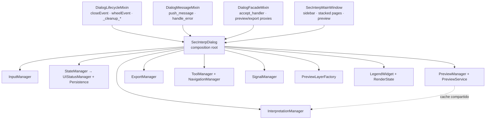

---
tags:
  - secinterp
  - code-walkthrough
  - gui
  - dialog
aliases:
  - main_dialog.py
  - SecInterpDialog
cssclass: secinterp-note
note_lines: 700
---

# `gui/main_dialog.py`

> [!abstract] Resumen en una línea
> Raíz de composición del diálogo principal: `SecInterpDialog` combina tres mixins (`Lifecycle`, `Message`, `Facade`) con `SecInterpMainWindow` y cablea nueve managers especializados en `_init_managers`.

**Ruta**: `gui/main_dialog.py` (193 líneas)
**Clase principal**: `SecInterpDialog(DialogLifecycleMixin, DialogMessageMixin, DialogFacadeMixin, SecInterpMainWindow)`
**Capa**: GUI (QDialog · Composition Root)
**Tags**: #secinterp #gui #dialog

---

## 🎯 ¿Por qué existe este archivo?

El diálogo creció hasta necesitar validación, preview, exportación, interpretación, herramientas de mapa y persistencia. Sin una raíz de composición, el `__init__` mezclaría construcción de UI, cableado de señales, i18n y limpieza. Este módulo resuelve eso delegando cada responsabilidad:

| Problema | Solución |
|----------|----------|
| Un `QDialog` monolítico con decenas de responsabilidades | Composición por mixins + nueve managers especializados |
| Limpieza de recursos dispersa entre `accept`, `reject` y cierre de ventana | `DialogLifecycleMixin.closeEvent` centraliza el teardown |
| Mensajes duplicados entre message bar de QGIS y panel del plugin | `DialogMessageMixin.push_message` con doble destino |
| El diálogo no debe conocer los detalles internos de cada manager | `DialogFacadeMixin` expone proxies delgados (`preview_profile_handler`, `accept_handler`) |
| Tests y arranque sin QGIS (`iface=None`) | `_NoOpMessageBar` evita `AttributeError` en `pushMessage` |

> [!important] Nota arquitectónica
> Este archivo es el **composition root** de la GUI: no contiene lógica de negocio ni cálculo geológico. Construye, conecta y destruye. Todo lo que sea "Compute" vive en `core/`; todo lo que sea "Extract/Present" vive en managers, extractors y páginas.

---

## 🧬 MRO y raíz de composición



> [!tip] Cómo leer
> Flecha sólida = herencia o construcción; punteada = colaboración en tiempo de ejecución (`PreviewCache` compartido entre preview e interpretación).

El orden de herencia es intencional y define la resolución de métodos:

| Posición MRO | Mixin / base | Qué aporta a la resolución |
|---|---|---|
| 1 | `DialogLifecycleMixin` | `closeEvent` y `wheelEvent` ganan a `QDialog` |
| 2 | `DialogMessageMixin` | `push_message`, `handle_error` |
| 3 | `DialogFacadeMixin` | Proxies (`update_button_state`, `accept_handler`, `getThemeIcon`) |
| 4 | `SecInterpMainWindow` | UI programática (`QDialog` + sidebar + páginas + preview) |

> [!note] `super().__init__(iface, parent)` y la cadena de constructores
> `SecInterpDialog.__init__` llama `super().__init__(iface, parent)`. Los mixins no definen `__init__`, así que la llamada atraviesa la MRO hasta `SecInterpMainWindow.__init__(iface, parent)`, que a su vez invoca `QDialog.__init__(parent)`.

---

## 📦 Imports — lectura arquitectónica

```python
# gui/main_dialog.py
from __future__ import annotations

from pathlib import Path
from typing import Any

from qgis.core import Qgis, QgsProject
from qgis.PyQt.QtCore import QSettings, QUrl
from qgis.PyQt.QtGui import QDesktopServices
from qgis.PyQt.QtWidgets import QDialogButtonBox, QPushButton

from sec_interp.gui.dialog_facade_mixin import DialogFacadeMixin        # ①
from sec_interp.gui.dialog_lifecycle_mixin import DialogLifecycleMixin
from sec_interp.gui.dialog_message_mixin import DialogMessageMixin
from sec_interp.gui.utils import show_user_message
from sec_interp.logger_config import get_logger

from .dialog_export_manager import ExportManager                        # ②
from .dialog_input_manager import InputManager
from .dialog_interpretation_manager import InterpretationManager
from .dialog_preview_manager import PreviewManager
from .dialog_signal_manager import SignalManager
from .dialog_state_manager import StateManager
from .dialog_tool_manager import NavigationManager, ToolManager
from .legend_widget import LegendWidget
from .preview_layer_factory import PreviewLayerFactory
from .preview_state import PreviewCache, RenderState
from .ui.main_window import SecInterpMainWindow
```

| # | Observación |
|---|-------------|
| ① | Los mixins se importan con ruta absoluta (`sec_interp.gui.*`); los managers con relativa (`.dialog_*`). Convención del paquete: lo reutilizable, absoluto; lo interno del diálogo, relativo. |
| ② | Nueve managers + `LegendWidget` + `PreviewLayerFactory` + `PreviewCache/RenderState`: todo el grafo de colaboración se declara aquí. Es la firma visual del composition root. |
| ③ | `Qgis` (niveles de mensaje), `QgsProject` (instancia del proyecto), `QSettings`/`QUrl`/`QDesktopServices` (solo para `open_help`) — imports QGIS mínimos y justificados. |
| ④ | `PreviewService` y `Pages` se importan **dentro** de `_init_managers` (imports diferidos) para evitar ciclos entre `gui` y `core.services` en tiempo de carga. |

---

## 🏗️ Inventario de estructura

**Clases:** `_NoOpMessageBar` (fallback), `SecInterpDialog` (principal)

**Métodos de `SecInterpDialog`:**

- `__init__(iface=None, plugin_instance=None, parent=None)` — construcción y cableado
- `_init_managers()` — instanciación de los nueve managers + cableado cruzado
- `show_dialog(title, message, level="info")` — message box modal via `show_user_message`
- `open_help()` — apertura de ayuda HTML según locale con cadena de fallback
- `validate_inputs()` — delega en `InputManager` y muestra el error si falla

---

## 📁 Familia `dialog_*` del paquete `gui/`

`main_dialog.py` no vive solo: cada sufijo es una responsabilidad extraída del antiguo diálogo monolítico.

| Módulo | Rol | Nota |
|---|---|---|
| `dialog_dependencies.py` | Contenedor `Pages` (dataclass) | [[dialog_dependencies]] |
| `dialog_lifecycle_mixin.py` | `closeEvent`, `wheelEvent`, `_cleanup_*` | [[dialog_lifecycle_mixin]] |
| `dialog_message_mixin.py` | `push_message`, `handle_error` | [[dialog_message_mixin]] |
| `dialog_facade_mixin.py` | Proxies hacia managers | [[dialog_facade_mixin]] |
| `dialog_input_manager.py` | Lectura y validación de inputs | [[dialog_input_manager]] |
| `dialog_state_manager.py` | Estado visual + persistencia | [[dialog_state_manager]] |
| `dialog_preview_manager.py` | Generación de preview | [[dialog_preview_manager]] |
| `dialog_export_manager.py` | Exportación | [[dialog_export_manager]] |
| `dialog_interpretation_manager.py` | Polígonos interpretados | [[dialog_interpretation_manager]] |
| `dialog_signal_manager.py` | Conexión centralizada de señales | [[dialog_signal_manager]] |
| `dialog_tool_manager.py` | `ToolManager` + `NavigationManager` | [[dialog_tool_manager]] |
| `main_dialog_config.py` | Defaults, constantes y mensajes i18n | [[main_dialog_config]] |
| `main_dialog_utils.py` | `DialogEntityManager` (capas, campos, iconos) | [[main_dialog_utils]] |

---

## 📖 Recorrido método por método

### `_NoOpMessageBar` — fallback sin QGIS

```python
class _NoOpMessageBar:
    """Safe no-op messagebar when iface is not available."""

    def pushMessage(self, *_args, **_kwargs) -> None:
        """No-op implementation of pushMessage."""
        return None
```

Objeto Null que replica la única superficie usada (`pushMessage`). Permite instanciar el diálogo con `iface=None` en tests y en modo degradado sin ramificar cada llamada con `if self.messagebar:`.

### Declaración de clase y docstring

```python
class SecInterpDialog(
    DialogLifecycleMixin,
    DialogMessageMixin,
    DialogFacadeMixin,
    SecInterpMainWindow,
):
```

El docstring documenta los tres atributos públicos del diálogo: `iface`, `plugin_instance` y `messagebar`. Todo lo demás (managers, widgets, estado) se considera detalle de composición y vive en `_init_managers` o en la ventana base.

### `__init__` — construcción en cinco tiempos

```python
def __init__(self, iface=None, plugin_instance=None, parent=None) -> None:
    super().__init__(iface, parent)

    self.iface = iface
    self.plugin_instance = plugin_instance
    self.project = QgsProject.instance()

    if self.iface is None:
        self.messagebar = _NoOpMessageBar()
    else:
        self.messagebar = self.iface.messageBar()

    self._init_managers()

    self.legend_widget = LegendWidget(self.preview_widget.canvas)
    self.render_state = RenderState()

    self.clear_cache_btn = QPushButton(self.tr("Clear Cache"))
    self.clear_cache_btn.setToolTip(self.tr("Clear cached data to force re-processing."))
    self.button_box.addButton(self.clear_cache_btn, QDialogButtonBox.ButtonRole.ActionRole)

    self.reset_defaults_btn = QPushButton(self.tr("Reset Defaults"))
    self.reset_defaults_btn.setToolTip(self.tr("Reset all inputs to their default values."))
    self.button_box.addButton(self.reset_defaults_btn, QDialogButtonBox.ButtonRole.ActionRole)

    self.tool_manager.initialize_tools()

    self.signal_manager = SignalManager(
        self,
        self.preview_manager,
        self.export_manager,
        self.tool_manager,
        self.state_manager,
    )
    self.signal_manager.connect_all()

    self.state_manager.update_all()
    self.state_manager.load_settings()

    self._save_on_close = True
```

| Tiempo | Qué ocurre | Por qué en ese orden |
|---|---|---|
| 1. Base + identidad | `super().__init__`, `iface`, `plugin_instance`, `project`, `messagebar` | Los managers reciben `self`; el diálogo debe existir antes |
| 2. Managers | `_init_managers()` | Crea input/state/preview/export/interpretación/tools |
| 3. Componentes visuales | `LegendWidget(canvas)`, `RenderState()`, botones extra | Requieren `preview_widget` y `button_box` de la ventana base |
| 4. Señales | `ToolManager.initialize_tools()`, `SignalManager(...).connect_all()` | Todo debe existir antes de conectar |
| 5. Estado inicial | `update_all()`, `load_settings()`, `_save_on_close = True` | La UI refleja el estado persistido al abrir |

> [!note] Botones con `ActionRole`
> `Clear Cache` y `Reset Defaults` se añaden con `QDialogButtonBox.ButtonRole.ActionRole` para que **no** cierren el diálogo (a diferencia de `Ok`/`Cancel`). Sus handlers viven en el facade: `clear_cache_handler` y `reset_defaults_handler`.

### `_init_managers` — el cableado

```python
def _init_managers(self) -> None:
    from sec_interp.core.services.preview_service import PreviewService

    from .dialog_dependencies import Pages

    preview_cache = PreviewCache()
    pages = Pages(
        dem=self.page_dem,
        section=self.page_section,
        geology=self.page_geology,
        structure=self.page_struct,
        drillhole=self.page_drillhole,
        settings=self.page_settings,
    )

    self.input_manager = InputManager(pages, self.output_widget, self.tr)
    self.state_manager = StateManager(self)
    self.preview_manager = PreviewManager(
        self, PreviewService(self.plugin_instance.controller), cache=preview_cache
    )
    self.export_manager = ExportManager(self)
    self.state_manager.setup_indicators()
    self.interpretation_manager = InterpretationManager(self, cache=preview_cache)
    self.interpretation_manager.load_interpretations()
    self.tool_manager = ToolManager(
        self.preview_widget.canvas,
        self.preview_widget,
        self.tr,
        self.on_interpretation_finished,
        self.update_measurement_display,
    )
    self.navigation_manager = NavigationManager(self.preview_widget.canvas)
    self.layer_factory = PreviewLayerFactory()

    self.preview_manager.set_interpretations_cleared_handler(
        self.interpretation_manager.clear_interpretations
    )
    self.interpretation_manager.set_preview_update_handler(
        self.preview_manager.update_from_checkboxes
    )
```

Tres decisiones destacan:

- **`Pages` estrecha la superficie**: `InputManager` no recibe el diálogo entero, sino el dataclass `Pages` + `output_widget` + `self.tr` como función de traducción inyectada. Ver [[dialog_dependencies]].
- **`PreviewCache` compartido**: el mismo objeto `preview_cache` se inyecta en `PreviewManager` e `InterpretationManager`, de modo que limpiar interpretaciones invalida el preview sin acoplarlos directamente.
- **Handlers cruzados**: `set_interpretations_cleared_handler` / `set_preview_update_handler` rompen la dependencia circular preview ↔ interpretación con callbacks, no con referencias directas.

> [!warning] `self.plugin_instance.controller` sin guarda
> `PreviewService(self.plugin_instance.controller)` asume `plugin_instance` no nulo. Con `iface=None` en tests, el llamante debe inyectar un `plugin_instance` con `controller` válido o un mock; de lo contrario el constructor falla antes de llegar al fallback de message bar.

### `show_dialog` — message box modal

```python
def show_dialog(self, title: str, message: str, level: str = "info") -> Any:
    return show_user_message(self, title, message, level=level)
```

Fachada delgada sobre [[gui_utils_py]] (`show_user_message`). No confundir con `push_message` (no modal, doble destino message bar + panel). El nivel por defecto aquí es `"info"`; en `show_user_message` es `"warning"`.

### `open_help` — ayuda localizada con fallback

```python
def open_help(self) -> None:
    user_locale = QSettings().value("locale/userLocale", "en")
    if not isinstance(user_locale, str):
        user_locale = "en"

    plugin_dir = Path(__file__).parent.parent
    help_dir = plugin_dir / "help" / "html"
    help_file = help_dir / user_locale / "index.html"

    if not help_file.exists() and len(user_locale) > 2:  # noqa: PLR2004
        help_file = help_dir / user_locale[0:2] / "index.html"

    if not help_file.exists():
        help_file = help_dir / "en" / "index.html"

    if help_file.exists():
        QDesktopServices.openUrl(QUrl.fromLocalFile(str(help_file)))
    else:
        self.push_message(
            self.tr("Error"),
            self.tr("Help file not found. Please run 'make docs' to generate it."),
            level=Qgis.MessageLevel.Warning,
        )
```

Cadena de resolución: locale completo (`es_ES`) → dos letras (`es`) → inglés → mensaje de aviso. `Path(__file__).parent.parent` sube de `gui/` a la raíz del plugin. Todos los literales visibles pasan por `self.tr()`.

### `validate_inputs` — validación delegada

```python
def validate_inputs(self) -> bool:
    """Validate the inputs from the dialog via DialogInputManager."""
    is_valid, error_message = self.input_manager.validate_inputs()
    if not is_valid:
        show_user_message(self, self.tr("Validation Error"), error_message)
    return is_valid
```

Respeta el patrón Extract-then-Compute a nivel de diálogo: no valida nada por sí mismo, delega en `InputManager` y solo presenta el error. Lo invoca `accept_handler` (facade) antes de aceptar el diálogo.

---

## 🔄 Flujo de datos del cableado

| Fase | Entrada | Transformación | Salida |
|---|---|---|---|
| Construcción base | `iface`, `plugin_instance` | `SecInterpMainWindow.__init__` crea sidebar, páginas, preview | Widgets listos en `self` |
| Empaquetado | `page_dem…page_settings` | Dataclass `Pages` | Superficie estrecha para `InputManager` |
| Servicio core | `plugin_instance.controller` | `PreviewService(controller)` | Servicio inyectado en `PreviewManager` |
| Traducción | `self.tr` (bound method) | Inyección en `InputManager` y `ToolManager` | Managers traducen sin heredar de `QDialog` |
| Cableado cruzado | Métodos bound de ambos managers | `set_*_handler` mutuo | Preview ↔ interpretación sin importes circulares |
| Arranque de estado | settings persistidos | `update_all()` + `load_settings()` | UI sincronizada al abrir |

---

## 🪟 Ciclo de vida QDialog: `accept` frente a `closeEvent`

El diálogo distingue tres salidas, cada una con semántica propia (el detalle vive en [[dialog_facade_mixin]] y [[dialog_lifecycle_mixin]]):

| Salida | Quién la gestiona | Semántica |
|---|---|---|
| Botón OK | `accept_handler` (facade) | Guarda settings → valida → guarda interpretaciones → limpia preview renderer → `accept()` |
| Botón Cancel / `reject` | `reject_handler` (facade) | Marca `_save_on_close = False` → `close()` (no persiste) |
| Cierre de ventana (×) | `closeEvent` (lifecycle) | Si `_save_on_close`, guarda settings → `_cleanup_resources()` completo |

> [!important] Fix de scratch layers (2026-09-21)
> El renderer registra capas temporales de memoria en `QgsProject` para un render estable. Si no se eliminan, QGIS muestra el aviso de "temporary scratch layers" al salir. Por eso tanto `accept_handler` como `_cleanup_preview_renderer` invocan `renderer.cleanup()`: el diálogo nunca abandona capas transitorias en el proyecto, se acepte o se cierre la ventana.

---

## 🏛️ Patrones de diseño presentes

| Patrón | Dónde | Propósito |
|---|---|---|
| **Composition Root** | `__init__` + `_init_managers` | Un solo lugar construye el grafo de objetos |
| **Mixin (composición por herencia)** | Declaración de clase, orden MRO | Separar lifecycle / mensajes / fachada sin herencia profunda |
| **Facade** | `DialogFacadeMixin`, `show_dialog`, `validate_inputs` | API delgada sobre managers |
| **Null Object** | `_NoOpMessageBar` | Operar sin `iface` sin condicionales |
| **Dependency Injection** | Constructores de managers, `Pages`, `self.tr` | Managers testeables con dobles |
| **Observer (vía callbacks)** | `set_interpretations_cleared_handler` | Romper el ciclo preview ↔ interpretación |

---

## 🧾 Resumen de la API

| Símbolo | Firma / Hereda | Uso típico |
|---|---|---|
| `SecInterpDialog` | mixins + `SecInterpMainWindow` | `dlg = SecInterpDialog(iface, plugin)` |
| `_NoOpMessageBar` | `pushMessage(*args, **kwargs)` | Fallback cuando `iface is None` |
| `__init__` | `(iface=None, plugin_instance=None, parent=None)` | Construcción completa del diálogo |
| `_init_managers` | `() -> None` | Crea y cablea los nueve managers |
| `show_dialog` | `(title, message, level="info") -> Any` | Message box modal |
| `open_help` | `() -> None` | Abrir ayuda HTML localizada |
| `validate_inputs` | `() -> bool` | Validar vía `InputManager` |

---

## 🛡️ Manejo de errores

El módulo casi no captura excepciones: delega en `DialogMessageMixin.handle_error` (distingue `SecInterpError` de errores inesperados con traceback) y en validación previa (`validate_inputs` antes de `accept`). Dos defensas locales:

- `_NoOpMessageBar` evita `AttributeError` sin `iface`.
- `open_help` valida `isinstance(user_locale, str)` porque `QSettings.value` puede devolver `None` o tipos no texto, y cae a un `push_message` si no hay HTML generado.

---

## 🧪 Tests asociados

No existe un `test_main_dialog.py` único; la cobertura se reparte por responsabilidad (Mock-first, sin QGIS real):

- `tests/gui/test_main_dialog_core.py` — construcción, `_init_managers`, superficie básica.
- `tests/gui/test_main_dialog_validation_manager.py` — `validate_inputs` y delegación en `InputManager`.
- `tests/gui/test_main_dialog_signals_wiring.py` — `SignalManager.connect_all` tras el cableado.
- `tests/gui/test_main_dialog_tools.py` — `ToolManager.initialize_tools` y herramientas.
- `tests/gui/test_main_dialog_interpretation.py` — interpretación y caché compartido.
- `tests/gui/test_main_dialog_settings.py` — `load_settings` / persistencia al arrancar.
- `tests/gui/test_message_manager.py` — mensajería (`push_message`, `show_dialog`).

---

## 👀 Observaciones y notas

> [!success] Fortalezas
> - Composition root ejemplar: 193 líneas orquestan nueve managers sin lógica de negocio.
> - MRO documentada por el orden de declaración; cada mixin tiene una sola razón para cambiar.
> - `_save_on_close` distingue Cancel de cierre con ×, evitando persistir descartes.
> - i18n sistemático: todo literal visible pasa por `self.tr()` o `QCoreApplication.translate`.

> [!warning] Puntos de atención
> - `PreviewService(self.plugin_instance.controller)` sin guarda: exige `plugin_instance` válido incluso con `iface=None`.
> - `__init__` hace mucho (construir + conectar + cargar settings); un fallo en `load_settings` deja el diálogo a medio cablear.
> - La clase supera el umbral orientativo de 300 líneas para diálogos GUI solo con imports y cableado; cualquier método nuevo debería ir a un manager o mixin.

> [!question] Preguntas abiertas
> - ¿Proteger `_init_managers` con un `plugin_instance` nulo para tests puros de UI?
> - ¿Mover los botones `Clear Cache` / `Reset Defaults` a `SecInterpMainWindow` junto al resto del `button_box`?

---

## 🔗 Notas relacionadas

- [[Index]] — índice de la bóveda
- [[main_window]] — ventana base con sidebar, páginas y preview
- [[dialog_lifecycle_mixin]] — `closeEvent` y limpieza (fix scratch layers)
- [[dialog_facade_mixin]] — `accept_handler`, `reject_handler`, proxies
- [[dialog_message_mixin]] — `push_message` y `handle_error`
- [[dialog_dependencies]] — dataclass `Pages` para `InputManager`
- [[dialog_preview_manager]] — preview con `PreviewService` y caché compartido
- [[dialog_state_manager]] — `update_all`, `load_settings`, `setup_indicators`
- [[preview_page]] — widget de preview y `results_text`
- [[settings_page]] — página de ajustes persistidos
- [[controller]] — `plugin_instance.controller`, origen del `PreviewService`
- [[gui_utils_py]] — `show_user_message` usado por `show_dialog`

---

*Nota de la bóveda SecInterp Code Walkthrough v2 — v3.8.0*
