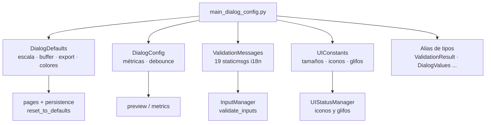

---
tags:
  - secinterp
  - code-walkthrough
  - gui
  - dialog
aliases:
  - main_dialog_config.py
  - DialogDefaults
  - DialogConfig
  - ValidationMessages
  - UIConstants
cssclass: secinterp-note
---

# `gui/main_dialog_config.py`

> [!abstract] Resumen en una línea
> Módulo de constantes del diálogo: `DialogDefaults` (valores iniciales), `DialogConfig` (comportamiento), `ValidationMessages` (19 mensajes i18n) y `UIConstants` (tamaños, iconos, glifos), más alias de tipos del dominio GUI.

**Ruta**: `gui/main_dialog_config.py` (195 líneas)
**Clases principales**: `DialogDefaults`, `DialogConfig`, `ValidationMessages`, `UIConstants`
**Capa**: GUI (constantes puras · sin widgets · casi QGIS-agnóstica)
**Tags**: #secinterp #gui #dialog

---

## 🎯 ¿Por qué existe este archivo?

Los valores por defecto, los mensajes de validación y las constantes visuales tienden a esparcirse por páginas, managers y tests como literales mágicos. Centralizarlos da un único punto de cambio:

| Problema | Solución |
|----------|----------|
| Literales mágicos (`100`, `300`, `"50000"`) repetidos en páginas y managers | `DialogDefaults` con un nombre por valor |
| Flags de comportamiento enterrados en el código | `DialogConfig` con métricas y debounce documentados |
| Mensajes de error duplicados y sin traducir | `ValidationMessages`: 19 métodos estáticos con `QCoreApplication.translate` |
| Nombres de iconos y glifos de estado inconsistentes | `UIConstants` con iconos del tema QGIS y símbolos ✓/✗/⚠ |
| Firmas con `dict`/`tuple` opacos | Alias (`ValidationResult`, `DialogValues`, `ExportSettings`) que documentan intención |

> [!important] Nota arquitectónica
> Es el módulo más parecido a "configuración pura" de la GUI: ninguna clase crea widgets ni toca capas. Solo `QColor` y `QCoreApplication.translate` lo atan a Qt; el resto son `str`, `int`, `bool` y listas. Los managers lo consumen, nunca al revés.

---

## 🧬 Diagrama de relaciones



> [!tip] Cómo leer
> Flecha sólida = define; flecha hacia consumidor = usado por. Ninguna flecha vuelve: los consumidores importan, el config no importa a nadie del plugin.

---

## 📦 Imports — lectura arquitectónica

```python
# gui/main_dialog_config.py
from __future__ import annotations

from typing import Any, ClassVar

from qgis.PyQt.QtCore import QCoreApplication
from qgis.PyQt.QtGui import QColor
```

| # | Observación |
|---|-------------|
| ① | Solo dos imports Qt en 195 líneas: `QCoreApplication` (traducción sin widget) y `QColor` (colores por defecto). Nada de `qgis.core`, nada de widgets. |
| ② | `ClassVar` marca las listas de formatos como atributos de clase (no de instancia): `SUPPORTED_IMAGE_FORMATS` y compañía pertenecen a la clase. |
| ③ | `Any` sostiene los alias `LayerSelection` / `RasterSelection`: documentan intención sin importar clases QGIS que romperían tests sin entorno. |

---

## 🏗️ Inventario de estructura

**Clases (4, todas sin `__init__` ni estado):**

- `class DialogDefaults` — ~15 constantes agrupadas por dominio
- `class DialogConfig` — 4 flags de comportamiento
- `class ValidationMessages` — 19 métodos estáticos, todos traducidos
- `class UIConstants` — tamaños, iconos, glifos, indicador de requerido

**Alias de tipos (5):** `LayerSelection`, `RasterSelection`, `ValidationResult`, `DialogValues`, `ExportSettings`

---

## 📁 Dónde vive dentro de `gui/`

| Vecino | Relación con este módulo |
|---|---|
| [[main_dialog]] | Sus managers consumen defaults y mensajes; no lo importa directamente |
| [[main_dialog_utils]] | Utilidades de entidades (capas/campos); complementa, no duplica |
| [[dialog_state_manager]] | `reset_to_defaults` restaura valores de `DialogDefaults` vía persistencia |
| [[dialog_input_manager]] | Devuelve `ValidationResult` y mensajes de `ValidationMessages` |
| [[ui_status_manager]] | Usa iconos y glifos coherentes con `UIConstants` |

---

## 📖 Recorrido clase por clase

### `DialogDefaults` — valores iniciales

```python
class DialogDefaults:
    """Default values for dialog inputs and settings."""

    # Scale and exaggeration
    SCALE = "50000"
    VERTICAL_EXAGGERATION = "1.0"
    AUTO_VERTICAL_EXAGGERATION: bool = True
    DIP_SCALE = "4"
    DIP_SCALE_FACTOR = "4"

    # Buffer and sampling
    BUFFER_DISTANCE = 100  # meters
    SAMPLING_INTERVAL = 10  # meters

    # Export settings
    DPI = 300
    PREVIEW_WIDTH = 800
    PREVIEW_HEIGHT = 600
    EXPORT_QUALITY = 95  # for JPEG

    # Colors
    BACKGROUND_COLOR = QColor(255, 255, 255)  # White
    GRID_COLOR = QColor(200, 200, 200)  # Light gray

    # Raster band
    DEFAULT_BAND = 1

    # File extensions
    SUPPORTED_IMAGE_FORMATS: ClassVar[list[str]] = [".png", ".jpg", ".jpeg"]
    SUPPORTED_VECTOR_FORMATS: ClassVar[list[str]] = [".shp"]
    SUPPORTED_DOCUMENT_FORMATS: ClassVar[list[str]] = [".pdf", ".svg"]
```

| Grupo | Valores | Lectura |
|---|---|---|
| Escala | `SCALE="50000"`, `VERTICAL_EXAGGERATION="1.0"`, `AUTO_...=True` | Cadenas porque alimentan combobox/line-edits; el auto-cálculo va activado por defecto |
| Dip | `DIP_SCALE="4"`, `DIP_SCALE_FACTOR="4"` | Duplicado nominal: escala de visualización y factor de cálculo se versionan por separado |
| Buffer/muestreo | `BUFFER_DISTANCE=100`, `SAMPLING_INTERVAL=10` (metros) | Enteros de dominio geológico, comentados con la unidad |
| Export | `DPI=300`, `800×600`, `EXPORT_QUALITY=95` | Calidad de impresión por defecto; 95 evita artefactos JPEG en secciones |
| Colores | `QColor` blanco / gris claro | Objetos `QColor`, no tuplas: listos para `setBrush`/`setPen` |
| Formatos | `ClassVar[list[str]]` por familia | `.png/.jpg/.jpeg`, `.shp`, `.pdf/.svg`; el tipado impide sombrearlos por instancia |

> [!note] Cadenas frente a números
> `SCALE` y `VERTICAL_EXAGGERATION` son `str` porque nacen en widgets de texto; `BUFFER_DISTANCE` y `DPI` son `int` porque nacen en spinboxes y cálculos. El tipo refleja el widget de origen, no una preferencia abstracta.

### `DialogConfig` — comportamiento

```python
class DialogConfig:
    """Configuration for dialog behavior and features."""

    # Performance metrics
    ENABLE_PERFORMANCE_METRICS: bool = True
    SHOW_METRICS_IN_RESULTS: bool = True
    LOG_DETAILED_METRICS: bool = False

    # UI behavior
    ZOOM_DEBOUNCE_MS = 200  # Milliseconds
```

Tres flags de métricas con granularidad pensada: recoger (`ENABLE_*`), mostrar (`SHOW_*`) y detallar en log (`LOG_*`, apagado por defecto para no inundar). `ZOOM_DEBOUNCE_MS = 200` evita tormentas de re-render cuando la rueda del ratón dispara `wheelEvent` en ráfaga — lo consume la navegación del preview.

### `ValidationMessages` — 19 mensajes traducidos

```python
class ValidationMessages:
    """Standard validation error messages."""

    @staticmethod
    def missing_raster() -> str:
        """Return translated 'DEM raster layer is required' message."""
        return QCoreApplication.translate("ValidationMessages", "DEM raster layer is required")

    @staticmethod
    def missing_field(field: str) -> str:
        """Return translated 'Required field not found' message."""
        return QCoreApplication.translate(
            "ValidationMessages", "Required field '{}' not found in layer"
        ).format(field)
    # ... 17 métodos más con la misma forma
```

Inventario completo por familia:

| Familia | Métodos |
|---|---|
| Capas requeridas | `missing_raster`, `missing_section_line`, `missing_output_path`, `missing_outcrop_layer`, `missing_outcrop_field`, `missing_structural_layer`, `missing_dip_field`, `missing_strike_field` |
| Capas inválidas | `invalid_raster`, `invalid_section_line`, `invalid_output_path`, `wrong_geometry_type`, `empty_layer`, `invalid_geometry` |
| Campos | `missing_field(field)`, `invalid_field_type(field)` (únicos con parámetro, con `.format(field)`) |
| Genéricos | `validation_failed`, `unknown_error` |

> [!important] `QCoreApplication.translate`, no `self.tr()`
> Al ser métodos estáticos sin widget, usan `QCoreApplication.translate("ValidationMessages", ...)` con contexto explícito. Es el patrón correcto para código sin `QObject`: el contexto `"ValidationMessages"` agrupa las cadenas en los `.ts` de forma estable aunque se refactorice la GUI.

### `UIConstants` — tamaños, iconos y glifos

```python
class UIConstants:
    """UI-related constants."""

    # Widget sizes
    MIN_PREVIEW_WIDTH = 400
    MIN_PREVIEW_HEIGHT = 300
    MAX_PREVIEW_WIDTH = 1920
    MAX_PREVIEW_HEIGHT = 1080

    # Icon names (QGIS theme icons)
    ICON_HELP = "mActionHelpContents.svg"
    ICON_REFRESH = "mActionRefresh.svg"
    ICON_EXPORT = "mActionFileSave.svg"
    ICON_CLEAR = "mActionDeleteSelected.svg"

    # Status indicators
    STATUS_OK = "✓"
    STATUS_ERROR = "✗"
    STATUS_WARNING = "⚠"

    # Required field indicator
    REQUIRED_INDICATOR = "*"
    REQUIRED_COLOR = QColor(255, 0, 0)  # Red
```

Los iconos son nombres del tema QGIS (`mAction*.svg`), no rutas: se resuelven con `QgsApplication.getThemeIcon` (ver [[main_dialog_utils]]) y siguen el tema activo. Los glifos ✓/✗/⚠ son los mismos que `UIStatusManager` y `push_message` muestran en `results_text`, de modo que el panel y las constantes nunca divergen. El rango 400×300–1920×1080 acota el preview entre lo usable y Full HD.

### Alias de tipos

```python
# Type aliases for better code readability
LayerSelection = Any  # QgsVectorLayer or None
RasterSelection = Any  # QgsRasterLayer or None
ValidationResult = tuple[bool, str]  # (is_valid, error_message)
DialogValues = dict[str, Any]  # Dictionary of dialog input values
ExportSettings = dict[str, Any]  # Dictionary of export configuration
```

`ValidationResult` es el contrato de retorno de `InputManager.validate_inputs()` (ver [[main_dialog]]): `(is_valid, error_message)`. `LayerSelection`/`RasterSelection` quedan en `Any` deliberadamente para no importar `qgis.core` en firmas que también usan los tests sin QGIS.

---

## 🔤 Contexto de traducción y ciclo `.ts`

Cada método de `ValidationMessages` fija dos cosas: el **contexto** (`"ValidationMessages"`) y la **cadena fuente** en inglés. Con `lupdate`, esas 19 cadenas viajan a los `.ts` (p. ej. `i18n/sec_interp_es.ts`), donde el traductor las ve agrupadas aunque la GUI se reorganice:

| Elemento | Valor | Por qué importa |
|---|---|---|
| Contexto | `"ValidationMessages"` | Agrupa las 19 cadenas en una sección del `.ts` |
| Fuente | Inglés técnico (`"DEM raster layer is required"`) | Lengua canónica; el `.ts` mapea a cada locale |
| Parámetros | `"..." '{}' ..."` + `.format(field)` | El placeholder sobrevive a la traducción; el campo se inserta después |
| Sin widget | `QCoreApplication.translate` | Funciona en managers, tests y CLI sin `QObject` |

Contraste con el resto del plugin:

| Quién traduce | Mecanismo | Dónde |
|---|---|---|
| Páginas y diálogo | `self.tr("...")` | `main_window.py`, `sidebar.py` (vía `SecInterpMainWindow`) |
| Managers sin widget | `self.tr` inyectado | `InputManager(pages, output_widget, self.tr)` |
| Este módulo | `QCoreApplication.translate` | `ValidationMessages.*` (estáticos) |

### Ejemplo de consumo en validación

```python
# gui/dialog_input_manager.py — uso típico (ilustrativo)
from sec_interp.gui.main_dialog_config import DialogDefaults, ValidationMessages
from sec_interp.gui.main_dialog_config import ValidationResult

def validate_raster(raster) -> ValidationResult:
    if raster is None:
        return False, ValidationMessages.missing_raster()
    if not raster.isValid():
        return False, ValidationMessages.invalid_raster()
    return True, ""
```

El patrón se repite por sección: detectar ausencia → `missing_*`; detectar invalidez → `invalid_*`; campos concretos → `missing_field(name)`. El llamante ([[main_dialog]] vía `validate_inputs`) solo muestra la cadena ya traducida.

---

## 🔄 Flujo de datos

| Fase | Entrada | Transformación | Salida |
|---|---|---|---|
| Arranque | `DialogDefaults.*` | Páginas y persistencia inicializan widgets | UI con valores sensatos |
| Validación | Estado de capas/campos | `InputManager` elige método de `ValidationMessages` | `(False, mensaje_traducido)` |
| Estado visual | Iconos y glifos de `UIConstants` | `UIStatusManager` + `push_message` | Indicadores y `results_text` coherentes |
| Reset | `DialogDefaults.*` | `StateManager.reset_to_defaults` vía persistencia | Formulario restaurado |
| Export | `DPI`, formatos soportados | `ExportManager` valida extensión y calidad | Archivo con calidad de impresión |

---

## 🧮 Números que gobiernan la UI (tarjeta de referencia)

| Número | Dónde | Racional en una línea |
|---|---|---|
| `100 m` buffer | `BUFFER_DISTANCE` | Franja de captura alrededor de la línea de sección |
| `10 m` muestreo | `SAMPLING_INTERVAL` | Paso del perfil topográfico |
| `300` DPI | `DPI` | Calidad de impresión para export |
| `800 × 600` | `PREVIEW_WIDTH/HEIGHT` | Tamaño inicial del preview |
| `95` calidad | `EXPORT_QUALITY` | JPEG sin artefactos visibles en secciones |
| `200 ms` debounce | `ZOOM_DEBOUNCE_MS` | Funde ráfagas de `wheelEvent` en un re-render |
| `400×300 – 1920×1080` | `UIConstants` | Preview entre usable y Full HD |
| Banda `1` | `DEFAULT_BAND` | Primera banda del DEM por defecto |

---

## 🏛️ Patrones de diseño presentes

| Patrón | Dónde | Propósito |
|---|---|---|
| **Parameter Object (constantes)** | `DialogDefaults`, `UIConstants` | Un solo punto de cambio para valores |
| **Static Factory (mensajes)** | `ValidationMessages` | Mensajes traducidos sin instanciar |
| **Type Alias** | `ValidationResult`, `DialogValues` | Firmas auto-documentadas |
| **Theme indirection** | `ICON_*` como nombres, no rutas | Seguir el tema QGIS activo |

---

## 🧾 Resumen de la API

| Símbolo | Contenido | Uso típico |
|---|---|---|
| `DialogDefaults` | 15 constantes | `spin.setValue(DialogDefaults.BUFFER_DISTANCE)` |
| `DialogConfig` | 4 flags | `if DialogConfig.ENABLE_PERFORMANCE_METRICS:` |
| `ValidationMessages` | 19 estáticos `-> str` | `return False, ValidationMessages.missing_raster()` |
| `UIConstants` | tamaños, iconos, glifos | `getThemeIcon(UIConstants.ICON_HELP)` |
| `ValidationResult` | `tuple[bool, str]` | Retorno de `validate_inputs()` |
| `DialogValues` / `ExportSettings` | `dict[str, Any]` | Valores del diálogo y ajustes de export |
| `LayerSelection` / `RasterSelection` | `Any` | Capas o `None` en firmas GUI |

---

## 🛡️ Manejo de errores

El módulo no lanza ni captura: es declarativo. Su contribución a la robustez es preventiva — los mensajes genéricos `validation_failed` y `unknown_error` actúan como red cuando ningún caso específico encaja, y los formatos soportados permiten rechazar extensiones antes de escribir archivos. El único acoplamiento frágil es `QColor` a nivel de clase: se construye al importar, lo que exige un `QApplication`/`QgsApplication` existente; en tests sin Qt esto se resuelve con los mocks de `tests/base_test.py`.

---

## 🧪 Tests asociados

No existe un `tests/gui/test_main_dialog_config.py` dedicado; la honestidad obliga a decirlo. La cobertura es indirecta, a través de los consumidores:

- `tests/gui/test_main_dialog_validation_manager.py` — ejercita los mensajes al validar inputs.
- `tests/gui/test_main_dialog_settings.py` — verifica persistencia y restauración de defaults.
- `tests/gui/test_dialog_export_manager.py` — formatos y calidad de exportación.
- `tests/gui/test_dem_page.py`, `test_drillhole_page.py`, `test_settings_page.py` — páginas que inicializan widgets con estos defaults.

---

## 👀 Observaciones y notas

> [!success] Fortalezas
> - Cero lógica, cero estado: imposible romperlo con efectos laterales.
> - i18n correcta sin widgets (`QCoreApplication.translate` con contexto estable).
> - Iconos por nombre de tema: inmunes a rutas y al tema activo.
> - Alias de tipos que documentan contratos (`ValidationResult`) sin coste.

> [!warning] Puntos de atención
> - `DIP_SCALE` y `DIP_SCALE_FACTOR` (ambos `"4"`) sugieren una duplicación sin documentar qué los diferencia.
> - `QColor` a nivel de clase exige entorno Qt al importar; un test que importe el módulo sin mocks de Qt fallaría.
> - `LOG_DETAILED_METRICS = False` y `SHOW_METRICS_IN_RESULTS = True` conviven sin explicar la interacción entre ambos flags.
> - Sin test dedicado: un cambio de literal rompe capturas de traductor sin que ningún test avise.

> [!question] Preguntas abiertas
> - ¿Fusionar `DIP_SCALE` y `DIP_SCALE_FACTOR` o documentar la diferencia?
> - ¿Añadir un `test_main_dialog_config.py` que congele defaults y traduzca cada mensaje?

---

## 🔗 Notas relacionadas

- [[Index]] — índice de la bóveda
- [[main_dialog]] — composition root cuyos managers consumen estas constantes
- [[dialog_input_manager]] — devuelve `ValidationResult` con estos mensajes
- [[dialog_state_manager]] — `reset_to_defaults` sobre `DialogDefaults`
- [[ui_status_manager]] — indicadores con iconos y glifos coherentes
- [[main_dialog_utils]] — `get_theme_icon`, resolución de `ICON_*`
- [[dialog_settings_persistence]] — persistencia de los valores por defecto
- [[settings_page]] — página que expone varios de estos ajustes
- [[core_utils___init___py]] — fachada de utilidades del core (contraste: utilidades puras frente a constantes GUI)

---

*Nota de la bóveda SecInterp Code Walkthrough v2 — v3.9.0*
