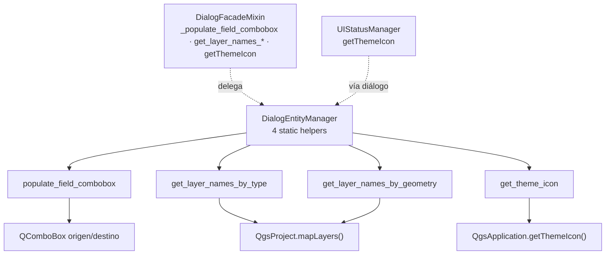

---
tags:
  - secinterp
  - code-walkthrough
  - gui
  - utils
aliases:
  - main_dialog_utils.py
  - DialogEntityManager
cssclass: secinterp-note
---

# `gui/main_dialog_utils.py`

> [!abstract] Resumen en una línea
> `DialogEntityManager`: cuatro helpers estáticos que aíslan el acceso a entidades QGIS (campos de capa, nombres por tipo/geometría, iconos del tema) para que el facade del diálogo nunca llame a `QgsProject` directamente.

**Ruta**: `gui/main_dialog_utils.py` (50 líneas)
**Clase principal**: `DialogEntityManager` (solo métodos estáticos)
**Capa**: GUI (helpers Extract · QGIS-dependiente)
**Tags**: #secinterp #gui #utils

---

## 🎯 ¿Por qué existe este archivo?

Las páginas y el facade necesitan listar capas, leer campos y pedir iconos. Sin este módulo, cada llamante repetiría `QgsProject.instance().mapLayers()` y `QgsApplication.getThemeIcon` con sus filtros:

| Problema | Solución |
|----------|----------|
| Consultas a `QgsProject` esparcidas por el diálogo | Dos listados filtrados en un solo lugar |
| Poblar combos de campos con bucles repetidos | `populate_field_combobox(source, target)` reutilizable |
| Iconos del tema pedidos con rutas hardcodeadas | `get_theme_icon(name)` como único punto de resolución |
| El facade necesita estas operaciones sin heredar nada | Clase de estáticos: se usa sin instanciar ni mezclar en la MRO |

> [!important] Nota arquitectónica
> Es el lado "Extract" más fino de la GUI: convierte objetos QGIS vivos (capas, fields) en **primitivos** (`list[str]`, `QIcon`) en el borde, para que los consumidores trabajen con datos simples. No importa nada de `core/` ni de managers: solo `qgis.core` y Qt.

---

## 🧬 Diagrama de relaciones



> [!tip] Cómo leer
> Flecha sólida = llama a; punteada = delegación desde el facade y el status manager, que son los dos consumidores reales.

---

## 📦 Imports — lectura arquitectónica

```python
# gui/main_dialog_utils.py
from __future__ import annotations

from qgis.core import QgsApplication, QgsMapLayer, QgsProject, QgsWkbTypes
from qgis.PyQt.QtGui import QIcon
```

| # | Observación |
|---|-------------|
| ① | Importa `QgsProject` (registro vivo de capas) y `QgsApplication` (iconos del tema): las dos únicas puertas QGIS que necesita. |
| ② | `QgsMapLayer.LayerType` y `QgsWkbTypes.GeometryType` aparecen **solo como tipos de parámetro**: el filtrado se expresa en el vocabulario QGIS, sin enums propios. |
| ③ | `QIcon` es el único tipo Qt de retorno; el resto son `None` o `list[str]`: primitivos hacia fuera, QGIS hacia dentro. |

---

## 🏗️ Inventario de estructura

**Clases:** `class DialogEntityManager` — 4 métodos estáticos, sin `__init__`, sin atributos.

| Método | Firma | Rol |
|---|---|---|
| `populate_field_combobox` | `(source_combobox, target_combobox) -> None` | Copia nombres de campos al combo destino |
| `get_layer_names_by_type` | `(layer_type: QgsMapLayer.LayerType) -> list[str]` | Nombres de capa por tipo (raster/vector/…) |
| `get_layer_names_by_geometry` | `(geometry_type: QgsWkbTypes.GeometryType) -> list[str]` | Nombres de vectoriales por geometría |
| `get_theme_icon` | `(name: str) -> QIcon` | Icono del tema QGIS activo |

---

## 📁 Dónde vive dentro de `gui/`

| Vecino | Relación con este módulo |
|---|---|
| [[main_dialog]] | El facade (`DialogFacadeMixin`) envuelve los cuatro helpers como métodos del diálogo |
| [[main_dialog_config]] | `UIConstants.ICON_*` aporta los nombres que `get_theme_icon` resuelve |
| [[ui_status_manager]] | Pide iconos vía `dialog.getThemeIcon`, que termina aquí |
| [[main_window]] | La ventana crea la sidebar con iconos del mismo tema |

---

## 📖 Recorrido método por método

### `populate_field_combobox` — campos de una capa a un combo

```python
@staticmethod
def populate_field_combobox(source_combobox, target_combobox) -> None:
    """Populate a combobox with field names from a selected vector layer."""
    layer = source_combobox.currentLayer()
    target_combobox.clear()
    if layer:
        fields = [field.name() for field in layer.fields()]
        target_combobox.addItems(fields)
```

Protocolo mínimo: el combo origen expone `currentLayer()` (los `QgsMapLayerComboBox` lo hacen). Siempre limpia el destino primero, así cambiar de capa nunca deja campos fantasma. Si no hay capa, el destino queda vacío pero válido — sin excepciones.

> [!note] Sin tipos en los parámetros
> Los combos se tipan como `Any` implícito a propósito: el método solo exige duck typing (`currentLayer`, `clear`, `addItems`), lo que permite combos reales y dobles de test sin importar `qgis.gui`.

### `get_layer_names_by_type` — capas por tipo

```python
@staticmethod
def get_layer_names_by_type(layer_type: QgsMapLayer.LayerType) -> list[str]:
    """Get a list of layer names filtered by the specified layer type."""
    return [
        layer.name()
        for layer in QgsProject.instance().mapLayers().values()
        if layer.type() == layer_type
    ]
```

Recorre el registro vivo del proyecto y devuelve **solo nombres**, nunca las capas. Esa es la decisión Extract: quien lista no retiene referencias a objetos QGIS que luego cruzarían hilos o cachés.

### `get_layer_names_by_geometry` — vectoriales por geometría

```python
@staticmethod
def get_layer_names_by_geometry(
    geometry_type: QgsWkbTypes.GeometryType,
) -> list[str]:
    """Get a list of layer names filtered by the specified geometry type."""
    return [
        layer.name()
        for layer in QgsProject.instance().mapLayers().values()
        if (
            layer.type() == QgsMapLayer.LayerType.VectorLayer
            and layer.geometryType() == geometry_type
        )
    ]
```

Doble filtro: primero vectorial, luego geometría (`Point`, `LineString`, `Polygon`). Es el que alimenta los selectores de línea de sección, afloramientos y estructuras: cada página pide justo la geometría que acepta, y las capas incompatibles ni aparecen.

### `get_theme_icon` — icono del tema activo

```python
@staticmethod
def get_theme_icon(name: str) -> QIcon:
    """Get a theme icon from QGIS."""
    return QgsApplication.getThemeIcon(name)
```

Una línea que centraliza el tema: si QGIS cambia de set de iconos, todo el plugin lo sigue sin tocar código. Los nombres (`"mIconRaster.svg"`, `"mMessageLogCritical.svg"`) los aportan [[main_dialog_config]] y las páginas.

---

## 🔌 Consumo desde el facade (proxies)

El diálogo nunca llama a `DialogEntityManager` desde las páginas: `DialogFacadeMixin` lo envuelve para ofrecer una API uniforme sobre `self.dialog`:

```python
# gui/dialog_facade_mixin.py — proxies reales
def _populate_field_combobox(self, source_combobox: Any, target_combobox: Any) -> None:
    DialogEntityManager.populate_field_combobox(source_combobox, target_combobox)

def get_layer_names_by_type(self, layer_type) -> list[str]:
    return DialogEntityManager.get_layer_names_by_type(layer_type)

def get_layer_names_by_geometry(self, geometry_type) -> list[str]:
    return DialogEntityManager.get_layer_names_by_geometry(geometry_type)

def getThemeIcon(self, name: str) -> Any:
    return DialogEntityManager.get_theme_icon(name)
```

Cuatro proxies, una regla: el facade traduce `self.metodo(...)` → `DialogEntityManager.metodo(...)`, y [[ui_status_manager]] llega al mismo sitio vía `dialog.getThemeIcon`. Un solo camino hacia `QgsProject` y `QgsApplication`, cuatro puertas de entrada.

## 📐 Matriz de filtros por página

| Página | Helper usado | Filtro efectivo |
|---|---|---|
| DEM / Raster | `get_layer_names_by_type(RasterLayer)` | Capas raster (banda `DEFAULT_BAND`) |
| Section Line | `get_layer_names_by_geometry(LineString)` | Solo líneas |
| Geology | `get_layer_names_by_geometry(Polygon)` | Solo polígonos de afloramiento |
| Structural | `get_layer_names_by_geometry(Point)` | Solo puntos de medición |
| Drillholes | `populate_field_combobox` + listados | Capas collar/survey/interval y sus campos |
| Sidebar e indicadores | `get_theme_icon("m*.svg")` | Iconos del tema activo |

> [!tip] Cada página pide lo que acepta
> El filtrado ocurre en el listado, no en la validación: una capa incompatible ni siquiera aparece como opción. `InputManager` valida lo elegido; aquí se recorta lo elegible.

---

## 🔄 Flujo de datos

| Fase | Entrada | Transformación | Salida |
|---|---|---|---|
| Selección de capa | `currentLayer()` del combo origen | `[f.name() for f in layer.fields()]` | Items de texto en el combo destino |
| Listado | `QgsProject.instance().mapLayers()` | Filtro por `type()` y/o `geometryType()` | `list[str]` con nombres |
| Icono | Nombre `"m*.svg"` | `QgsApplication.getThemeIcon(name)` | `QIcon` del tema activo |
| Consumo | Primitivos (`str`, `QIcon`) | Facade y páginas los presentan | Combos, sidebars e indicadores |

---

## 🏛️ Patrones de diseño presentes

| Patrón | Dónde | Propósito |
|---|---|---|
| **Static utility class** | `DialogEntityManager` | Agrupar helpers sin estado ni instancia |
| **Extract (borde fino)** | Los dos listados | Convertir registro QGIS vivo en `list[str]` |
| **Duck typing** | `populate_field_combobox` | Aceptar cualquier combo con `currentLayer` |
| **Indirección de tema** | `get_theme_icon` | Nombres en vez de rutas de iconos |

---

## 🧾 Resumen de la API

| Símbolo | Firma | Uso típico |
|---|---|---|
| `DialogEntityManager` | 4 estáticos | `DialogEntityManager.get_theme_icon("mIconRaster.svg")` |
| `populate_field_combobox` | `(origen, destino) -> None` | Refrescar combo de campos al cambiar de capa |
| `get_layer_names_by_type` | `(LayerType) -> list[str]` | Listar rasters o vectoriales |
| `get_layer_names_by_geometry` | `(GeometryType) -> list[str]` | Listar líneas / puntos / polígonos |
| `get_theme_icon` | `(str) -> QIcon` | Iconos de sidebar e indicadores |

---

## 🛡️ Manejo de errores

Filosofía de degradación silenciosa: sin capa seleccionada, el combo destino queda vacío; sin capas en el proyecto, los listados devuelven `[]`. Ningún método lanza por ausencia de datos — la validación que sí debe fallar vive en `InputManager` con mensajes de [[main_dialog_config]]. El único fallo posible es operativo (proyecto cerrado a mitad de iteración), fuera del alcance de un helper.

---

## 🧪 Tests asociados

No existe un `tests/gui/test_main_dialog_utils.py` dedicado; se dice con claridad. La cobertura es indirecta:

- `tests/gui/test_main_dialog_core.py` — el facade que envuelve estos helpers se ejercita al construir el diálogo.
- `tests/gui/test_dem_page.py`, `test_drillhole_page.py` — páginas que listan capas y pueblan campos.
- `tests/gui/test_message_manager.py` — iconos y mensajería del diálogo.

Un test dedicado con `QgsProject` mockeado (dos capas falsas por tipo) cubriría los cuatro métodos en unas 30 líneas.

---

## 👀 Observaciones y notas

> [!success] Fortalezas
> - 50 líneas, cero estado, cero dependencias del plugin: el módulo más barato de mantener en `gui/`.
> - Devuelve primitivos, no capas vivas: respeta el borde Extract sin que nadie se lo imponga.
> - Duck typing en combos: testeable sin `qgis.gui`.

> [!warning] Puntos de atención
> - Los combos sin tipar (`source_combobox` sin anotación) dificultan el autocompletado; un `Protocol` con `currentLayer` costaría dos líneas.
> - Itera `mapLayers()` completo en cada llamada: con cientos de capas y llamadas por keystroke podría notarse; no hay caché.
> - `get_theme_icon` no valida el nombre: un typo devuelve un icono nulo silencioso.

> [!question] Preguntas abiertas
> - ¿Añadir `test_main_dialog_utils.py` con proyecto mockeado?
> - ¿Tipar los combos con un `Protocol` mínimo (`currentLayer`, `clear`, `addItems`)?

---

## 🔗 Notas relacionadas

- [[Index]] — índice de la bóveda
- [[main_dialog]] — facade que envuelve estos cuatro helpers
- [[dialog_facade_mixin]] — `_populate_field_combobox`, `get_layer_names_*`, `getThemeIcon`
- [[main_dialog_config]] — `UIConstants.ICON_*`, nombres que aquí se resuelven
- [[ui_status_manager]] — consumidor de iconos vía `dialog.getThemeIcon`
- [[main_window]] — sidebar construida con iconos del mismo tema
- [[dem_page]] / [[section_page]] / [[geology_page]] — páginas que listan capas y campos

---

*Nota de la bóveda SecInterp Code Walkthrough v2 — v3.9.1*
