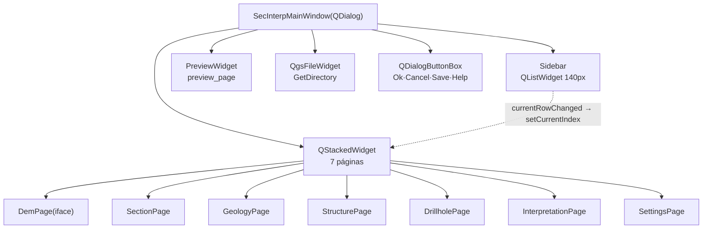

---
tags:
  - secinterp
  - code-walkthrough
  - gui
  - ui
aliases:
  - main_window.py
  - SecInterpMainWindow
cssclass: secinterp-note
---

# `gui/ui/main_window.py`

> [!abstract] Resumen en una línea
> `SecInterpMainWindow`: el `QDialog` programático que ensambla sidebar, siete páginas apiladas y preview en un `QSplitter` de tres paneles, con hoja de estilo premium y navegación por `currentRowChanged`.

**Ruta**: `gui/ui/main_window.py` (158 líneas)
**Clase principal**: `SecInterpMainWindow(QDialog)`
**Capa**: GUI (UI programática · sin `.ui`, sin `core/`)
**Tags**: #secinterp #gui #ui

---

## 🎯 ¿Por qué existe este archivo?

El plugin no usa Qt Designer ni `.ui` compilados: toda la ventana se construye en código para controlar tema, proporciones y navegación. Este módulo es el esqueleto visual sobre el que `SecInterpDialog` añade managers:

| Problema | Solución |
|----------|----------|
| Siete páginas de configuración compitiendo por espacio | `QStackedWidget` + sidebar de navegación |
| El preview necesita el máximo espacio sin aplastar los ajustes | `QSplitter` horizontal de tres paneles con stretches 0/0/1 |
| Navegación acoplada a botones "siguiente/anterior" | `sidebar.currentRowChanged → stacked.setCurrentIndex` directo |
| Fugas por señales conectadas y nunca desconectadas | `disconnect_signals()` con `contextlib.suppress` |
| Carpeta de salida separada del flujo de páginas | Fila inferior con `QgsFileWidget` en modo directorio |

> [!important] Nota arquitectónica
> Ventana **tonta a propósito**: no valida, no calcula, no persiste. Solo ensambla widgets y propaga el índice de navegación. La inteligencia vive en [[main_dialog]] y sus managers; aquí solo hay layout, estilo y dos señales.

---

## 🧬 Diagrama de relaciones



> [!tip] Cómo leer
> Flecha sólida = contiene/construye; punteada = la única conexión lógica (navegación). Todo lo demás es contención estática.

---

## 📦 Imports — lectura arquitectónica

```python
# gui/ui/main_window.py
from __future__ import annotations

import contextlib
from typing import Any

from qgis.gui import QgsFileWidget
from qgis.PyQt.QtCore import Qt
from qgis.PyQt.QtWidgets import (
    QDialog,
    QDialogButtonBox,
    QHBoxLayout,
    QLabel,
    QSplitter,
    QStackedWidget,
    QVBoxLayout,
    QWidget,
)

from .pages.dem_page import DemPage                        # ①
from .pages.drillhole_page import DrillholePage
from .pages.geology_page import GeologyPage
from .pages.interpretation_page import InterpretationPage
from .pages.preview_page import PreviewWidget
from .pages.section_page import SectionPage
from .pages.settings_page import SettingsPage
from .pages.structure_page import StructurePage
from .sidebar import Sidebar
```

| # | Observación |
|---|-------------|
| ① | Las ocho páginas/sidebar se importan con ruta relativa (`.pages.*`, `.sidebar`): son piezas internas de `gui/ui`, no API pública. |
| ② | `QgsFileWidget` es el único widget QGIS: selector de carpeta nativo con modo `GetDirectory`, sin código propio de exploración. |
| ③ | `contextlib` solo sirve a `disconnect_signals`: suprimir `TypeError/RuntimeError` al desconectar señales ya muertas. |
| ④ | Cero imports de `core/` y de managers: la ventana no sabe que existen `PreviewService` ni `InputManager`. |

---

## 🏗️ Inventario de estructura

**Clases:** `class SecInterpMainWindow(QDialog)` — 3 métodos.

| Método | Rol |
|---|---|
| `__init__(iface=None, parent=None)` | Título, tamaño, widgets, páginas, ensamblado y señales |
| `_setup_ui()` | Layout, splitter con estilo, fila de salida, items del sidebar |
| `_connect_signals()` | Una sola conexión de navegación |
| `disconnect_signals()` | Desconexión defensiva anti-fugas |

Atributos creados en `__init__`: `sidebar`, `stacked_widget`, `preview_widget`, `output_widget`, `button_box`, `page_dem`, `page_section`, `page_geology`, `page_struct`, `page_drillhole`, `page_interpretation`, `page_settings`.

---

## 📁 Dónde vive dentro de `gui/ui/`

| Vecino | Relación con este módulo |
|---|---|
| [[sidebar]] (`ui/sidebar.py`) | Navegación lateral usada aquí |
| [[preview_page]] (`ui/pages/preview_page.py`) | Panel derecho: `PreviewWidget` |
| [[settings_page]] (`ui/pages/settings_page.py`) | Última página del stack |
| [[dem_page]], [[section_page]], [[geology_page]], [[structure_page]], [[drillhole_page]], [[interpretation_page]] | Páginas 1–6 del stack |
| [[main_dialog]] (`gui/main_dialog.py`) | Subclase vía mixins: añade managers y ciclo de vida |

---

## 📖 Recorrido método por método

### `__init__` — identidad y piezas

```python
def __init__(self, iface: Any | None = None, parent: QWidget | None = None) -> None:
    super().__init__(parent)
    self.setWindowTitle(self.tr("Sec Interp"))
    self.resize(1200, 700)

    # Initialize UI components
    self.sidebar = Sidebar()
    self.stacked_widget = QStackedWidget()
    self.preview_widget = PreviewWidget()
    self.output_widget = QgsFileWidget()

    flags = QDialogButtonBox.StandardButton.Ok | QDialogButtonBox.StandardButton.Cancel
    flags |= QDialogButtonBox.StandardButton.Save | QDialogButtonBox.StandardButton.Help
    self.button_box = QDialogButtonBox(flags)

    # Initialize Pages
    self.page_dem = DemPage(iface)
    self.page_section = SectionPage()
    self.page_geology = GeologyPage()
    self.page_struct = StructurePage()
    self.page_drillhole = DrillholePage()
    self.page_interpretation = InterpretationPage()
    self.page_settings = SettingsPage()

    self._setup_ui()
    self._connect_signals()
```

Solo `DemPage` recibe `iface` (necesita el proyecto para listar rasters); el resto de páginas son autónomas. El `button_box` combina `Ok|Cancel|Save|Help`: `Save` y `Help` los cablea después `SignalManager` (ver [[main_dialog]]). Título y tamaño inicial fijos: 1200×700, panorámico para dar aire al preview.

### `_setup_ui` — el splitter de tres paneles

```python
def _setup_ui(self) -> None:
    main_layout = QVBoxLayout(self)
    main_layout.setContentsMargins(5, 5, 5, 5)
    main_layout.setSpacing(5)

    # -- Main Content Area: Splitter [Sidebar | Settings | Preview] --
    splitter = QSplitter(Qt.Orientation.Horizontal)
    splitter.setHandleWidth(6)  # Nominal width
    splitter.setChildrenCollapsible(True)

    # Style the splitter handle to be visible and indicate interaction
    splitter.setStyleSheet("""
        QSplitter::handle {
            background-color: #e0e0e0;
            border: 1px solid #c0c0c0;
            margin: 1px;
            border-radius: 2px;
        }
        QSplitter::handle:hover {
            background-color: #d0d0d0;
            border-color: #a0a0a0;
        }
        QSplitter::handle:pressed {
            background-color: #b0b0b0;
            border-color: #808080;
        }
    """)

    # 1. Left: Sidebar
    splitter.addWidget(self.sidebar)

    # 2. Middle: Settings (Stacked Pages)
    self.stacked_widget.addWidget(self.page_dem)
    self.stacked_widget.addWidget(self.page_section)
    self.stacked_widget.addWidget(self.page_geology)
    self.stacked_widget.addWidget(self.page_struct)
    self.stacked_widget.addWidget(self.page_drillhole)
    self.stacked_widget.addWidget(self.page_interpretation)
    self.stacked_widget.addWidget(self.page_settings)

    splitter.addWidget(self.stacked_widget)

    # 3. Right: Preview Widget
    splitter.addWidget(self.preview_widget)

    # Set Splitter Stretches (Sidebar minimal, Settings medium, Preview expanding)
    splitter.setStretchFactor(0, 0)
    splitter.setStretchFactor(1, 0)  # Settings doesn't need to hog space
    splitter.setStretchFactor(2, 1)  # Preview gets the rest

    # Make settings panel collapsible
    splitter.setCollapsible(1, True)

    main_layout.addWidget(splitter, stretch=10)
```

| Decisión | Efecto |
|---|---|
| Handle de 6px con QSS propio (normal/hover/pressed) | El divisor se ve y sugiere arrastre; estética "premium" sin depender del estilo del SO |
| `setChildrenCollapsible(True)` + `setCollapsible(1, True)` | El panel de ajustes puede ocultarse del todo para dar todo al preview |
| Stretches 0/0/1 | Sidebar y ajustes conservan su tamaño; **todo** el espacio extra va al preview |
| `addWidget` en orden sidebar → stack → preview | El índice del stack (0–6) coincide con la fila del sidebar |

El orden de inserción en el `stacked_widget` es un contrato implícito con el sidebar: la fila N muestra la página N. Añadir una página exige añadir su item en la misma posición (ver abajo).

### Fila inferior y población del sidebar

```python
    out_layout = QHBoxLayout()
    out_layout.addWidget(QLabel(self.tr("Output Folder")))

    self.output_widget.setStorageMode(QgsFileWidget.StorageMode.GetDirectory)
    out_layout.addWidget(self.output_widget)

    main_layout.addLayout(out_layout)
    main_layout.addWidget(self.button_box)

    # Populate sidebar
    self.sidebar.add_item(self.tr("DEM / Raster"), "mIconRaster.svg")
    self.sidebar.add_item(self.tr("Section Line"), "mIconLineLayer.svg")
    self.sidebar.add_item(self.tr("Geology"), "mIconPolygonLayer.svg")
    self.sidebar.add_item(self.tr("Structural"), "mIconPointLayer.svg")
    self.sidebar.add_item(self.tr("Drillholes"), "mActionDataSourceManager.svg")
    self.sidebar.add_item(self.tr("Interpretation"), "mActionEdit.svg")
    self.sidebar.add_item(self.tr("Settings"), "mActionOptions.svg")

    self.sidebar.setCurrentRow(0)
```

Cada item empareja etiqueta traducida (`self.tr(...)`) con icono del tema QGIS, y el orden replica el del stack. `setCurrentRow(0)` abre en DEM/Raster. La carpeta de salida queda fuera del stack a propósito: es transversal a todas las páginas.

### `_connect_signals` y `disconnect_signals` — navegación sin fugas

```python
def _connect_signals(self) -> None:
    """Connect navigation signals."""
    self.sidebar.currentRowChanged.connect(self.stacked_widget.setCurrentIndex)

def disconnect_signals(self) -> None:
    """Disconnect all signals to prevent memory leaks."""
    with contextlib.suppress(TypeError, RuntimeError):
        self.sidebar.currentRowChanged.disconnect(self.stacked_widget.setCurrentIndex)
    with contextlib.suppress(TypeError, RuntimeError):
        self.output_widget.fileChanged.disconnect(self.update_button_state)
```

La navegación es una conexión señal→slot sin intermediarios: `currentRowChanged(int)` encaja con `setCurrentIndex(int)`. En desconexión, el segundo bloque referencia `self.update_button_state`, que **no** existe en esta clase: se resuelve por MRO en el diálogo completo ([[dialog_facade_mixin]] lo aporta). Funciona porque `disconnect_signals` solo se invoca sobre `SecInterpDialog`, pero acopla esta ventana a un método que no declara.

---

## 🔄 Flujo de datos

| Fase | Entrada | Transformación | Salida |
|---|---|---|---|
| Construcción | `iface` (solo a `DemPage`) | Siete páginas + sidebar + preview + salida | Árbol de widgets |
| Navegación | `currentRowChanged(int)` | `setCurrentIndex(int)` directo | Página visible |
| Salida | Directorio elegido | `QgsFileWidget` en modo `GetDirectory` | Ruta para `InputManager`/`ExportManager` |
| Cierre | `closeEvent` (mixin) | `disconnect_signals()` defensivo | Sin conexiones colgadas |

---

## 📐 Geometría y proporciones

| Elemento | Medida | Intención |
|---|---|---|
| Ventana inicial | 1200 × 700 | Panorámica: preview ancho desde el primer frame |
| Sidebar | 140px fijos | Columna estable, inmune al redimensionado del splitter |
| Handle del splitter | 6px + QSS propio | Visible y arrastrable sin depender del estilo del SO |
| Márgenes / spacing | 5px / 5px | Aire mínimo, densidad de herramienta profesional |
| Stretches | 0 / 0 / 1 | Sidebar y ajustes conservan tamaño; todo el extra va al preview |
| Splitter en layout | `stretch=10` | Ocupa el área; salida y botones conservan altura mínima |

> [!note] Redimensionado
> Al agrandar la ventana, solo el preview crece (stretch 1 frente a 0/0). Al encoger, el panel de ajustes colapsa primero (`setCollapsible(1, True)`) antes de recortar el preview.

---

## 🌐 i18n: `self.tr()` en cada literal

Título (`"Sec Interp"`), `"Output Folder"` y las siete etiquetas del sidebar pasan por `self.tr()`, heredado de `QDialog` vía `qgis.PyQt`. Los nombres de icono quedan fuera de traducción (son claves del tema, no texto). Las páginas traducen su propio contenido; la ventana solo traduce su cáscara.

---

## 🏛️ Patrones de diseño presentes

| Patrón | Dónde | Propósito |
|---|---|---|
| **Programmatic UI (sin Designer)** | Todo el módulo | Control total de tema y proporciones |
| **Stacked navigation** | Sidebar + `QStackedWidget` | Siete páginas en el espacio de una |
| **Direct signal-slot** | `_connect_signals` | Navegación sin mediadores |
| **Guarded disconnect** | `contextlib.suppress` | Desconectar lo ya muerto sin `try/except` verboso |

---

## 🧾 Resumen de la API

| Símbolo | Firma / Hereda | Uso típico |
|---|---|---|
| `SecInterpMainWindow` | `QDialog` | Base de `SecInterpDialog` vía mixins |
| `__init__` | `(iface=None, parent=None)` | `SecInterpMainWindow(iface, parent)` |
| `_setup_ui` | `() -> None` | Ensambla splitter, salida y sidebar |
| `_connect_signals` | `() -> None` | Navegación sidebar → stack |
| `disconnect_signals` | `() -> None` | Limpieza en `closeEvent` |
| `page_dem…page_settings` | Siete páginas | Superficie que empaqueta `Pages` |
| `preview_widget` / `output_widget` | `PreviewWidget` / `QgsFileWidget` | Anclajes de managers |

---

## 🛡️ Manejo de errores

Sin `try/except` explícitos: la defensa es `contextlib.suppress(TypeError, RuntimeError)` al desconectar (señal ya desconectada u objeto C++ destruido). No valida índices ni páginas: confía en el contrato de orden sidebar↔stack. Los errores de construcción (p. ej. `iface` inválido en `DemPage`) propagan al llamante, que es [[main_dialog]].

---

## 🧪 Tests asociados

Sin `tests/gui/test_main_window.py` dedicado; cobertura honesta e indirecta:

- `tests/gui/test_dem_page.py`, `test_drillhole_page.py`, `test_settings_page.py` — páginas individuales del stack.
- `tests/gui/test_main_dialog_core.py` — construye la ventana completa vía `SecInterpDialog`.
- `tests/gui/test_main_dialog_signals_wiring.py` — verifica el cableado de señales tras el ensamblado.

---

## 👀 Observaciones y notas

> [!success] Fortalezas
> - 158 líneas para una ventana completa de 7 páginas: densidad alta sin prisa.
> - Navegación de una línea, imposible de romper con estados intermedios.
> - QSS propio en splitter y sidebar: identidad visual sin pelear con el estilo del SO.
> - `disconnect_signals` defensivo: cerrar dos veces no explota.

> [!warning] Puntos de atención
> - `disconnect_signals` referencia `self.update_button_state`, inexistente en esta clase: acople implícito al facade vía MRO.
> - El orden sidebar↔stack es un contrato sin assert: insertar una página desalineada rompe la navegación en silencio.
> - `Save`/`Help` del `button_box` se crean aquí pero se cablean en `SignalManager`: dos archivos para un botón.

> [!question] Preguntas abiertas
> - ¿Añadir un assert o test que congele el orden sidebar↔stack (7 items, mismo orden)?
> - ¿Mover `disconnect` de `fileChanged` al `SignalManager` junto al resto de señales?

---

## 🔗 Notas relacionadas

- [[Index]] — índice de la bóveda
- [[main_dialog]] — subclase que añade managers, señales y ciclo de vida
- [[sidebar]] — widget de navegación lateral
- [[preview_page]] — panel derecho del splitter
- [[settings_page]] — última página del stack
- [[dem_page]] / [[section_page]] / [[geology_page]] / [[structure_page]] / [[drillhole_page]] / [[interpretation_page]] — páginas del stack
- [[dialog_signal_manager]] — cablea `Save`/`Help` creados aquí
- [[dialog_lifecycle_mixin]] — invoca la limpieza que incluye `disconnect_signals`
- [[dialog_facade_mixin]] — aporta `update_button_state` referenciado en `disconnect_signals`
- [[gui_ui_pages]] — índice de las páginas

---

*Nota de la bóveda SecInterp Code Walkthrough v2 — v3.9.0*
