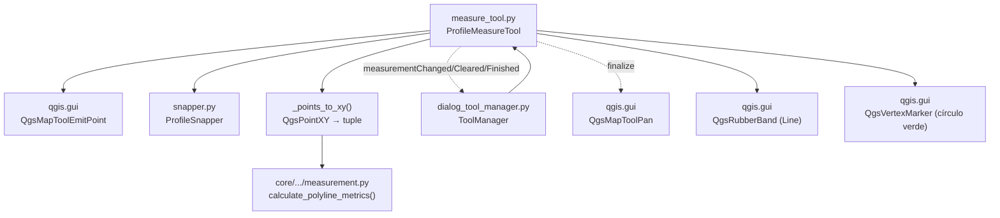

---
tags:
  - secinterp
  - code-walkthrough
  - gui
  - tools
aliases:
  - measure_tool.py
  - ProfileMeasureTool
cssclass: secinterp-note
---

# `gui/tools/measure_tool.py`

> [!abstract] Resumen en una línea
> Map tool de medición multipunto sobre el perfil: polilínea con snapping, métricas calculadas por la función pura del core `calculate_polyline_metrics()` y ciclo de vida con medición finalizada persistente.

**Ruta**: `gui/tools/measure_tool.py` (330 líneas)
**Clase principal**: `ProfileMeasureTool(QgsMapToolEmitPoint)` + helper `_points_to_xy()`
**Capa**: GUI · Tools (eventos + caucho visual; el cálculo es QGIS-agnóstico en `core/`)
**Tags**: #secinterp #gui #tools

---

## 🎯 ¿Por qué existe este archivo?

Medir sobre el perfil (distancia, desnivel, pendiente) exige dibujar una polilínea interactiva y mostrar métricas en vivo, pero el cálculo debe ser testeable sin QGIS.

| Problema | Solución |
|----------|----------|
| Medir distancias/pendientes con varios tramos sobre el canvas | `ProfileMeasureTool`: clic añade puntos, el movimiento emite preview de métricas |
| El cálculo no debe depender de `QgsPointXY` ni del canvas | `calculate_polyline_metrics()` del core opera sobre `list[tuple[float, float]]`; `_points_to_xy()` adapta |
| La medición confirmada debe quedar visible al volver a pan | Estado `finalized`/`finalized_points`: `reset()` conserva el caucho y `finalize_measurement()` conmuta a `QgsMapToolPan` |
| El diálogo debe mostrar, limpiar y reaccionar al fin de medición | Tres señales: `measurementChanged(dict)`, `measurementCleared`, `measurementFinished` |

> [!important] Nota arquitectónica
> Separación **UI vs. matemática**: el tool gestiona eventos, snapping y caucho; `core/utils/geometry_utils/measurement.py` calcula. El helper `_points_to_xy()` es la única costura entre ambos mundos. El ciclo de vida lo orquesta `ToolManager` ([[dialog_tool_manager]]), que conecta las tres señales al widget de preview.

---

## 🧬 Diagrama de relaciones



> [!tip] Cómo leer
> Flecha sólida = importa/delega; punteada = señal o conmutación de tool. El cálculo (`MATH`) nunca ve un objeto QGIS: solo recibe tuplas.

---

## 📦 Imports — lectura arquitectónica

```python
# gui/tools/measure_tool.py
from __future__ import annotations

import contextlib
from typing import Any

from qgis.core import (
    QgsPointXY,
    QgsWkbTypes,
)
from qgis.gui import (
    QgsMapCanvas,
    QgsMapToolEmitPoint,
    QgsMapToolPan,
    QgsRubberBand,
    QgsVertexMarker,
)
from qgis.PyQt.QtCore import Qt, pyqtSignal
from qgis.PyQt.QtGui import QColor

from sec_interp.core.utils.geometry_utils.measurement import calculate_polyline_metrics
from sec_interp.gui.tools.snapper import ProfileSnapper
from sec_interp.logger_config import get_logger
```

| # | Observación |
|---|-------------|
| ① | `contextlib` solo para la limpieza de escena (`cleanup_finalized`, `reset`): el patrón "limpiar sin romper" de los tools. |
| ② | `QgsMapToolPan` se importa para **autodesactivarse**: al finalizar, el tool crea un pan y lo instala en el canvas. |
| ③ | Único tool que importa del core una **función de cálculo** (no un DTO): `calculate_polyline_metrics`. Es la excepción legítima a "GUI no computa": delega en puro. |
| ④ | `ProfileSnapper` por composición, igual que `ProfileInterpretationTool`: mismo snapping, distinta semántica de botones. |
| ⑤ | Sin `QCoreApplication.translate` ni `datetime`/`uuid`: la medición no crea entidades persistentes, solo emite dicts efímeros. |

---

## 🏗️ Inventario de estructura

**Función helper (1):**

| Función | Firma | Rol |
|---------|-------|-----|
| `_points_to_xy` | `(points: list[QgsPointXY]) -> list[tuple[float, float]]` | Adapta puntos QGIS a matemática pura |

**Clase (1):** `ProfileMeasureTool(QgsMapToolEmitPoint)` — 3 señales + 14 métodos.

**Señales:**

| Señal | Payload | Reacción en `ToolManager` |
|-------|---------|---------------------------|
| `measurementChanged` | `dict` de métricas | `update_measurement_display()` pinta el HTML |
| `measurementCleared` | — | `results_text.clear()` |
| `measurementFinished` | — | `btn_measure.setChecked(False)` |

**Estado interno:**

| Atributo | Tipo | Rol |
|----------|------|-----|
| `points` | `list[QgsPointXY]` | Vértices de la medición en curso |
| `finalized` | `bool` | La medición está confirmada y congelada |
| `finalized_points` | `list[QgsPointXY]` | Copia de los puntos confirmados (para display) |
| `rubber_band` | `QgsRubberBand \| None` | Polilínea roja (ancho 2) |
| `vertex_markers` | `list[QgsVertexMarker]` | Círculos verdes (tamaño 8, ancho 2) |
| `snapper` | `ProfileSnapper` | Snapping compartido |
| `cursor` | `CrossCursor` | Cruz al activar |

**Métodos:**

| Método | Firma | Rol |
|--------|-------|-----|
| `__init__` | `(canvas: QgsMapCanvas) -> None` | Estado vacío + snapper |
| `activate` / `deactivate` | `() -> None` | Cursor en cruz; `deactivate` **no** resetea (persiste lo finalizado) |
| `disconnect_signals` | `() -> None` | Desconecta las 3 señales (`try/except TypeError`) |
| `cleanup_finalized` | `() -> None` | Limpieza total al cerrar el diálogo (oculta + retira + vacía) |
| `reset` | `() -> None` | Si `finalized`: solo vacía datos; si no: limpia todo y emite `measurementCleared` |
| `canvasReleaseEvent` | `(event: Any) -> None` | Derecho resetea; izquierdo añade (ignorado si `finalized`) |
| `canvasMoveEvent` | `(event: Any) -> None` | Caucho + preview de métricas (congelado si `finalized`) |
| `keyPressEvent` | `(event: Any) -> None` | `Enter` finaliza (≥ 2 puntos), `Escape` resetea |
| `_add_point` | `(point: QgsPointXY) -> None` | Añade, dibuja marcador y emite métricas desde 2 puntos |
| `finalize_measurement` | `() -> None` | Congela, redibuja banda final, conmuta a pan, emite `measurementFinished` |
| `_add_vertex_marker` | `(point: QgsPointXY) -> None` | Círculo verde por punto |
| `_ensure_rubber_band` | `() -> None` | Crea la banda de línea roja si falta |
| `_update_rubber_band` | `(current_point: QgsPointXY) -> None` | Fijos + cursor móvil |
| `_calculate_and_emit_preview` | `(target_point: QgsPointXY) -> None` | Métricas temporales con el cursor incluido |

---

## 📁 Archivos del paquete

| Archivo | Líneas | Rol |
|---|--:|---|
| `measure_tool.py` | 330 | Esta nota: medición multipunto persistente |
| `interpretation_tool.py` | 269 | Hermano: polígonos con `polygonFinished` (DTO) |
| `snapper.py` | 112 | `ProfileSnapper` compartido por ambos |
| `__init__.py` | — | Marcador de paquete |

---

## 📖 Recorrido método por método

### `_points_to_xy`

```python
def _points_to_xy(points: list[QgsPointXY]) -> list[tuple[float, float]]:
    """Extract (x, y) tuples from QgsPointXY points for pure-math processing."""
    return [(p.x(), p.y()) for p in points]
```

La costura Extract: convierte la geometría viva en datos planos antes de llamar al core. Gracias a ella, `calculate_polyline_metrics()` es testeable sin QGIS (`tests/core/test_geometry_utils.py` y `tests/core/test_utils.py` la ejercitan con tuplas).

### `activate` / `deactivate` (persistencia visual)

```python
def deactivate(self) -> None:
    """Note: We no longer call reset() here to allow measurements to persist
    visually until a new one is started or explicitly cleared."""
    super().deactivate()
```

Diferencia clave con el tool de interpretación: al desactivar **no limpia**, para que la medición finalizada siga dibujada bajo el pan. La limpieza real ocurre en `reset()` (nueva medición), `cleanup_finalized()` (cierre) o `toggle_measure_tool(False)` del manager.

### `disconnect_signals` / `cleanup_finalized`

```python
def disconnect_signals(self) -> None:
    try:
        self.measurementChanged.disconnect()
        self.measurementCleared.disconnect()
        self.measurementFinished.disconnect()
    except TypeError:
        pass
```

Desconecta las tres señales de una vez; si una no tenía slots, el `TypeError` aborta el `try` y las restantes podrían quedar conectadas (ver riesgos). `cleanup_finalized()` es la artillería pesada del cierre: oculta (`hide()`) y retira banda y marcadores de la escena con `suppress(Exception)`, y vacía `points`, `finalized_points` y flags. La invoca `_cleanup_map_tools()` de `dialog_lifecycle_mixin`.

### `reset` (doble comportamiento)

```python
if self.finalized:
    self.points = []
    self.finalized = False
    return  # visuals + results stay!
```

Si la medición está finalizada, `reset()` solo vacía `points` y baja el flag: la banda, los marcadores y el texto de resultados **permanecen**. Solo el reset "normal" (no finalizado) retira la escena y emite `measurementCleared`. Este es el truco que permite "medir → finalizar → medir de nuevo" sin parpadeos.

### `canvasReleaseEvent` / `canvasMoveEvent`

Clic derecho = `reset()` (cancelar todo; contrasta con interpretación, donde el derecho solo deshace un vértice). Clic izquierdo con `finalized` se ignora con un `info` en log. En movimiento, además del caucho se invoca `_calculate_and_emit_preview()`: métricas **temporales** calculadas con `[*points, cursor]`, de modo que el panel muestra la distancia "en vivo" antes de clicar.

### `keyPressEvent`

`Enter`/`Return` finaliza con ≥ 2 puntos (`MIN_MEASURE_POINTS = 2`); `Escape` resetea. Constantes locales con nombre en mayúsculas, estilo del módulo.

### `_add_point`

```python
def _add_point(self, point: QgsPointXY) -> None:
    self.points.append(point)
    self._ensure_rubber_band()
    self.rubber_band.addPoint(point, True)
    self._add_vertex_marker(point)
    MIN_RELEVANT_POINTS = 2
    if len(self.points) >= MIN_RELEVANT_POINTS:
        metrics = calculate_polyline_metrics(_points_to_xy(self.points))
        self.measurementChanged.emit(metrics)
```

Sin guarda anti-duplicados (a diferencia de interpretación): dos clics en el mismo sitio generan un segmento de longitud cero, inocuo para las métricas. Emite el dict completo (`total_distance`, `horizontal_distance`, `elevation_change`, `avg_slope`, `segment_count`, `segments`, `point_count`) que `ToolManager.update_measurement_display()` formatea a HTML.

### `finalize_measurement`

```python
self.finalized_points = self.points.copy()
self.finalized = True
metrics = calculate_polyline_metrics(_points_to_xy(self.points))
self.measurementChanged.emit(metrics)
if self.rubber_band:
    self.rubber_band.reset(QgsWkbTypes.GeometryType.LineGeometry)
    for point in self.finalized_points:
        self.rubber_band.addPoint(point, False)
    self.rubber_band.show()
pan_tool = QgsMapToolPan(self.canvas)
self.canvas.setMapTool(pan_tool)
self.measurementFinished.emit()
```

Secuencia de congelación: copia los puntos, emite métricas finales, **redibuja** la banda solo con los puntos fijos (elimina el segmento elástico al cursor), conmuta a pan y emite `measurementFinished` para desmarcar el botón. Es método público: también lo invoca el botón "Finalizar" del preview. Con < 2 puntos registra `warning` y no hace nada.

### `_update_rubber_band` / `_calculate_and_emit_preview` / `_add_vertex_marker` / `_ensure_rubber_band`

Banda `LineGeometry` roja (`255,0,0`, ancho 2), marcadores círculo verdes (`0,255,0`, tamaño 8, ancho 2). El preview de métricas construye `temp_points = [*self.points, target_point]` sin mutar el estado: el cursor participa en el cálculo pero nunca en `points`.

### Claves del dict de métricas (lo que el panel consume)

`calculate_polyline_metrics()` devuelve siempre las mismas claves, incluso con < 2 puntos (todo a cero):

| Clave | Significado | Unidad |
|-------|-------------|--------|
| `total_distance` | Longitud 2D acumulada de todos los segmentos | m (unidades del perfil) |
| `horizontal_distance` | Suma de `dx` (alcance horizontal) | m |
| `elevation_change` | `y_último − y_primero` (con signo) | m |
| `avg_slope` | Pendiente media | grados |
| `segment_count` | `len(points) − 1` | conteo |
| `segments` | Detalle por tramo (`distance`, `dx`, `dy`) | lista (el panel la ignora hoy) |
| `point_count` | Vértices incluidos | conteo |

> [!note] El panel filtra por `point_count`
> `ToolManager.update_measurement_display()` descarta dicts con menos de 2 puntos y formatea el resto a HTML (`total`, `horizontal`, `elevation_change` con signo, `avg_slope`). La lista `segments` viaja en el dict pero no se muestra.

### Medición vs. interpretación (misma base, distinta semántica)

| Aspecto | `ProfileMeasureTool` | `ProfileInterpretationTool` |
|---------|---------------------|----------------------------|
| Clic derecho | `reset()` total | quita solo el último vértice |
| `deactivate()` | conserva visuales | `reset()` completo |
| Umbral de confirmación | ≥ 2 puntos | ≥ 3 puntos |
| Salida | `dict` efímero de métricas | DTO `InterpretationPolygon` |
| Anti-duplicados | no | `compare(point, 1e-6)` |
| Auto-retiro | conmuta a `QgsMapToolPan` | no (el manager desactiva) |

> [!tip] Dónde vive cada comportamiento
> La semántica compartida (snapper, rubber band, `disconnect_signals`, limpieza con `suppress`) se hereda del patrón común de tools; la semántica distinta (rol del clic derecho, persistencia al desactivar, tipo de salida) es la razón por la que existen dos clases en vez de una parametrizada.

> [!note] Constantes locales de umbral
> `MIN_MEASURE_POINTS = 2` (confirmar) y `MIN_RELEVANT_POINTS = 2` (emitir) aparecen como locales en mayúsculas en `keyPressEvent`, `_add_point` y `finalize_measurement`. Mismo valor, tres sitios: unificarlas en una constante de clase evitaría divergencias futuras.
> El log distingue los tres momentos (`Point N added`, `finalize_measurement called`, `Measurement finalized` con distancia total), útil para depurar mediciones perdidas.
> Ver también [[dialog_lifecycle_mixin]] (`_cleanup_map_tools` invoca `cleanup_finalized()`) y [[preview_page]] para el botón Finalizar.
> Sin `cleanup_finalized()`, cada reapertura del diálogo dejaría una banda roja huérfana sobre el canvas.

---

## 🔄 Flujo de datos

| Fase | Entrada | Transformación | Salida |
|------|---------|----------------|--------|
| Activación | `ToolManager.toggle_measure_tool(True)` | `reset()` + `setMapTool` + botón Finalizar visible | tool listo |
| Trazado | clics (píxeles) | `snap()` → `QgsPointXY` → `_points_to_xy()` → core | `measurementChanged(dict)` en vivo |
| Preview | movimiento del ratón | `[*points, cursor]` → métricas temporales | dict provisional en el panel |
| Finalización | `Enter` / botón (≥ 2 puntos) | copia + redibujado + pan + `measurementFinished` | medición congelada y visible |
| Nueva medición | toggle de nuevo | `reset()` conserva visuales; siguiente clic arranca de cero | ciclo repetible |
| Cierre | cierre del diálogo | `cleanup_finalized()` | escena sin huérfanos |

---

## 🏛️ Patrones de diseño presentes

| Patrón | Dónde | Propósito |
|--------|-------|-----------|
| **Map Tool (QGIS)** | Herencia de `QgsMapToolEmitPoint` | Eventos estándar del canvas |
| **Observer (3 señales)** | `measurementChanged/Cleared/Finished` | Progreso, limpieza y fin observables por el manager |
| **Adapter** | `_points_to_xy()` | QGIS → matemática pura (Extract) |
| **Composición** | `ProfileSnapper` + función del core | Snapping y cálculo reutilizables |
| **State flag** | `finalized` / `finalized_points` | Persistencia visual tras confirmar |
| **Self-deactivation** | `finalize_measurement()` instala `QgsMapToolPan` | El tool se retira solo al terminar |

---

## 🧾 Resumen de la API

| Símbolo | Firma / Hereda | Uso típico |
|---------|----------------|------------|
| `ProfileMeasureTool` | `QgsMapToolEmitPoint` | `ProfileMeasureTool(canvas)` (lo crea `ToolManager`) |
| `measurementChanged` | `pyqtSignal(dict)` | Claves `total_distance`, `horizontal_distance`, `elevation_change`, `avg_slope`, `segment_count`, `point_count` |
| `measurementCleared` | `pyqtSignal()` | Limpiar `results_text` |
| `measurementFinished` | `pyqtSignal()` | Desmarcar `btn_measure` |
| `finalize_measurement` | `() -> None` | Botón Finalizar / `Enter` |
| `reset` / `cleanup_finalized` | `() -> None` | Reiniciar / cierre del diálogo |
| `_points_to_xy` | `(list[QgsPointXY]) -> list[tuple]` | Adaptador al core |

---

## 🛡️ Manejo de errores

| Situación | Comportamiento |
|-----------|----------------|
| Finalizar con < 2 puntos | `warning` y retorno, sin señales |
| Clic con medición finalizada | Ignorado con `info` en log |
| Movimiento con `finalized` o sin puntos | Retorno temprano, sin caucho ni emisiones |
| Objetos de escena destruidos | `suppress(Exception)` en `reset()` y `cleanup_finalized()` |
| Señal sin slots en `disconnect_signals` | `except TypeError: pass` (ver riesgo abajo) |

---

## 🧪 Tests asociados

Cobertura GUI en `tests/gui/test_measure_tool.py` (`TestMeasureTool`, 337 líneas, canvas mockeado):

- `test_snapper_no_layers` y casos con `QgsPointLocator` parcheado: snap sin capas, con capa válida, locator que falla o ausente.
- Tests del tool: añadir puntos, `_calculate_and_emit_preview`, `finalize_measurement`, `reset()` en ambos estados, `cleanup_finalized`, `disconnect_signals` en `tearDown`.

El cálculo puro se cubre en `tests/core/` sin QGIS: `test_geometry_utils.py` / `test_utils.py` para `calculate_polyline_metrics` (distancias, desnivel, pendiente, < 2 puntos). Integración del ciclo en `tests/gui/test_main_dialog_tools.py` (vía `ToolManager`).

---

## 👀 Observaciones y notas

> [!success] Fortalezas
> - Cálculo 100 % QGIS-agnóstico y unit-testeable en el core; el tool solo adapta y dibuja.
> - Preview de métricas en vivo con el cursor incluido, sin mutar el estado.
> - Medición finalizada persistente: el usuario la contempla mientras navega con pan.
> - Tres señales con semántica nítida (cambio / limpieza / fin).

> [!warning] Puntos de atención
> - `disconnect_signals()` usa un solo `try` para tres `disconnect()`: si la primera lanza `TypeError`, las otras dos no se intentan. Desconectar señal por señal sería más robusto.
> - Sin anti-duplicados: doble clic accidental crea un segmento cero (inocuo pero ensucia `segment_count`).
> - `finalize_measurement()` crea `QgsMapToolPan` sin guardar referencia: el pan anterior del manager queda sustituido fuera de su control.

> [!question] Preguntas abiertas
> - ¿Unificar el `disconnect` por señal con `contextlib.suppress`, como hace `ToolManager.disconnect_signals()`?
> - ¿Mostrar también la métrica por segmento (`segments`) en el panel, hoy ignorada por `update_measurement_display()`?

---

## 🔗 Notas relacionadas

- [[Index]] — índice de la bóveda
- [[gui_tools]] — nota de familia de map tools
- [[dialog_tool_manager]] — conecta las 3 señales y alterna medición/pan/interpretación
- [[snapper]] — snapping compartido con el tool de interpretación
- [[interpretation_tool]] — hermano con distinta semántica de clic derecho y salida DTO
- [[measurement]] — `calculate_polyline_metrics()`: claves del dict y matemática
- [[main_dialog]] — aloja canvas, botones y `results_text`
- [[preview_task_orchestrator]] — el cómputo pesado vive en `QgsTask`; medir es interacción ligera

---

*Nota de la bóveda SecInterp Code Walkthrough v2 — v3.9.1*
