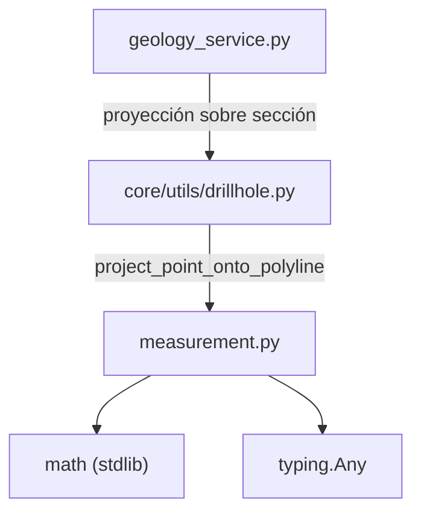

---
tags:
  - secinterp
  - code-walkthrough
  - core
  - utils
aliases:
  - measurement.py
  - project_point_onto_polyline
  - calculate_polyline_metrics
cssclass: secinterp-note
---

# `core/utils/geometry_utils/measurement.py`

> [!abstract] Resumen en una línea
> Utilidades **puras de medición geométrica** para perfiles: proyecta un punto sobre una polilínea y calcula métricas agregadas (distancia total, horizontal, cambio de cota, pendiente media) sin tocar QGIS.

**Ruta**: `core/utils/geometry_utils/measurement.py` (136 líneas)
**Función principal**: `project_point_onto_polyline`, `calculate_polyline_metrics`
**Capa**: Core (QGIS-agnóstico)
**Tags**: #secinterp #core #utils

---

## 🎯 ¿Por qué existe este archivo?

El visor de perfiles necesita medir distancias a lo largo de la línea de sección y
resumir la forma del terreno, pero ese cálculo no debe depender de `QgsGeometry`:

| Problema | Solución |
|----------|----------|
| Proyectar un sondaje/estructura sobre la línea de sección sin usar `QgsGeometry.closestSegmentWithContext` | `project_point_onto_polyline` con matemática planar |
| Resumir la forma de un perfil (distancia, cota, pendiente) para la UI | `calculate_polyline_metrics` devuelve un dict agregado |
| Operar en hilos de fondo (`QgsTask`) sin objetos QGIS | Sólo `math` + tuples `(x, y)` |

> [!important] Nota arquitectónica
> QGIS-agnóstico total: ni un solo import de `qgis.*`. Todo son `tuple[float, float]`
> y `dict`. Aproxima la proyección con **matemática planar**, válida para CRS proyectados.

---

## 🧬 Diagrama de relaciones



> [!tip] Cómo leer
> `measurement` no depende de nada del proyecto: es la hoja de cálculo de la geometría.
> `drillhole.py` la importa para proyectar trayectorias; el resto del core la alcanza
> transitivamente.

---

## 📦 Imports — lectura arquitectónica

```python
# core/utils/geometry_utils/measurement.py
from __future__ import annotations

import math
from typing import Any
```

| # | Observación |
|---|-------------|
| ① | `math` (hypot, sqrt, atan, degrees) — toda la trigonometría es estándar, sin NumPy. |
| ② | `typing.Any` sólo para el retorno flexible del dict de métricas. |
| ③ | **Cero imports del proyecto**: no acopla con `drillhole`, `sampling` ni `domain`. |

> [!note] Diseño deliberado de "hoja pura"
> Ser la base de la pila (nadie por debajo) lo hace trivialmente testeable y reutilizable
> desde `drillhole.py` sin riesgo de ciclos de import.

---

## 🏗️ Inventario de estructura

**Funciones (2 públicas, 0 clases):**

- `project_point_onto_polyline(point, polyline) -> tuple[float, tuple[float, float]]`
- `calculate_polyline_metrics(points) -> dict[str, Any]`

**Constantes locales:**

- `MIN_POINTS_REQUIRED = 2` (dentro de `calculate_polyline_metrics`)

---

## 📁 Archivos del paquete

| Archivo | Líneas | Rol |
|---|--:|---|
| [[#measurementpy|measurement.py]] | 136 | Medición geométrica planar (proyección + métricas) |

> [!note] Subpaquete `geometry_utils/`
> Convive con [[optimization]] (simplificación) y [[processing]] (densificación/interpolación).
> Ver [[core_utils_geometry_utils]] para el rol del namespace.

---

## 📖 Recorrido método por método

### `project_point_onto_polyline`

```python
def project_point_onto_polyline(
    point: tuple[float, float],
    polyline: list[tuple[float, float]],
) -> tuple[float, tuple[float, float]]:
    if not polyline:
        return 0.0, point
    if len(polyline) == 1:
        return 0.0, polyline[0]

    px, py = point
    best_dist_along = 0.0
    best_point = polyline[0]
    best_sq = float("inf")
    cumulative = 0.0

    for i in range(len(polyline) - 1):
        x1, y1 = polyline[i]
        x2, y2 = polyline[i + 1]
        dx = x2 - x1
        dy = y2 - y1
        seg_len = math.hypot(dx, dy)

        if seg_len == 0:
            nearest = (x1, y1)
            t = 0.0
        else:
            t = ((px - x1) * dx + (py - y1) * dy) / (dx * dx + dy * dy)
            t = max(0.0, min(1.0, t))
            nearest = (x1 + t * dx, y1 + t * dy)

        sq = (px - nearest[0]) ** 2 + (py - nearest[1]) ** 2
        if sq < best_sq:
            best_sq = sq
            best_dist_along = cumulative + t * seg_len
            best_point = nearest

        cumulative += seg_len

    return best_dist_along, best_point
```

Proyección punto-segmento iterando todos los tramos. Devuelve `(distancia_a_lo_largo, punto_más_cercano)`.
- `t` es la **proyección paramétrica** del punto sobre el segmento, recortada a `[0, 1]`
  para quedarse dentro del tramo (no prolonga la recta).
- `seg_len == 0` evita la división por cero en vértices repetidos.
- Compara distancias **al cuadrado** (`sq < best_sq`) para no calcular `sqrt` en cada tramo.
- `cumulative` acumula la longitud recorrida, así `dist_along` es la posición real sobre la
  polilínea, no sobre un solo tramo.

> [!tip] Casos borde
> Polilínea vacía → `(0.0, point)`; un solo vértice → `(0.0, polyline[0])`. Sin excepciones.

### `calculate_polyline_metrics`

```python
def calculate_polyline_metrics(points: list[tuple[float, float]]) -> dict[str, Any]:
    MIN_POINTS_REQUIRED = 2
    if len(points) < MIN_POINTS_REQUIRED:
        return {
            "total_distance": 0.0,
            "horizontal_distance": 0.0,
            "elevation_change": 0.0,
            "avg_slope": 0.0,
            "segment_count": 0,
            "segments": [],
            "point_count": len(points),
        }

    total_dist = 0.0
    total_dx = 0.0
    segments = []

    for i in range(len(points) - 1):
        p1 = points[i]
        p2 = points[i + 1]
        dx = abs(p2[0] - p1[0])
        dy = p2[1] - p1[1]
        seg_dist = math.sqrt(dx * dx + dy * dy)

        total_dist += seg_dist
        total_dx += dx
        segments.append({
            "distance": seg_dist,
            "dx": dx,
            "dy": dy,
            "start": (p1[0], p1[1]),
            "end": (p2[0], p2[1]),
        })

    elevation_change = points[-1][1] - points[0][1]

    avg_slope = 0.0
    if total_dx > 0:
        avg_slope = math.degrees(math.atan(abs(elevation_change) / total_dx))

    return {
        "total_distance": total_dist,
        "horizontal_distance": total_dx,
        "elevation_change": elevation_change,
        "avg_slope": avg_slope,
        "segment_count": len(segments),
        "segments": segments,
        "point_count": len(points),
    }
```

Resumen agregado del perfil. Claves del retorno:
- `total_distance`: longitud 3D acumulada de todos los tramos.
- `horizontal_distance`: suma de los `|dx|` (alcance en X).
- `elevation_change`: cota final − cota inicial (signo conservado).
- `avg_slope`: `atan(|Δz| / Δx)` en grados; `0` si no hay avance horizontal.
- `segments`: detalle por tramo (distancia, `dx`, `dy`, extremos) para la UI.

> [!tip] `elevation_change` conserva el signo
> A diferencia de `horizontal_distance` (siempre positivo), el cambio de cota usa
> `points[-1][1] - points[0][1]` **sin `abs`**, para distinguir subida de bajada.

---

## 📐 Fundamento matemático

### Proyección punto-segmento

El parámetro `t` sale del producto escalar de vectores:

```
t = ((p − p1) · (p2 − p1)) / |p2 − p1|²
```

| Término | Significado |
|---------|-------------|
| `(p2 − p1)` | vector director del segmento |
| `(p − p1) · (p2 − p1)` | componente del vector al punto sobre el segmento |
| `|p2 − p1|²` | normalización (longitud al cuadrado) |
| `max(0.0, min(1.0, t))` | proyección recortada al interior del tramo |

### Pendiente media

```
avg_slope = degrees(atan(|elevation_change| / total_dx))
```

- `total_dx` es la suma de `|dx|` (no la distancia euclídea a lo largo del perfil).
- Si `total_dx == 0` (perfil vertical), se define `avg_slope = 0` para evitar la
  indeterminación `atan(∞)`.

### Ejemplo numérico (triángulo 3-4-5)

| Métrica | Cálculo | Valor |
|---------|---------|-------|
| `total_distance` | `hypot(3, 4)` | `5.0` |
| `horizontal_distance` | `|3 − 0|` | `3.0` |
| `elevation_change` | `4 − 0` | `4.0` |
| `avg_slope` | `degrees(atan(4/3))` | `≈ 53.13°` |

---

## 🧮 Complejidad y rendimiento

| Operación | Complejidad | Nota |
|-----------|-------------|------|
| `project_point_onto_polyline` | `O(n)` | recorre los `n − 1` tramos una vez |
| `calculate_polyline_metrics` | `O(n)` | acumulación lineal |

- Ambas son lineales en el número de vértices, aptas para perfiles grandes.
- La comparación por distancias **al cuadrado** evita `sqrt` en cada iteración.
- El compañero natural es [[optimization]] (LOD) para reducir `n` antes de medir.

---

## 🔄 Flujo de datos

| Fase | Entrada | Transformación | Salida |
|------|---------|----------------|--------|
| Proyección | `(x, y)` + polilínea | proyección paramétrica por tramo | `(dist_along, nearest_point)` |
| Métricas | lista `(x, y)` | acumulación por tramos + `atan` | dict con 7 claves |

**Consumidores reales:**

| Consumidor | Qué usa | Para qué |
|-----------|---------|----------|
| `drillhole.py::project_trajectory_to_section` | `project_point_onto_polyline` | situar cada punto 3D sobre la sección |
| `preview_service` / UI del perfil | `calculate_polyline_metrics` | etiquetas de distancia y pendiente |

---

## 🏛️ Patrones de diseño presentes

| Patrón | Dónde | Propósito |
|--------|-------|-----------|
| **Función pura** | ambas | Sin estado ni efectos secundarios; determinista y thread-safe |
| **DTO por diccionario** | `calculate_polyline_metrics` | Devuelve un dict tipado por convención, no un objeto |
| **Early-return defensivo** | ambas | Polilíneas vacías/cortas sin excepciones |
| **Micro-optimización** | comparación por `sq` | Evita `sqrt` en el bucle interior |

---

## 🧾 Resumen de la API

| Símbolo | Firma | Uso típico |
|---------|-------|------------|
| `project_point_onto_polyline` | `(point, polyline) -> tuple[float, tuple[float, float]]` | Proyectar un punto sobre la línea de sección |
| `calculate_polyline_metrics` | `(points) -> dict[str, Any]` | Resumir forma del perfil para la UI |

---

## 🛡️ Manejo de errores

No lanza excepciones de dominio; maneja todo con **retornos defensivos**:

| Caso | Comportamiento |
|------|----------------|
| `polyline == []` | `project_point_onto_polyline` → `(0.0, point)` |
| `len(polyline) == 1` | → `(0.0, polyline[0])` |
| `len(points) < 2` | `calculate_polyline_metrics` → dict con ceros y `point_count` real |
| `total_dx == 0` | `avg_slope` → `0.0` (evita división por cero) |

> [!warning] No valida unidades
> La función asume CRS proyectado (matemática planar). En CRS geográficos (grados) los
> resultados serían incorrectos; la responsabilidad de proyectar es del llamador (GUI).

---

## 🧪 Tests asociados

`tests/core/test_geometry_utils.py` → `TestGeometryMeasurement`:

- `test_calculate_polyline_metrics_empty` — listas vacías y de un punto (`point_count`).
- `test_calculate_polyline_metrics_valid` — triángulo 3-4-5: `total_distance=5.0`,
  `horizontal_distance=3.0`, `elevation_change=4.0`, `avg_slope≈53.13°`.

> [!note] Cobertura indirecta
> `project_point_onto_polyline` se ejercita vía `tests/core/test_drillhole_utils.py`
> (proyección de trayectoria), además de su uso en `test_geometry_utils.py`.

---

## 🔬 Precisión numérica y casos límite

| Caso | Comportamiento | Riesgo |
|------|----------------|--------|
| Vértice duplicado (`seg_len == 0`) | `t = 0.0`, `nearest = (x1, y1)` | ninguno, se salta la división |
| `t` fuera de `[0, 1]` | recortado con `max/min` | evita proyectar fuera del tramo |
| Distancias muy pequeñas | compara cuadrados, no raíces | menos error de redondeo acumulado |
| `total_dx == 0` (perfil vertical) | `avg_slope = 0.0` | pendiente indefinida → 0 por convención |

> [!warning] Unidades implícitas
> No hay parámetro de tolerancia: la proyección es **exacta en coma flotante**. La
> tolerancia de inclusión (p. ej. `buffer_width` en sondajes) la gestionan los llamadores.

---

## 👀 Observaciones y notas

> [!success] Fortalezas
> - QGIS-agnóstico y libre de dependencias: fácil de testear y portar.
> - Casos borde bien cubiertos (vacio, un vértice, tramos degenerados).
> - Retorno `(dist_along, nearest)` reutilizado directamente por `drillhole.py`.

> [!warning] Puntos de atención
> - `calculate_polyline_metrics` devuelve `dict[str, Any]` sin un DTO tipado (`TypedDict`).
> - No documenta explícitamente la suposición de CRS planar; un uso en grados es silencioso.
> - `avg_slope` es una pendiente **global** (primer vs último punto), no la media por tramo.

> [!question] Preguntas abiertas
> - ¿Migrar el dict de métricas a un `TypedDict` (`PolylineMetrics`) en `core/types.py`?
> - ¿Añadir `total_distance` geodésica opcional para CRS geográficos?
> - ¿Exponer `project_point_onto_polyline` desde `core/utils/__init__.py` como los demás
>   helpers puros, o mantenerlo interno a `geometry_utils`?

---

## 🔗 Notas relacionadas

- [[Index]] — índice de la bóveda
- [[drillhole]] — principal consumidor de `project_point_onto_polyline`
- [[optimization]] / [[processing]] — módulos hermanos en `geometry_utils/`
- [[core_utils_geometry_utils]] — namespace del subpaquete
- [[performance_metrics]] — métricas de rendimiento (aplicables a estos cálculos)

---

*Nota de la bóveda SecInterp Code Walkthrough v2 — v3.8.0*
