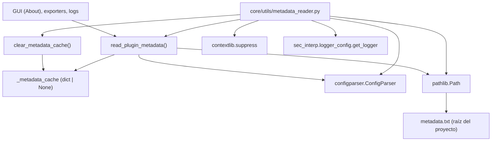

---
tags:
  - secinterp
  - code-walkthrough
  - core
  - utils
  - metadata
aliases:
  - metadata_reader.py
  - read_plugin_metadata
  - clear_metadata_cache
cssclass: secinterp-note
---

# `core/utils/metadata_reader.py`

> [!abstract] Resumen en una línea
> Lee el `metadata.txt` estándar de QGIS con `ConfigParser` y lo expone como un dict cacheado, garantizando una **única fuente de verdad** para nombre, versión, autor y email del plugin.

**Ruta**: `core/utils/metadata_reader.py` (129 líneas)
**Clase/Función principal**: `read_plugin_metadata`
**Capa**: Core · Utilities (QGIS-agnóstico)
**Tags**: #secinterp #core #utils #metadata

---

## 🎯 ¿Por qué existe este archivo?

La versión, el autor y el email del plugin se repiten en varios puntos (About, UI,
logs, exporters). Si cada módulo los hardcodea, se desincronizan con el
`metadata.txt` oficial que QGIS usa para publicar el plugin.

| Problema | Solución |
|----------|----------|
| Versión/autor duplicados en varios módulos | `read_plugin_metadata()` centraliza la lectura del `metadata.txt` |
| Lectura repetida del archivo en cada llamada | Caché a nivel de módulo (`_metadata_cache`) |
| Campos opcionales que pueden faltar | `contextlib.suppress` los ignora sin romper la lectura |
| Tests/actualizaciones en caliente | `clear_metadata_cache()` resetea el caché |

> [!important] Nota arquitectónica — QGIS-agnóstico puro
> Aunque lee el `metadata.txt` *de* QGIS, el módulo **no importa `qgis.*`**: usa
> `configparser.ConfigParser` y `pathlib.Path` de la stdlib. Es perfectamente testeable
> sin QGIS (Mock-first), como demuestra `tests/core/utils/test_metadata_reader.py`.

---

## 🧬 Diagrama de relaciones



> [!tip] Cómo leer
> `read_plugin_metadata` localiza `metadata.txt` (vía `Path`), lo parsea (`ConfigParser`)
> y cachea el resultado. `clear_metadata_cache` invalida el caché. Los consumidores solo
> llaman a `read_plugin_metadata`, nunca leen el archivo directamente.

---

## 📦 Imports — lectura arquitectónica

```python
# core/utils/metadata_reader.py
from __future__ import annotations

from configparser import ConfigParser
from contextlib import suppress
from pathlib import Path
from typing import TYPE_CHECKING

from sec_interp.logger_config import get_logger

if TYPE_CHECKING:
    pass

logger = get_logger(__name__)
```

| # | Observación |
|---|-------------|
| ① | `configparser.ConfigParser` lee el formato INI del `metadata.txt` (sección `[general]`). |
| ② | `contextlib.suppress` permite ignorar campos opcionales ausentes sin `try/except` ruidoso. |
| ③ | `pathlib.Path` resuelve la ruta del `metadata.txt` de forma portable (Windows/Linux/macOS). |
| ④ | `TYPE_CHECKING` con `pass`: bloque preparado para anotaciones futuras sin coste en runtime. |
| ⑤ | `get_logger(__name__)` desde `sec_interp.logger_config` (proyecto, no stdlib) → logging centralizado. |
| ⑥ | **Cero imports de `qgis.*`** ⇒ el módulo es QGIS-agnóstico. |

---

## 🏗️ Inventario de estructura

**Estado global (1):**

- `_metadata_cache: dict[str, str] | None` — caché a nivel de módulo para evitar lecturas repetidas.

**Funciones (2):**

- `read_plugin_metadata() -> dict[str, str]` — lee y cachea el metadata.
- `clear_metadata_cache() -> None` — invalida el caché.

**Logger (1):**

- `logger = get_logger(__name__)` — usado para `error`, `exception` y `debug`.

---

## 📁 Archivos del paquete

`metadata_reader.py` vive en `core/utils/`:

| Archivo | Líneas | Rol |
|---|--:|---|
| [[metadata_reader]] | 129 | Lectura de `metadata.txt` (versión, autor) |
| [[io]] | 101 | Escritura de vectores (`create_vector_writer`) |
| [[parsing]] | 222 | Parsing de strike/dip, acimut cardinal y atributos |
| [[rendering]] | 129 | Bounds, transformada de coordenadas, intervalos |
| [[safe_loader]] | 79 | Importación y carga perezosa segura |
| [[drillhole]] | 298 | Trayectoria y proyección de sondajes |

> [!note] `metadata_reader` y `safe_loader` comparten el logger
> Ambos importan `from sec_interp.logger_config import get_logger`, a diferencia del
> resto de utilidades puras que no logean. Ver [[safe_loader]].

---

## 📖 Recorrido método por método

### `read_plugin_metadata`

```python
def read_plugin_metadata() -> dict[str, str]:
    global _metadata_cache

    if _metadata_cache is not None:
        return _metadata_cache

    metadata_path = Path(__file__).parent.parent.parent / "metadata.txt"

    if not metadata_path.exists():
        msg = f"metadata.txt not found at {metadata_path}"
        logger.error(msg)
        raise FileNotFoundError(msg)

    parser = ConfigParser()
    try:
        parser.read(metadata_path, encoding="utf-8")
    except Exception as e:
        msg = f"Failed to parse metadata.txt: {e}"
        logger.exception(msg)
        raise ValueError(msg) from e

    required_fields = ["name", "version", "author", "email"]
    metadata = {}
    for field in required_fields:
        try:
            metadata[field] = parser.get("general", field)
        except Exception as e:
            msg = f"Required field '{field}' missing in metadata.txt"
            logger.exception(msg)
            raise ValueError(msg) from e

    optional_fields = ["description", "homepage", "repository", "about"]
    for field in optional_fields:
        with suppress(Exception):
            metadata[field] = parser.get("general", field)

    _metadata_cache = metadata
    logger.debug(f"Loaded plugin metadata: {metadata['name']} v{metadata['version']}")
    return metadata
```

El flujo sigue un patrón de **memoización + fail-fast**:

1. **Cache hit** → devuelve el dict ya leído sin tocar el disco.
2. **Localizar** → `Path(__file__).parent.parent.parent / "metadata.txt"` sube 2 niveles desde `core/utils/` hasta la raíz del proyecto.
3. **Existencia** → si no existe, `FileNotFoundError` con la ruta exacta en el mensaje.
4. **Parseo** → `ConfigParser.read(..., encoding="utf-8")`; cualquier error se envuelve en `ValueError` con `raise ... from e`.
5. **Campos requeridos** → `name`, `version`, `author`, `email`; si falta uno, `ValueError`.
6. **Campos opcionales** → `description`, `homepage`, `repository`, `about`; los ausentes se ignoran con `suppress`.
7. **Cachear y retornar**.

> [!tip] La ruta es relativa a `__file__`, no al CWD
> `Path(__file__).parent.parent.parent` hace la resolución **independiente del directorio
> de trabajo**, robusta tanto en desarrollo como cuando QGIS carga el plugin desde el
> directorio de plugins del perfil.

### `clear_metadata_cache`

```python
def clear_metadata_cache() -> None:
    global _metadata_cache
    _metadata_cache = None
    logger.debug("Metadata cache cleared")
```

Útil para tests (cada `setUp`/`tearDown` lo invoca) y para cuando el `metadata.txt` se
actualiza en tiempo de ejecución. Es la palanca que hace testeable la memoización.

---

## 🔄 Flujo de datos

| Fase | Entrada | Transformación | Salida |
|------|---------|----------------|--------|
| Cache hit | `_metadata_cache` (dict) | retorno directo | `dict[str, str]` |
| Localización | `Path(__file__)` | `.parent.parent.parent / "metadata.txt"` | ruta absoluta |
| Parseo | contenido INI | `ConfigParser.read(encoding="utf-8")` | secciones/opciones |
| Extracción requerida | `[general]` name/version/author/email | `parser.get("general", field)` | campos obligatorios |
| Extracción opcional | description/homepage/repository/about | `suppress(Exception)` | campos opcionales |
| Memoización | `metadata` | asignación a `_metadata_cache` | caché poblado |

---

## 🏛️ Patrones de diseño presentes

| Patrón | Dónde | Propósito |
|--------|-------|-----------|
| **Memoization (cache-aside)** | `_metadata_cache` + early return | Evitar I/O repetido del archivo |
| **Single source of truth** | lectura centralizada del `metadata.txt` | Una única definición de versión/autor |
| **Fail-fast + context** | `raise ... from e` | Preservar la traza original al envolver errores |
| **Null-object-ish (suppress)** | `contextlib.suppress` en opcionales | Ignorar ausencias sin ramas ruidosas |
| **Module singleton state** | `_metadata_cache` global | Estado compartido por todo el proceso |

---

## 🧾 Resumen de la API

| Símbolo | Firma / Hereda | Uso típico |
|---------|----------------|------------|
| `read_plugin_metadata` | `() -> dict[str, str]` | Obtener `name`, `version`, `author`, `email` (cacheado) |
| `clear_metadata_cache` | `() -> None` | Resetear el caché (tests o recarga en caliente) |

**Claves del dict devuelto:**

| Clave | Requerida | Descripción |
|-------|:---:|---|
| `name` | sí | Nombre del plugin |
| `version` | sí | Versión (p. ej. `v3.8.0`) |
| `author` | sí | Autor |
| `email` | sí | Email de contacto |
| `description` | no | Descripción corta |
| `homepage` | no | URL de documentación |
| `repository` | no | URL del código fuente |
| `about` | no | Texto "acerca de" |

---

## 📄 Estructura del `metadata.txt`

El archivo leído sigue el formato INI estándar de los plugins de QGIS:

```ini
[general]
name=Sec Interp
version=3.8.0
author=Juan M Bernales
email=juanbernales@gmail.com
description=Data extraction for geological interpretation
homepage=https://...
repository=https://github.com/...
about=...texto largo...
```

| Elemento | Detalle |
|----------|---------|
| Sección | `[general]` — única sección leída por el módulo |
| Codificación | `utf-8` (explícita en `parser.read`) |
| Delimitadores | `=` (INI clásico) |
| Comentarios | líneas con `#` o `;` — `ConfigParser` los ignora |

> [!note] La cabecera GPL del `.py` no forma parte del metadata
> `metadata_reader.py` conserva la cabecera GPL/Plugin Builder heredada, pero es
> irrelevante para la lógica: solo importa el `metadata.txt` externo.

---

## 🧠 Memoización: ciclo de vida

```python
if _metadata_cache is not None:   # ① cache hit
    return _metadata_cache
...
_metadata_cache = metadata        # ② cache write
```

| Momento | Estado del caché | Efecto |
|---------|------------------|--------|
| Primer `read_plugin_metadata()` | `None` → lee y escribe | 1 lectura de disco |
| Llamadas posteriores | dict → retorno directo | 0 lecturas de disco |
| `clear_metadata_cache()` | `None` (reset) | próxima llamada relee |
| Al terminar el proceso | dict en memoria | se libera con el intérprete |

> [!tip] Coste ≈ una lectura por proceso
> La lectura del archivo ocurre **una sola vez** por vida del proceso QGIS. Los tests
> lo invalidan explícitamente para asegurar aislamiento.

---

## 🔎 ¿Quién lo consume?

| Consumidor | Propósito |
|------------|-----------|
| Diálogo "About" / UI | Mostrar nombre, versión y autor |
| Exporters | Emitir metadatos de versión en los archivos generados |
| Logs | Anotar versión del plugin en el arranque |

> [!note] No se importa en el `__init__.py` de `core/utils/`
> `metadata_reader` no aparece en los re-exports del paquete; se importa de forma
> explícita donde se necesita (`from sec_interp.core.utils.metadata_reader import ...`).

---

## 🛡️ Manejo de errores

| Caso | Excepción | Log |
|------|-----------|-----|
| `metadata.txt` no existe | `FileNotFoundError` | `logger.error(msg)` |
| Fallo al parsear | `ValueError` (desde `Exception`) | `logger.exception(msg)` |
| Campo requerido ausente | `ValueError` (desde `Exception`) | `logger.exception(msg)` |
| Campo opcional ausente | — (suprimido) | — |

```python
# Preservar la causa original al envolver
try:
    parser.read(metadata_path, encoding="utf-8")
except Exception as e:
    msg = f"Failed to parse metadata.txt: {e}"
    logger.exception(msg)
    raise ValueError(msg) from e
```

> [!tip] `raise ... from e` mantiene la cadena de excepciones
> El traceback original (p. ej. un `UnicodeDecodeError`) no se pierde: queda accesible
> vía `__cause__`, facilitando el diagnóstico.

> [!warning] `except Exception` es deliberadamente amplio
> Capturar `Exception` en el parseo y en los campos requeridos normaliza **cualquier**
> fallo a `ValueError`, a costa de perder granularidad. Es pragmático para un archivo
> de configuración pequeño, pero oculta la causa concreta hasta inspeccionar el log.

---

## 🧪 Tests asociados

`tests/core/utils/test_metadata_reader.py` (104 líneas, Mock-first, sin QGIS):

- `test_read_plugin_metadata_success` — parchea `Path` y `ConfigParser`; verifica `name`, `version`, `author`, `email`, `homepage`.
- `test_read_plugin_metadata_file_not_found` — `exists() -> False` ⇒ `FileNotFoundError`.
- `test_read_plugin_metadata_missing_fields` — `parser.get` falla en `version` ⇒ `ValueError`.
- `test_integration_real_metadata` — lee el `metadata.txt` real; verifica `name == "Sec Interp"`.

> [!note] `setUp`/`tearDown` invocan `clear_metadata_cache()`
> Cada test resetea el caché para que la memoización no contamine un test con el
> resultado de otro (aislamiento).

---

## 👀 Observaciones y notas

> [!success] Fortalezas
> - 100% QGIS-agnóstico: solo stdlib + logger del proyecto.
> - Memoización simple y testeable gracias a `clear_metadata_cache`.
> - Mensajes de error con la ruta exacta del archivo ausente.

> [!warning] Puntos de atención
> - `except Exception` amplio en parseo/campos; la causa concreta solo se ve en el log.
> - El `TYPE_CHECKING: pass` es un bloque vacío; no aporta nada hoy.
> - El dict devuelto es mutable y compartido: un consumidor podría modificarlo e invalidar el caché silenciosamente.

> [!question] Preguntas abiertas
> - ¿Tipar el retorno como `TypedDict` (`PluginMetadata`) para documentar las claves?
> - ¿Devolver una copia (`dict(metadata)`) para proteger el caché de mutaciones externas?
> - ¿Eliminar el bloque `if TYPE_CHECKING: pass` que no declara nada?

---

## 🔗 Notas relacionadas

- [[Index]] — índice de la bóveda
- [[core_utils]] — paquete `core/utils/` y sus utilidades puras
- [[safe_loader]] — comparte el logger de `logger_config` y el rol de infraestructura
- [[io]] — escribe vectores; su exportación acompaña la versión leída aquí
- [[controller]] — puede exponer la versión en la UI/logs
- [[parsing]] / [[rendering]] — vecinos puros del mismo paquete

---

*Nota de la bóveda SecInterp Code Walkthrough v2 — v3.9.0*
