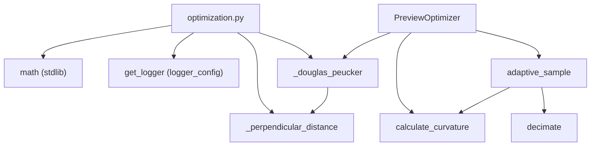

---
tags:
  - secinterp
  - code-walkthrough
  - core
  - utils
aliases:
  - optimization.py
  - PreviewOptimizer
  - decimate
  - calculate_curvature
  - adaptive_sample
cssclass: secinterp-note
---

# `core/utils/geometry_utils/optimization.py`

> [!abstract] Resumen en una línea
> Optimización geométrica para render de previsualización: simplifica polilíneas con **Douglas-Peucker**, estima la **curvatura** local por desviación angular y muestrea de forma **adaptativa** según la curvatura, sin tocar QGIS.

**Ruta**: `core/utils/geometry_utils/optimization.py` (197 líneas)
**Clase principal**: `PreviewOptimizer`
**Capa**: Core (QGIS-agnóstico)
**Tags**: #secinterp #core #utils

---

## 🎯 ¿Por qué existe este archivo?

Los perfiles y estructuras 3D pueden tener miles de vértices; dibujarlos todos degrada el
render. Se necesita **reducir el número de puntos** preservando la forma:

| Problema | Solución |
|----------|----------|
| Perfiles con demasiados vértices ralentizan el render | `decimate` con Douglas-Peucker |
| La simplificación uniforme borra detalles importantes | `adaptive_sample` baja la tolerancia donde hay más curvatura |
| Cuantificar "cuánto gira" una línea | `calculate_curvature` (desviación angular entre tramos) |

> [!important] Nota arquitectónica
> QGIS-agnóstico: sólo `math` y `sec_interp.logger_config.get_logger`. El **LOD**
> (Level of Detail) se calcula en el core; la GUI decide cuándo aplicarlo según el zoom.

---

## 🧬 Diagrama de relaciones



> [!tip] Cómo leer
> `PreviewOptimizer` es una **fachada estática**: `adaptive_sample` orquesta curvatura →
> tolerancia → `decimate`. Los helpers privados (`_douglas_peucker`, `_perpendicular_distance`)
> implementan el algoritmo recursivo.

---

## 📦 Imports — lectura arquitectónica

```python
# core/utils/geometry_utils/optimization.py
from __future__ import annotations

import math

from sec_interp.logger_config import get_logger

logger = get_logger(__name__)
```

| # | Observación |
|---|-------------|
| ① | `math` para trigonometría (`hypot`, `acos`, `degrees`). |
| ② | `get_logger(__name__)` inyecta el logger del proyecto; sin `qgis.*` directo. |
| ③ | Un único import del proyecto (`logger_config`), que es infraestructura, no dominio. |

> [!note] Logger a nivel de módulo
> `logger = get_logger(__name__)` se crea una vez en el import. Los `logger.debug` de
> `decimate` y `adaptive_sample` informan la reducción LOD sin ruido en producción.

---

## 🏗️ Inventario de estructura

**Clases (1):**

- `class PreviewOptimizer` — 3 métodos estáticos/de clase, sin estado.

**Funciones privadas (2):**

- `_perpendicular_distance(point, line_start, line_end) -> float`
- `_douglas_peucker(points, tolerance) -> list[tuple[float, float]]`

**Constantes locales:**

- `MIN_POINTS_REQUIRED = 3` (Douglas-Peucker)
- `MIN_COMPONENTS_REQUIRED = 3` (curvatura)

---

## 📁 Archivos del paquete

| Archivo | Líneas | Rol |
|---|--:|---|
| [[#optimizationpy|optimization.py]] | 197 | Simplificación, curvatura y muestreo adaptativo |

> [!note] Subpaquete `geometry_utils/`
> Convive con [[measurement]] (medición) y [[processing]] (densificación). Ver
> [[core_utils_geometry_utils]] para el rol del namespace.

---

## 📖 Recorrido método por método

### `_perpendicular_distance`

```python
def _perpendicular_distance(
    point: tuple[float, float],
    line_start: tuple[float, float],
    line_end: tuple[float, float],
) -> float:
    px, py = point
    x1, y1 = line_start
    x2, y2 = line_end

    dx = x2 - x1
    dy = y2 - y1
    if dx == 0 and dy == 0:
        return math.hypot(px - x1, py - y1)

    t = ((px - x1) * dx + (py - y1) * dy) / (dx * dx + dy * dy)
    t = max(0.0, min(1.0, t))
    return math.hypot(px - (x1 + t * dx), py - (y1 + t * dy))
```

Distancia perpendicular de un punto a un segmento, con `t` recortado a `[0, 1]`. Es la
misma proyección paramétrica de [[measurement]], pero aquí devuelve la **distancia**.
- Segmento degenerado (`dx == 0 and dy == 0`) → distancia euclídea al vértice.
- Es la métrica que Douglas-Peucker usa para decidir qué punto conservar.

### `_douglas_peucker`

```python
def _douglas_peucker(
    points: list[tuple[float, float]], tolerance: float
) -> list[tuple[float, float]]:
    MIN_POINTS_REQUIRED = 3
    if len(points) < MIN_POINTS_REQUIRED:
        return points

    start = points[0]
    end = points[-1]

    max_dist = 0.0
    index = 0
    for i in range(1, len(points) - 1):
        dist = _perpendicular_distance(points[i], start, end)
        if dist > max_dist:
            max_dist = dist
            index = i

    if max_dist > tolerance:
        left = _douglas_peucker(points[: index + 1], tolerance)
        right = _douglas_peucker(points[index:], tolerance)
        return left[:-1] + right
    return [start, end]
```

Algoritmo clásico **Ramer–Douglas–Peucker** recursivo:
1. Une `start` y `end` con una recta y busca el punto más alejado.
2. Si `max_dist > tolerance`, conserva ese punto y recursiona a izquierda y derecha.
3. Si no, colapsa el tramo a `[start, end]`.
4. `left[:-1] + right` evita duplicar el vértice de corte.

> [!tip] Caso base
> Con `< 3` puntos no se puede simplificar: se devuelve tal cual. La tolerancia es la
> **desviación máxima** permitida respecto a la recta de referencia.

### `PreviewOptimizer.decimate`

```python
class PreviewOptimizer:
    @staticmethod
    def decimate(
        data: list[tuple[float, float]],
        tolerance: float | None = None,
        max_points: int = 1000,
    ) -> list[tuple[float, float]]:
        if not data or len(data) <= max_points:
            return data

        try:
            if tolerance is None:
                xs = [p[0] for p in data]
                ys = [p[1] for p in data]
                width = max(xs) - min(xs)
                height = max(ys) - min(ys)
                tolerance = math.hypot(width, height) / max_points

            result = _douglas_peucker(data, tolerance)

            logger.debug(
                f"LOD Decimation: {len(data)} -> {len(result)} points (tol={tolerance:.2f})"
            )
        except Exception as e:
            logger.warning(f"LOD decimation failed: {e}")
            return data
        else:
            return result
```

Punto de entrada de simplificación. Si `tolerance` no se da, se **auto-calcula**:
`hypot(width, height) / max_points`, una diagonal de la envolvente repartida entre los
puntos objetivo. El bloque `try/except` devuelve `data` intacto ante cualquier fallo
(comportamiento **fail-safe** para el render).

### `PreviewOptimizer.calculate_curvature`

```python
    @staticmethod
    def calculate_curvature(data: list[tuple[float, float]]) -> list[float]:
        MIN_COMPONENTS_REQUIRED = 3
        if len(data) < MIN_COMPONENTS_REQUIRED:
            return [0.0] * len(data)

        curvatures = [0.0]
        for i in range(1, len(data) - 1):
            p_prev = data[i - 1]
            p_curr = data[i]
            p_next = data[i + 1]

            v1_x = p_curr[0] - p_prev[0]
            v1_y = p_curr[1] - p_prev[1]
            v2_x = p_next[0] - p_curr[0]
            v2_y = p_next[1] - p_curr[1]

            dot_product = v1_x * v2_x + v1_y * v2_y
            mag_v1 = math.sqrt(v1_x**2 + v1_y**2)
            mag_v2 = math.sqrt(v2_x**2 + v2_y**2)

            if mag_v1 == 0 or mag_v2 == 0:
                angle = 0.0
            else:
                cosine_angle = dot_product / (mag_v1 * mag_v2)
                cosine_angle = max(-1.0, min(1.0, cosine_angle))
                angle = math.degrees(math.acos(cosine_angle))

            curvatures.append(angle)
        curvatures.append(0.0)
        return curvatures
```

Curvatura aproximada como el **ángulo de desviación** entre el segmento entrante y el
saliente en cada vértice. `cosine_angle` se recorta a `[-1, 1]` para evitar `NaN` por
errores de coma flotante. Los extremos quedan en `0.0` (sin segmento previo/siguiente).

> [!tip] Valores altos = giros bruscos
> Una línea recta da `0°` en todos los puntos; un giro de `90°` da exactamente `90`.
> Es la señal que `adaptive_sample` usa para decidir dónde conservar detalle.

### `PreviewOptimizer.adaptive_sample`

```python
    @classmethod
    def adaptive_sample(
        cls,
        data: list[tuple[float, float]],
        min_tolerance: float = 0.1,
        max_tolerance: float = 10.0,
        max_points: int = 1000,
    ) -> list[tuple[float, float]]:
        if len(data) <= max_points:
            return data

        curvatures = cls.calculate_curvature(data)
        avg_curvature = sum(curvatures) / len(curvatures)

        normalized_curvature = avg_curvature / 180.0
        tolerance_factor = 1.0 - normalized_curvature

        tolerance = min_tolerance + (max_tolerance - min_tolerance) * tolerance_factor
        tolerance = max(min_tolerance, min(max_tolerance, tolerance))

        logger.debug(
            f"Adaptive sampling: Avg curvature={avg_curvature:.2f}, "
            f"calculated tolerance={tolerance:.2f}"
        )

        return cls.decimate(data, tolerance=tolerance, max_points=max_points)
```

Muestreo **adaptativo**: calcula la curvatura media, la normaliza (`/180`) y la invierte
para obtener un factor de tolerancia. A mayor curvatura, menor tolerancia (se conserva más
detalle); a menor curvatura, mayor tolerancia (se simplifica más). Finalmente delega en
`decimate` con la tolerancia interpolada y recortada a `[min_tolerance, max_tolerance]`.

---

## 📐 Fundamento matemático

### Douglas-Peucker (resumen)

| Paso | Acción |
|------|--------|
| 1 | Recta `start → end` como referencia |
| 2 | Distancia perpendicular de cada punto interior |
| 3 | Si `max_dist > tolerance` → partir en el punto de mayor distancia |
| 4 | Si no → descartar todo el interior |

- Complejidad media `O(n log n)`, peor caso `O(n²)` (tolerancia nula).
- El resultado es un subconjunto de los puntos originales (sin interpolar).

### Curvatura angular

```
angle = degrees(acos(clamp(v1·v2 / (|v1|·|v2|), -1, 1)))
```

- `v1` = segmento entrante, `v2` = segmento saliente.
- El `clamp` evita `acos` fuera de dominio por redondeo.

### Tolerancia adaptativa

```
tolerance = min_tol + (max_tol − min_tol) · (1 − avg_curvature/180)
```

| Curvatura media | Factor | Tolerancia | Efecto |
|-----------------|--------|-----------|--------|
| Baja (~0°) | ≈ 1.0 | alta | simplifica agresivo |
| Alta (~180°) | ≈ 0.0 | baja | conserva detalle |

---

## 🧮 Complejidad y rendimiento

| Operación | Complejidad | Nota |
|-----------|-------------|------|
| `calculate_curvature` | `O(n)` | un barrido lineal |
| `_douglas_peucker` | `O(n log n)` típico / `O(n²)` peor | recursivo |
| `decimate` / `adaptive_sample` | `O(n log n)` | dominados por DP |

- La recursión de Douglas-Peucker crea copias de sublistas (`points[: i + 1]`), lo que
  suma sobrecarga de memoria en perfiles muy grandes.
- `decimate` devuelve `data` sin procesar si `len(data) <= max_points`, evitando trabajo
  innecesario en líneas pequeñas.

---

## 🔄 Flujo de datos

| Fase | Entrada | Transformación | Salida |
|------|---------|----------------|--------|
| Curvatura | lista `(x, y)` | ángulo entre tramos consecutivos | `list[float]` |
| Tolerancia | curvatura media | normalización + inversión | `tolerance` |
| Decimación | lista + tolerancia | Douglas-Peucker recursivo | lista reducida |

**Consumidores reales:**

| Consumidor | Qué usa | Para qué |
|-----------|---------|----------|
| Render de preview (GUI) | `decimate` / `adaptive_sample` | reducir vértices según LOD |
| Cualquier módulo de perfil | `calculate_curvature` | detectar zonas de giro |

---

## 🏛️ Patrones de diseño presentes

| Patrón | Dónde | Propósito |
|--------|-------|-----------|
| **Facade estático** | `PreviewOptimizer` | API unificada sin instanciar |
| **Strategy (parámetro de tolerancia)** | `decimate(tolerance=...)` | ajustar agresividad |
| **Template Method** | `adaptive_sample` → `decimate` | orquestar paso a paso |
| **Fail-safe** | `try/except` en `decimate` | nunca romper el render por una decimación |
| **Divide & Conquer** | `_douglas_peucker` | simplificación recursiva |

---

## 🧾 Resumen de la API

| Símbolo | Firma | Uso típico |
|---------|-------|------------|
| `PreviewOptimizer.decimate` | `(data, tolerance=None, max_points=1000) -> list` | simplificar polilínea |
| `PreviewOptimizer.calculate_curvature` | `(data) -> list[float]` | estimar giros locales |
| `PreviewOptimizer.adaptive_sample` | `(data, min_tolerance=0.1, max_tolerance=10.0, max_points=1000) -> list` | muestreo sensible a la forma |
| `_perpendicular_distance` | `(point, start, end) -> float` | métrica interna de DP |
| `_douglas_peucker` | `(points, tolerance) -> list` | algoritmo recursivo |

---

## 🛡️ Manejo de errores

| Caso | Comportamiento |
|------|----------------|
| `data` vacío o `<= max_points` | `decimate`/`adaptive_sample` devuelven `data` intacto |
| `< 3` puntos | DP y curvatura devuelven la entrada / ceros |
| Segmento degenerado | `_perpendicular_distance` usa distancia al vértice |
| Excepción inesperada en decimación | capturada y `return data` (fail-safe) |

> [!warning] `except Exception` amplio
> El `except Exception` de `decimate` oculta la causa raíz (sólo `logger.warning`). Es
> intencional para no romper el render, pero dificulta el diagnóstico de bugs reales.

---

## 🧪 Tests asociados

`tests/core/test_geometry_utils.py` → `TestGeometryOptimization`:

- `test_preview_optimizer_decimate` — passthrough con `max_points=10`; tipo `list` con `max_points=1`.
- `test_calculate_curvature` — línea recta suma `0.0`; giro de 90° da `90.0` en el vértice.
- `test_adaptive_sample` — 100 puntos colineales con `max_points=50` devuelven `list`.

> [!note] Cobertura del fallback
> El camino `except` (decimación fallida) no está cubierto explícitamente por tests; el
> contrato es "nunca lanzar".

---

## 👀 Observaciones y notas

> [!success] Fortalezas
> - Fail-safe: una decimación fallida nunca rompe el render.
> - Douglas-Peucker correcto y compacto; buena base para LOD.
> - `adaptive_sample` conserva detalle donde importa (curvatura alta).

> [!warning] Puntos de atención
> - La recursión genera copias de listas (sobrecarga de memoria en líneas enormes).
> - `except Exception` demasiado amplio enmascara errores de lógica.
> - La "curvatura" es angular, no una curvatura geométrica (1/radio); no es invariante a escala.

> [!question] Preguntas abiertas
> - ¿Reemplazar la recursión por una versión iterativa con pila para evitar `RecursionError`
>   en polilíneas con miles de vértices?
> - ¿Acotar `except Exception` a excepciones concretas (`ValueError`, `TypeError`)?

---

## 🔗 Notas relacionadas

- [[Index]] — índice de la bóveda
- [[measurement]] / [[processing]] — módulos hermanos en `geometry_utils/`
- [[core_utils_geometry_utils]] — namespace del subpaquete
- [[drillhole]] — genera las trayectorias que luego se optimizan para render
- [[performance_metrics]] — mide el coste de estas simplificaciones

---

*Nota de la bóveda SecInterp Code Walkthrough v2 — v3.9.0*
