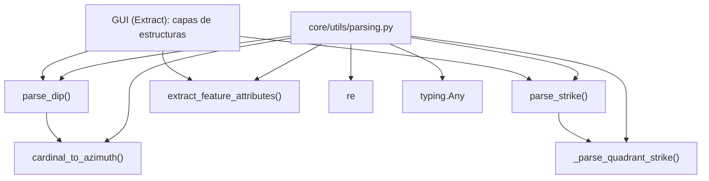

---
tags:
  - secinterp
  - code-walkthrough
  - core
  - utils
  - parsing
aliases:
  - parsing.py
  - parse_strike
  - parse_dip
  - cardinal_to_azimuth
  - extract_feature_attributes
cssclass: secinterp-note
---

# `core/utils/parsing.py`

> [!abstract] Resumen en una línea
> Convierte entradas estructurales crudas (strike/dip en formatos variados, acimuts cardinales y atributos de features QGIS) a primitivos Python limpios, tolerantes a ruido, listos para el Compute puro del core.

**Ruta**: `core/utils/parsing.py` (222 líneas)
**Clase/Función principal**: `parse_strike`, `parse_dip`, `cardinal_to_azimuth`, `extract_feature_attributes`
**Capa**: Core · Utilities (QGIS-agnóstico)
**Tags**: #secinterp #core #utils #parsing

---

## 🎯 ¿Por qué existe este archivo?

Los datos de estructuras geológicas llegan en formatos humanos heterogéneos: números,
cadenas con símbolos de grados, notación de cuadrante (`N 30 E`), combinaciones
`strike/dip`, y atributos QGIS con `QVariant`. El core necesita acimuts (0-360) y
primitivos, no cadenas sucias.

| Problema | Solución |
|----------|----------|
| Strike en notación de cuadrante (`N 30 E`, `S 45 W`) | `_parse_quadrant_strike` + `parse_strike` → azimut 0-360 |
| Dip con dirección (`45 NE`) y símbolos de grados ruidosos | `parse_dip` → `(dip_angle, dip_direction_azimuth)` |
| Dirección cardinal como texto (`NE`, `SW`) | `cardinal_to_azimuth` → grados |
| `QVariant`/`NULL` de QGIS rompen el threading en QGIS 4/Qt6 | `extract_feature_attributes` → dict de primitivos Python |

> [!important] Nota arquitectónica — QGIS-agnóstico con duck typing
> Ninguna función importa `qgis.*`. `extract_feature_attributes` recibe `feature: Any` y
> usa **duck typing** (`hasattr(feature, "fields")`), de modo que el core no acopla el
> tipo `QgsFeature`. Es el puente de "sanitización" entre la fase Extract (GUI) y Compute (core).

---

## 🧬 Diagrama de relaciones



> [!tip] Cómo leer
> `parse_strike` reutiliza el helper privado `_parse_quadrant_strike`; `parse_dip`
> reutiliza `cardinal_to_azimuth`. La GUI (fase Extract) es el único consumidor: entrega
> datos limpios al Compute.

---

## 📦 Imports — lectura arquitectónica

```python
# core/utils/parsing.py
from __future__ import annotations

import re
from typing import Any
```

| # | Observación |
|---|-------------|
| ① | `re` (regex) es la herramienta central: parsing tolerante a ruido y prefijos. |
| ② | `typing.Any` aparece en `parse_strike`, `parse_dip` y `extract_feature_attributes`: acepta cualquier entrada cruda. |
| ③ | **Cero imports de QGIS** ⇒ el módulo es testeable sin instalación de QGIS. |
| ④ | No importa DTOs del dominio: devuelve primitivos (`float`, `tuple`, `dict`), no entidades. |

---

## 🏗️ Inventario de estructura

**Funciones públicas (4):**

- `parse_strike(value: Any) -> float | None`
- `parse_dip(value: Any) -> tuple[float | None, float | None]`
- `cardinal_to_azimuth(text: str) -> float | None`
- `extract_feature_attributes(feature: Any) -> dict[str, Any]`

**Funciones privadas (1):**

- `_parse_quadrant_strike(part: str) -> float | None`

**Sin clases ni estado global:** módulo de funciones puras.

---

## 📁 Archivos del paquete

`parsing.py` vive en `core/utils/`:

| Archivo | Líneas | Rol |
|---|--:|---|
| [[parsing]] | 222 | Parsing de strike/dip, acimut cardinal y atributos |
| [[io]] | 101 | Escritura de vectores |
| [[metadata_reader]] | 129 | Lectura de `metadata.txt` |
| [[rendering]] | 129 | Bounds, transformada de coordenadas, intervalos |
| [[safe_loader]] | 79 | Importación y carga perezosa segura |
| [[drillhole]] | 298 | Trayectoria y proyección de sondajes |

> [!note] `parsing.py` es el más rico en regex del paquete
> Ver [[core_utils]] para el resto de utilidades puras.

---

## 📖 Recorrido método por método

### `_parse_quadrant_strike`

```python
def _parse_quadrant_strike(part: str) -> float | None:
    match = re.search(r"([NS])\s*(\d+\.?\d*)\s*([EW])", part)
    if not match:
        return None

    d1, ang, d2 = match.groups()
    ang = float(ang)
    strike = 0.0
    if d1 == "N" and d2 == "E":
        strike = ang
    elif d1 == "N" and d2 == "W":
        strike = 360 - ang
    elif d1 == "S" and d2 == "E":
        strike = 180 - ang
    elif d1 == "S" and d2 == "W":
        strike = 180 + ang

    return strike % 360
```

Convierte notación de cuadrante a azimut. El regex `([NS])\s*(\d+\.?\d*)\s*([EW])`
tolera espacios y usa `re.search` (permite prefijos como `"Strike: "`). La tabla de
conversión es la regla geológica estándar del rumbo en cuadrantes.

### `parse_strike`

```python
def parse_strike(value: Any) -> float | None:
    if value is None:
        return None

    try:
        return float(value) % 360
    except (ValueError, TypeError):
        pass

    text = (
        str(value)
        .replace("°", "").replace("º", "").replace("ø", "").replace("O", "")
        .strip().upper()
    )

    parts = re.split(r"[,/\\;|]", text)
    parts = [p.strip() for p in parts if p.strip()]

    for part in parts:
        strike = _parse_quadrant_strike(part)
        if strike is not None:
            return strike

    if re.search(r"(?:DIP|BUZA|PEND)", text):
        return None

    numeric_match = re.search(r"(\d+\.?\d*)", text)
    if numeric_match:
        if re.search(r"\d+\.?\d*\s+[NSEW]{1,2}(?!\w)", text):
            pass
        else:
            try:
                return float(numeric_match.group(1)) % 360
            except (ValueError, TypeError):
                pass

    return None
```

Estrategia en cascada: **numérico directo** → **cuadrante** → **extracción numérica
con guardas**. Las guardas evitan confundir un dip con dirección (`45 SE`) con un
strike. La etiqueta `DIP`/`BUZA`/`PEND` (inglés/español) aborta el parsing de strike.

### `parse_dip`

```python
def parse_dip(value: Any) -> tuple[float | None, float | None]:
    if value is None:
        return None, None

    text = (
        str(value)
        .replace("°", "").replace("º", "").replace("ø", "").replace("O", "")
        .strip().upper()
    )

    numeric_only = re.match(r"^(\d+\.?\d*)$", text)
    if numeric_only:
        return float(text), None

    parts = re.split(r"[,/\\;|]", text)
    parts = [p.strip() for p in parts if p.strip()]

    for part in parts:
        if re.search(r"[NS]\s*\d+\.?\d*\s*[EW]", part):
            continue

        match = re.search(r"(\d+\.?\d*)\s*([NSEW]{1,2})", part)
        if match:
            dip, cardinal = match.groups()
            dip_val = float(dip)
            dip_dir = cardinal_to_azimuth(cardinal)
            if dip_dir is not None:
                return dip_val, dip_dir

    if not re.search(r"[NS]\s*\d+\.?\d*", text):
        numeric_match = re.search(r"(\d+\.?\d*)", text)
        if numeric_match:
            try:
                return float(numeric_match.group(1)), None
            except (ValueError, TypeError):
                pass

    return None, None
```

Devuelve una **tupla** `(dip_angle, dip_direction_azimuth)`. Distingue numérico puro
(`45` → `(45.0, None)`) de dirección (`45 NE` → `(45.0, 45.0)`). Descarta notación de
cuadrante para no confundir strike con dip.

### `cardinal_to_azimuth`

```python
def cardinal_to_azimuth(text: str) -> float | None:
    table = {
        "N": 0, "NE": 45, "E": 90, "SE": 135,
        "S": 180, "SW": 225, "W": 270, "NW": 315,
    }
    return table.get(text)
```

Traducción directa de los 8 rumbos cardinales a grados. `dict.get` devuelve `None`
para entradas inválidas (sin excepción).

### `extract_feature_attributes`

```python
def extract_feature_attributes(feature: Any) -> dict[str, Any]:
    if not feature or not hasattr(feature, "fields"):
        return {}

    names = feature.fields().names()
    raw_values = feature.attributes()
    sanitized = {}

    for name, val in zip(names, raw_values, strict=False):
        if val is None or str(val) == "NULL":
            sanitized[name] = None
        elif isinstance(val, int | float | str | bool):
            sanitized[name] = val
        else:
            sanitized[name] = str(val)

    return sanitized
```

Extrae los atributos de un feature (duck-typed) a un dict de **primitivos Python**.
Convierte `QVariant`/`NULL` a `None`, deja pasar primitivos, y convierte el resto
(fechas, etc.) a `str`. El `strict=False` evita fallos si nombres y valores difieren
en longitud.

> [!important] Motivación: thread-safety en QGIS 4 / Qt6
> Los `QVariant` de QGIS no son seguros para usar en hilos de fondo. Sanitizar a
> primitivos aquí permite que el core procese en `QgsTask` sin arrastrar objetos Qt.

---

## 🔄 Flujo de datos

| Fase | Entrada | Transformación | Salida |
|------|---------|----------------|--------|
| Strike numérico | `45` / `"45"` | `float(...) % 360` | `45.0` |
| Strike cuadrante | `"N 30 E"` | regex + tabla cuadrante | `30.0` |
| Strike combinado | `"N30E, 45"` | split delimitadores + cascade | azimut o `None` |
| Dip numérico | `"45"` | `re.match` exacto | `(45.0, None)` |
| Dip con dirección | `"45 NE"` | regex + `cardinal_to_azimuth` | `(45.0, 45.0)` |
| Atributos feature | `QgsFeature` | sanitización `QVariant`→primitivo | `dict[str, Any]` |

---

## 🏛️ Patrones de diseño presentes

| Patrón | Dónde | Propósito |
|--------|-------|-----------|
| **Pipeline / cascade de parsing** | `parse_strike`, `parse_dip` | Probar estrategias en orden, retornar en el primer éxito |
| **Strategy table (dict)** | `cardinal_to_azimuth` | Mapear rumbos a grados sin `if/elif` |
| **Guard clause + early return** | `if value is None: return None` | Fallar suave ante entrada vacía |
| **Duck typing** | `extract_feature_attributes` | No acoplar el tipo `QgsFeature` |
| **Sanitizer / Adapter** | `extract_feature_attributes` | Normalizar `QVariant` a primitivos para el core |

---

## 🧾 Resumen de la API

| Símbolo | Firma / Hereda | Uso típico |
|---------|----------------|------------|
| `parse_strike` | `(value: Any) -> float \| None` | Azimut 0-360 desde formato variado |
| `parse_dip` | `(value: Any) -> tuple[float \| None, float \| None]` | Ángulo + azimut de dirección |
| `cardinal_to_azimuth` | `(text: str) -> float \| None` | `"NE"` → `45.0` |
| `extract_feature_attributes` | `(feature: Any) -> dict[str, Any]` | Atributos de feature → primitivos |

---

## 🛡️ Manejo de errores

Este módulo **no lanza excepciones** al usuario: es un parser *tolerante* que devuelve
`None` (o tuplas con `None`) ante cualquier entrada inválida.

| Entrada | `parse_strike` | `parse_dip` | `cardinal_to_azimuth` |
|---------|:---:|:---:|:---:|
| `None` | `None` | `(None, None)` | `None` |
| `"abc"` (sin número) | `None` | `(None, None)` | `None` |
| `"XYZ"` (dirección inválida) | — | — | `None` |

> [!tip] `try/except (ValueError, TypeError)` interno
> Las conversiones `float(...)` están protegidas: si fallan, se pasa a la siguiente
> estrategia en vez de propagar. Es el contrato de "nunca crashear por datos sucios".

> [!warning] `None` es ambiguo
> `parse_strike` devuelve `None` tanto para "sin strike" como para "no parseable". El
> llamador no puede distinguir ambos casos sin contexto adicional.

---

## 🧪 Tests asociados

La cobertura vive en tres archivos (Mock-first, sin QGIS):

- `tests/core/test_utils.py` — `test_parse_strike_*` (numérico, string, cuadrantes NE/NW/SE/SW, inválido), `test_parse_dip_*` (numérico, con dirección, cardinales, inválido), `test_cardinal_to_azimuth_*`.
- `tests/core/test_utils_standalone.py` — variantes adicionales: `test_parse_strike_combined_notation`, `test_parse_dip_combined_notation`, `test_parse_dip_alternative_symbols`.
- `tests/core/test_structural_parsing_advanced.py` — `test_partial_data_dip_only`, `test_partial_data_strike_only` (datos parciales).

---

## 👀 Observaciones y notas

> [!success] Fortalezas
> - Parser defensivo y tolerante a ruido humano (grados, prefijos, combinaciones).
> - QGIS-agnóstico: duck typing en `extract_feature_attributes` respeta la frontera del core.
> - Sanitización a primitivos resuelve la thread-safety con `QVariant` en QGIS 4.

> [!warning] Puntos de atención
> - `None` sobrecargado: "ausente" y "no parseable" son indistinguibles.
> - `extract_feature_attributes` depende de métodos no documentados como contrato (`fields()`, `attributes()`).
> - La lógica de regex es densa y con `pass` en una rama (código muerto aparente en `parse_strike`).

> [!question] Preguntas abiertas
> - ¿Devolver un tipo `Result[T]` para distinguir "ausente" de "error de parsing"?
> - ¿Extraer la tabla de rumbos de `cardinal_to_azimuth` a una constante compartida con otros módulos?
> - ¿Limpiar la rama `pass` de `parse_strike` (línea con comentario pero sin acción)?

---

## 🔗 Notas relacionadas

- [[Index]] — índice de la bóveda
- [[core_utils]] — paquete `core/utils/` y sus utilidades puras
- [[geology]] — `calculate_apparent_dip` usa los azimuts parseados aquí
- [[rendering]] — bounds y transformada de los datos ya parseados
- [[drillhole]] — proyección de sondajes (datos numéricos puros)
- [[entities]] / [[dtos]] — DTOs del dominio que reciben estos primitivos
- [[controller]] — consume el parsing en la fase Extract

---

*Nota de la bóveda SecInterp Code Walkthrough v2 — v3.9.0*
