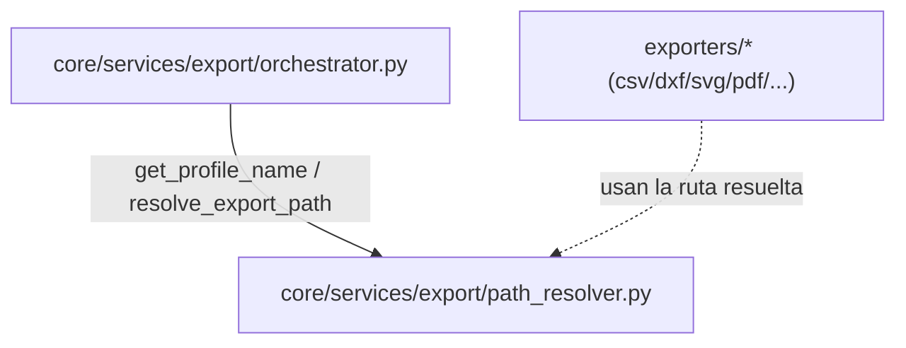

---
tags:
  - secinterp
  - code-walkthrough
  - core
  - services
  - export
aliases:
  - path_resolver.py
  - resolve_export_path
  - get_profile_name
cssclass: secinterp-note
---

# `core/services/export/path_resolver.py`

> [!abstract] Resumen en una línea
> Resuelve **dónde** y **con qué nombre** se escribe cada archivo de exportación: deriva el nombre del perfil y compone la ruta de salida (y el nombre lógico de capa) de forma uniforme para todos los exporters.

**Ruta**: `core/services/export/path_resolver.py` (60 líneas)
**Función principal**: `resolve_export_path`
**Capa**: Core (QGIS-agnóstico)
**Tags**: #secinterp #core #services #export

---

## 🎯 ¿Por qué existe este archivo?

Cada exporter (SHP, GPKG, CSV, DXF, PDF, SVG, imagen) debe decidir **dos cosas**:
el archivo físico y el nombre lógico de capa. Si esa lógica vive repetida en cada
exporter, cualquier cambio se propaga a 12 sitios.

| Problema | Solución |
|----------|----------|
| Nomenclatura de salida duplicada en todos los exporters | Centralizarla en `resolve_export_path` |
| Derivar un nombre de archivo seguro desde la capa de sección | `get_profile_name` + sanitización de `/` y `\` |
| Tratar el caso especial de GeoPackage (un solo contenedor) | Rama `ext == ".gpkg"` dentro de `resolve_export_path` |

> [!important] QGIS-agnóstico verificado
> Solo importa `pathlib.Path` y `typing.Any`. El `controller` se accede por
> **introspección defensiva** (`hasattr` encadenado), nunca por una importación QGIS.

---

## 🧬 Diagrama de relaciones



> [!tip] Cómo leer
> Sólida = importa; punteada = consume el resultado. `path_resolver` es una **hoja**
> utilitaria: no importa nada interno, solo lo usan el orquestador y los exporters.

---

## 📦 Imports — lectura arquitectónica

```python
# core/services/export/path_resolver.py
from __future__ import annotations

from pathlib import Path
from typing import Any
```

| # | Observación |
|---|-------------|
| ① | `pathlib.Path` (no `os.path`) — estilo idiomático y portable del proyecto. |
| ② | `Any` en `controller` y `naming_pattern`: la firma tolera `None` y tipos externos. |
| ③ | Sin dependencias internas: módulo totalmente aislado y testeable. |

---

## 🏗️ Inventario de estructura

**Funciones/Métodos:**
- `get_profile_name(controller)`
- `resolve_export_path(folder, base_name, profile_name, naming_pattern, ext)`

Dos funciones puras. Ninguna clase, ninguna constante.

---

## 📖 Recorrido método por método

### `get_profile_name`

```python
def get_profile_name(controller: Any | None) -> str:
    profile_name = "profile"
    has_sect = (
        controller and hasattr(controller, "settings") and hasattr(controller.settings, "section")
    )
    if has_sect:
        sect = controller.settings.section
        if hasattr(sect, "layer_name") and sect.layer_name:
            profile_name = sect.layer_name
    return profile_name.replace("/", "_").replace("\\", "_")
```

**Comportamiento:**

1. Arranca con el fallback `"profile"`.
2. Intenta leer `controller.settings.section.layer_name` con **`hasattr` encadenado**.
3. Sanitiza reemplazando `/` y `\` por `_` (evita que un nombre con barras se
   interprete como subdirectorio).

> [!tip] Cadena de `hasattr` como cortocircuito
> `controller and hasattr(...) and hasattr(...)` evalúa de izquierda a derecha y se
> detiene en el primer `None`/`False`. Evita el `AttributeError` sin `try/except`.

### `resolve_export_path`

```python
def resolve_export_path(
    folder: Path,
    base_name: str,
    profile_name: str,
    naming_pattern: str | None,
    ext: str,
) -> tuple[Path, str]:
```

Devuelve la tupla `(Path del archivo, nombre lógico de capa)`. El nombre lógico se
desacopla del nombre de archivo porque, en un GeoPackage, una capa puede llamarse
distinto del archivo contenedor.

```python
new_name = base_name
if naming_pattern:
    new_name = naming_pattern.format(filename=base_name, profile=profile_name)
    new_name = new_name.replace("/", "_").replace("\\", "_")

if ext == ".gpkg":
    return folder / f"{profile_name}{ext}", new_name

container_folder = folder / profile_name
container_folder.mkdir(parents=True, exist_ok=True)
return container_folder / f"{new_name}{ext}", new_name
```

| Rama | Resultado |
|------|-----------|
| **`.gpkg`** | Archivo único `folder/<profile>.gpkg`; nombre lógico `new_name` (capa interna) |
| **Otros (`.shp`, `.csv`, `.dxf`, …)** | Subcarpeta `folder/<profile>/<new_name><ext>` por perfil |

> [!important] Por qué `.gpkg` es especial
> Un GeoPackage es un **contenedor** multi-capa: no necesita una carpeta por perfil. El
> resto son un archivo por capa, por lo que se agrupan en una subcarpeta por perfil.

> [!note] `naming_pattern` con placeholders
> El patrón usa `str.format(filename=..., profile=...)`. Tras aplicar el patrón se
> **re-sanitiza** por si introduce `/` o `\`.

---

## 🔄 Flujo de datos

| Fase | Entrada | Transformación | Salida |
|------|---------|----------------|--------|
| Nombre de perfil | `controller` (o `None`) | `hasattr` encadenado + sanitización | `profile_name: str` |
| Ruta de salida | `folder`, `base_name`, `profile_name`, `pattern`, `ext` | `format()` + rama `.gpkg` / subcarpeta | `(Path, nombre_lógico)` |

---

## 📂 Ejemplos de rutas resueltas

Supongamos `folder = /tmp/out`, `profile_name = "secc1"`, `base_name = "topo_profile"`:

| `ext` | `naming_pattern` | Path resultante | Nombre lógico |
|-------|------------------|-----------------|---------------|
| `.gpkg` | — | `/tmp/out/secc1.gpkg` | `topo_profile` |
| `.gpkg` | `"{profile}_{filename}"` | `/tmp/out/secc1.gpkg` | `secc1_topo_profile` |
| `.csv` | — | `/tmp/out/secc1/topo_profile.csv` | `topo_profile` |
| `.dxf` | `"{filename}"` | `/tmp/out/secc1/topo_profile.dxf` | `topo_profile` |

> [!tip] Observa la asimetría
> En `.gpkg` el nombre lógico **no** aparece en el path (es el nombre de la capa
> interna); en los demás, el nombre lógico coincide con el archivo (sin extensión).

---

## 🔬 Matriz `ext` → comportamiento

| Formato | Contenedor | Carpeta por perfil | Comentario |
|---------|-----------|:---:|------------|
| `.gpkg` | multi-capa | ❌ | Un solo archivo agrupa capas |
| `.shp` / `.csv` / `.dxf` / `.pdf` / `.svg` / imagen | un archivo por capa | ✅ | Se agrupan bajo `folder/<profile>/` |

---

## 🏛️ Patrones de diseño presentes

| Patrón | Dónde | Propósito |
|--------|-------|-----------|
| **Pure function** | ambas funciones | Determinismo y testeo trivial (sin estado) |
| **Null object / default** | `get_profile_name` → `"profile"` | Fallback seguro sin excepción |
| **Template (naming pattern)** | `naming_pattern.format(...)` | Nomenclatura personalizable por el usuario |
| **Special case** | rama `ext == ".gpkg"` | Tratar el contenedor de forma diferenciada |

---

## 🧾 Resumen de la API

| Símbolo | Firma / Hereda | Uso típico |
|---------|----------------|------------|
| `get_profile_name` | `(controller: Any \| None) -> str` | Nombre sanitizado del perfil |
| `resolve_export_path` | `(folder, base_name, profile_name, naming_pattern, ext) -> (Path, str)` | Ruta física + nombre lógico de capa |

---

## 🛡️ Manejo de errores

No lanza excepciones; degrada con valores por defecto:

| Caso | Comportamiento |
|------|----------------|
| `controller` es `None` o sin `settings` | `get_profile_name` → `"profile"` |
| `naming_pattern` es `None` | se usa `base_name` sin formato |
| La subcarpeta no existe | `mkdir(parents=True, exist_ok=True)` la crea (idempotente) |

> [!warning] `str.format` puede lanzar `KeyError`
> Si `naming_pattern` contiene un placeholder desconocido (p. ej. `{foo}`),
> `format(...)` lanza `KeyError`. Hoy no se protege; es el único punto frágil.

---

## 🧪 Tests asociados

Casos directos a cubrir (tests puros, sin QGIS):

- `test_get_profile_name_default` — `None` → `"profile"`.
- `test_get_profile_name_sanitizes_slashes` — `"a/b\\c"` → `"a_b_c"`.
- `test_resolve_gpkg_single_container` — `ext=".gpkg"` devuelve `folder/<profile>.gpkg`.
- `test_resolve_creates_profile_folder` — la subcarpeta se crea al exportar no-GPKG.
- `test_resolve_naming_pattern` — `"{profile}_{filename}"` se expande correctamente.

---

## 🔁 Flujo de llamada dentro del orquestador

El orquestador de exportación lo usa en **dos pasos**:

```python
# 1. Nombre del perfil (una vez por exportación)
profile_name = get_profile_name(controller)

# 2. Ruta + nombre lógico (una vez por exporter)
path, layer_name = resolve_export_path(folder, "topo_profile", profile_name, pattern, ".shp")
```

| Paso | Función | Frecuencia |
|------|---------|------------|
| Derivar perfil | `get_profile_name` | 1 por exportación |
| Resolver salida | `resolve_export_path` | 1 por formato/exporter |

> [!note] `base_name` es un **nombre lógico estable**
> No es el nombre de archivo final: es el identificador del dataset (p. ej.
> `"topo_profile"`, `"geol_profile"`). El patrón y la extensión lo moldean después.

---

## 🌐 Notas de uso y migración

- **Sin cadenas de usuario**: módulo puro sin i18n; los mensajes los añade el exporter.
- **`pathlib` end-to-end**: todas las rutas se construyen con `Path`, nunca `os.path`.
- **Idempotente**: `mkdir(parents=True, exist_ok=True)` hace segura la re-ejecución.
- **Extensible**: añadir un formato nuevo solo requiere decidir su `ext` en la matriz.

---

## 👀 Observaciones y notas

> [!success] Fortalezas
> - Módulo mínimo y puro; una sola responsabilidad (nomenclatura de salida).
> - `pathlib` idiomático y consistente con el estándar del proyecto.
> - Defensa ante `None` sin bloques `try/except` ruidosos.

> [!warning] Puntos de atención
> - `naming_pattern.format(...)` sin `try/except` puede reventar con `KeyError`.
> - `hasattr` encadenado duplica la estructura de `settings` en el código.

> [!question] Preguntas abiertas
> - ¿Validar `naming_pattern` en origen (configuración) en vez de aquí?
> - ¿Devolver un dataclass `ResolvedPath` en lugar de una tupla `(Path, str)`?

---

## 🔗 Notas relacionadas

- [[Index]] — índice de la bóveda
- [[layer_core_services_export]] — paquete `export/` al que pertenece
- [[orchestrator]] — consumidor principal de `resolve_export_path`
- [[core_services_export]] — hermano en el paquete `export/`
- [[core_services]] — shim que re-exporta la API pública

---

*Nota de la bóveda SecInterp Code Walkthrough v2 — v3.8.0*
