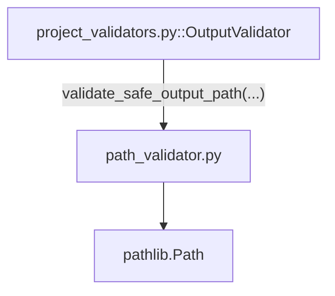

---
tags:
  - secinterp
  - code-walkthrough
  - core
  - validation
aliases:
  - path_validator.py
  - validate_safe_output_path
  - validate_output_path
  - _check_path_security
  - _check_base_restriction
cssclass: secinterp-note
---

# `core/validation/path_validator.py`

> [!abstract] Resumen en una línea
> Validación **segura** de rutas de salida en el core: comprueba null bytes, traversal de directorios, confinamiento a un directorio base, existencia/creación y escritura real del sistema de archivos, todo con `pathlib.Path`.

**Ruta**: `core/validation/path_validator.py` (111 líneas)
**Funciones principales**: `validate_safe_output_path`, `validate_output_path`
**Capa**: Core (QGIS-agnóstico)
**Tags**: #secinterp #core #validation

---

## 🎯 ¿Por qué existe este archivo?

Exportar un perfil a una ruta elegida por el usuario es una operación con riesgo de
seguridad (path traversal, escritura en ubicaciones arbitrarias). Este módulo aplica
una **política de validación en 3 pasos** antes de permitir escribir:

| Problema | Solución |
|----------|----------|
| Un `..` en la ruta puede escapar del directorio esperado | `_check_path_security` detecta traversal |
| Null bytes pueden engañar a APIs C/OS | `_check_path_security` los rechaza |
| La ruta debe quedar dentro de un directorio base (sandbox) | `_check_base_restriction` con `Path.relative_to` |
| El directorio debe existir, crearse o ser escribible | `_validate_path_state` (test real de escritura) |

> [!important] Nota arquitectónica
> **QGIS-agnóstico y solo stdlib** (`pathlib`). No importa QGIS ni PyQt; la validación
> de rutas es un problema de sistema de archivos puro. La GUI pasa la ruta como `str` y
> recibe un `Path` resuelto.

---

## 🧬 Diagrama de relaciones



> [!tip] Cómo leer
> Sólida = importa/delega. `OutputValidator` (en `project_validators.py`) es el único
> consumidor del paquete; el resto de usos son vía `validate_output_path` re-exportada
> en `core/validation/__init__.py`.

---

## 📦 Imports — lectura arquitectónica

```python
# core/validation/path_validator.py
from __future__ import annotations

from pathlib import Path
```

| # | Observación |
|---|-------------|
| ① | `from __future__ import annotations` — anotaciones diferidas. |
| ② | Solo `pathlib.Path` — sin `os`, sin `shutil`, sin QGIS. `Path` centraliza toda la I/O. |
| ③ | Cero dependencias del dominio: es un módulo de utilidad pura. |

---

## 🏗️ Inventario de estructura

**Funciones públicas (2):**

- `validate_safe_output_path(path, base_dir=None, must_exist=False, create_if_missing=False) -> (bool, str, Path|None)`
- `validate_output_path(path) -> (bool, str, Path|None)` — wrapper de conveniencia.

**Funciones privadas (3):**

- `_check_path_security(path) -> (bool, str, Path|None)` — null bytes + traversal.
- `_check_base_restriction(path_obj, base_dir) -> (bool, str, Path|None)` — confinamiento a `base_dir`.
- `_validate_path_state(path, must_exist, create_if_missing) -> (bool, str)` — existencia/creación/escritura.

> [!note] Sin clases
> Módulo funcional puro. La estructura de 3 privados refleja los 3 pasos del pipeline:
> seguridad → confinamiento → estado del FS.

---

## 📁 Archivos del paquete

`path_validator.py` es la pieza de sistema de archivos del paquete `core/validation/`:

| Archivo | Rol |
|---------|-----|
| `path_validator.py` | Validación segura de rutas (este archivo) |
| `field_validator.py` | Validación atómica de campos |
| `layer_validator.py` | Validación espacial de capas |
| `validation_helpers.py` | `ValidationContext`, `DependencyRule` |
| `project_validator.py` | `ProjectValidator` + `ValidationParams` |
| `project_validators.py` | `OutputValidator` (consume este módulo) |
| `validators.py` | Fábricas para campos de dataclass |
| `layer_metadata.py` | `LayerMetadata` + constantes |
| `base_validator.py` | `IValidator` (ABC) |
| `pipeline.py` | `ValidationPipeline` |

---

## 📖 Recorrido método por método

### `validate_safe_output_path`

```python
def validate_safe_output_path(
    path: str,
    base_dir: Path | None = None,
    must_exist: bool = False,
    create_if_missing: bool = False,
) -> tuple[bool, str, Path | None]:
    if not path or path.strip() == "":
        return False, "Output path is required", None

    # 1. Security check
    is_safe, msg, path_obj = _check_path_security(path)
    if not is_safe or not path_obj:
        return False, msg, None

    # 2. Base directory restriction
    if base_dir:
        is_within, msg, resolved_path = _check_base_restriction(path_obj, base_dir)
        if not is_within or not resolved_path:
            return False, msg, None
    else:
        try:
            resolved_path = path_obj.resolve(strict=False)
        except (OSError, RuntimeError) as e:
            return False, f"Cannot resolve path: {e!s}", None

    # 3. Existence and Permissions
    is_valid, msg = _validate_path_state(resolved_path, must_exist, create_if_missing)
    if not is_valid:
        return False, msg, None

    return True, "", resolved_path
```

Es el punto de entrada. Orquesta los 3 pasos (seguridad, confinamiento, estado) y
devuelve la ruta **resuelta** (absoluta) en la tercera posición. Si `base_dir` está
ausente, solo hace `resolve(strict=False)` sin exigir que exista.

| Parámetro | Rol |
|-----------|-----|
| `base_dir` | Si se da, la ruta debe quedar **dentro** de este directorio (sandbox) |
| `must_exist` | Si `True`, la ruta debe existir ya |
| `create_if_missing` | Si `True`, crea el directorio si no existe |

### `_check_path_security`

```python
def _check_path_security(path: str) -> tuple[bool, str, Path | None]:
    if "\0" in path:
        return False, "Path contains invalid null bytes", None
    try:
        path_obj = Path(path)
        if ".." in path_obj.parts:
            return False, "Path contains directory traversal sequences (..)", None
        return True, "", path_obj
    except (TypeError, ValueError) as e:
        return False, f"Invalid path: {e!s}", None
```

Paso 1 de seguridad. Rechaza null bytes (`\0`) y secuencias `..` en cualquier segmento
(`Path.parts` descompone la ruta en componentes, así `"a/../b"` se detecta). Captura
`TypeError`/`ValueError` del constructor de `Path`.

### `_check_base_restriction`

```python
def _check_base_restriction(path_obj: Path, base_dir: Path) -> tuple[bool, str, Path | None]:
    try:
        resolved_path = path_obj.resolve(strict=False)
        base_resolved = base_dir.resolve(strict=False)
        resolved_path.relative_to(base_resolved)
        return True, "", resolved_path
    except ValueError:
        return False, f"Path escapes base directory: {base_dir}", None
    except (OSError, RuntimeError) as e:
        return False, f"Cannot validate base directory: {e!s}", None
```

Paso 2: confinamiento. `relative_to()` lanza `ValueError` si la ruta no está bajo
`base_dir`, lo que se traduce en `"Path escapes base directory"`. Es el mecanismo de
**sandbox** que impide escribir fuera del directorio de trabajo.

### `_validate_path_state`

```python
def _validate_path_state(path: Path, must_exist: bool, create_if_missing: bool) -> tuple[bool, str]:
    if not path.exists():
        if must_exist:
            return False, f"Path does not exist: {path}"
        if create_if_missing:
            try:
                path.mkdir(parents=True, exist_ok=True)
            except OSError as e:
                return False, f"Cannot create directory: {e!s}"
        else:
            return True, ""

    if not path.is_dir():
        return False, f"Path is not a directory: {path}"

    # Check if writable
    try:
        test_file = path / ".write_test"
        test_file.touch()
        test_file.unlink()
        return True, ""
    except OSError:
        return False, f"Directory is not writable: {path}"
```

Paso 3: estado del FS. Maneja existencia, creación (`mkdir(parents=True, exist_ok=True)`)
y verifica que es un **directorio**. La comprobación de escritura es **empírica**:
crea un archivo `.write_test`, lo toca y lo elimina. Si cualquier `OSError` ocurre,
declara el directorio no escribible.

### `validate_output_path`

```python
def validate_output_path(path: str) -> tuple[bool, str, Path | None]:
    return validate_safe_output_path(path, must_exist=True)
```

Wrapper de conveniencia que valida que una ruta es un **directorio existente y
escribible**. Es la función re-exportada en `core/validation/__init__.py` y la que
usan la mayoría de consumidores y tests.

---

## 🔄 Flujo de datos

| Fase | Entrada | Transformación | Salida |
|------|---------|----------------|--------|
| Seguridad | `str` cruda | detecta `\0` y `..` | `Path` o `(False, msg)` |
| Confinamiento | `Path` + `base_dir` | `resolve` + `relative_to` | `Path` resuelto o error |
| Estado | `Path` resuelto | existe/crea/escribe | `(bool, str)` |
| Conveniencia | `str` | delega con `must_exist=True` | `(bool, str, Path\|None)` |

> [!tip] La ruta final ya está resuelta
> El retorno `resolved_path` es **absoluto y normalizado**, listo para usar en la fase
> de exportación sin resolver de nuevo.

---

## 🔒 Análisis de seguridad

| Amenaza | Defensa |
|---------|---------|
| Path traversal (`../../etc/passwd`) | `".." in Path.parts` → rechazo |
| Null byte injection (`\0`) | `"\0" in path` → rechazo |
| Escritura fuera del workspace | `relative_to(base_dir)` → `ValueError` |
| Directorio no escribible | test `.write_test` touch/unlink |
| Ruta que no es directorio | `path.is_dir()` → rechazo |

> [!important] TOCTOU residual
> El test de escritura (touch/unlink) es una comprobación *best-effort*: entre validar
> y escribir real (fase de export) puede haber una condición de carrera (TOCTOU). Para
> este plugin (export local, un solo usuario) es aceptable, pero conviene saberlo.

---

## 🔀 Matriz de combinaciones de parámetros

`validate_safe_output_path` tiene 3 flags booleanos que combinan de formas distintas.
Esta tabla documenta el comportamiento resultante para una ruta **no existente**:

| `base_dir` | `must_exist` | `create_if_missing` | Resultado |
|:--:|:--:|:--:|-----------|
| no | `False` | `False` | `(True, "", resolved)` — no exige existencia |
| no | `True` | `False` | `(False, "Path does not exist")` |
| no | `False` | `True` | crea directorio; si falla → `(False, ...)` |
| sí | `False` | `False` | exige quedar dentro de `base_dir` |
| sí | `True` | `False` | dentro de `base_dir` y existente |
| sí | `False` | `True` | dentro de `base_dir`, creado si falta |

> [!note] `create_if_missing` solo aplica a rutas inexistentes
> Si la ruta ya existe, el flag `create_if_missing` es ignorado (se pasa a verificar
> que es directorio y que es escribible).

## 🔢 Ejemplo de flujo completo

Dado `base_dir = Path("/home/user/secinterp/exports")` y la petición de validar la ruta
`"exports/perfil_2026"`:

```python
is_valid, msg, resolved = validate_safe_output_path(
    "exports/perfil_2026",
    base_dir=Path("/home/user/secinterp/exports"),
    create_if_missing=True,
)
# is_valid  -> True
# resolved  -> Path("/home/user/secinterp/exports/perfil_2026")
```

1. `_check_path_security` — no hay `\0` ni `..` → `Path("exports/perfil_2026")`.
2. `_check_base_restriction` — `resolve()` → `/home/user/secinterp/exports/perfil_2026`,
   que es relativo a `/home/user/secinterp/exports` → dentro del sandbox.
3. `_validate_path_state` — no existe, `create_if_missing=True` → `mkdir(parents=True)`.
4. Retorna `(True, "", <Path resuelto>)`.

Si el usuario hubiera tecleado `"../otro/proyecto"`, el paso 1 lo habría rechazado por
traversal; si `"/tmp/fuera"`, el paso 2 por escapar del directorio base.

## 🧮 Validación de entrada vs validación de salida

`path_validator` cubre la **salida** (dónde escribir). La **entrada** de rutas/capas la
resuelven otros componentes del proyecto:

| Aspecto | `path_validator.py` | `path_resolver` / GUI |
|---------|---------------------|------------------------|
| Propósito | Validar ruta de salida | Resolver rutas de entrada |
| Preocupación | Seguridad + escritura | Localización de recursos |
| Retorno | `(bool, str, Path)` | ruta resuelta / objeto de capa |
| Falla si | traversal, no-escribible… | recurso no encontrado |

> [!tip] Frontera limpia
> El core nunca toca el sistema de archivos más allá de lo necesario para validar
> **salida**. La lectura de capas/recursos de entrada es responsabilidad de la GUI.

---

## 🏛️ Patrones de diseño presentes

| Patrón | Dónde | Propósito |
|--------|-------|-----------|
| **Pipeline de 3 pasos** | `validate_safe_output_path` | Separar seguridad / confinamiento / estado |
| **Sandbox** | `_check_base_restriction` | Confinar escritura a `base_dir` |
| **Result tuple** | todos | `(bool, str, Path|None)` sin excepciones |
| **Wrapper de conveniencia** | `validate_output_path` | API simple para el caso común |
| **Prueba empírica** | `.write_test` | Verificar escritura real, no suponerla |

---

## 🧾 Resumen de la API

| Símbolo | Firma / Hereda | Uso típico |
|---------|----------------|------------|
| `validate_safe_output_path` | `(path, base_dir=None, must_exist=False, create_if_missing=False) -> (bool, str, Path\|None)` | Validación completa con sandbox |
| `validate_output_path` | `(path) -> (bool, str, Path\|None)` | Directorio existente y escribible |

---

## 🛡️ Manejo de errores

Sin excepciones al consumidor; cada fallo se traduce a `(False, msg, None)`:

| Situación | Mensaje |
|-----------|---------|
| Ruta vacía | `"Output path is required"` |
| Null bytes | `"Path contains invalid null bytes"` |
| Traversal `..` | `"Path contains directory traversal sequences (..)"` |
| Fuera de `base_dir` | `"Path escapes base directory: {base_dir}"` |
| `must_exist` y no existe | `"Path does not exist: {path}"` |
| Fallo de creación | `"Cannot create directory: {e}"` |
| No es directorio | `"Path is not a directory: {path}"` |
| No escribible | `"Directory is not writable: {path}"` |

> [!note] Captura de `OSError`/`RuntimeError`
> Los bloques `except` capturan `OSError` (y a veces `RuntimeError`) del sistema de
> archivos, nunca excepciones del dominio. Este módulo no lanza `ValidationError`.

---

## 🧪 Tests asociados

Casos mapeados a `tests/core/test_path_validator.py` (más `test_validation.py` y
`test_validation_refactor.py`, que prueban `validate_output_path`):

- `test_validate_safe_output_path_basic` — ruta válida devuelve `Path`; vacía → `"required"`.
- `test_validate_safe_output_path_security` — null byte y `../../etc/passwd` rechazados.
- `test_validate_safe_output_path_sandbox` — dentro de `base_dir` ok; `/tmp/outside.txt` → `"escapes base directory"`.
- `test_validate_safe_output_path_creation` — `must_exist=True` falla; `create_if_missing=True` crea.
- `test_validate_safe_output_path_is_dir` — un archivo existente → `"not a directory"`.
- `test_validate_output_path_convenience` — dir existente ok; ausente falla.

---

## 👀 Observaciones y notas

> [!success] Fortalezas
> - Solo `pathlib`: portable y sin dependencias externas.
> - Defensa en profundidad (seguridad → confinamiento → estado) clara y separada.
> - Test de escritura empírico (touch/unlink) en vez de suposiciones.

> [!warning] Puntos de atención
> - Race TOCTOU entre la validación y la escritura real del export.
> - `validate_output_path` fuerza `must_exist=True`; no sirve para rutas a crear.
> - `_validate_path_state` exige que sea **directorio**; una ruta de archivo de salida individual debe tratarse aparte.

> [!question] Preguntas abiertas
> - ¿Mover la escritura real dentro de un try/except de export en vez de validar antes?
> - ¿Añadir soporte para validar rutas de **archivo** (no solo directorios)?

---

## 🔗 Notas relacionadas

- [[Index]] — índice de la bóveda
- [[core_validation]] — nota de paquete del directorio `validation/`
- [[project_validators]] — `OutputValidator` consume `validate_safe_output_path`
- [[project_validator]] — `ValidationParams.output_path` es el campo validado
- [[path_resolver]] — resolución de rutas (complementario, lado GUI/export)
- [[io]] — manejo de I/O y exportación de archivos

---

*Nota de la bóveda SecInterp Code Walkthrough v2 — v3.8.0*
