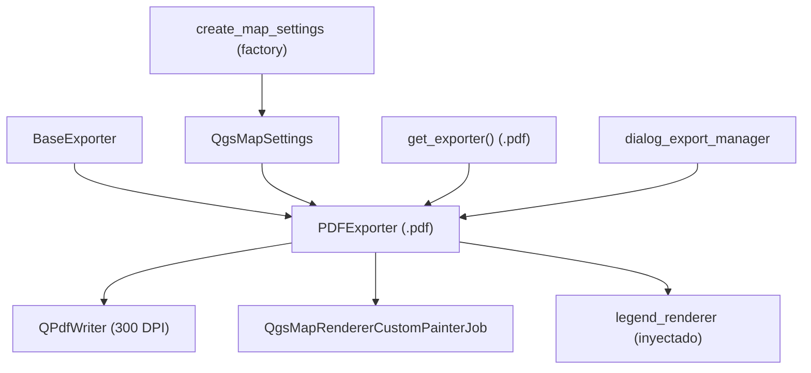

---
tags:
  - secinterp
  - code-walkthrough
  - exporters
  - print
aliases:
  - pdf_exporter.py
  - PDFExporter
cssclass: secinterp-note
---

# `exporters/pdf_exporter.py`

> [!abstract] Resumen en una línea
> Exporter de documento PDF: renderiza un `QgsMapSettings` con `QgsMapRendererCustomPainterJob` sobre `QPdfWriter` a 300 DPI con página a medida y márgenes cero, más leyenda opcional.

**Ruta**: `exporters/pdf_exporter.py` (79 líneas)
**Clase principal**: `PDFExporter(BaseExporter)`
**Capa**: Exporters (acoplado a `qgis.core` + `QtGui`: render imprimible)
**Tags**: #secinterp #exporters #print

---

## 🎯 ¿Por qué existe este archivo?

El informe geológico se entrega en PDF: un documento portable, imprimible y con
calidad de imprenta que el PNG no da (raster fijo) ni el SVG (no todos lo imprimen
igual):

| Problema | Solución |
|----------|----------|
| Informe imprimible con calidad fija | `QPdfWriter` a 300 DPI |
| Página del tamaño exacto del perfil | `QPageSize(QSizeF(width, height), Point)` a medida |
| Márgenes blancos que recortan el dibujo | `QMarginsF(0, 0, 0, 0)` explícitos |
| Render borroso al imprimir | `map_settings.setOutputDpi(writer.resolution())` con el DPI real |
| Leyenda fuera del documento | `legend_renderer.draw_legend()` sobre el mismo painter |

> [!important] Nota arquitectónica
> Segundo miembro del tríptico de render (`image`/`pdf`/`svg`): misma coreografía
> (settings → painter + job → leyenda → guardar), distinto dispositivo. Su `data` es
> un `QgsMapSettings` cocinado por `create_map_settings` (ver [[orchestrator]]).

---

## 🧬 Diagrama de relaciones



> [!tip] Cómo leer
> El writer define página y resolución; el `QgsMapSettings` se **recalibra** contra el
> dispositivo real (`setOutputSize`/`setOutputDpi`) antes del render. Sin esa
> recalibración, el PDF saldría con la escala del canvas en pantalla.

---

## 📦 Imports — lectura arquitectónica

```python
# exporters/pdf_exporter.py
from __future__ import annotations

from pathlib import Path

from qgis.core import QgsMapRendererCustomPainterJob, QgsMapSettings
from qgis.PyQt.QtCore import QMarginsF, QRectF, QSize, QSizeF
from qgis.PyQt.QtGui import QPageSize, QPainter, QPdfWriter

from sec_interp.logger_config import get_logger

from .base_exporter import BaseExporter
```

| # | Observación |
|---|-------------|
| ① | `QPdfWriter` + `QPageSize`: el dispositivo es un documento paginado, no un lienzo. |
| ② | `QMarginsF`/`QSizeF` en flotante: la página se define en **puntos** tipográficos, no en píxeles. |
| ③ | `QgsMapSettings` tipado en la firma: el llamador debe entregar la escena cocinada. |
| ④ | Sin `QImage` ni `QColor`: aquí no hay fondo que rellenar, la página manda. |
| ⑤ | `get_logger`: fallos de `painter.begin()` y excepciones quedan registrados. |

---

## 🏗️ Inventario de estructura

**Clases:** `class PDFExporter(BaseExporter)` — 1 clase, 2 métodos.

**Métodos:**

- `get_supported_extensions() -> list[str]` — `[".pdf"]`
- `export(output_path: Path, map_settings: QgsMapSettings) -> bool` — documento completo

**Settings consumidos:**

| Clave | Defecto | Rol |
|-------|---------|-----|
| `width` | `800` | Ancho de página en puntos |
| `height` | `600` | Alto de página en puntos |
| `show_legend` | `True` | Interruptor de leyenda |
| `legend_renderer` | `None` | Objeto con `draw_legend(painter, rect)` |

**Constantes fijas en código:** resolución `300` DPI, márgenes `0`.

---

## 📁 Archivos del paquete

| Archivo | Líneas | Rol |
|---|--:|---|
| `__init__.py` | 81 | `get_exporter()`: `.pdf` → `PDFExporter` |
| `base_exporter.py` | 137 | Contrato heredado (ver [[base_exporter]]) |
| `pdf_exporter.py` | 79 | `PDFExporter` (esta nota) |
| `image_exporter.py` | 72 | Gemelo raster: misma coreografía sobre `QImage` |
| `svg_exporter.py` | 85 | Gemelo vectorial: misma coreografía sobre `QSvgGenerator` |

---

## 📖 Recorrido método por método

### `get_supported_extensions`

```python
def get_supported_extensions(self) -> list[str]:
    """Get supported PDF extension."""
    return [".pdf"]
```

Una sola extensión: el PDF es a la vez documento e imagen vectorial, así que no hay
variantes (a diferencia del trío png/jpg/jpeg).

### `export` — documento completo

```python
def export(self, output_path: Path, map_settings: QgsMapSettings) -> bool:
    """Export map to PDF.

    Args:
        output_path: Output file path
        map_settings: QgsMapSettings instance configured for rendering

    Returns:
        True if export successful, False otherwise

    """
    try:
        width = self.get_setting("width", 800)
        height = self.get_setting("height", 600)

        # Setup PDF writer
        writer = QPdfWriter(str(output_path))
        writer.setResolution(300)  # Set DPI
        writer.setPageSize(QPageSize(QSizeF(width, height), QPageSize.Unit.Point))
        writer.setPageMargins(QMarginsF(0, 0, 0, 0))

        # Setup painter
        painter = QPainter()
        if not painter.begin(writer):
            logger.error(f"Failed to begin painting for PDF export to {output_path}")
            return False

        try:
            painter.setRenderHint(QPainter.RenderHint.Antialiasing)

            # Update map settings with actual writer device dimensions and DPI
            dev = painter.device()
            map_settings.setOutputSize(QSize(dev.width(), dev.height()))
            map_settings.setOutputDpi(writer.resolution())

            # Render map
            job = QgsMapRendererCustomPainterJob(map_settings, painter)
            job.start()
            job.waitForFinished()

            # Draw legend if available
            show_legend = self.get_setting("show_legend", True)
            legend_renderer = self.get_setting("legend_renderer")
            if legend_renderer and show_legend:
                legend_renderer.draw_legend(painter, QRectF(0, 0, dev.width(), dev.height()))

        finally:
            painter.end()
    except Exception:
        logger.exception(f"PDF export failed for {output_path}")
        return False
    else:
        return True
```

| Paso | Detalle |
|------|---------|
| Página | `QPdfWriter(str(path))` + 300 DPI + tamaño en puntos + márgenes cero |
| `begin` | Si `painter.begin(writer)` falla → `logger.error` + `False` (único `False` explícito previo al render) |
| Recalibración | `setOutputSize` con el tamaño real del dispositivo y `setOutputDpi(300)`: el mapa se renderiza a resolución de imprenta, no de pantalla |
| Render | Job síncrono (`start` + `waitForFinished`) con antialiasing |
| Leyenda | Caja con las dimensiones reales del dispositivo (`dev.width/height`), no las de settings |
| Cierre | `finally: painter.end()` garantiza el flush del documento incluso si el job lanza |
| Éxito | `else: return True` tras el `try` completo |

> [!important] La recalibración DPI es load-bearing
> Sin `setOutputDpi(writer.resolution())`, el mapa se pintaría a ~96 DPI de pantalla
> dentro de una página de 300 DPI: todo saldría diminuto. Este es el paso que no
> existe en `image_exporter` (donde píxel de imagen = píxel de settings).

> [!tip] `finally` blinda el documento
> A diferencia de `image_exporter`, aquí `painter.end()` está en `finally`: un fallo
> del job no deja el PDF a medio cerrar. El patrón se repite en `svg_exporter`.

---

## 🔄 Flujo de datos

| Fase | Entrada | Transformación | Salida |
|------|---------|----------------|--------|
| Página | `width`, `height` | `QPdfWriter` + `QPageSize` en puntos, 300 DPI | documento vacío |
| Calibración | dispositivo real del painter | `setOutputSize` + `setOutputDpi` | `QgsMapSettings` a DPI de imprenta |
| Render | mapa + leyenda opcional | job síncrono + `draw_legend` | página completa |
| Cierre | painter abierto | `finally: painter.end()` | `.pdf` + `bool` |

---

## 🧩 Por qué 300 DPI y márgenes cero

| Decisión | Motivo |
|----------|--------|
| 300 DPI fijos | Estándar de imprenta; evita PDFs gigantes de 600+ DPI y borrosos de 96 |
| Página a medida (`width`×`height` en puntos) | El perfil manda: sin saltos de página ni escalado sorpresa |
| Márgenes `0` | El extent del mapa ya define el encuadre; la GUI controla el aire |

---

## 🏛️ Patrones de diseño presentes

| Patrón | Dónde | Propósito |
|--------|-------|-----------|
| **Template Method** | `export()` sobre [[base_exporter]] | Documento con retorno `bool` |
| **Dependency Injection** | `map_settings` + `legend_renderer` | Sin construcción de escena aquí |
| **Device calibration** | `setOutputSize`/`setOutputDpi` | Render a resolución del dispositivo |
| **Guaranteed cleanup** | `try/finally` con `painter.end()` | Documento siempre cerrado |

---

## 🧾 Resumen de la API

| Símbolo | Firma / Hereda | Uso típico |
|---------|----------------|------------|
| `PDFExporter` | `(BaseExporter)` | `PDFExporter({"width": 1200, "height": 800})` |
| `export` | `(output_path: Path, map_settings: QgsMapSettings) -> bool` | `export(path, map_settings)` |
| `get_supported_extensions` | `() -> list[str]` | `[".pdf"]` |

---

## 🛡️ Manejo de errores

| Situación | Comportamiento |
|-----------|----------------|
| `painter.begin(writer)` falla | `logger.error` + `False` inmediato (disco lleno, ruta inválida) |
| Excepción en render o leyenda | `logger.exception` + `False`; el `finally` cierra el painter igual |
| `map_settings` vacío | PDF válido pero en blanco → `True` (éxito de escritura, no de contenido) |
| Resolución/página extremas | Sin validación previa: un `width` absurdo genera un PDF absurdo |

---

## 🧪 Tests asociados

Mock-first en `tests/exporters/test_pdf_exporter.py` (writer, painter y job mockeados):

- `test_get_supported_extensions` — declara `[".pdf"]`.
- `test_export_success` — `begin() == True` + job → `True`.
- `test_export_painter_begin_fails` — `begin() == False` → `False` y error registrado.
- `test_export_exception_handling` — excepción del job → `False`.

Integración:

- `tests/exporters/test_exporters.py` — contrato `BaseExporter`.
- `tests/integration/test_export_workflow.py` — corrida completa con PDF.
- `tests/integration/test_qgis_smoke.py` — humo con QGIS real.

---

## 👀 Observaciones y notas

> [!success] Fortalezas
> - Recalibración DPI explícita: el PDF sale a imprenta de verdad, no a pantalla.
> - `finally` garantiza documento cerrado ante cualquier fallo intermedio.
> - `begin()` chequeado con log dedicado: el fallo de apertura es distinguible.
> - Página a medida sin márgenes: el encuadre lo decide el extent, no el writer.

> [!warning] Puntos de atención
> - DPI `300` y márgenes `0` están **fijos en código**: no hay setting `dpi` aunque `BaseExporter.__init__` lo documente.
> - `width`/`height` en puntos, no en píxeles: un llamador que pase píxeles de pantalla obtiene una página diminuta.
> - PDF en blanco (settings vacíos) devuelve `True`: éxito de escritura, no de contenido.
> - Una sola página: perfiles largos no paginan (por diseño, pero conviene saberlo).

> [!question] Preguntas abiertas
> - ¿Exponer `dpi` y `margins` como settings (`get_setting("dpi", 300)`)?
> - ¿Documentar unidades (puntos) en el docstring para evitar confusión con píxeles?
> - ¿Validar `begin()` también en `svg_exporter` con log equivalente?

---

## 🔗 Notas relacionadas

- [[Index]] — índice de la bóveda
- [[base_exporter]] — contrato heredado
- [[image_exporter]] / [[svg_exporter]] — gemelos de render
- [[exporters]] — nota de capa del paquete
- [[orchestrator]] — `get_map_settings` que cocina el `QgsMapSettings`
- [[dialog_export_manager]] — GUI que pide el PDF
- [[preview_renderer]] — vista que se congela en el documento
- [[dtos]] — `PreviewResult` visualizado
- [[exceptions]] — `ExportError` aguas arriba

---

*Nota de la bóveda SecInterp Code Walkthrough v2 — v3.9.0*
