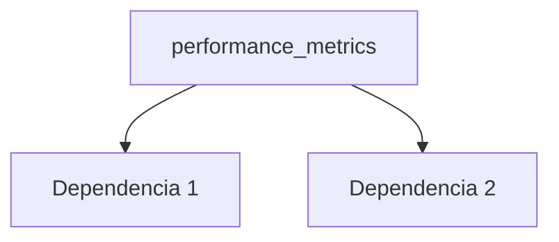

---
tags:
  - secinterp
  - code-walkthrough
  - core      # core | gui | exporters
  - general     # services | managers | renderers | adapters | validation | etc.
aliases:
  - performance_metrics.py  # ej. path_resolver.py
  - performance_metrics     # ej. resolve_export_path
cssclass: secinterp-note
# note_lines: 700      # opcional: tope > 500 para módulos de importancia alta (máx 700)
---

# `core/performance_metrics.py`

> [!abstract] Resumen en una línea
> Performance metrics module for SecInterp plugin. — qué hace este módulo en una frase, sin tocar QGIS si es core.

**Ruta**: `core/performance_metrics.py` (321 líneas)
**Clase/Función principal**: `performance_metrics`
**Capa**: core (QGIS-agnóstico / GUI · Tipo)
**Tags**: #secinterp #core #general

---

## 🎯 ¿Por qué existe este archivo?

| Problema | Solución |
|----------|----------|
| (pendiente) | (pendiente) |
| (pendiente) | (pendiente) |

> [!important] Nota arquitectónica
> QGIS-agnóstico (p. ej. "QGIS-agnóstico", "Adapter Extract", "Factory").

---

## 🧬 Diagrama de relaciones



> [!tip] Cómo leer
> Flecha sólida = importa/delega; punteada = callback/injectado.

---

## 📦 Imports — lectura arquitectónica

```python
# performance_metrics.py
from __future__ import annotations
import logging
import time
import tracemalloc
from collections.abc import Callable, Generator
from contextlib import contextmanager
from functools import wraps
from typing import Any
```

| # | Observación |
|---|-------------|
| ① | (pendiente) |
| ② | (pendiente) |

---

## 🏗️ Inventario de estructura

**Clases:** `class MetricsCollector` — 6 métodos; `class PerformanceTimer` — 3 métodos; `class PerformanceMonitor` — 5 métodos
**Funciones/Métodos:**
- `MetricsCollector.__init__(def __init__(self) -> None:)`
- `MetricsCollector.record_timing(def record_timing(self, operation: str, duration: float) -> None:)`
- `MetricsCollector.record_count(def record_count(self, metric: str, count: int) -> None:)`
- `MetricsCollector.add_metadata(def add_metadata(self, key: str, value: Any) -> None:)`
- `MetricsCollector.get_summary(def get_summary(self) -> dict[str, Any]:)`
- `MetricsCollector.clear(def clear(self) -> None:)`
- `PerformanceTimer.__init__(def __init__(self, operation_name: str, collector: MetricsCollector | None=None, logger_func: Any | None=None) -> None:)`
- `PerformanceTimer.__enter__(def __enter__(self) -> PerformanceTimer:)`
- `PerformanceTimer.__exit__(def __exit__(self, exc_type: type[BaseException] | None, exc_val: BaseException | None, exc_tb: Any | None) -> None:)`
- `format_duration(def format_duration(seconds: float) -> str:)`
- `PerformanceMonitor.__init__(def __init__(self, log_file: str='performance.log') -> None:)`
- `PerformanceMonitor._setup_logger(def _setup_logger(self, log_file: str) -> logging.Logger:)`
- `PerformanceMonitor.measure_operation(@contextmanager)`
- `PerformanceMonitor._get_memory_usage(def _get_memory_usage(self) -> float:)`
- `PerformanceMonitor.get_operation_stats(def get_operation_stats(self, operation_name: str) -> dict[str, Any] | None:)`
- `performance_monitor(def performance_monitor(func: Callable) -> Callable:)`

---

## 📁 Archivos del paquete

- `performance_metrics.py` — nota individual de este archivo.

---

## 📖 Recorrido método por método

### `método_1`

```python
# (enriquecer)
```

_(enriquecer leyendo el fuente)_

### `método_2`

```python
# (enriquecer)
```

_(enriquecer leyendo el fuente)_

<!-- Añade una subsección por cada método público del módulo -->

---

## 🔄 Flujo de datos

| Fase | Entrada | Transformación | Salida |
|------|---------|----------------|--------|
| - | - | - | - |
| - | - | - | - |

---

## 🏛️ Patrones de diseño presentes

| Patrón | Dónde | Propósito |
|--------|-------|-----------|
| - | - | - |

---

## 🧾 Resumen de la API

| Símbolo | Firma / Hereda | Uso típico |
|---------|----------------|------------|
| `format_duration`, `performance_monitor` | `-` | - |

---

## 🛡️ Manejo de errores

_(pendiente)_

---

## 🧪 Tests asociados

_(pendiente)_

---

## 👀 Observaciones y notas

> [!success] Fortalezas
> - (skeleton)

> [!warning] Puntos de atención
> - (skeleton)

> [!question] Preguntas abiertas
> - (skeleton)

---

## 🔗 Notas relacionadas

- [[Index]] — índice de la bóveda
- [[Index]] — índice
- [[controller]] — orquestador

---

*Nota de la bóveda SecInterp Code Walkthrough v2 — v3.8.0*
